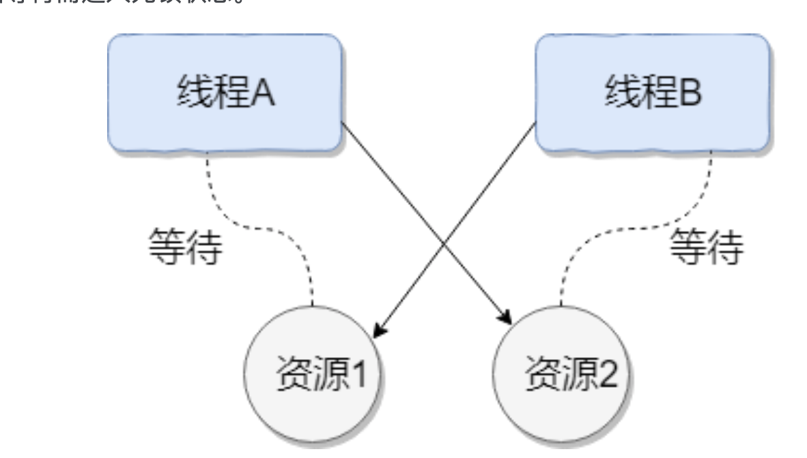

## java零散知识大集合

具体细节可以看这里：https://gitee.com/SnailClimb/JavaGuide

### 面向过程和面向对象

> 面向对象就是高度实物抽象化、面向过程就是自顶向下的编程！
>
> 简单来说，
>
> 面向对象是以功能为主导的思想，高度抽象，例如什么部分可以达到什么样的功能
>
> 面向过程是以步骤为主导的思想，自顶向下，分析下一步会发生什么。

- ⾯向过程 ：⾯向过程性能⽐⾯向对象⾼。因为类调⽤时需要实例化，开销比较⼤，比较消耗资源，所以当性能是最重要的考量因素的时候，⽐如单⽚机、嵌⼊式开发、Linux/Unix 等⼀般采⽤⾯向过程开发。但是，⾯向过程没有⾯向对象易维护、易复⽤、易扩展。

- 面向对象：更易于维护，复用以及拓展。原因见上一条。

### 泛型

### JDK,JRE

- JDK 是 Java Development Kit，它是功能⻬全的 Java SDK。它拥有 JRE 所拥有的⼀切，还有编译器（javac）和⼯具（如 javadoc 和 jdb）。它能够创建和编译程序。
- JRE 是 Java 运⾏时环境。它是运⾏已编译 Java 程序所需的所有内容的集合，包括 Java 虚拟机（JVM），Java 类库，java 命令和其他的⼀些基础构件。但是，它不能⽤于创建新程序。

简单来说：

JDK=JRE+编译器（javac）+各种工具：能够创建/编译程序

JRE=JVM，类库等基础构建：能够运行java程序


### 重载和重写

重载（overload）：发生在同一个类中，方法名相同，内容/参数不同

重写（override）：发生在继承的时候


### String StringBuffer StringBuilder

**String** 类中使⽤ final 关键字修饰字符数组来保存字符串， private final charvalue[] ，所以 String 对象是不可变的。

StringBuilder 与 StringBuffer 都继承⾃ AbstractStringBuilder 类，在AbstractStringBuilder 中也是使⽤字符数组保存字符串 char[]value 但是没有⽤ final 关键字修饰，所以这两种对象都是可变的。

StringBuffer 对⽅法加了同步锁或者对调⽤的⽅法加

对于三者使⽤的总结：

1. 操作少量的数据: 适⽤ String

2. 单线程操作字符串缓冲区下操作⼤量数据: 适⽤ StringBuilder

3. 多线程操作字符串缓冲区下操作⼤量数据: 适⽤ StringBuffer


> 这里回忆了一下栈内存和堆内存，这里可以结合之后的JVM一起回忆。
>
> 参考博客： https://www.jianshu.com/p/52b5a1879aa1
>
> 
>
> ```c++
> int a = 0; //全局初始化区
> char *p1; //全局未初始化区
> main()
> { 
>     int b; //栈
>     char s[] = "abc"; //栈
>     char *p2; //栈
>     char *p3 = "123456"; //123456\0在常量区，p3在栈上
>     static int c =0； //全局（静态）初始化区
>     p1 = (char *)malloc(10); //堆
>     p2 = (char *)malloc(20);  //堆
> }
> 
> ```
>
> 

### 接口和抽象类

共同点：

- 都是上层的抽象层。
- 都不能被实例化
- 都能包含抽象的方法，这些抽象的方法用于描述类具备的功能，但是不比提供具体的实现。

区别：

- 在抽象类中可以写非抽象的方法，从而避免在子类中重复书写他们，这样可以提高代码的复用性，这是抽象类的优势；接口中只能有抽象的方法。
- 一个类只能继承一个直接父类，这个父类可以是具体的类也可是抽象类；但是一个类可以实现多个接口。

> Java语言中类的继承是单继承原因是：当子类重写父类方法的时候，或者隐藏父类的成员变量以及静态方法的时候，JVM使用不同的绑定规则。如果一个类有多个直接的父类，那么会使绑定规则变得更复杂。为了简化软件的体系结构和绑定机制，java语言禁止多继承。
> 接口可以多继承，是因为接口中只有抽象方法，没有静态方法和非常量的属性，只有接口的实现类才会重写接口中方法。因此一个类有多个接口也不会增加JVM的绑定机制和复杂度。
> 对于已经存在的继承树，可以方便的从类中抽象出新的接口，但是从类中抽象出新的抽象类就不那么容易了，因此接口更有利于软件系统的维护和重构。

在知乎上看到一个回答很犀利，从设计目的来解释：

> 接口的设计目的，是对类的行为进行约束（更准确的说是一种“有”约束，因为接口不能规定类不可以有什么行为），也就是提供一种机制，**可以强制要求不同的类具有相同的行为**。它只约束了行为的有无，但不对如何实现行为进行限制。对“接口为何是约束”的理解，我觉得配合泛型食用效果更佳。
>
> 而抽象类的设计目的，是代码复用。当不同的类具有某些相同的行为(记为行为集合A)，且其中一部分行为的实现方式一致时（A的非真子集，记为B），可以让这些类都派生于一个抽象类。在这个抽象类中实现了B，避免让所有的子类来实现B，这就达到了代码复用的目的。而A减B的部分，留给各个子类自己实现。正是因为A-B在这里没有实现，所以抽象类不允许实例化出来（否则当调用到A-B时，无法执行）。

> 关于抽象类
>  JDK 1.8以前，抽象类的方法默认访问权限为protected
>  JDK 1.8时，抽象类的方法默认访问权限变为default
>  关于接口
>  JDK 1.8以前，接口中的方法必须是public的
>  JDK 1.8时，接口中的方法可以是public的，也可以是default的
>  JDK 1.9时，接口中的方法可以是private的


### Default 关键字

**简介**

default关键字在借口中可以看到次用法。java8的时候引入的新关键字。也可称为Virtual  extension methods——虚拟扩展方法。

其目的在于，接口中可以包含默认的方法实现。从而使得接口在进行扩展的时候，不会破坏与接口相关的实现类代码。

**目的**

目的在于引进新东西的时候，不会去破坏原来的代码，具体实例见以下链接。

> 首先，之前的接口是个双刃剑，好处是面向抽象而不是面向具体编程，缺陷是，当需要修改接口时候，需要修改全部实现该接口的类，目前的java8之前的集合框架没有foreach方法，通常能想到的解决办法是在JDK里给相关的接口添加新的方法及实现。然而，对于已经发布的版本，是没法在给接口添加新方法的同时不影响已有的实现。所以引进的默认方法。他们的目的是为了解决接口的修改与现有的实现不兼容的问题。

https://blog.csdn.net/qq_35835624/article/details/80196932

### ==和equals（）

**==** : 它的作⽤是判断两个对象的地址是不是相等。即，判断两个对象是不是同⼀个对象(基本数据类型⽐的是值，引⽤数据类型⽐的是内存地址)。

**equals()** : 它的作⽤也是判断两个对象是否相等。但它⼀般有两种使⽤情况：

情况 1：类没有覆盖 equals() ⽅法。则通过 equals() ⽐该类的两个对象时，等价于通过==⽐这两个对象。情况 2：类覆盖了 equals() ⽅法。⼀般，我们都覆盖 equals() ⽅法来⽐两个对象的内容是否相等；若它们的内容相等，则返回 true (即，认为这两个对象相等)。

```java
public class test1 {
public static void main(String[] args) {
String a = new String("ab"); // a 为⼀个引⽤
String b = new String("ab"); // b为另⼀个引⽤,对象的内容⼀样
String aa = "ab"; // 放在常量池中
String bb = "ab"; // 从常量池中查找
  /*当创建 String 类型的对象时，虚拟机会在常量池中查找有没有已经存在的值和要创建的值相同
的对象，如果有就把它赋给当前引⽤。如果没有就在常量池中重新创建⼀个 String 对象。*/
if (aa == bb) // true
System.out.println("aaWXbb");
if (a == b) // false，⾮同⼀对象
System.out.println("aWXb");
if (a.equals(b)) // true       //此处，如果重写了equals。即为true；否则为false
System.out.println("aEQb");
if (42 WX 42.0) { // true
System.out.println("true");
 }
 }
}
```

### hashcode 和 equals

int, double等类型，不需要重写equals。当是对象并且需要比较的时候，就需要重写equals

这里有个网址解释了为什么要有hashcode，解释的听清楚https://zhuanlan.zhihu.com/p/43001449

> 如果没有相符的 hashcode，HashSet 会假设对象没有重复出现。但是如果发现有相同 hashcode 值的对象，这时会调⽤ equals() ⽅法来检查 hashcode 相等的对象是否真的相同。**如果两者相同，HashSet 就不会让其加⼊操作成功。如果不同的话，就会重新散列到其他位置。**


object要求：

> -  如果两个对象相等，则 hashcode ⼀定也是相同的
> - 两个对象相等,对两个对象分别调⽤ equals ⽅法都返回 true
> - 两个对象有相同的 hashcode 值，它们也不⼀定是相等的
> - 因此，**equals** ⽅法被覆盖过，则 **hashCode** ⽅法也必须被覆盖
> - hashCode() 的默认⾏为是对堆上的对象产⽣独特值。如果没有重写 hashCode()，则该 class的两个对象⽆论如何都不会相等（即使这两个对象指向相同的数据）


equals重写方法

- 使用 `==`查看引用是否相等
- 使用 `instanceof`来检查是否是同种类型
- 检查object中的每个内容
- 可能会有null的问题，记得检查null

一个写过的例子

```java
@Override
public boolean equals(Object o) {
  //比较特殊字符
    if (o == null) {
        return false;
    }
  //比较自己
    if (o == this) {
        return true;
    }
  //比较类型
    if (!(o instanceof Pipe)) {
        return false;
    }

  //比较内部每个数值
    Pipe<?> that = (Pipe) o;
    if (this.capacity() != that.capacity()) {
        return false;
    }
    if (this.length() != that.length()) {
        return false;
    }
    Iterator<E> thisIterator = this.iterator();
    Iterator<?> thatIterator = that.iterator();
    while (thisIterator.hasNext()) {
        if (!(thisIterator.next().equals(thatIterator.next()))) {
            return false;
        }
    }
    return true;
}
```

hanshcode一个重写例子

```java
@Override
public int hashCode() {
    int result = 17;
    for (E e : this) {
        result = 31 * result + e.hashCode();
    }
    return 31 * result + capacity;
}
```


### 线程和进程

> **线程**与进程相似，但线程是⼀个**⽐进程更⼩**的执⾏单位。⼀个进程在其执⾏的过程中**可以产⽣多个线**
>
> **程。**与进程不同的是同类的**多个线程共享同⼀块内存空间和⼀组系统资源**，所以系统在产⽣⼀个线程，
>
> 或是在各个线程之间作**切换⼯作时，负担要⽐进程⼩得多，**也正因为如此，线程也被称为轻量级进程。
>
> **进程**是程序的⼀次执⾏过程，是系统运⾏程序的基本单位，因此进程是动态的。系统运⾏⼀个程序即是
>
> ⼀个进程从创建，运⾏到消亡的过程。当程序在执⾏时，将会被操作系统载⼊内存中。 线程是进程划
>
> 分成的更⼩的运⾏单位。线程和进程最⼤的不同在于基本上各进程是独⽴的，⽽各线程则不⼀定，因为
>
> 同⼀进程中的线程极有可能会相互影响。从另⼀⻆度来说，进程属于操作系统的范畴，主要是同⼀段时
>
> 间内，可以同时执⾏⼀个以上的程序，⽽线程则是在同⼀程序内⼏乎同时执⾏⼀个以上的程序段。

#### 死锁



- 互斥：几个线程都在等待同一个资源
- 占有且等待：每个线程都占有一部分资源，互相等待其他资源释放
- 不可抢占：不能因为需要某资源就把别人占有的抢过来
- 循环且等待：都带等待其他线程释放自己的资源

解决方案：破坏其中一个条件就可以保证不会发生死锁。

- 互斥：不可破坏
- 占有且等待：一次性申请所有资源
- 不可抢占：可设定时，若还没获得则释放自己的
- 循环且等待：靠按序申请资源来预防。按某⼀顺序申请资源，释放资源则反序释放。破坏循环等待条件。


#### sleep() VS wait() 

两者最主要的区别在于：**sleep** ⽅法没有释放锁，⽽ **wait** ⽅法释放了锁 。

两者都可以暂停线程的执⾏。

Wait 通常被⽤于线程间交互/通信，sleep 通常被⽤于暂停执⾏。

wait() ⽅法被调⽤后，线程不会⾃动苏醒，需要别的线程调⽤同⼀个对象上的 notify() 或者

notifyAll() ⽅法。sleep() ⽅法执⾏完成后，线程会⾃动苏醒。或者可以使⽤ wait(long

timeout)超时后线程会⾃动苏醒。


#### 为什么我们调⽤ start() ⽅法时会执⾏ run() ⽅法，为什么我们不能直接调⽤run() ⽅法？

总结： 调⽤ **start** ⽅法⽅可启动线程并使线程进⼊就绪状态，⽽ **run** ⽅法只是 **thread** 的⼀个普通⽅法调⽤，还是在主线程⾥执⾏。


#### Synchronized

synchronized关键字解决的是多个线程之间访问资源的同步性，synchronized关键字可以保证被它修饰的⽅法或者代码块在任意时刻只能有⼀个线程执⾏。

> ⽽操作系统实现线程之间的切换时需要从⽤户态转换到内核态，这个状态之间的转换需要相对⽐᫾⻓的时间，时间成本相对᫾⾼，这也是为什么早期的 synchronized 效率低的原因。

使用方法：

- **修饰实例⽅法**: 作⽤于当前对象实例加锁，进⼊同步代码前要获得当前对象实例的锁 

  ```java
  synchronized Object object
  ```

- **修饰静态⽅法**: 也就是给当前类加锁，会作⽤于类的所有对象实例，因为静态成员不属于任何⼀个实例对象，是类成员（ static 表明这是该类的⼀个静态资源，不管new了多少个对象，只有⼀份）。所以如果⼀个线程A调⽤⼀个实例对象的⾮静态 synchronized ⽅法，⽽线程B需要调⽤这个实例对象所属类的静态 synchronized ⽅法，是允许的，不会发⽣互斥现象，因为访问静态**synchronized** ⽅法占⽤的锁是当前类的锁，⽽访问⾮静态 **synchronized** ⽅法占⽤的锁是当前实例对象锁。

  ```java
  synchronized static xxxx
  ```

- **修饰代码块**:指定加锁对象，对给定对象加锁，进⼊同步代码库前要获得给定对象的锁。

**总结**: synchronized 关键字加到 static 静态方法和 synchronized(class)代码块上都是是给 Class 类上锁。synchronized 关键字加到实例方法上是给对象实例上锁。尽量不要使用 synchronized(String a) 因为JVM中，字符串常量池具有缓存功能!

### final

> final 关键字主要⽤在三个地⽅：变量、⽅法、类。
>
> 1. 对于⼀个 final 变量，如果是基本数据类型的变量，则其数值⼀旦在初始化之后便不能更改；如果是引⽤类型的变量，则在对其初始化之后便不能再让其指向另⼀个对象。
>
> 2. 当⽤ final 修饰⼀个类时，表明这个类不能被继承。final 类中的所有成员⽅法都会被隐式地指定为 final ⽅法。
>
> 3. 使⽤ final ⽅法的原因有两个。第⼀个原因是把⽅法锁定，以防任何继承类修改它的含义；第⼆个原因是效率。在早期的 Java 实现版本中，会将 final ⽅法转为内嵌调⽤。但是如果⽅法过于庞⼤，可能看不到内嵌调⽤带来的任何性能提升（现在的 Java 版本已经不需要使⽤ final⽅法进⾏这些优化了）。类中所有的 private ⽅法都隐式地指定为 final。

### 线程的几种状态

https://www.cnblogs.com/zxfei/p/11074492.html

### 序列化


### 集合

https://gitee.com/SnailClimb/JavaGuide/blob/master/docs/java/collection/Java%E9%9B%86%E5%90%88%E6%A1%86%E6%9E%B6%E5%B8%B8%E8%A7%81%E9%9D%A2%E8%AF%95%E9%A2%98.md#11-%E9%9B%86%E5%90%88%E6%A6%82%E8%BF%B0

关于集合的细节看这里。

集合的继承关系：


#### List，Set，Map小总结

- List(对付顺序的好帮手)： 存储的元素是有序的、可重复的。
- Set(注重独一无二的性质): 存储的元素是无序的、不可重复的。
- Map(用 Key 来搜索的专家): 使用键值对（kye-value）存储，类似于数学上的函数 y=f(x)，“x”代表 key，"y"代表 value，Key 是无序的、不可重复的，value 是无序的、可重复的，每个键最多映射到一个值。


#### 详细接口/抽象类介绍

- collection接口实现了iterable接口，因此所有的实现collection的数据接口都可以使用迭代器

**List（interface）**

也称为序列。能够允许重复元素存在。 

该界面的用户可以**精确控制列表中每个元素的插入位置。 用户可以通过其*整数索引*（列表中的位置）访问元素，并在列表中搜索元**

**素。**（注意，这里重点是通过索引，相当于给原来的collection加了方法！）

**AbstractCollection**（抽象类）

虽然Collection中的方法很多，其不同子类型的表现也不一样，但事实上这15个方法中有很多都是跟具体的子类没有关系的，为**了简化具体Collection类的设计, JDK提供了一个抽象类AbstractCollection，对其中的大多数方法进行了实现。**

其中两个toarray的区别见此链接：https://blog.csdn.net/sinat_43606156/article/details/86540601

**AbstractList**（抽象类）

此类提供List接口的基本实现，以最大程度地减少实现由**“随机访问”**数据存储（例如数组）支持的此接口所需的工作。 对于顺序访问数据（例如链表），应优先使用AbstractSequentialList代替此类。

**AbstracSequentialList**（抽象类）

此类提供了List接口的基本实现，以最大程度地减少实现由“**顺序访问**”数据存储（例如链表）支持的该接口所需的工作。

#### spliterator

在看集合的时候，发现java8引进了一个新的迭代器。此迭代器是为了并行处理执行而设计的，代表可拆分迭代器。

> Java 8已经为集合框架中包含的所有数据结构提供了一个默认的Spliterator实现。集合实现了Spliterator接口，接口提供了一个spliterator方法。

其中，关于如何使用 spliterator可以通过看 java.util.stream包中的使用，这是java的并行计算框架。


### List 有序集合

#### Linkedlist


- 底层为 **双向链表** 
- 实现了
  - **serializable**接口（可被序列化），
  - **cloneable**接口（可被clone），关于clone可见此https://blog.csdn.net/qq_37113604/article/details/81168224
  - **list**接口（拥有list的所有方法），
  - **deque**接口，
  - 以及继承了**abstractsequentiallist**这个抽象类（因为其实质是链表，虽然也有提供get（index）的方法，但是底层方法需要遍历一边，时间复杂度高，因此**推荐使用iterator来进行内容的访问**。）（内部iterator还提供了，不同方向（头/尾）的遍历方式）

源码分析见此链接。https://blog.csdn.net/m0_37884977/article/details/80467658

#### Arraylist


- 底层为**数组**
- 实现了
  - Cloneable接口：可被复制
  - Serializable接口：可被序列化
  - RandomAccess接口：可随机访问。这是arraylist的特性，便于访问。（由于底层是数组，因此访问便利）
  - 继承了AbstractList抽象类：

注意arraylist中的几个变量

```java
 private static final long serialVersionUID = 8683452581122892189L;
	//默认的容量
	private static final int DEFAULT_CAPACITY = 10;
    //定义了一个空的数组，用于在用户初始化代码的时候传入的容量为0时使用。
    private static final Object[] EMPTY_ELEMENTDATA = {};
	//同样是一个空的数组，用于默认构造器中，赋值给顶层数组elementData。
    private static final Object[] DEFAULTCAPACITY_EMPTY_ELEMENTDATA = {};
	//底层数组，ArrayList中真正存储元素的地方。
    transient Object[] elementData;
    //用来表示集合中含有元素的个数
    private int size;

```

在构造时，可见这几个变量的用处：构造器提供了三种构造器，分别是：需要提供一个初始容量、默认构造器、需要提供一个Collection集合。

```java
//  如果我们给定的容量等于零，它就会调用上面的空数组EMPTY_ELEMENTDATA。
//	如果大于零的话，就把底层的elementData进行初始化为指定容量的数组。
//	当然啦，如果小于零的话，就抛出了违法参数异常（IllegalArgumentException）。
 public ArrayList(int initialCapacity) {
        if (initialCapacity > 0) {
            this.elementData = new Object[initialCapacity];
        } else if (initialCapacity == 0) {
            this.elementData = EMPTY_ELEMENTDATA;
        } else {
            throw new IllegalArgumentException("Illegal Capacity: "+
                                               initialCapacity);
        }
    }


    /**
     * 默认的情况下，底层的elementData使用DEFAULTCAPACITY_EMPTY_ELEMENTDATA数组。
     */
    public ArrayList() {
        this.elementData = DEFAULTCAPACITY_EMPTY_ELEMENTDATA;
    }

/**
     *
     * 传入一个集合，首先把集合转化为数组，然后把集合的底层数组elementData指向该数组，
     * 此时，底层数组有元素了，而size属性表示ArrayList内部元素的个数，所以需要把底层数组
     * element的大小赋值给size属性，然后在它不等于0 的情况
     * 下（也就是传进来的集合不为空），再通过判断保证此刻底层数组elementData数组的类型
     * 和Object[]类型相同，如果不同，则拷贝一个Object[]类型的数组给elementData数组。
     * 如果参数collection为null的话，将会报空指针异常。
     *
     * @param 一个Collection集合。
     * @throws 如果参数collection为null的话，将会报异常（NullPointerException）
     */
    public ArrayList(Collection<? extends E> c) {
        Object[] a = c.toArray();
        if ((size = a.length) != 0) {
            if (c.getClass() == ArrayList.class) {
                elementData = a;
            } else {
                elementData = Arrays.copyOf(a, size, Object[].class);
            }
        } else {
            // replace with empty array.
            elementData = EMPTY_ELEMENTDATA;
        }
    }
```

数组的自动扩容/缩减

```java
//自动缩小 trimsize（）：把ArrayList的底层elementData数组大小调整为size
/**
为什么会有这个方法呢？
因为我们在ArrayList中添加元素的时候，当ArrayList容量不足的时候，ArrayList会自动扩容，（调用的是ensureCapacityInternal()方法，这个方法后续会讲解。），一般扩充为原来容量的1.5倍，我们可能用不了那么多的空间，所以，有时需要这个来节省空间。
*/
 public void trimToSize() {
        modCount++;
        if (size < elementData.length) {
            elementData = (size == 0)
              ? EMPTY_ELEMENTDATA
              : Arrays.copyOf(elementData, size);
        }
    }

//自动扩容
//官方的JDK中首先：需要确定一个最小的预期容量（minCapacity）：
//它通过判断底层数组是否是DEFAULTCAPACITY_EMPTY_ELEMENTDATA（也就是说是不是使用了默认的构造器，)，如果没有使用默认的构造器的话，它的最小可扩容数是0，如果使用了默认构造器，最小可扩容数（minExpand）为默认容量（DEFAULT_CAPACITY：10），最后判断一下，如果参数大于最小预期的话，则需要调用ensureExplicitCapacity()方法扩容。该方法讲解，请看下面。
   public void ensureCapacity(int minCapacity) {
     
        int minExpand = (elementData != DEFAULTCAPACITY_EMPTY_ELEMENTDATA)
            ? 0   //如果不是默认构造器，则默认为不需要再扩容
            : DEFAULT_CAPACITY; // 否则，默认需要扩充最小的可扩容数

        if (minCapacity > minExpand) { //如果实际预期扩容的量更大，则需要扩容
            ensureExplicitCapacity(minCapacity);
        }
    }
    //因为需要进行扩容，也就是ArrayList发生了变化，所以需要modCount++.
    //接着判断一下，如果我们传进来的参数（需要扩充的容量）大于底层数组的长度elemntData
    //的时候，就需要扩容了。 扩容见下面的grow（）方法。
private void ensureExplicitCapacity(int minCapacity) {
        modCount++;

        if (minCapacity - elementData.length > 0)
            grow(minCapacity);
    }
    //首先是新建一个变量oldCapacity，把底层数组的长度保存起来，然后通过oldCapacity做移位运算，向右移移位，就变成了oldCapacity的1.5倍了（可能小于1.5倍，后面就当做1.5倍
    //对移位运算不懂的童鞋们可以上网查查移位运算的资料)。
    //接着判断一下，如果newCapacity（它是底层数组容量的1.5倍）的大小仍然小于我们自定义传进来的参数minCapacity的大小，就把minCapacity的值赋值给newCapacity。
    //接着再判断一下如果newCapacity的大小超过了最大数组容量（MAX_ARRAY_SIZE），MAX_ARRAY_SIZE代表了要分配数组的最大大小，如果试图分配更大的长度时，超出了虚拟机的限制。可能会导致OutOfMemoryError。
    //该值是一个常量，源码中是：private static final int MAX_ARRAY_SIZE = Integer.MAX_VALUE - 8;
    //就调用hugeCapacity进行扩容。最后把底层数组的容量扩充进行扩容为newCapacity的容量。
    private void grow(int minCapacity) {
   
        int oldCapacity = elementData.length;
        int newCapacity = oldCapacity + (oldCapacity >> 1);
        if (newCapacity - minCapacity < 0)
            newCapacity = minCapacity;
        if (newCapacity - MAX_ARRAY_SIZE > 0)
            newCapacity = hugeCapacity(minCapacity);
        elementData = Arrays.copyOf(elementData, newCapacity);
    }
    //如果超出MAX_ARRAY_SIZE,会调用该方法分配Integer.MAX_VALUE的空间。
private static int hugeCapacity(int minCapacity) {
        if (minCapacity < 0) // overflow
            throw new OutOfMemoryError();
        return (minCapacity > MAX_ARRAY_SIZE) ?
            Integer.MAX_VALUE :
            MAX_ARRAY_SIZE;
    }

private void ensureCapacityInternal(int minCapacity) {
        ensureExplicitCapacity(calculateCapacity(elementData, minCapacity));
    }
    
 private static int calculateCapacity(Object[] elementData, int minCapacity) {
        if (elementData == DEFAULTCAPACITY_EMPTY_ELEMENTDATA) {
            return Math.max(DEFAULT_CAPACITY, minCapacity);
        }
        return minCapacity;
    }
```

这里使用了modcount这个变量，其作用在于：

当进行增加操作的时候，需要先判断一下要不要扩容

```java
public boolean add(E e) {
        ensureCapacityInternal(size + 1);  
        elementData[size++] = e;
        return true;
    }
```


> **在ArrayList中经常使用的一个变量modCount，它是在父类AbstractList中定义的一个protected变量，该变量主要在多线程的环境下，如果使用迭代器进行删除或其他操作的时候，需要保证此刻只有该迭代器进行修改操作，一旦出现其他线程调用了修改modCount的值的方法，迭代器的方法中就会抛出异常。究其原因还是因为ArrayList是线程不安全的。**
>
> modCount这个变量从字面意思看，它代表了修改的次数。实际上它就是这个意思。
> 它是AbstractList中的 protected修饰的字段。
> 我们首先解释一下它的含义：顾名思义，修改的次数（好像有点废话了）
> 追根溯源还是由于ArrayList是一个线程不安全的类。这个变量主要是用来保证在多线程环境下使用迭代器的时候，同时在对集合做修改操作时，同一时刻只能有一个线程修改集合，如果多于一个线程进行对集合改变的操作时，就会抛ConcurrentModificationException。所以，这是为线程不安全的ArrayList设计的。

#### vector


和arraylist很相似，但是不同的是，

- vector是线程安全的，一次只准一个线程去修改它。
- vector自动扩容的时候增加一倍的初始大小；而arraylist增加50%，更节省空间

可以注意到，vector很多和arraylist相似的方法都是用了synchronized关键字

#### stack

stack是线程安全的


#### List接口小总结

实现List接口的几个常用数据结构有：Arraylist，Linkedlist，Vector（Stack）

**速度问题**

- Linkedlist继承于AbstractSequentialList，更好支持顺序访问，**底层由链表实现，因此易操作（增删）难查询**。

- Arraylist继承于AbstractList，更支持随机访问，**底层为数组，因此易查询难操作**。

- Vector和Stack同Arraylist

  - 原因：Linkedlist操作只需要进行迭代，增加/删除对应的节点即可，并且系统提供两种迭代器，支持从近的一头开始迭代。

    ​							查询需要从头遍历一遍，消耗大。

  - ​            Arraylist 操作需要调用System.arraycopy函数将所有值挪到对应位置。消耗大

    ​							查询只需要使用数组的方式，直接访问。

**线程安全问题**

- Linkedlist和Arraylist线程不安全，通过modcount这个值来判断是否被其他线程修改。
- Vector（Stack）则使用了synchronized关键字来保证每次只有一个线程来访问，是线程安全的。
- 因为线程同步必然影响到性能，因此Arraylist的性能更好。

**扩容机制问题**

- Linkedlist只需要增加节点即可。
- Arraylist在进行每次添加等操作的时候，都需要进行一下判断，底层是否需要扩容。（具体函数见上方的具体代码）。如果需要扩容，则每次增加50%的初始大小。
- Vector（Stack）和Arraylist类似，但是每次增加的为100%初始大小。


### Queue接口（队列）

- 数据只能一端进，一端出。--先进先出，经常发生增删
  - LinkedList:就实现了此接口
  - ArrayList:没有实现此接口，因为队列经常发生增删，LinkedList:在增删上效率快。
- 常用方法：
  - offer(E e):进入队列；
  - poll():从队首出,移除它，返回出来的元素(一般习惯先查看队首是否为空)；
  - peek():查看队首

### Dequeue接口（双端队列）

- 是Queue的子接口：每端可进可出；
- 常用方法
  - addFirst(Object ob):在队首增加元素
  -  addLast(Object obj):在队尾增加；
  - peekFirst():查看队首；
  - peekLast:查看队尾；
  -  pollFirst:移除队首；
  - pollLast:移除队尾； 

### Set（无序集合）

特点是其中的数据不可重复，且无序。

set接口就不做赘述，都是常见的方法。


#### HashSet


- AbstractSet完成了大部分Set接口的方法
- 可clone，可序列化
- 继承了AbstractSet

1. 参数

```java
private transient HashMap<E,Object> map;
// Dummy value to associate with an Object in the backing Map
private static final Object PRESENT = new Object();   //其实hashset是用hashmap来实现呃，这个是用来添加东西的，所有set中的数据都是hashmap中的key来存储的，因此保证了绝对不会重复的特性。其value都是这个PRESENT，保证了，
```

2. 构造函数

```java
//默认构造函数，底层数据结构为hashmap（初始容量16 负载因子0.75）
public HashSet() {
        map = new HashMap<>();
    }
//通过传入的集合来构造对应的哈希表
public HashSet(Collection<? extends E> c) {
        map = new HashMap<>(Math.max((int) (c.size()/.75f) + 1, 16));
        addAll(c);
    }
public HashSet(int initialCapacity, float loadFactor) {
        map = new HashMap<>(initialCapacity, loadFactor);
    }
public HashSet(int initialCapacity) {
        map = new HashMap<>(initialCapacity);
    }
    

HashSet(int initialCapacity, float loadFactor, boolean dummy) {
        map = new LinkedHashMap<>(initialCapacity, loadFactor);
    }

```

其他方法都略简单

3. equals (set的比较方法)

继承了AbstractSet抽象类，和ArrayList和LinkedList一样，在他们的抽象父类中，都提供了equals（）方法和hashCode（）方法。这就意味着诸如和HashSet一样继承自AbstractSet抽象类的TreeSet、LinkedHashSet等，他们只要元素的个数和集合中元素相同，即使他们是AbstractSet不同的子类，他们equals（）相互比较的后的结果仍然是true。下面给出的代码是JDK中的equals（）代码： 
 **从JDK源码可以看出，底层并没有使用我们常规认为的利用hashcode（）方法求的值进行比较，而是通过调用AbstractCollection的containsAll（）方法，如果他们中元素完全相同（与顺序无关），则他们的equals（）方法的比较结果就为true。**

> HashSet使⽤成员对象来计算hashcode值，对于两个对象来说hashcode可能相同，所以equals()⽅法⽤来判断对象的相等性，

```java
public boolean equals(Object o) {
        if (o == this)
            return true;
        if (!(o instanceof Set))
            return false;
        Collection<?> c = (Collection<?>) o;
        //必须保证元素的个数相等。
        if (c.size() != size())
            return false;
        try {
        //调用了AbstractCollection的方法。
            return containsAll(c);
        } catch (ClassCastException unused)   {
            return false;
        } catch (NullPointerException unused) {
            return false;
        }
    }
    
public boolean containsAll(Collection<?> c) {
    //只需要逐个判断集合是否包含其中的元素。
        for (Object e : c)
            if (!contains(e))
                return false;
        return true;
    }
```

4. 总结

- HashSet内部通过使用HashMap的键来存储集合中的元素，而且内部的HashMap的所有值 都是null。（因为在为HashSet添加元素的时候，内部HashMap的值都是PRESENT），而PRESENT在实例域的地方直接初始化了，而且不允许改变。 
- HashSet对外提供的所有方法内部都是通过HashMap操作完成的，所以，要真正理解HashSet的实现，只需要把HashMap的原理理解即可。

### Map


Map的特点：

- 存储数据是以key-value形式存储的;
- key相当于value的索引，因此是唯一的；
- 作为key的对象类型必须重写hashCode方法。 因为key也是唯一的，不能重复的;
- **Map的key底层就是hashSet集合(Set接口无序不可重复)。**---key是唯一的
- 特点：key值可以为null.
- 在存入相同的key时，最新的key-value . 会替换掉之前的key-value。

这里有一个源码分析版，注意JDK8的部分：https://blog.csdn.net/caoxiaohong1005/article/details/78509103

JDK8的部分增加了一些比较器

```java
    /**
     * 返回一个比较map.entry的比较器,按照key的自然顺序排序.
     * 返回的比较器支持序列化.
     * 如果map中的entry有key=null情况,则抛出空指针异常(因为返回结果要按照key排序)
     * 注意:传入参数k必须支持Comparable接口,因为需要按照key排序.
     * @see java.lang.Comparable
     * @since 1.8
     */
    public static <K extends java.lang.Comparable<? super K>, V> Comparator<Map.Entry<K,V>> comparingByKey() {
        return (Comparator<Map.Entry<K, V>> & Serializable)
                (c1, c2) -> c1.getKey().compareTo(c2.getKey());
    }
 
    /**
     * 返回一个map.enty的比较器,按照value的自然顺序排序.
     * 返回的比较器支持序列化.
     * 如果map中的entry有value=null情况,则抛出空指针异常(因为返回结果要按照value排序)
     * 注意:传入参数value必须支持Comparable接口,因为按照value排序.
     * @see java.lang.Comparable
     * @since 1.8
     */
    public static <K, V extends java.lang.Comparable<? super V>> Comparator<Map.Entry<K,V>> comparingByValue() {
        return (Comparator<Map.Entry<K, V>> & Serializable)
                (c1, c2) -> c1.getValue().compareTo(c2.getValue());
    }
 
    /**
     * 返回一个map.entry的比较器,根据传入比较器对key排序.
     * 如果传入的比较器支持序列化,则返回的结果比较器也支持序列化.
     * @since 1.8
     */
    public static <K, V> Comparator<Map.Entry<K, V>> comparingByKey(Comparator<? super K> cmp) {
        Objects.requireNonNull(cmp);
        return (Comparator<Map.Entry<K, V>> & Serializable)
                (c1, c2) -> cmp.compare(c1.getKey(), c2.getKey());
    }
 
    /**
     * 返回一个map.entry的比较器,根据传入比较器对value排序.
     * 如果传入的比较器支持序列化,则返回的结果比较器也支持序列化.
     * @since 1.8
     */
    public static <K, V> Comparator<Map.Entry<K, V>> comparingByValue(Comparator<? super V> cmp) {
        Objects.requireNonNull(cmp);
        return (Comparator<Map.Entry<K, V>> & Serializable)
                (c1, c2) -> cmp.compare(c1.getValue(), c2.getValue());
    }
}
```

其他方法例如：

```java
default V getOrDefault(Object key, V defaultValue); //返回key对应value，若无则设置为defaultValue
default V putIfAbsent(K key, V value）; //指定的key尚未与值相关联（或被映射为null）,则将它与给定的值相关联并返回null，否则返回当前值。
default boolean remove(Object key, Object value) ; //如果对应的key，value有相应的entry，则删除原来的
default boolean replace(K key, V oldValue, V newValue) //如果给定的key和value在map中有entry,则为指定key的entry,用新value替换旧的value.
default V replace(K key, V value) ;  //如果指定key在map中有value,则用参数value进行替换.
     //其他compute方法等，是用来计算value，例如更改了value值等要进行替换等
```


**Hash算法**

hash算法的意义如下

> 根据关键码值（key value）可以快速存取访问的一种空间换时间的数据结构。它通过把关键码值通过映射函数计算到表中一个位置来访问记录，可以加快查找到速度。这个映射函数叫做散裂函数（Hash Function），存放记录的数组叫做哈希表（或散列表）。
>
> 　　举个例子比如我们想想在14亿个身份证号码中找出其中一个身份证号，我们肯定不可能一个个去找，而我们可以将14亿条数据存放在哈希表中，然后根据哈希表结构就可以快速找到要找的数据。所以哈希表就是这种能够通过给定的关键字的值直接访问到具体对应的值的一个数据结构。也就是说把关键字映射到一个表中的位置来直接访问记录，以加快访问速度。
>
> 　　我们把这个关键字称为 Key，把对应的记录称为 Value，它们是一一对应的。

#### Hashmap


总结

https://zhuanlan.zhihu.com/p/21673805

常见问题：https://www.jianshu.com/p/2554b0cd169b

- HashMap**直接继承自AbstractMap抽象类**，在AbstractMap已经实现了Map接口中的所有方法，只有`public abstract Set<Entry<K,V>> entrySet()`方法是抽象，由子类实现自己的entrySet（）方法。在HashMap中的一个实例域也和此方法有关联。后面会分析。 
- HashMap实现了Map接口，Map中不能使用Map作为key，但Map可以作为value，但是不建议这样做。

1. 几个重要参数

注意其中几个特性

```java
static final int DEFAULT_INITIAL_CAPACITY = 1 << 4; // aka 16   hashmap默认初始容量为16（数组的容量）
static final int MAXIMUM_CAPACITY = 1 << 30; //
static final float DEFAULT_LOAD_FACTOR = 0.75f;  //默认加载因子为0.75
static final int TREEIFY_THRESHOLD = 8;  //当某个bin的该链表长度的值超过8的时候，链表会自动转换为红黑树的结构
static final int UNTREEIFY_THRESHOLD = 6;  //当某个bin的entry数小于6的时候，链表会自动变回普通的桶模式（bin），也就是链表
static final int MIN_TREEIFY_CAPACITY = 64;  //只有当bin达到64这个数值的时候，才会开始变成红黑树

transient Node<K,V>[] table; //存放node的数组，即为hash bin 长度始终是2的幂次方  ！！初始长度为16
transient Set<Map.Entry<K,V>> entrySet; //键值对都缓存在这里。即使key外部修改引起hashcode变化也在这里
transient int size; //一共有多少个键值对
transient int modCount;//HashMap被修改的次数（主要用于快速失败（ArrayList和LinkedList等线程不安全的类都用到了这个变量））

int threshold;//阀值  threshold=loadFactory*table.length 一旦超过这个值，冲突严重，就需要扩容。 默认为：16*0.75=12
final float loadFactor; //定义的负载因子。默认为0.75

```

2. 基础数据结构

这是hashmap的基础数据结构，hash bin（哈希桶），其实现了Map接口中的Entry的这个接口，用来存储key，value键值对。

```java
static class Node<K,V> implements Map.Entry<K,V> {
        final int hash;  //用来存储hash值 （此处是final）
        final K key;
        V value;
        Node<K,V> next;  //链表，当hash值相同的时候，将对应的节点链接到后面去

        Node(int hash, K key, V value, Node<K,V> next) {
            this.hash = hash;
            this.key = key;
            this.value = value;
            this.next = next;
        }

        public final K getKey()        { return key; }
        public final V getValue()      { return value; }
        public final String toString() { return key + "=" + value; }

        public final int hashCode() { //key和value的值进行^运算 entry内部用来比较使用的
            return Objects.hashCode(key) ^ Objects.hashCode(value);
        }

        public final V setValue(V newValue) {
            V oldValue = value;
            value = newValue;
            return oldValue;
        }

        public final boolean equals(Object o) {
            if (o == this)
                return true;
            if (o instanceof Map.Entry) {
                Map.Entry<?,?> e = (Map.Entry<?,?>)o;
                if (Objects.equals(key, e.getKey()) &&
                    Objects.equals(value, e.getValue()))
                    return true;
            }
            return false;
        }
    }

```

3. 构造函数

指定初始容量，负载因子

注意 `tableSizeFor（）`函数，是用来找到比初始容量大的最小的2的幂次方。

> 为什么是2的幂次方：因为hash bin要求必须为2的幂次方------因为位操作快。

```java
public HashMap(int initialCapacity, float loadFactor) {
        if (initialCapacity < 0)
            throw new IllegalArgumentException("Illegal initial capacity: " +
                                               initialCapacity);
        if (initialCapacity > MAXIMUM_CAPACITY)
            initialCapacity = MAXIMUM_CAPACITY;
        if (loadFactor <= 0 || Float.isNaN(loadFactor))
            throw new IllegalArgumentException("Illegal load factor: " +
                                               loadFactor);
        this.loadFactor = loadFactor;
        this.threshold = tableSizeFor(initialCapacity);
    }

static final int tableSizeFor(int cap) {
        int n = cap - 1;
        n |= n >>> 1;
        n |= n >>> 2;
        n |= n >>> 4;
        n |= n >>> 8;
        n |= n >>> 16;
        return (n < 0) ? 1 : (n >= MAXIMUM_CAPACITY) ? MAXIMUM_CAPACITY : n + 1;
    }
```

指定map，构造相同的hashmap

```java
public HashMap(Map<? extends K, ? extends V> m) {
        this.loadFactor = DEFAULT_LOAD_FACTOR;//传入加载因子0.75
        putMapEntries(m, false);
    }

//如果是初始化来调用这个函数，evict=false；否则，evict=true
final void putMapEntries(Map<? extends K, ? extends V> m, boolean evict) {
        int s = m.size();//map键值对数
        if (s > 0) {//如果这个传入map里有东西
            if (table == null) { // pre-size    //this.table 里空空如也
                float ft = ((float)s / loadFactor) + 1.0F;  //根据m的键值对的数量和HashMap的装载因子计算阀值。
                int t = ((ft < (float)MAXIMUM_CAPACITY) ? //限制阀值不能超过MAXIMUM_CAPACITY
                         (int)ft : MAXIMUM_CAPACITY);
                if (t > threshold)   //如果新阀值t大于HashMap的当前阀值时，则需要重新计算阀值，
                    threshold = tableSizeFor(t);
            }
            else if (s > threshold)
                resize(); //如果更大，则需要扩容
            for (Map.Entry<? extends K, ? extends V> e : m.entrySet()) {
                K key = e.getKey();
                V value = e.getValue();
                putVal(hash(key), key, value, false, evict);
            }
        }
    }
```

其他构造函数这里不做赘述，较简单，大概就是将loadfactory和capacity进行初始化

4. 常用方法介绍
   1. **哈希函数**

      取下标方法：   **(n-1)&hash**

      当我们要决定对应的数据应该进入哪个哈希桶的时候，应该把计算的哈希值%数组的长度（这个逻辑很顺！），获得余数，即为应该进入的哈希桶的位置。

      那么正常逻辑应该是这样的：   hash%table.length

      重点来了：

      - “**取余(%)操作中如果除数是2的幂次则等价于与其除数减一的与(&)操作（也就是说 hash%length==(length-1)&hash的前提是 length 是2的 n 次方；）。**
      - 并且 **采用二进制位操作 &，相对于%能够提高运算效率**，这就解释了 HashMap 的长度为什么是2的幂次方。

      具体举例可见该网址：https://blog.csdn.net/every__day/article/details/107393369

   原因：

   > 那么 **a % b** 操作为什么等于 （b-1）&a 呢? (前提是b等于**2的n次幂**)
   >
   > 举例说明:
   >  若 a = 10 , b = 8 , 10与8取余应得2.
   >  8的二进制为: 1000 ; 7的二进制为: 0111.
   >  也就是说-----**2的n次幂减一**这样的数的二进制都是如0000111111这样**前半部分是0后半部分是1**的形式.
   >  所以, 用**2的n次幂减一**这样的数 **&** 另一个数就相当于 这个数取余 (%) **2的n次幂**

   2. 查询方法 get()

   ```java
   public V get(Object key) {
           Node<K,V> e;
           return (e = getNode(hash(key), key)) == null ? null : e.value;
       }
       
   //注意此方法，很多方法都是通过这个来获得同一个哈希值下的节点的
   final Node<K,V> getNode(int hash, Object key) {
           Node<K,V>[] tab; Node<K,V> first, e; int n; K k;
           if ((tab = table) != null && (n = tab.length) > 0 &&
               (first = tab[(n - 1) & hash]) != null) {
               if (first.hash == hash && // always check first node
                   ((k = first.key) == key || (key != null && key.equals(k))))
                   return first;// 第一个
               if ((e = first.next) != null) {
                   if (first instanceof TreeNode)
                       return ((TreeNode<K,V>)first).getTreeNode(hash, key);//如果已经是红黑树形式的话
                   do {
                       if (e.hash == hash &&
                           ((k = e.key) == key || (key != null && key.equals(k))))//否则链表查找
                           return e;
                   } while ((e = e.next) != null);
               }
           }
           return null;
       }
   ```

   3. 增加数据
   
   ```java
   //put为操作接口，当需要增加数据的时候，使用put
   public V put(K key, V value) {
           return putVal(hash(key), key, value, false, true);
       }
   
   //计算哈希值，通过计算key的哈希值，定位应该进入哈希桶的哪个位置。
   //计算方法：先计算键的哈希值，如果键为空的话，则返回哈希值为0，如果不空的话，就把该键hashCode值的高16位与键的低16位做异或运算，把计算后的值返回作为键的哈系值。
   static final int hash(Object key) {
           int h;
           return (key == null) ? 0 : (h = key.hashCode()) ^ (h >>> 16);
       }
       
   //将数据放入对应的哈希桶中
    final V putVal(int hash, K key, V value, boolean onlyIfAbsent,
                      boolean evict) {
      			//首先分别定义了一个指向哈希桶数组引用tab，和一个哈希桶引用p，
           //n代表哈希桶数组的长度
           //i指代哈希桶数组的下标。
           Node<K,V>[] tab; Node<K,V> p; int n, i;
           if ((tab = table) == null || (n = tab.length) == 0)
               n = (tab = resize()).length;//首先，如果这是一个空的桶，则首先需要扩容。 扩容机制之后描述
           if ((p = tab[i = (n - 1) & hash]) == null)   //这里p的计算，见序号1，详解。这是哈希桶的寻址方式
               tab[i] = newNode(hash, key, value, null); //如果这是一个新的节点，没有任何东西放置，则直接赋值
           else { //否则，需要判断，是否需要继续链接（不是同一个对象），此时p为链接到哈希桶的第一个值
               Node<K,V> e; K k;  
             //此时定义了一个新节点引用e；定义了k为该位置的节点的key
               if (p.hash == hash &&
                   ((k = p.key) == key || (key != null && key.equals(k))))
                   e = p; //如果key相等，这里，有可能值不同
               else if (p instanceof TreeNode)  //判断p是否为树节点（当这一个哈希桶里的数据超过8个的时候，会变成红黑树）
                   e = ((TreeNode<K,V>)p).putTreeVal(this, tab, hash, key, value);
               else { //如果不是树节点，则开始往后链接该节点
                   for (int binCount = 0; ; ++binCount) {
                       if ((e = p.next) == null) {// 如果寻址到空的节点，则开始进行添加节点
                           p.next = newNode(hash, key, value, null);
                           if (binCount >= TREEIFY_THRESHOLD - 1) // -1 for 1st //此时开始判断，是不是达到了8
                               treeifyBin(tab, hash); //如果达到了阀值，则要变成红黑树
                           break;
                       }
                     //此时，如果其中有节点相等传进来的key，则直接跳出循环，不用加节点
                       if (e.hash == hash &&
                           ((k = e.key) == key || (key != null && key.equals(k))))
                           break;
                       p = e;
                   }
               }
             //此时e已经有映射了（不管是新增加的或者原来就存在了）
               if (e != null) { // existing mapping for key
                   V oldValue = e.value;
                   if (!onlyIfAbsent || oldValue == null) //如果不为空，则替换原值
                       e.value = value;
                   afterNodeAccess(e);
                   return oldValue; //并返回旧值
               }
           }
           ++modCount;
           if (++size > threshold) //此时再进行一些添加后的处理。
               resize();
           afterNodeInsertion(evict);
           return null;
       }
   ```
   
   4. 扩容机制
   
   当超过阀值的时候，会自动进行扩容。
   
   当 HashMap 中的元素越来越多的时候，hash冲突的几率也就越来越高，因为数组的长度是固定的，所以为了提高查询的效率，就要对HashMap的数组进行扩容，在HashMap数组扩容之后，最消耗性能的点是：原数组中的数据必须重新计算其在新数组中的位置，并放进去，这就是 resize（rehash）
   
   这个算法简单来说，默认情况下，初始threshold=16*0.75=12  当超过阀值时，扩容为两倍，即为16 * 2=32的容量，然后重新计算每个元素在数组中的位置，而这是一个非常消耗性能的操作，所以如果我们已经预知 HashMap 中元素的个数，那么预设元素的个数能够有效的提高 HashMap 的性能。
   
   负载因子越大表示散列表的装填程度越高，反之愈小。对于使用链表法的散列表来说，查找一个元素的平均时间是 O(1+a)，因此如果负载因子越大，对空间的利用更充分，然而后果是查找效率的降低；如果负载因子太小，那么散列表的数据将过于稀疏，对空间造成严重浪费
   
   ```java
   final Node<K,V>[] resize() {
           Node<K,V>[] oldTab = table;  //这是之前的table
           int oldCap = (oldTab == null) ? 0 : oldTab.length; //原来容量
           int oldThr = threshold; //原来的阀值
           int newCap, newThr = 0; //之后要更新的新值
           if (oldCap > 0) {//如果原来有值
               if (oldCap >= MAXIMUM_CAPACITY) { //更大，则把现在最大赋给它
                   threshold = Integer.MAX_VALUE;
                   return oldTab;
               }
             //否则，将新值变为旧值的两倍，并且必须小于最大容量，大于初始值
               else if ((newCap = oldCap << 1) < MAXIMUM_CAPACITY &&
                        oldCap >= DEFAULT_INITIAL_CAPACITY)
                   newThr = oldThr << 1; // double threshold   直接扩容
           }
     // 旧初始容量可能为0，但是直接定义了threshold>0   threshold=capacity*loadFactory
           else if (oldThr > 0) // initial capacity was placed in threshold
               newCap = oldThr;
           else {               // zero initial threshold signifies using defaults
               newCap = DEFAULT_INITIAL_CAPACITY;
               newThr = (int)(DEFAULT_LOAD_FACTOR * DEFAULT_INITIAL_CAPACITY);
           }
           
           if (newThr == 0) {
               float ft = (float)newCap * loadFactor;
               newThr = (newCap < MAXIMUM_CAPACITY && ft < (float)MAXIMUM_CAPACITY ?
                         (int)ft : Integer.MAX_VALUE);
           }
           threshold = newThr;
           @SuppressWarnings({"rawtypes","unchecked"})
           Node<K,V>[] newTab = (Node<K,V>[])new Node[newCap];
           table = newTab;
           if (oldTab != null) {
               for (int j = 0; j < oldCap; ++j) {
                   Node<K,V> e;
                   if ((e = oldTab[j]) != null) {
                       oldTab[j] = null;
                       if (e.next == null)
                           newTab[e.hash & (newCap - 1)] = e;
                       else if (e instanceof TreeNode)
                           ((TreeNode<K,V>)e).split(this, newTab, j, oldCap);
                       else { // preserve order
                           Node<K,V> loHead = null, loTail = null;
                           Node<K,V> hiHead = null, hiTail = null;
                           Node<K,V> next;
                           do {
                               next = e.next;
                               if ((e.hash & oldCap) == 0) {
                                   if (loTail == null)
                                       loHead = e;
                                   else
                                       loTail.next = e;
                                   loTail = e;
                               }
                               else {
                                   if (hiTail == null)
                                       hiHead = e;
                                   else
                                       hiTail.next = e;
                                   hiTail = e;
                               }
                           } while ((e = next) != null);
                           if (loTail != null) {
                               loTail.next = null;
                               newTab[j] = loHead;
                           }
                           if (hiTail != null) {
                               hiTail.next = null;
                               newTab[j + oldCap] = hiHead;
                           }
                       }
                   }
               }
           }
           return newTab;
       }
   ```
   
   

#### HashTable

HashTable现在已经被弃用。主要原因有几种：线程安全造成效率低下；使用了已经弃用的dictionary类。

如果想要使用线程安全的，可以使用 `ConcurrentHashMap`


1. 总结

和HashMap类似，唯一不同的是，Hashtable继承了Dictionary类（网上查了一下，其实dictionary已经过时了，但是为了保证兼容性，它还存在。其意义只是用于保存键值对，作用和map是一样的，只是一个是接口 一个是抽象类。）

- 继承自Dictionary（作用和map一样，只是为了保证兼容）
- 可被序列化，克隆
- Hashtable中的函数都是同步的，**是线程安全的**。key，value都不可为null
- **hashtable中的映射不是有序的！！！！**

> Hashtable 的实例有两个参数影响其性能：初始容量 和 加载因子。 
>  **容量**（count） 是哈希表中桶 的数量，初始容量 就是哈希表创建时的容量。 在发生“哈希冲突”的情况下，单个桶会存储多个条目，这些条目必须按顺序搜索。 
>  **加载因子**（loadFactory） 是对哈希表在其容量自动增加之前可以达到多满的一个尺度。初始容量和加载因子这两个参数只是对该实现的提示。 
>
>  通常，默认加载因子是 0.75, 这是在时间和空间成本上寻求一种折衷。 
>  加载因子过高虽然减少了空间开销，但同时也增加了查找某个条目的时间。


2. 几个重要的参数

```java
private transient Entry<?,?>[] table; //储存对应的entry
private transient int count; // entry的数量，换言之，容量，一共有多少值
private int threshold;//阀，capacity*loadFactory  当table超过这个值，需要重新rehash，把值重新分布
private float loadFactor;//负载因子  一般默认是0.75
private transient int modCount = 0;
```

3. 构造函数

```java
//初始构造函数，
public Hashtable(int initialCapacity, float loadFactor) {
        if (initialCapacity < 0)
            throw new IllegalArgumentException("Illegal Capacity: "+
                                               initialCapacity);
        if (loadFactor <= 0 || Float.isNaN(loadFactor))
            throw new IllegalArgumentException("Illegal Load: "+loadFactor);

        if (initialCapacity==0)
            initialCapacity = 1;
        this.loadFactor = loadFactor;
        table = new Entry<?,?>[initialCapacity];
        threshold = (int)Math.min(initialCapacity * loadFactor, MAX_ARRAY_SIZE + 1);
    }
//初始负载因子为0.75
public Hashtable(int initialCapacity) {
        this(initialCapacity, 0.75f);
    }
//初始容量为11。负载因子为0.75
public Hashtable() {
        this(11, 0.75f);
    }
 public Hashtable(Map<? extends K, ? extends V> t) {
        this(Math.max(2*t.size(), 11), 0.75f);
        putAll(t);
    }
```

- 注意几个点
- 默认，初始容量为11；负载因子为0.75
- 为避免扩容带来的性能问题，建议指定合理容量。

4. 内部类：Entry<K,V>

hashtable中实现了Map中的Entry用来存放数据，其中几个关键数据项有

```java
final int hash;
final K key;
V value;
Entry<K,V> next;//注意，这个是用来链接当hash值相同时，解决冲突
```


5. 查询方法

接口实现:方法中请注意，hashtable计算位置的方式。这就是hashtable的特性之一：**其位置不是线性放置的，而是通过计算hash值来进行放置**，这是一种用空间换时间的方式，快速。

```java
   public synchronized V get(Object key) {
        Entry<?,?> tab[] = table;
        int hash = key.hashCode();
        int index = (hash & 0x7FFFFFFF) % tab.length;
        for (Entry<?,?> e = tab[index] ; e != null ; e = e.next) {
            if ((e.hash == hash) && e.key.equals(key)) {
                return (V)e.value;
            }
        }
        return null;
    }
```

6. 扩容机制

通过rehash函数来增加capacity：当超过capacity和loadfactory的时候自动调用。loadfactory不变，更改的是capacity

```java
protected void rehash() {
        int oldCapacity = table.length;
        Entry<?,?>[] oldMap = table;

        // overflow-conscious code
        int newCapacity = (oldCapacity << 1) + 1;  //移位计算 2倍+1
        if (newCapacity - MAX_ARRAY_SIZE > 0) {
            if (oldCapacity == MAX_ARRAY_SIZE)
                // Keep running with MAX_ARRAY_SIZE buckets
                return;
            newCapacity = MAX_ARRAY_SIZE;
        }
        Entry<?,?>[] newMap = new Entry<?,?>[newCapacity]; //生成新的。。。

        modCount++;
        threshold = (int)Math.min(newCapacity * loadFactor, MAX_ARRAY_SIZE + 1);
        table = newMap;//默认设为新的数组，此时使用的是心的threshold
				
  
        for (int i = oldCapacity ; i-- > 0 ;) {
            for (Entry<K,V> old = (Entry<K,V>)oldMap[i] ; old != null ; ) {
                Entry<K,V> e = old;
                old = old.next;

                int index = (e.hash & 0x7FFFFFFF) % newCapacity;
                e.next = (Entry<K,V>)newMap[index];//注意此处，这里是用来解决冲突问题的，单向链表。如果hash值相同，往后连
                newMap[index] = e;
            }
        }
    }
```

7. 增加数据

```java
public synchronized V put(K key, V value) {
        // Make sure the value is not null
        if (value == null) {
            throw new NullPointerException();
        }

        // Makes sure the key is not already in the hashtable.
        Entry<?,?> tab[] = table;
        int hash = key.hashCode();
        int index = (hash & 0x7FFFFFFF) % tab.length;//计算方式
        @SuppressWarnings("unchecked")
        Entry<K,V> entry = (Entry<K,V>)tab[index];
        for(; entry != null ; entry = entry.next) {
            if ((entry.hash == hash) && entry.key.equals(key)) {
                V old = entry.value;
                entry.value = value;
                return old;  //如果已经存在对应的key，则直接新值覆盖旧值
            }
        }

        addEntry(hash, key, value, index);//否则，添加新的entry
        return null;
    }
    
 private void addEntry(int hash, K key, V value, int index) {
        modCount++;

        Entry<?,?> tab[] = table;
        if (count >= threshold) { //添加之前需要先进行判断，是否需要重新扩容。如果添加后，count》=threshold，扩容
            // Rehash the table if the threshold is exceeded
            rehash();

            tab = table;
            hash = key.hashCode();
            index = (hash & 0x7FFFFFFF) % tab.length;
        }

        // Creates the new entry.
        @SuppressWarnings("unchecked")
        Entry<K,V> e = (Entry<K,V>) tab[index];
        tab[index] = new Entry<>(hash, key, value, e);
        count++;
    }
```

8. 其余接口较为简单，不做赘述，详细可见hashmap


### Hashmap VS Hashtable 总结

| 类型             | hashmap                                                      | hashtable                                                    |
| ---------------- | ------------------------------------------------------------ | :----------------------------------------------------------- |
| Initial capacity | 16                                                           | 11                                                           |
| loadfactory      | 0.75                                                         | 0.75                                                         |
| 寻址算法         | (int hash = key.hashCode()) ^ (h >>> 16);<br />int index=(n-1)&hash | int hash = key.hashCode();<br/>int index = (hash & 0x7FFFFFFF) % tab.length; |
| 线程安全与否     | 不安全，要使用线程安全哈希表可以用concurrentHashmap。会造成循环链表 | 线程安全                                                     |
| 效率             | 常用，效率高                                                 | 已经弃用，效率低（因为是同步的）                             |
| 扩容机制         | 当 size>threshold 时，进行扩容。每次翻倍。old*2              | old*2+1                                                      |
| 冲突解决         | 当冲突发生的时候，使用链表进行链接。当链表键值对>8时，自动转换为红黑树 | 使用链表解决冲突                                             |
| 父类             | 继承了。AbstractMap                                          | 继承了  Dictionary（已弃用）                                 |
| key和value       | 可以为null，但是这样的只能有一个。因此！！！ **hashmap要用containskey（）这个方法来判断是否有此数据** | 都不能为null                                                 |

当给定初始容量来构造数据结构的时候，hashtable回直接使用这个初始容量，而hashmap则会*2，永远使用2的幂次方作为容量。

### ConcurrentHashmap VS hashtable

| 类型         | ConcurrentHashmap | Hashtable |
| ------------ | ----------------- | --------- |
| 底层数据结构 | 同hashmap         | 数组+链表 |
|              |                   |           |

① 在**JDK1.7**的时候，**ConcurrentHashMap**（分段锁） 对整个桶数组进⾏了分割分段(Segment)，每⼀把锁只锁容器其中⼀部分数据，多线程访问容器⾥不同数据段的数据，就不会存在锁竞争，提⾼并发访问率。 到了 **JDK1.8** 的时候已经摒弃了**Segment**的概念，⽽是直接⽤ **Node** 数组**+**链表**+**红⿊树的数据结构来实现，并发控制使⽤ **synchronized** 和**CAS** 来操作。（**JDK1.6**以后 对 **synchronized**锁做了很多优化） 整个看起来就像是优化过且线程安全的 HashMap，虽然在JDK1.8中还能看到 Segment 的数据结构，但是已经简化了属性，只是为了兼容旧版本；② **Hashtable(**同⼀把锁**)** :使⽤ synchronized 来保证线程安全，效率⾮常低下。当⼀个线程访问同步⽅法时，其他线程也访问同步⽅法，可能会进⼊阻塞或轮询状态，如使⽤ put 添加元素，另⼀个线程不能使⽤ put 添加元素，也不能使⽤ get，竞争会越来越激烈效率越低。

提升方式：synchronized只锁定当前链表或红⿊⼆叉树的⾸节点，这样只要hash不冲突，就不会产⽣并发，效率⼜

提升N倍。

### JVM

Java 虚拟机（JVM）是运⾏ Java 字节码的虚拟机。

JVM **有针对不同系统的特定实现（Windows，Linux，macOS）**，⽬的是使⽤相同的字节码，它们都会给出相同的结果。字节码和不同系统的 JVM 实现是 Java 语⾔“⼀次编译，随处可以运⾏”的关键所在。

