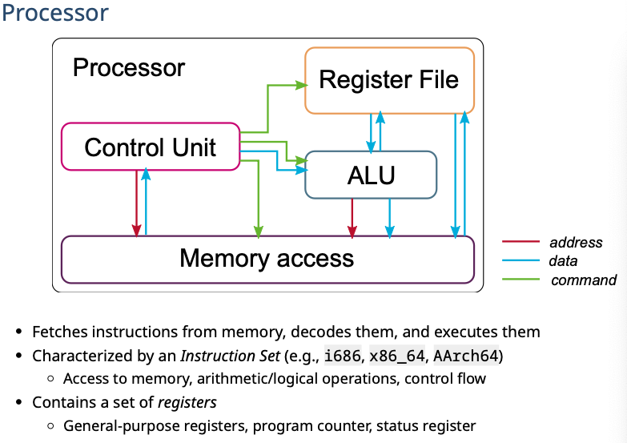
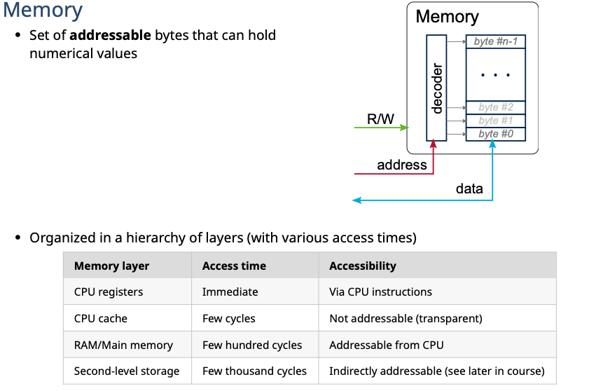
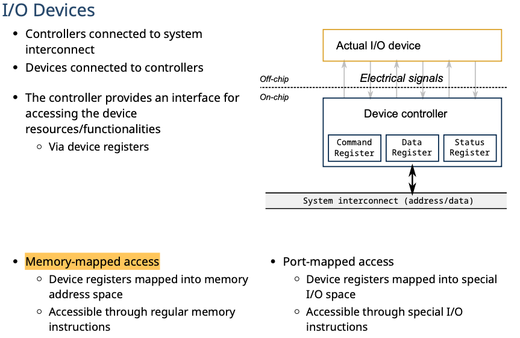
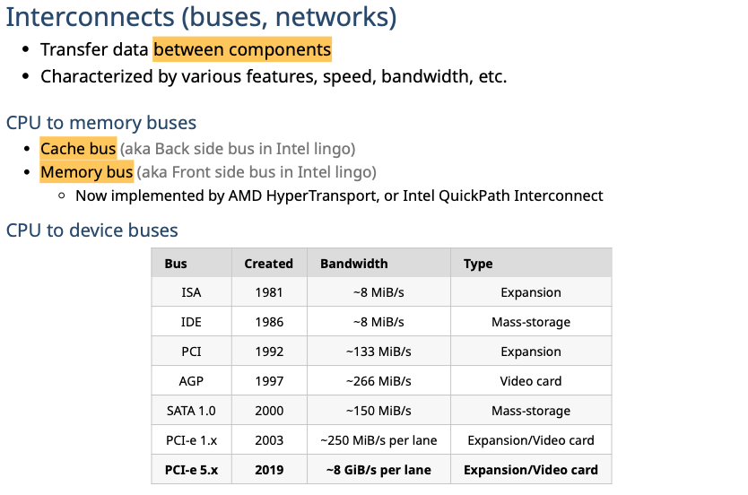
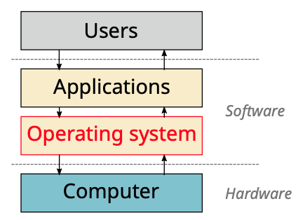
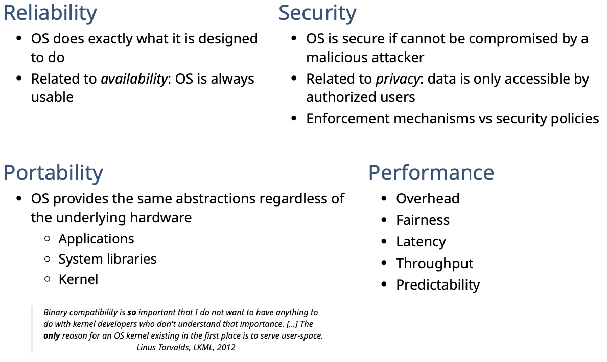

# Intro to OS

# Computer

Computer  = hardware + software

Operating system works as the interface between hardware and software. 

# Hardware Components

### Processor

CPU (Central Processing Unit) 

Controls **System Operation**： Processes/threads

### Memory 

**Real/Main memory**: **Volatile** (typically): store in-processing objects

**Secondary Memory** – **non-volatile**

### I/O Modules

**External** Communication

### System Bus

**Internal** Communication

# Software Components

It's what we use every day.

**Program**: consists of a set of instructions stored in memory

# Operating System

## **Definition**

Operating System:  

- A layer of **software** that **manages a computer's resources** for its users and their applications.
- a interface between applications and hardware
-  is a program that controls the execution of application programs

### Role

Operating System works as a resource manager of the computer

- Manage **resource sharing**(管理系统所有资源 - hardware/software)
  - Resource allocation (e.g., CPU, memory, I/O devices)
  - Isolation (e.g., fault isolation) 
  - Communication (e.g., safe communication)
- Abstraction of hardware via **resource virtualization**(包含一些hardware的接口，可以调用硬件)
- contains a set of **common services** to applications 
  - Hardware abstraction 
  - Filesystem, message passing, memory sharing

### Design Principles

可靠/安全/可移植/性能好

### Modes

OS has two modes of operation

- **User mode:**

  - **user program** executes in user mode 
  - certain areas of memory **are protected** from user access
  - certain instructions may not be executed

- **Kernel Mode:**

- - monitor executes in kernel mode
  - **privileged** instructions may be executed
  - protected areas of memory may be accessed

