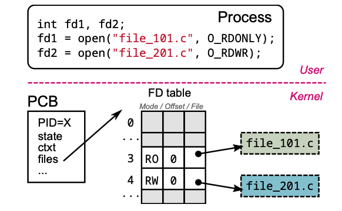
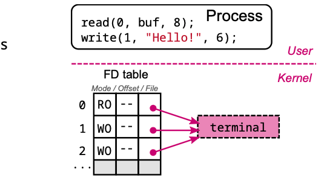

# System Calls (C language)

综上，OS为application提供hardware的接口，因此难免会需要系统调用。

在编写代码的时候，系统提供许多底层操控的Library用来进行对系统一些资源的调用。

## Definition

- Specific CPU instruction 
- Immediate transfer of control to ***kernel* code** 

### Purpose

Secure API between user applications and OS kernel

### Main categories

- Process management 
- Files and directories
- Pipes
- Signals
- Memory management

### Functions

3 types

- No privileged operation to perform
  - example: (`memset()`) - already in memory, no special operation
- Always needs to request privileged operation from OS
  - Known as **system call**, or syscall
  - example: `read`() file - verify if file exists/check read permission/read data
- Sometimes needs to request privileged operation from OS
  - example: `printf`() - internally buffered - full/\n needs to flush, flush needs write

# Process management

系统调用包括对进程的管理。

## Process

**A process is a program in execution**: 有自己的PID，自己的内存空间，在OS中由PCB代表

- identified by its *Process ID* (PID)
- runs its own memory space
- is represented in the OS by a *Process Control Block* (PCB)
  - Data structure storing information about process
  - PID, state, CPU register copies for context switching, open files, etc.

## Functions

- Process **creation and execution**
  - `fork()`: Create a new (clone) process - 拥有相同的寄存器，会继续执行后面的步骤
  - `exec()`: Change executed program within running process 执行
- Process **termination**
  - `exit()`: End running process 终止
  - `wait()/waitpid()` : Wait for a child process and collect exit code 阻塞
- Process identification
  - `getpid()`: Get process PID
  - `getppid()`: Get parent process PID

### Creation: `fork()：int`

从parent clone一个一摸一样的child出来，并且**让child执行当前(resumes -- 继续执行之后的，不是从新开始！！！)**。

- **对于parent: 返回child的pid**
- **对于child：返回0**
- 对于error： 返回-1

如下。执行完fork后，生成了新的child进程。此时，其中一个进程继续执行下面的步骤。如果是parent - 返回child pid；如果是child，返回0

### Execution:`exec()`

执行一个全新的进程。

- 如果进程执行成功，就不会返回任何信息
- 如果有错误，返回 **-1**

### Termination：`exit()`

结束当前进程。并返回对应结束状态。

### Termination: `wait()/waitpid()`

- `wait()`: parent会等待child执行完当前任务后再继续执行(**blocked**)
- `waitpid()`: 和上面相同，区别在于制定了pid/不会block，继续执行

如下， parent被阻塞，知道child执行完毕。

### `fork()+exec()+wait()`

### Identification: `getpid()/getppid()`

- `getpid()`: 返回当前进程的pid
- `getppid()`: 返回对应parent的pid

把进程看作一棵树，parent只能有一个，但是children可以有多个。

UNIX系统中，**kernel代表的PID是1**

# Files and directories

系统调用还包括对文件的处理 - **因为需要调用I/O模块**

电脑中的文件构成 **Virtual File System**: Every directory contains a list of filenames, Every file contains an array of bytes

### Functions

- File interaction
  - `open()`: open (create) file and return **file descriptor** 
  - `close()`: close file descriptor
  - `read()`: read from file
  - `write()` : write to file
  - `lseek()` : move file offset
- File descriptor management 
  - `dup()/dup2()`: duplicate file descriptor
- File characteristics 
  - `stat()/fstat()`: get file status
    - Stat 和 fstat 类似，但是是从fd返回数据
- Directory traversal
  - `getcwd()`: get current working directory
  - `chdir()`: change directory
  - `opendir()`: open directory
  - `closedir()`: close directory 
  - `readdir()`: read directory

### **File descriptor**

#### Definition

文件描述器，每个进程都拥有，记录了每个open files的状态。FD代表的是对应的**index**

如果用`open()`打开文件，永远返回**第一个available的FD**，也就是第一个可用的index

- Definition: **Table of *open files* per process** 
  - Part of PCB (Duplicated upon forking)
- FDs are simple indexes in the table

如下，fd1，原本被close了，此时fd2还存在， fd1位置为空。此时重新open，返回的为3.

####  standard stream FD 0，1，2

Initially, 3 standard file descriptors 

默认指向都是terminal。如下，默认指向输出位置都是terminal

也可以通过`>`改变输出位置

#### `dup2()`

replace open file descriptor with another (尽量避免使用 `dup()`)

# Pipe

管道 - 简单来说就是我们平时看到的｜

连接进程 - 进程1的输出会变成进程2的输入

- Inter-process communication (IPC)
- Pipeline of processes chained via their standard streams
  - **stdout** of one process connected to **stdin** of next process

### Functions

`pipe()`: 创建一个管道，并返回两个file descriptor

- [0] reading access
- [1] writing access

创建一个fd数组

pipe创建管道，返回两个fd，分别是3，4（0,1,2是standard stream）

对应3是read fd，4 是write fd

### Example

如下，是process1，输出到process2的example

- 创建管道
- 对于parent
  - 关闭 fd[0] 的read权限
  - 把standout的输出定向到管道 -> 所有输出流都到了pipe
  - 关闭 fd[1] 的write权限 - > process1只有一个输出，所有输出都要输向管道
- 对于child
  - 关闭 fd[1] --关闭向外的输出权限
  - 把standin的输入定向为管道 -> 所有输入都来源于管道了
  - 关闭 fd[0] read -- process2直邮一个输入，所有输入来源于管道

# Signals

### Definition

进程间通信方式的一种形式，通过发送信号，通知另一个进程做出对应的举动

- Form of **inter-process communication (IPC)** 
- Software notification system
  - From process' own actions: e.g., `SIGSEGV(Segmentation fault)`
  - From external events: e.g., `SIGINT(Ctrl-C)`
- About 30 different signals

### 常见Signals

- 

### Functions

- **Sending** signals
  - `raise()`: Send signal to **self**  
  - `kill()`: Send signal to **other** process -- 
    - 例如 kill -9 PID, 发送9信号干掉PID的进程
    - `raise(SIGKILL)`给自己发送终止的信号
  - `alarm()/setitimer()`: Set timer for **self**
    - Receive signal ( `SIGALRM/SIGVTALRM)` when timer is up
- **blocking** signals -- 阻塞信号的执行
  - `sigprocmask()`: Examine or change signal mask 改变对外暴露的信号值！ 
  - `sigpending()`: Examine pending blocked signals
- **receiving** signals
  - `sigaction()`: Map signal handler to signal 
    - Also `signal()` but usage not recommended
  - `pause()`: Suspend self until signal is received -- 暂停当前的进程，知道收到信号

### Example

# Memory

根据用处的不同，可以大致分为下面几种

简而言之 - user mode的时候，处理的空间是以segment划分的，内部以堆的形式存储。

kernel mode，管理的是page

- **User Mode**: C library
  - ==`malloc()/free()`==用来动态处理memory的分配
    - ==**Heap** memory **segment** (at the end of **data** segment)==分配的空间以堆的方式存储，存储的为segment
  - easy to manipulate
    - 只有当当前堆满了，才会向系统申请新的空间。
- **Kernel Mode**
  - Memory management at "page" level
  - Allocation of big chunks (many pages) to user library

### Functions

