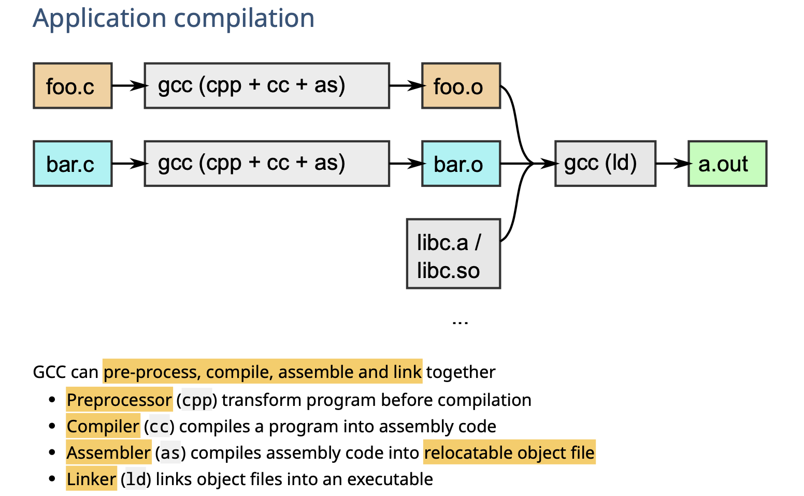
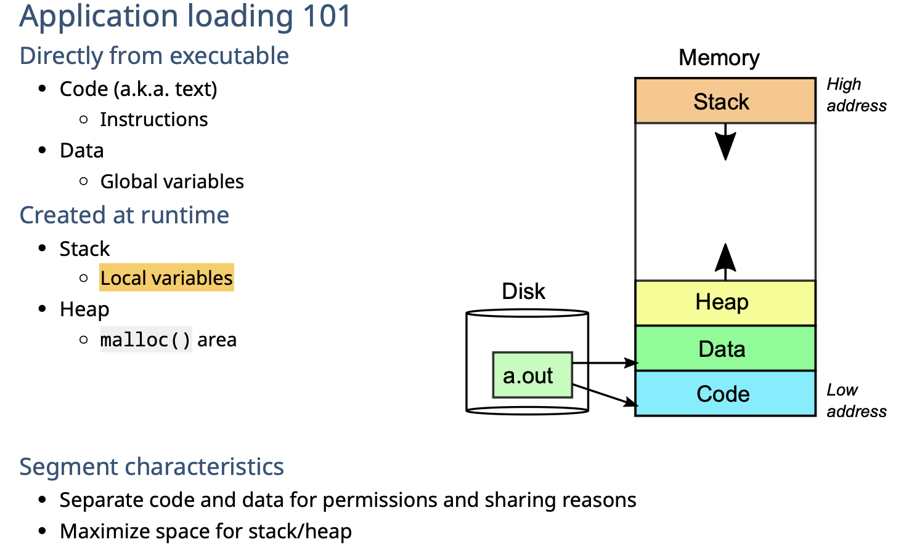
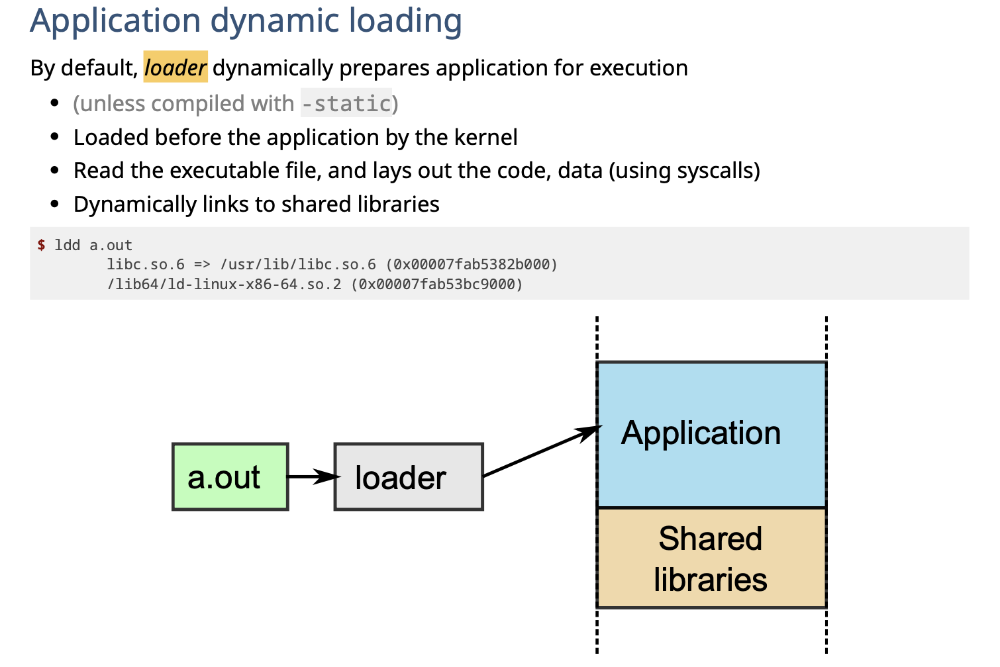
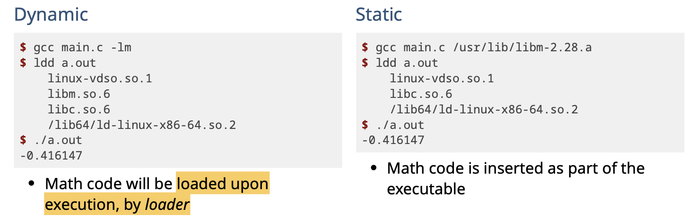
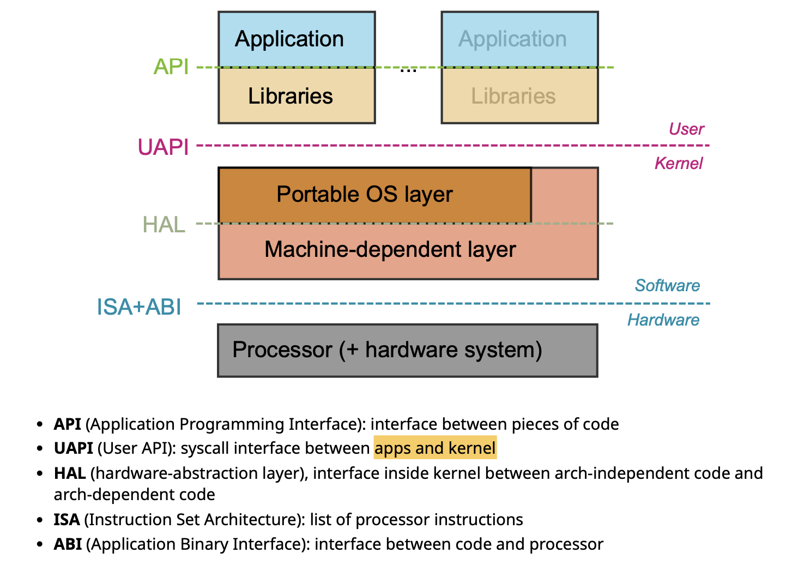
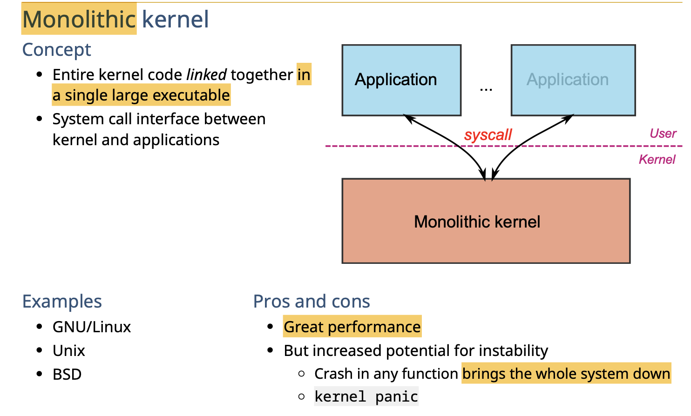
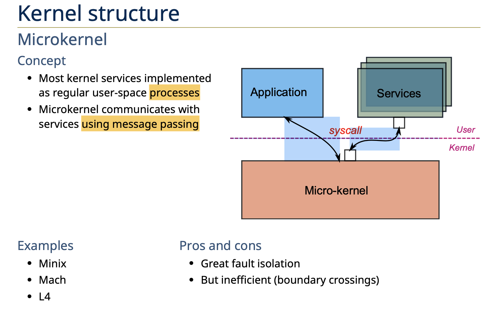
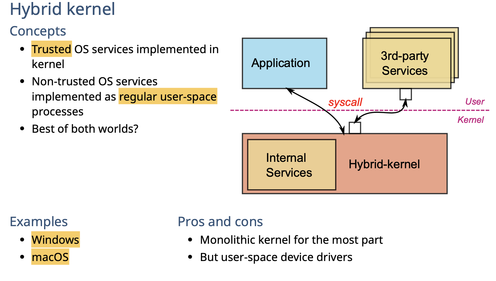

# OS Structure

## Overview

记录了OS是怎么在hardware和software之间运作的

- User Mode
  - **Applications**：是我们平时使用的软件，由程序员编写
  - **Libararies**：provide **libraries** for programmers to interact with kernel 
- Kernel Mode
  - **Portable OS layer**： 用来操作kernel，大部分的system call都在这里实现，从而可以和下层的硬件driver等进行交互
  - **Machine-dependent Layer**：最底层的接口，可以和硬件等进行交互。实现了很多硬件的抽象

## Application

### Compile

从代码 - > 可执行文件的过程

### Loading

可执行文件在运行的时候，会获得对应的内存空间来存储数据

os会对内存进行一个分配。其中dynamic方式和static方式是不同的

#### dynamic: loader

默认情况下，loader会在application执行前对application做一个**自动化**的分配。

是kernel的工作。读取可执行文件，分布code/data，自动连接libraries

#### static & dynamic

dynamic：执行前被loader加载

static：作为executable输出。直接执行。

## Libraries

可以通过standard headers来访问，和平常用到的方法没什么区别。

Code inclusion: Included in **executable directly** Or ***resolved* at load-time**

## Portable OS Layer

- Implementation of **most system calls**
-  *High-level* kernel code (i.e., top-half) for most subsystems
  - Virtual File System (VFS)
  - Inter-Process Communication (IPC) Process scheduler
  - Virtual memory
  - Networking, Sound, Cryptography, etc.

## Machine-dependent layer

最底层直接操作机器的layer

Bootstrap
 System initialization
 Exception handler (exceptions, interrupts and syscalls) I/O device drivers
 Memory management
 Processor mode switching
 Processor management

## OS Interface

# Kernel

### Monolithic kernel

### Microkernel

### Hybrid kernel

