# Process

可以简单理解为一段程序，计算机执行的一段代码。

A process is the abstraction used by the OS to **execute programs**

# Characteristics

## Address Space

每个进程都有自己的运行地址

## Environment

- **Process Control Block**(really important) - 保存了所有跟进程有关的所有信息

contains all specific characteristics of a process

P.S.: The memory has main(real) and secondary(virtual) memory. **Processes are maintained on secondary memory** - using virtual memory/simple swapping mechanism

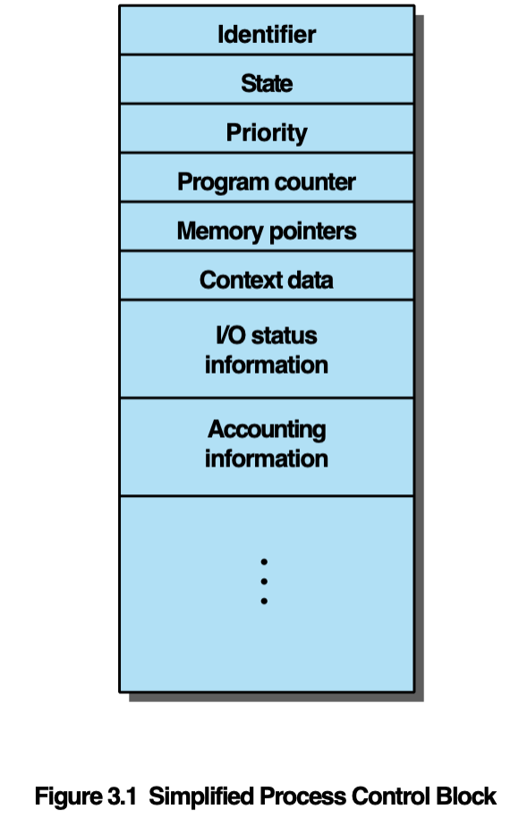

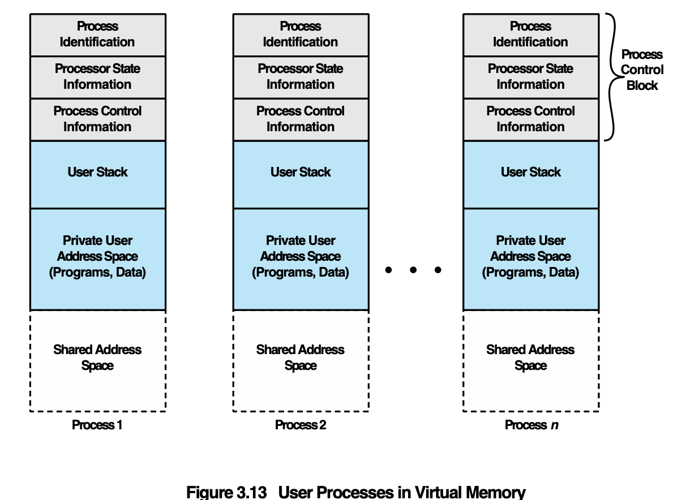

## Execution flow

Single sequential execution stream

进程是按顺序执行的。一次只能按照顺序执行程序的一段。

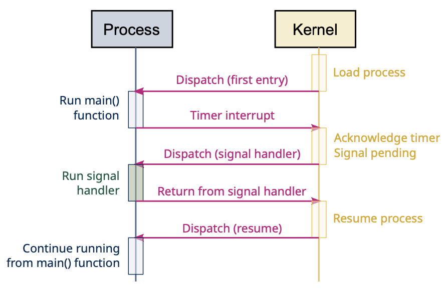


# Scheduling

## Single-processor system

**Terms**

- Trace - process 记录 当前指令执行顺序的行为 - 可以通过trace记录当前process的状态
- Dispatcher - small program 负责用来交换进程，并决定哪个process应该先进行。

### Definition

一次只能给一个进程执行。直到它进行完了才能进行下一个。Dispatcher负责选择什么进程先开始。(时间片到了/结束了等原因，切换进程)

- Single-processor systems only **allow one process to run at a time** 
- Scheduler(Dispatcher) in charge of determining which process should run
  - Ready queue contains all processes ready to run

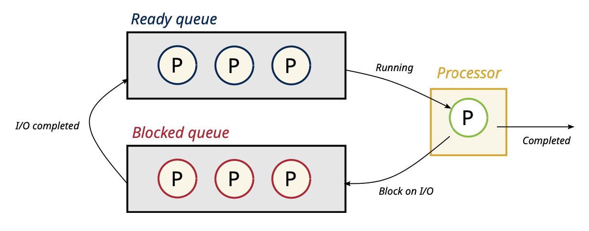

## Multitasking

### Definition

当当前process执行其他事情的时候，给下一个进程干活。Policy来决定哪个process 轮转而不是dispatcher。

- GOAL：目的是通过多进程的运转**最大化CPU利用率**
- When: process is **performing I/O burst** - give CPU to next process
- **Scheduling policy** determines which process is next

### Policy

- **Cooperative**: 可以长时间占有，I/O或者自愿才让出CPU
  - Process can hold unto CPU during long CPU bursts
  - Only yields voluntarily, or during I/O hursts
- **Preemptive**：每个进程会有时间片，超时会被强制suspended，保证多个进程都可以共享到时间片。
  - Process can be **forcefully suspended**, even during long CPU bursts
  - Use of hardware **timer interrupts**
  - Ensures guarantee in CPU sharing between multiple processes

## State

[Wiki](https://en.wikipedia.org/wiki/Process_state)

- New: 当进程被创建，会进入这个state，并等待进入ready state。大部分系统中，自动进入ready状态。
  - Process: assign id -> allocates space - > init process control block -> set linkage -> create/expand other data structures
- Ready: 当进程被加载到main memory， 进入ready状态等待使用CPU。系统可能有多个ready状态的进程，都在ready queue中等待。
- Running: 当进程获得时间片，开始获得CPU并执行任务，进入running 状态。当时间片过期被抢占/执行完毕/出现错误/IO触发，进入其他状态。
- Blocked: 当当前状态没法继续执行(例如，需要等待被占用的IO模块；等待输入；等待资源)或者有其他事件发生的时候(例如，分配的时间片执行完毕了)，进入blocked状态。
- Terminated: 当进程执行完毕/被killed后，进入terminated状态。
  - 它会作为**Zombie process**存在于process table中，直到parent对它进行回收/read its exit code。如果没有回收成功，就是内存泄漏问题。它会一直占用着table。

**Orphaned processes**: 如果parent在child之前就terminated了，没有process来结束当前进程，当前进程就成为了Orphaned  process.

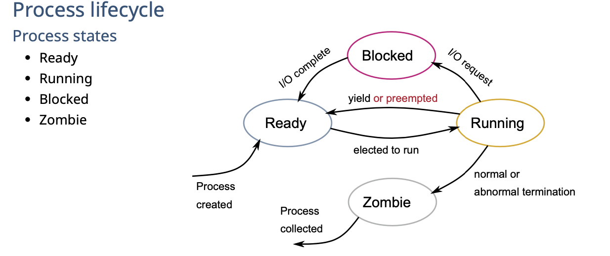

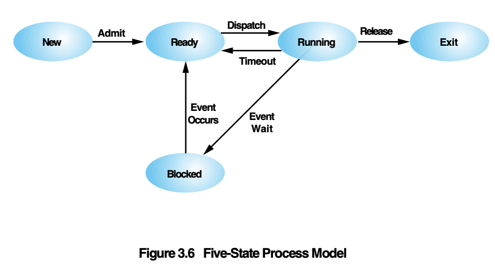

Other states

- **Suspend**: process没法马上ready for execution
  - 例如：swapping(OS需要释放内存，会把process suspend), interactive user request(debugging时，suspend process), timing(时间片到了，但是还没到执行的时候，于是suspend来等待下一个时间片)

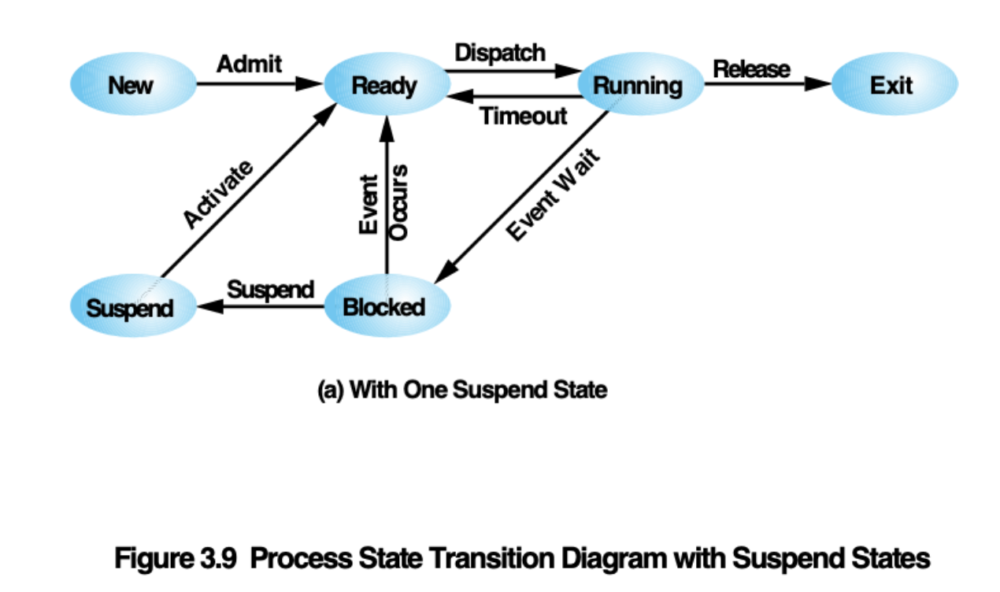

## Algorithm

### Terms

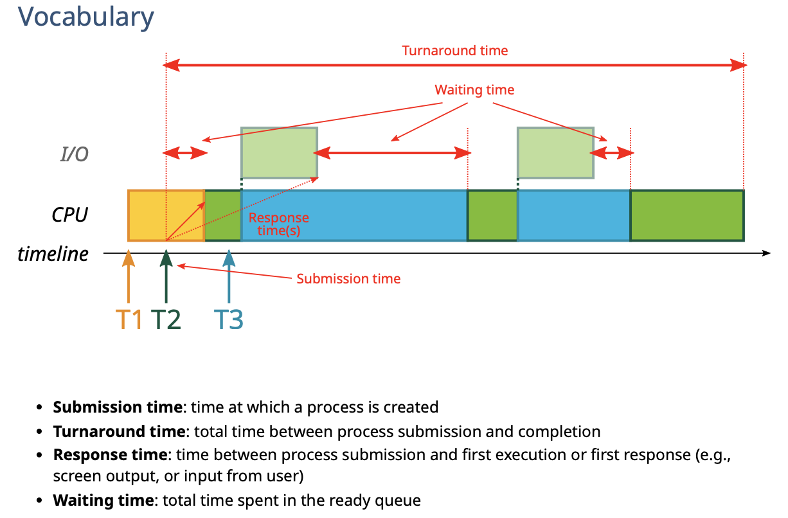

- turaround time : 从submit到执行完毕的时间

### FCFS(FIFO)

First come first served

先来后到，前一个结束了才执行后一个

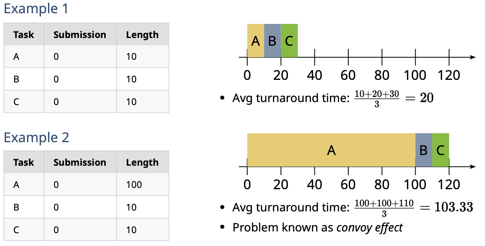

- 优点： 简单
- 缺点：**Convey effect**，由于每个任务时间过长而堆积

### SJF

shortest job first

先执行短的job

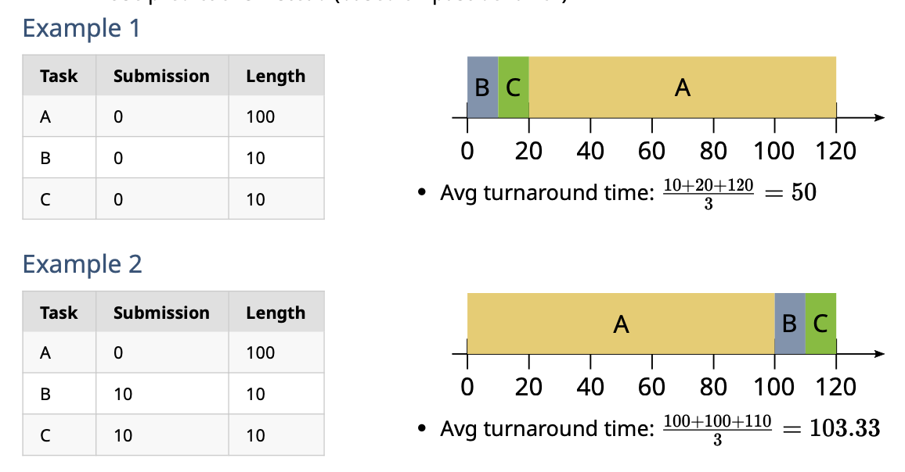

- 优点：速度的确有提升，optimal scheduling
- 缺点：需要提前知道task length；并且如果submission time太晚了，没有效果，如例子2

### Preemptive SJF

SRJF(Shortest Remaining Time First)

在同一时间内，剩余执行时间短的process先运行，新的short job可以抢占longer job

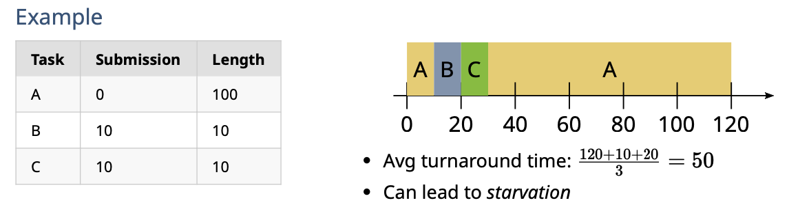

- 优点：可以解决SJF的没有效果的问题。
- 缺点：lead to **starvation** - 有可能一直被抢占

### Round-Robin(RR)

**Reason**

- Optimizing for turnaround time great **for (old) batch systems**
  - Length of tasks known (or predicted) in advance
  - Tasks **mostly CPU-bound**
- With **interactive** systems, need to **optimize for response time**
  - User wants reactivity 
  - Tasks of unknown length

**Definition**

任务是分时间片来执行的。一次只执行一个时间片。互相抢占执行。

- Tasks run only for a (short) ***time slice*** at a time 
- Relies on **preemption** (via timer interrupts)

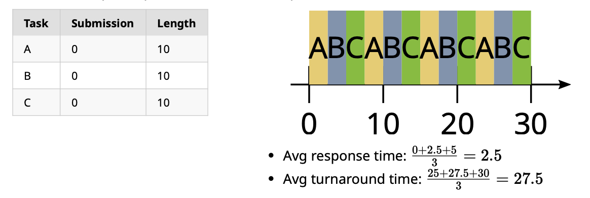

- 优点：prevents starving问题，response time得到了很好的响应
- 缺点：turnaround time变长了
- 重点：time slice time变得很重要，会影响reponse time和turnaround time的长短

### Multi-level queue scheduling

根据上面的情况，可以根据不同的任务**分类**，定**priority**来定义scheduling

- Classify tasks into categories - 根据是否需要interactive来分类
  - E.g., *foreground* (interactive) tasks vs *background* (batch) tasks 
- Give different priority to each category - interactive的任务priority高，因为需要及时性
  - E.g., Interactive > batch
- Schedule each categorize differently - 区别对待
  - E.g., optimize for response time or turnaround time

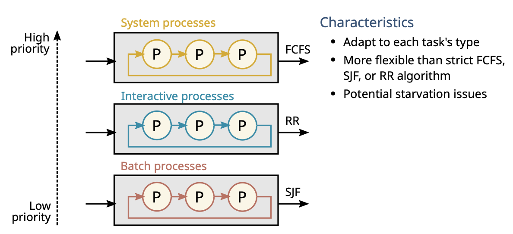

- 优点：能够更好适应各种情况，比上面几种算法灵活性更高
- 缺点：但是有可能会有starvation的情况发生

#### Multi-level feedback queue

不需要分类，根据实际情况改变。

- **No** predetermined classification
  -  All process start from highest priority
- Dynamic change based on **actual behavior**
  - **CPU-bound** processes move to lower priorities - 时间长的放后面
  - **I/O-bound** processes stay at or move up to higher priorities - 即时性要求高的提高

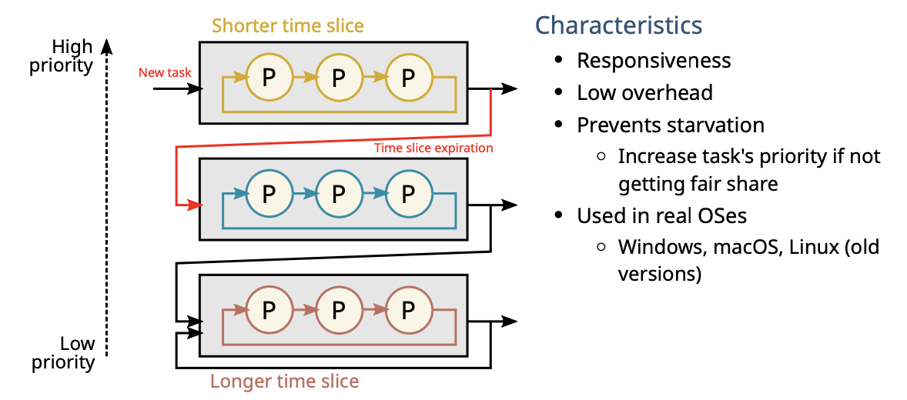

解决了很多问题如上！现在大部分的系统都用的这个！

# Inter-process communication

Specially for UNIX system

## Pipes

**循环buffers** - process可以像producer-consumer一样进行交流

- first in first out 
- Types: named/unnamed

```shell
# unnamed
ls -al | less
# named
mkfifo my Pipe
ls -l >myPipe
cat<myPipe
```

## Messages

类似消息队列

## Shared memory

共享内存。

## Semaphores

见下一个notes

## Signals

- A software mechanism that informs a process of the occurrence of asynchronous events
- **delivered**：A signal is delivered by **updating a field in the process table** for the process to which the signal is being sent
- **respond**：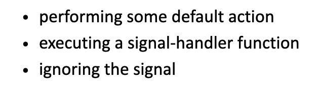
