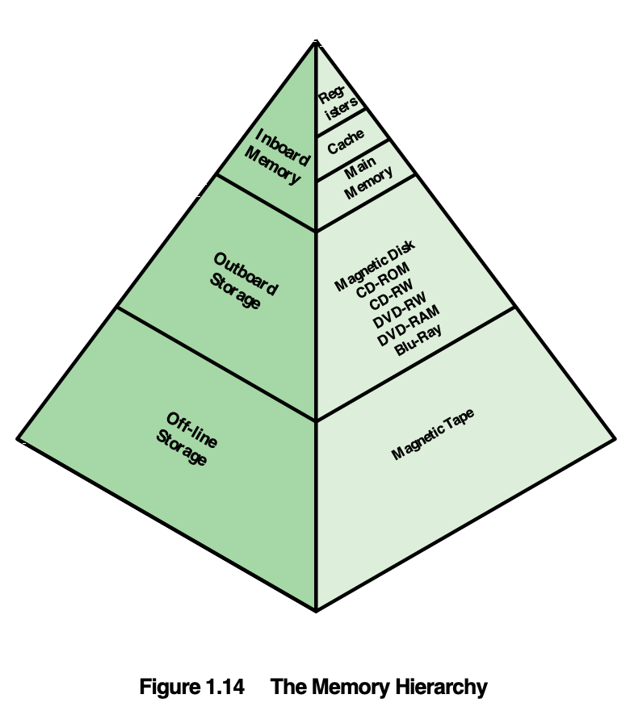
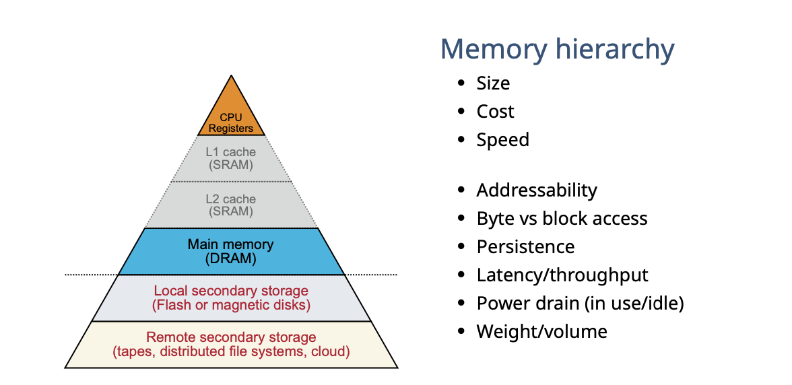
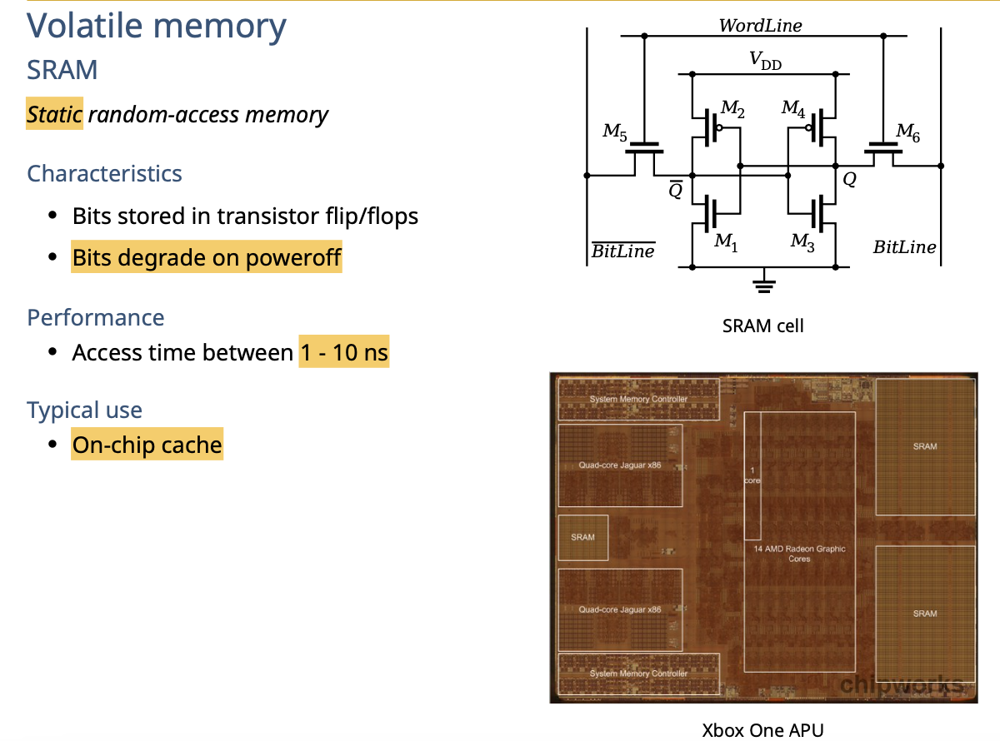
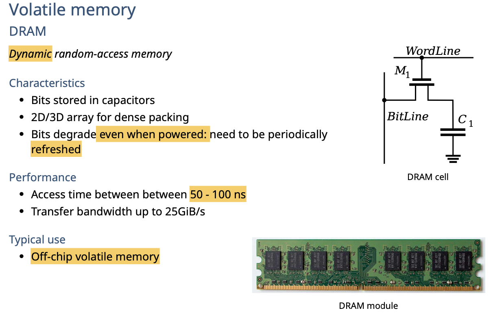
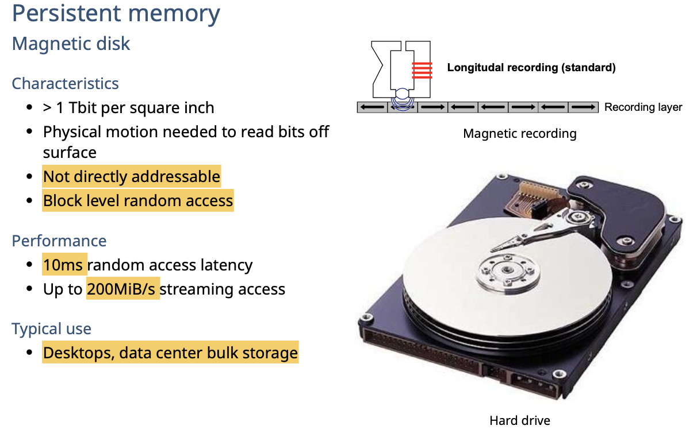
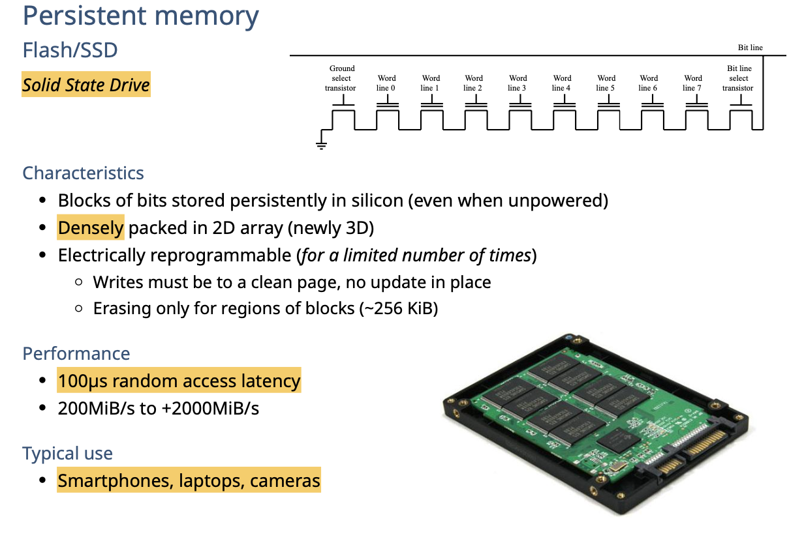

# Storage

从上往下

- 速度变慢
- 容量变高
- 访问时间增加
- 访问频率降低

# Technologies

## Register

这是计算机中最重要的一个部分。用来记录下一个指令的地址。

因此要求速度最快！

## SRAM

为啥是static：缓存是一次写入的，然后因为timeout/满的情况才会被清理。因此数据不会变，是静态的，访问很快。

## DRAM

## Persistent memory

### magnetic disk

磁盘

### Flash/SSD

固态硬盘

