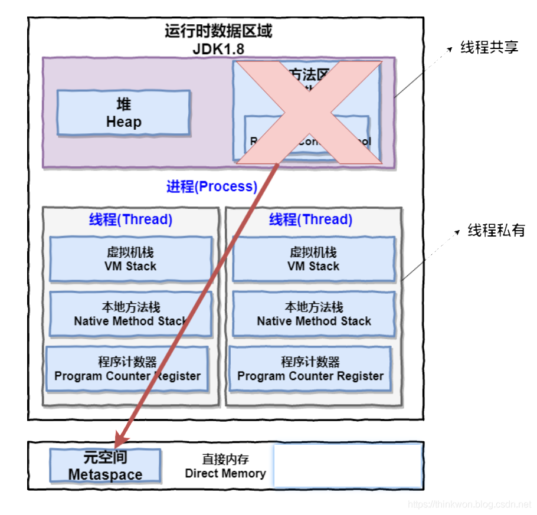
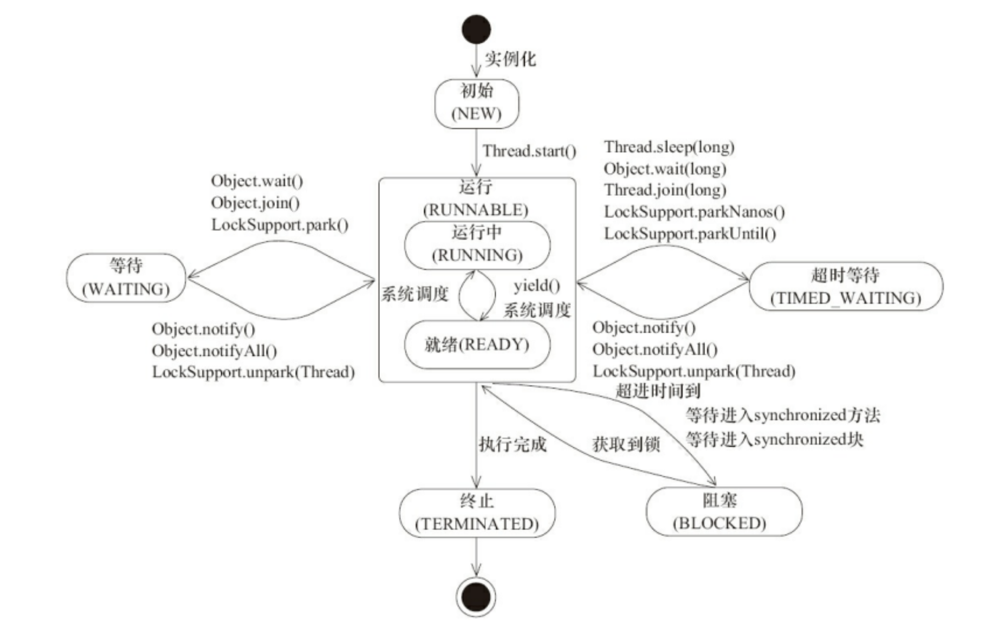

# OS Basic

## Process & Thread

thread之间堆共享，方法共享，常量池共享

thread拥有自己独立的register，VM stack，nitive stack

- register：记录线程运行的地址。运行到哪里了。
- VM stack(虚拟机栈)：程序运行时存储局部变量，引用等。
- native stack（本地方法栈）：类似VM stack，前者是执行Java服务，后者是native

为了保证局部变量 不被其他的访问到，因此都是私有的。



## Thread



## 死锁

**条件**

- 互斥：几个线程都在等待同一个资源
- 占有且等待：每个线程都占有一部分资源，互相等待其他资源释放
- 不可抢占：不能因为需要某资源就把别人占有的抢过来
- 循环且等待：都带等待其他线程释放自己的资源

**解决方案**：破坏其中一个条件就可以保证不会发生死锁。

- 互斥：不可破坏
- 占有且等待：一次性申请所有资源
- 不可抢占：可设定时，若还没获得则释放自己的
- 循环且等待：靠按序申请资源来预防。按某⼀顺序申请资源，释放资源则反序释放。破坏循环等待条件。


### **sleep() VS wait()** 

两者最主要的区别在于：**sleep** ⽅法没有释放锁，⽽ **wait** ⽅法释放了锁 。

两者都可以暂停线程的执⾏。

Wait 通常被⽤于线程间交互/通信，sleep 通常被⽤于暂停执⾏。

wait() ⽅法被调⽤后，线程不会⾃动苏醒，需要别的线程调⽤同⼀个对象上的 notify() 或者

notifyAll() ⽅法。sleep() ⽅法执⾏完成后，线程会⾃动苏醒。或者可以使⽤ wait(long

timeout)超时后线程会⾃动苏醒。


### start还是run

start才是真正启动线程，run是普通方法，仍然在主线程中执行。

# 锁

[对象锁和类锁](https://cloud.tencent.com/developer/article/1819019)

## Synchronized

synchronized关键字解决的是多个线程之间访问资源的同步性，synchronized关键字可以保证被它修饰的⽅法或者代码块在任意时刻只能有⼀个线程执⾏。

> ⽽操作系统实现线程之间的切换时需要从⽤户态转换到内核态，这个状态之间的转换需要相对⽐᫾⻓的时间，时间成本相对᫾⾼，这也是为什么早期的 synchronized 效率低的原因。

使用方法：

- **修饰实例⽅法**: 作⽤于当前对象实例加锁，进⼊同步代码前要获得当前对象实例的锁 

  ```java
  synchronized Object object
  ```

- **修饰静态⽅法**: 也就是给当前类加锁，会作⽤于类的所有对象实例，因为静态成员不属于任何⼀个实例对象，是类成员（ static 表明这是该类的⼀个静态资源，不管new了多少个对象，只有⼀份）。所以如果⼀个线程A调⽤⼀个实例对象的⾮静态 synchronized ⽅法，⽽线程B需要调⽤这个实例对象所属类的静态 synchronized ⽅法，是允许的，不会发⽣互斥现象，因为访问静态**synchronized** ⽅法占⽤的锁是当前类的锁，⽽访问⾮静态 **synchronized** ⽅法占⽤的锁是当前实例对象锁。

  ```java
  synchronized static xxxx
  ```

- **修饰代码块**:指定加锁对象，对给定对象加锁，进⼊同步代码库前要获得给定对象的锁。

### singleton

[饿汉，懒汉](https://www.cnblogs.com/codeshell/p/14177102.html)

#### **1. 饿汉式**

因为是static，在类加载的时候就把实例初始化好了。

**优点：** 简单。并且**线程安全**！不用加锁。

**缺点**：在初始化就创建好了，有时候并不需要经常使用。延时加载会节省内存

```java
public class Singleton { 
  private static final Singleton instance = new Singleton();
  
  private Singleton () {}
  
  public static Singleton getInstance() {
    return instance;
  }
}
```

#### **2. 懒汉式**

和饿汉的区别是，延迟加载。现在实例在需要的时候，调用getInstance时候才会创建。

为了防止被创建多个，需要对这个方法**加锁**

**优点**：延迟加载，提升了空间效率。线程安全。

**缺点：**这把锁只有在第一次创建的时候才有用。后面每次使用的时候都是负担，会降低效率，影响并发度。如果不常使用没关系。如果经常获取实例，效率很低。

```java
public class Singleton { 
  private static final Singleton instance;
  
  private Singleton () {}
  
  public static synchronized Singleton getInstance() {    
    if (instance == null) {      
      instance = new Singleton();    
    }    

    return instance;  
  }
}

```

#### **3. 双重加锁机制**

饿汉懒汉都有缺点，双重加锁解决了这个问题。

把懒汉的synchronized方法类锁变成了synchronized代码块。也就是**类级别的锁。**

> - 类级别的锁可以防止多个线程在运行时同时进入**该类所有实例化对象**的 synchronized代码块中。
> - 对象级别的锁可以防止多个线程在运行时同时进入**当前（或某一个）实例化对象**的 synchronized代码块中。

方法是静态方法。在第一次调用的时候才会进行初始化。此时就会进行判断。因为是类级别的锁，之后调用的时候，不用担心锁降低效率。

注意：java1.4下，有指令重排的问题，需要加上Volatile防止指令重排。之后就没问题了。

```java
//高版本的java解决了问题
public class Singleton { 
  private static Singleton instance;
  
  private Singleton () {}
  
  public static Singleton getInstance() {
    if (instance == null) {
      synchronized(Singleton.class) { // 注意这里是类级别的锁
        if (instance == null) {       // 这里的检测避免多线程并发时多次创建对象
          instance = new Singleton();
        }
      }
    }
    return instance;
  }
}

```

### 优化

synchronized在1.6后进行了许多优化。

## Volatile

**volatile** 关键字的主要作用就是保证变量的可⻅性然后还有一个作用是防止指令重排序。


## ThreadLocal

