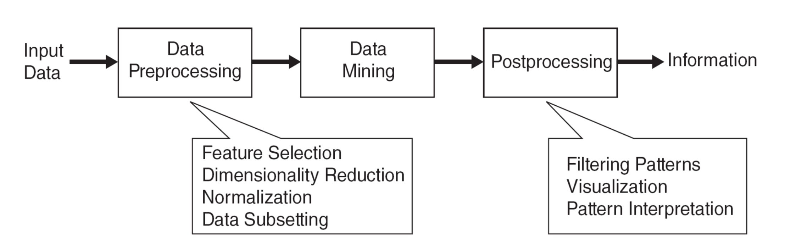

# Data Mining

> origin： Draws ideas from machine learning/AI, pattern recognition, statistics, and database systems

### Definition

**Non-trivial** extraction of **previously unknown, useful** and **interpretable** patterns of data.

### Process

### Key areas of data mining

- Predictive modeling：**Model relationship between input and output variables to predict the output on unseen (new) instances**
  -  监督学习(**supervised** learning): taking **labels**(input, output)-> build models-> **predict** the output 
    - **classification**:target takes **descrete** values(1,2,3,4,……)
    - **Regression** : target takes **continuous** values
- Descriptive modeling：find human interpretable patterns from **unlabeled** data
  - 非监督学习(**unsupervised** learning): 
    - **clustering** : find groups with similarites
    - **Association analytics** : find frequent associations
    - **anomaly detection** :find unusual instances

### Intro 

#### Classification

Example: 图像识别，垃圾邮件过滤

General approach: training dataset---(induction)---- learn model--->**model**---> apply model ---(deduction)--- predict(test dataset)

- decision trees
- svm(support vector machines)
- nearest neighbor
- naive bayes & probabilistic graphical models
- artificial neural networks. (deep learning)

常见问题- 

over fitting: 和dataset 过于切合，不适用

Under fitting: too simple

#### Clustering

find **groups with similarites**

#### Association anlysis

find **frequent patterns** of co-occurrence of items(**association**)

#### Anomaly detection

Detect significant **deviations** from normal behavior 

Example: credit card fraud detection/ network intrusion detection/ detecting changes in the global forest cover 

#### Avoiding false discoveries

goal: to assess the statistical significance of a data mining result beyond random chance

​	防止发现错误

​	当测试猜想等，非常重要

#### other topics

reinforcement learning

generative modeling： generative adversarial networks 

