# Data

## Definition

Number of votes received by political candidates in a specific race

Collection of **data objects** and their **attributes**: 是数据对象和属性的集合

- Attribute: 数据对象的一些自带的特性，性质
  - value: 属性值是非配给数据对象的对应属性的特定的数字/符号等
    - 用来代表属性的值，可能具有不同于属性本身的性质。有时候，除了显示序数性，也能显示本来数据不具有的其他性质
    - 属性的性质反应在用于测量它的值中。
- object：一个数据对象由多个属性描述而成

## Attributes

数值的一些性质（操作），经常可以用来描述属性。

### operation

| name                       | Operation | transformation                                               |
| -------------------------- | --------- | ------------------------------------------------------------ |
| Distinctness               | =,!=      | Any permutation of values 不论怎么排列组合都会有意义         |
| Order                      | < >       | new_value = f(old_value) f是一个单调函数                     |
| Differences are meaningful | + -       | new_value = a * old_value + b：这就意味着，华氏度，摄氏度会根据零度位置不同而意义不同 |
| Ratios are meaningful      | * /       | new_value = a * old_value                                    |

### types

#### 根据性质

- 分类的（定性）categorical/qualitative
  - **Nominal**: 名义上的。一般没啥意义，没有什么可操作的余地。可以就当成一个符号
    - Examples: ID numbers, eye color, zip codes
    - **操作**：（distinctness：=,!=）
  - **Ordinal**: 序数词。一般这样的序数词也没什么意义，但是可以用来rank
    - Examples: rankings (e.g., taste of potato chips on a scale from 1-10), grades, height {tall, medium, short}
    - **操作**：(distinctness & order)中值，百分位等
- 数值的（定量的）numerical/quantitative
  - **Interval**: 区间。区间属性，值之间的差是有意义的，即存在测量单位
    - Examples: calendar dates, temperatures in Celsius or Fahrenheit.
    - **操作**：(distinctness & order & meaningful differences)均值，标准差等
  - **Ratio**：比率。一般都有**meaningful 0.** 这事一种可以按比例的度量。
    - Examples: temperature in Kelvin, length, time, counts
    - **操作**：四种操作都可以。几何平均，调和平均等。
- 判断ratio 和 interval， 最重要的是看是否有绝对0值。

> 当使用保持属性意义的变换对属性进行变换，产生的结果是相同的。例如：对ID重新赋值，不会改变；好，较好，最好可以用1，2，3表示；华氏和摄氏度零度位置不同，1度表示也不同；长度可以用米或者英尺。

> difference betwwen ratio and interval
>
> Q1: 能否说10度是5度的两倍？
>
> Answer：摄氏度，华氏度不可以（因为是区间属性，只能进行+ -的赋值）
>
> Kelvin温度可以。因为本身是比率度量
>
> Q2: If Alice’s height is three inches above average and Bob’s height is six inches above average, then would we say that Bob is twice as tall as Alice
>
> answer：很明显，不可以。因为是above average 而不是大于meaningful 0
>
> 

#### 根据个数

- descrete 离散属性
  - 个数是有限的，coutable
  - 一般是整数值。binary是特殊的一种情况。
- continuous 连续属性
  - 一般都是真实的数字。通常用浮点变量表示
  - 一般来说，任意两个值之间，还能划分为无限的值，可以无限分割。

https://blog.csdn.net/a2099948768/article/details/82466237#:~:text=%E7%A6%BB%E6%95%A3%E5%8F%98%E9%87%8F%E6%98%AF%E6%8C%87%E5%85%B6,%E5%8D%B3%E5%8F%AF%E5%8F%96%E6%97%A0%E9%99%90%E4%B8%AA%E6%95%B0%E5%80%BC.

#### asymmetric attributes

非对称变量

比较的是属性之间的重要性。例如二元非对称属性，其中，假设1的出现比0的出现更有意义，此时，就是非对称的。

https://blog.csdn.net/dpengwang/article/details/81735576 

> We need two asymmetric binary attributes to represent one ordinary binary attribute
>
> – Association analysis uses asymmetric attributes
>
> Asymmetric attributes typically arise from objects that are sets

## Characteristic

- **Dimensionality**(属性的个数)
  - 过于高的维度可能会带来很多挑战。之后为了分析，经常需要降纬
- **Distribution**：数据分布
  - 数据倾斜问题以及 以及数据稀疏问题都需要后期处理。
- **Resolution**
  - **patterns** depend on the scale
- **size**: 大小
  - 很多分析都取决于数据的大小

## Types of data set

- Record data：记录大量数据
  - 例如：数据矩阵，文件，账单等
- graph
  - 例如：www，molecular stucture
- ordered
  - 例如：spatial data 空间数据 Temporal data，sequential data，genetic sequence data

## Quality

数据质量如果太差，会影响数据处理。

问题：

- noise and outliers: 无关的，或者极度异常的数据。比如超出范围过多的数据，随机错误。
  - noise很多时候是一个观测中的随机错误或者偏差，包括错误的值，偏离期望的孤点
  - outliers离群值。和大部队差异过多的。有可能是真实数据产生的， 有可能是噪声产生的。
    - 情况1:是不需要的会影响分析的数据。
    - 情况2:是分析的目标。例如credit card fraud
- missing values
  - 有些数据没被收集到/有些属性并不适用所有情况
  - 处理缺少的值：删除这些数据/估算/忽略
- duplicate data
  - 有时候需要汇集异构数据的时候会产生问题
  - 例如一个人有多个邮箱地址
  - 有时候需要去重
-  wrong data

# Similarity 

https://zhuanlan.zhihu.com/p/33164335 

有时候需要比较数据的相似性。（例如推荐系统时，需要寻找相似的数据）比较相似性一般通过比较两个数据集的**临近度**。比较临近度有一下几种方法

1. **similarity**

- **一般 falls in range [0，1]**，**相似度的数值越高**，两个数据对象就更加相似。

2. **dissimilarity**

- 当数值越低，说明两个数据相似度越高。
- **最低值是0**，最高值是变动的。

## simple attributes

对一些简单的属性值，可以通过以下简单的几种方式来比较相似度

## Proximity

临近度有时候是度量相似性的一个重要指标。一以下是几种临近度测量的方式。

#### **Distance Properties**

对于两点x，y，有如下这些特性

- **d(x,y)>=0: 如果x,y重合，则d(x,y)=0**
- d(x,y)=d(y,x) 对称性
- d(x,z)<=d(x,y)+d(y,z) 三角形的原则

能够符合这些特性的是**矩阵**

#### Similarity Properties

- **s(x,y)=1 如果x=y**
- s(x,y)=s(y,x) 对称性

### Euclidean Distance 欧几里得距离

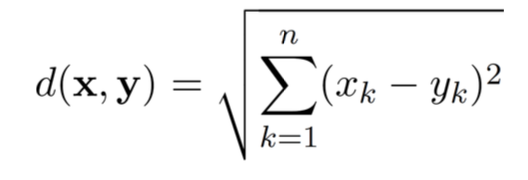

- n: dimensions - 变量的维度
- x，y是对应的亮点的第k个维度的值 x(x1,x2,x3,x4……xn),y(y1,y2,y3,y4,……yn)

> **Standardization is necessary, if scales differ.**：把数据变成相似的度量
>
> 有时候，数据是不可比较的，为了能够比较，需要提前对数据进行预处理。例如：normalization（将数据范围变到0，1之间。Xnorm=(Xk-Xmin)/(Xmax-Xmin)），或者Z-score(Z=(X-miu)/sigma,miu:mean,sigma:stand deviation)

#### Minkowski Distance

 欧几里得距离的另一种形式

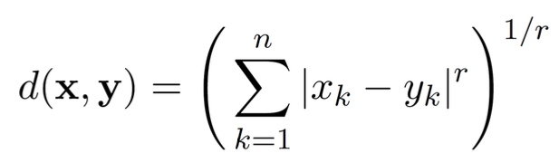

- n,x,y和欧几里得距离相同
- r是一个变量。
  - r=1: city block，也就是曼哈顿距离，L1 norm等。
  - r=2: Euclidean distance L2
  - r->∞: supremum distance，其实就是最远距离。可以理解为x-y中的最大值 Lmax norm; L∞ norm

##### Visualization of distance

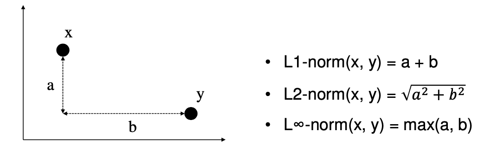

- **L1-norm is robust to outliers in a few attributes**
  - L1 正则化 - creates sparsity in the solution，也就是说，一些噪声在正则化中会呗弱化。
- **L∞-norm is robust to noise in irrelevant attributes**

### Mahalanobis Distance

> 是度量学习中一种常用的距离指标，同欧氏距离、曼哈顿距离、汉明距离等一样被用作评定数据之间的相似度指标。但却**可以应对高维线性分布的数据中各维度间非独立同分布的问题。**
>
> 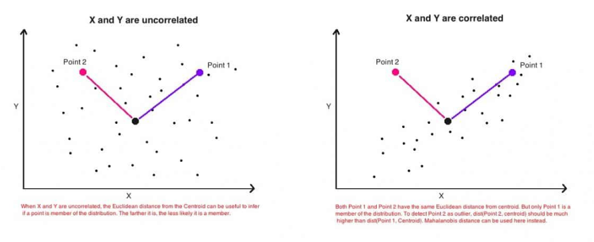
>
> 见上图，如果为了探查相关性，如果只看欧几里得距离，对于图二，点2必须比点1远，但是欧几里得距离无法解决这个问题。马氏距离可以

可以看作是欧氏距离的一种修正，修正了欧氏距离中各个维度尺度不一至相关的问题。

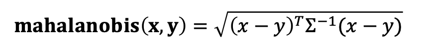

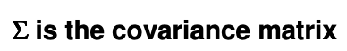

通过这个方式，离群点获得的马氏距离值更高，从而能够找到离群点。

## For binary

### Binary Vectors 只适用于二维向量

对于**向量p,q(p,q都只有二维的属性-have only binary attributes)**,计算二者的相似性有：

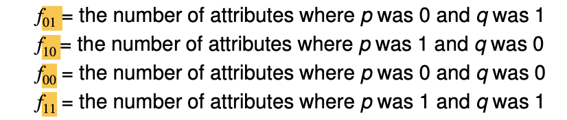

比较方法有：

- **SMC（simple matching）= number of matches / number of attributes**
  - **SMC=(f11+f00)/(f01+f10+f11+f00)**
- **Jaccard Coefficients= number of 1-1 maches / number of non-zero attributes**
  - **(f11)/(f01+f10+f11)**对比上面，删除了00的情况，因为其实没有意义。

### Cosine Similarity

对于d1,d2两个document vector 有：

**Cos(d1,d2)=<d1,d2>/||d1||*||d2||**

- <d1,d2>: 向量积
- ||d||: 向量的长度

#### Extended Jaccard Coefficient(Tanimoto)

是Jaccard的变形。如果属性是二维的，就是Jaccard

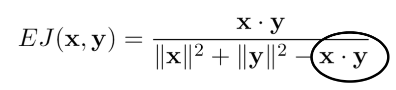

### Correlation

用来表示变量之间的**线性关系**，必须得是numeric数据

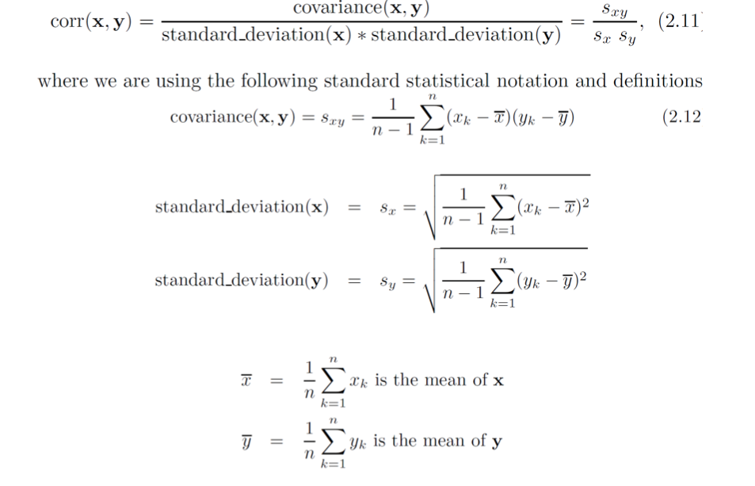

#### visualization of correlation

注意此图，取值区间为-1 - 1.

当趋近1/-1时，说明两个信息相似。

-1只是说明，当一个数据上升的时候，另一个数据会下降。

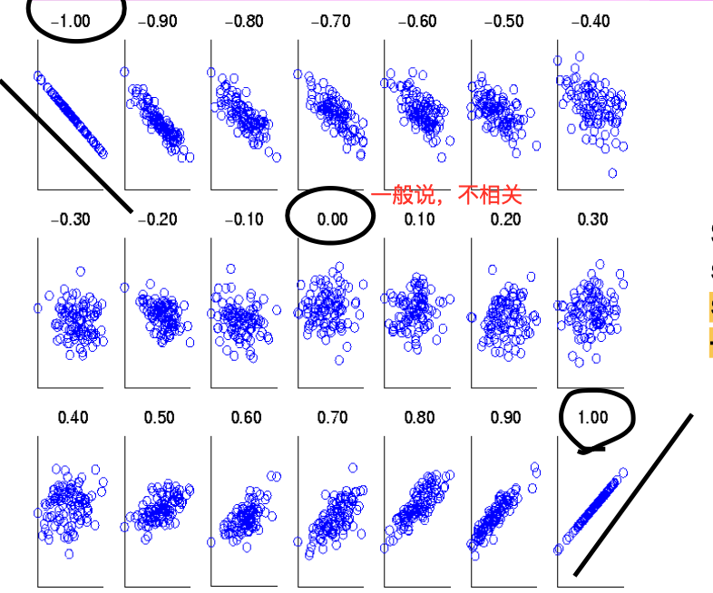

#### Drawback

当数据量过小的时候，浮动会很大。

注意，当x=xmean时，这个值会undefined

#### correlation & cosine

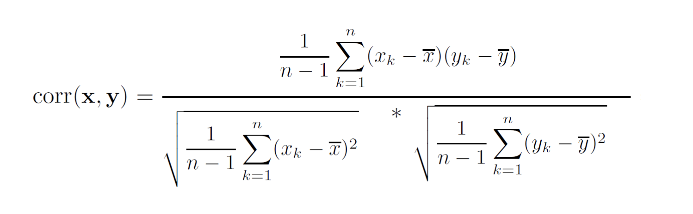

> 当转换x,y时
>
> Xm=X-mean;
>
> ym=Y-mean
>
> **有：core(x,y)=cos(xm,ym)** 

### Differences Among Proximity Measures

Measures: cosine, correlation, euclidean

有两种操作方式：

1. scaling operator ys=2*y 会改变度量
2. translation operator  yt=y+5

对于以上两种操作方式，这三种临近度方法互相对这两种操作方式不敏感的有

| Property                    | Cosine | Correlation | Minkovski Distance |
| --------------------------- | ------ | ----------- | ------------------ |
| invariant to scaling（*）   | Yes    | Yes         | No                 |
| invariant to translation(+) | No     | Yes         | No                 |

> 欧式距离衡量的是空间中各点之间的绝对距离，和点所在的位置坐标（即个体各维度的特征数值）直接相关，**距离越小，两向量之间越相似**；
>
> 余弦相似度衡量的是空间中两向量之间的夹角，体现的是方向上的差异，**夹角越小（余弦相似度越大），两向量之间越相似**。如果保持A点的位置不变，B点朝原方向**按比例延伸**，那么这个时候余弦相似度cosθ是保持不变的，因为夹角不变，而A、B两点间的距离显然在发生改变，这就是欧氏距离和余弦相似度的不同之处。

### Mutual Information

Measures **similarity** among two objects as the amount of information **shared among them**

通过比较二者之间互相包含的信息量，来比较二者的相似性。

- 可以处理非线性关系
- 计算费时且复杂

#### Entropy 熵

是度量信息的一种方法。H来表示。如下为计算方式。

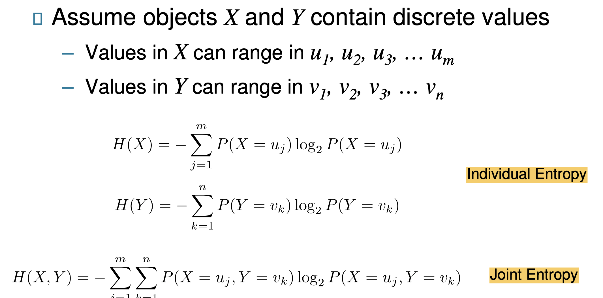

#### computing mutual information

**I(X,Y)=H(X)+H(Y)-H(X,Y)**

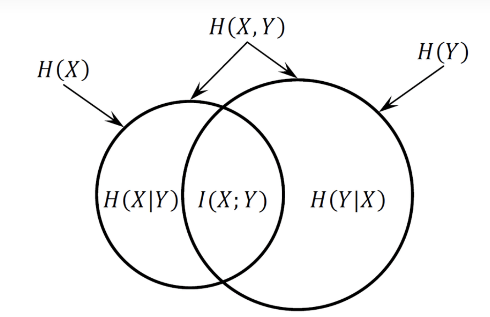

- **Minimum**: 0完全不相似
- **Maximum**: log2(min(m,n)) 二者中小的

规范化互信息: 将数值规范在0，1间

normalized Mutual Information= **I(X,Y)/log2(min(m,n))**

- 如果二者相似 =1

# Data Preprocessing

## Discretazation

- 简而言之，把大量的连续数据，**映射进几个不同的类别中**，把数据离散化。（converting a **continuous attribute** into an **ordinal attribute**）
- 是supervised和unsupervised 中的常用方法

**Unsupervised discretazation**

对数据用特定的方式来进行分类。

例如：等长，等频率，K-means等

- 等频分箱：每个区间内包括的值一样多
- 等距分箱：每两区间之间的距离是一样的（区间：(最大值-最小值)/bin数量）

**supervised**

有很多分类算法已经做的很好了。

## Binarization

将连续的或者分类的数据映射进1个或多个binary值中

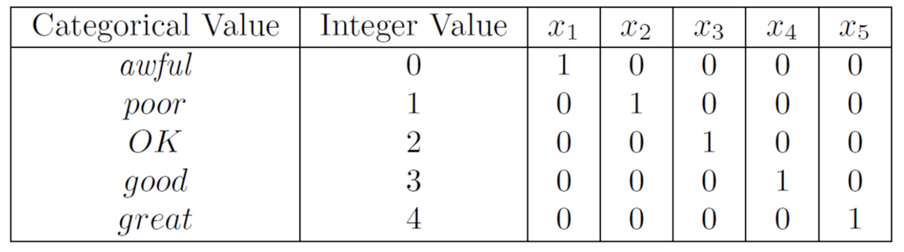

## Attribute Transformation

将数据集进行新的转换。

### simple functions

简单转换例如： x^k,log(x)等

### Normalization

- 使用各种技术，适应**mean，variance， range**之间带来的数据之间的差异。
- 能够将不需要的各种信息剔除。

### Standardization

标准化是  (数据-mean)/standard deviation

## Sampling

**是缩小数据集的主要技术**

原因：

- **获得**所有数据集的成本代价过大，过于耗时
- **处理**所有的数据成本过大

样本的**原则**

- 如果样本具有**代表性**，使用样本的效果和使用所有数据的效果相同
- **代表性**：它接近和原数据相同的properties

选取样本的方法：要关注两点-获取样本的**方式**和样本**大小**

获取样本的方式

- **simple random sampling** 简单随机取样
  - 每个样本被取到的概率是相同的
  - 两种简单取样方式
    - 取完不放回
    - 取完放回
- **stratified sampling**
  - 将样本分为多个片，从每个区间随机抽样

>  Stratified sampling in general has two advantages in the case when the objects in each group are homogeneous. 
>
> The first is that we are assured of a sample from each group, which can be used to estimate various statistical parameters of that group whenever the corresponding sample size is large enough.
>
> The second advantage is that the variance of the stratified sample is always smaller than the variance of the simple random sampling since **the latter has also to include the variance between the different groups.** 
>
> Hence stratified sampling is in general more accurate than simple random sampling.

## Aggregation

将多个变量变成一个变量或者一个对象。Combining **two or more attributes (or objects) into a single attribute (or object)**

目的：

- Data reduction: 减少数据量/变量数量
- Change of scale：
  - 有时候一些变量代表的意义是相同的，可以只取其中的一个部分，例如：
    - 城市 聚集成- 区域，省份，国家等
    - 天 聚集成- 周，月，年等
- more stable data：聚集一些变化少的数据

## Dimensionality Reduction

有时候，有些维度存在的意义不是很大，或者有些维度其实可以通过其中的维度而获得另一个，因此，其实有些维度可以删除。

**Purpose**

- **避免 curse of dimensionality**
- 减少数据挖掘时的时间和空间的花销
- 数据更容易被可视化
- 可以帮助删除一些无用的feature，或者减少噪声

**Techniques**

- **PCA**(Principal Components Analysis )主成分分析
- **Singular Value Decomposition**
- 其他：supervised and non-linear techniques

**curse of dimensionality**

当维度越来越高，数据会越来越稀疏，获得的值效果不好。

### Dimensionality Reduction: PCA

目的是为了：找到一个能**够捕捉最大数据差异**的预测。

例如：销售价格和销售数量之间，是有关系的，可以从一个推导到另一个，其实对此只需要保存其中之一就可以。