# Decision Tree

https://www.cnblogs.com/csguo/p/7814855.html

**Definition**:

决策树是一种用于对实例进行分类的树形结构。由节点和边组成。节点有两种：1. 内部节点。2. 叶子。其中，内部节点表示的为一个特征或者属性；叶子结点表示的是最终的分类结果。

**过程**

决策树就是一个根据变量分类的过程。变量为每个子数的根节点。一直分类直到节点只有一类，此时就为叶子节点。主要包括两个过程，一个是模型学习的过程，另一个是应用模型的过程。

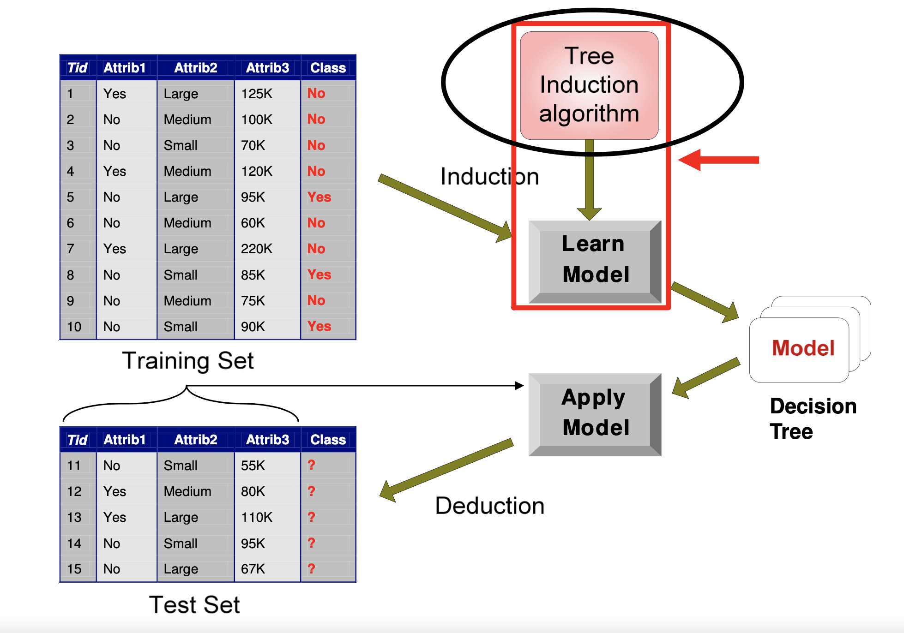

## Tree Induction algorithm

当我们要进行决策树构建的时候，就涉及到一个问题：怎么构建最优的树？选择什么变量来当作树的节点？如何选择？应该按照什么顺序选择？每个节点要选择几叉树？什么时候要进行剪枝？

常见的构建树的一些方法有：

- hunt's algorithm（也是最早的决策树构建算法）
- CART
- ID3, C4.5
- SLIQ, SPRINT

## Hunt's algorithm

这个算法是大部分决策树算法的基础。

### **Procedure:**

Dt 是决策树中到达node t的某数据集。

对于Dt有：

1. 如果当前节点只包含同一类，那么就划分为**叶子**结点。
2. 如果当前节点包含多类，那么继续细分。使用attribute test 来将数据划分成更小的数据集。递归的执行这个过程，知道划分成叶子结点。

> 1. 算法的第二步所创建的子女结点可能为空，即不存在与这些结点相关联的记录。如果没有一个训练记录包含与这样的结点相关联的属性值组合，这种情形就可能发生。这时，该结点成为叶结点，类标号为其父结点上训练记录中的多数类。
> 2. 在第二步，如果与 Dt 相关联的所有记录都具有相同的属性值（目标属性除外），则不可能进一步划分这些记录。在这种情况下，该结点为叶结点，其标号为与该结点相关联的训练记录中的多数类

## Futher issue **

**问题：**

以上，虽然hunt算法对数据进行了一个基础的划分，但是还存在问题：

- 我们应该如何划分数据集？
  - 测试条件的定义( 根据 attributes type来进行划分)
  - 评价测试条件的好坏
- 什么时候划分过程该结束了
  - 如果所有数据都在同一类/有identical attribute values
  - 提前结束

**解答**

一下针对以上的问题进行一些解答

1. 定义分类条件的方法
   1. 根据变量类型--- binary/nominal/ordinal/continuous
   2. 根据split的次数-binary/multi-ways

2. 评价测试条件的好坏
   1. Greedy approach -- purer class distribution is preferred  尽量分到只有一类的情况
   2. 需要评价当前节点的impurity的方法

### **how to split **

首先要知道我们要怎么定义测试条件，如何来进行划分

- nominal 变量
  - Multi-ways 
  - Binary-ways
- ordinal 变量(和nominal都相同，唯一不同的地方在于，对于binary比那两有)
  - **仍然要保留order的特性，不能随意划分**
- continuous变量（划分方式仍然相同，就是相对的需要对划分条件进行一些微处理）
  - **Discretization** - 离散地将数据划分成ordinal类型的分类。可以通过 **等距离划分/等频率划分/聚类**的方式来划分每个类的
    - static- 建树前就划分好
    - dynamic 每次划分到节点的时候划分下一个
  - **bianry**-(A < v) or (A ≥ v) : 要考虑到所有可能的splits，找到最合适的。

### **how is the split**

上面提到了我们该如何对数据进行划分，那么划分如何界定这个划分是好的呢，顺序应该如何呢？需要一个度量来评价划分的选择。

#### measurement

- Gini
- Entropy
- Misclassification Erro

#### General Procedure

- **Before** splitting: 计算impurity measure(**P**)

- **After** splitting: 计算impurity measure(**M**)

  - 计算每个字节点impurity， M是子节点的加权impurity

- 选择获得**highest gain**的划分条件
  $$
  Gain=P-M
  $$
  或者计算后**最低的impurity**

- 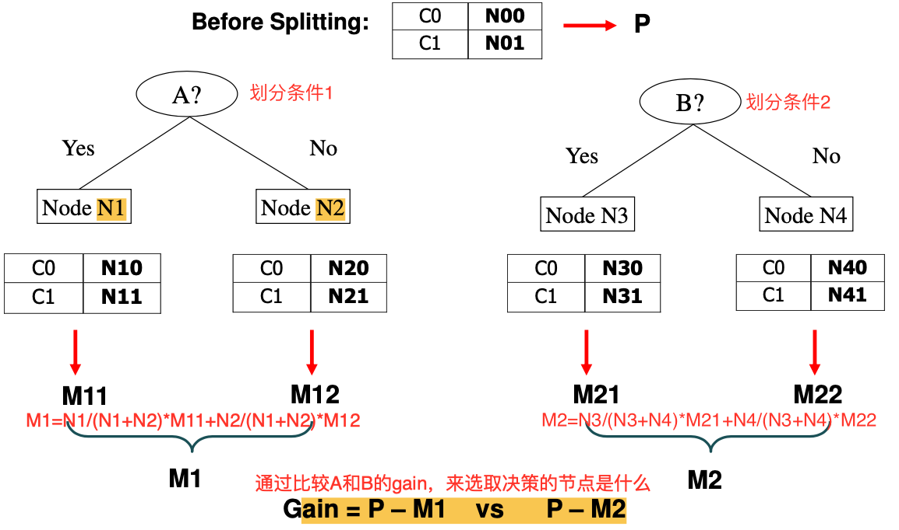

## GINI

- GINI系数，一种用来判断划分条件好坏的度量
- GINI index广泛用于**CART，SLIQ，SPRINT**等树的算法
- **Maximum**:**(1-1/nc)** 当数据平均分布在每一类的时候，说明这个分类条件**不好**，implying least interesting information
- **Minimum**: 0 当所有数据都分布在一个类的时候，说明是个**好的**分类条件，implying most interesting information
- 选择原则：选择能够**最大化Gain**的划分条件

$$
GINI(t)=1-\sum_{j} [p(j|t)]^2
$$

**解释：**

以上公式意义为：
$$
GINI=1-((n_{0t/n_t})^2+(n_{1t/n_t})^2)
$$

**例子**

以二元分类为例，可以看到，随着分类越来越平均，gini系数越来越高

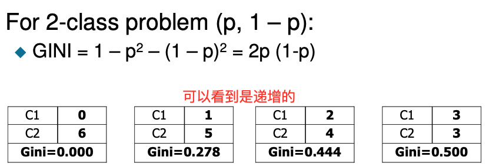

### GINI的计算

对于单节点的简单计算为，每个节点的GINI系数计算方式如下

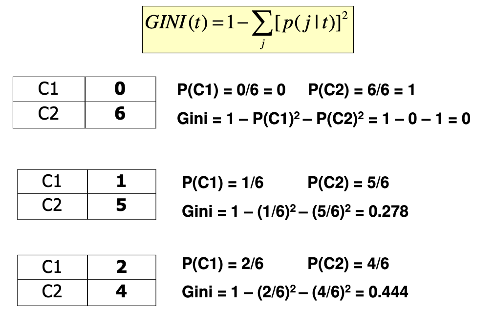

**考虑多分类的情况**

**选择能够最小化weighted average Gini index of the children**

​	对于以下公式有，**对原GINI index做了一个加权的处理。**注意下面的一些例子。除了计算原先基尼系数外，还需要进行一个加权赋值

- ni=在节点i的子节点数量
- n=在父节点p的数量

$$
GINI_{split}=\sum_{i=1}^k \frac{n_i}{n}GINI(i)\\
$$

#### Binary Attributes

- 分成两个partition
- 对原先的基尼系数进行**加权赋值**划分
  - 加权的优势：**larger and purer** partitions are sought for

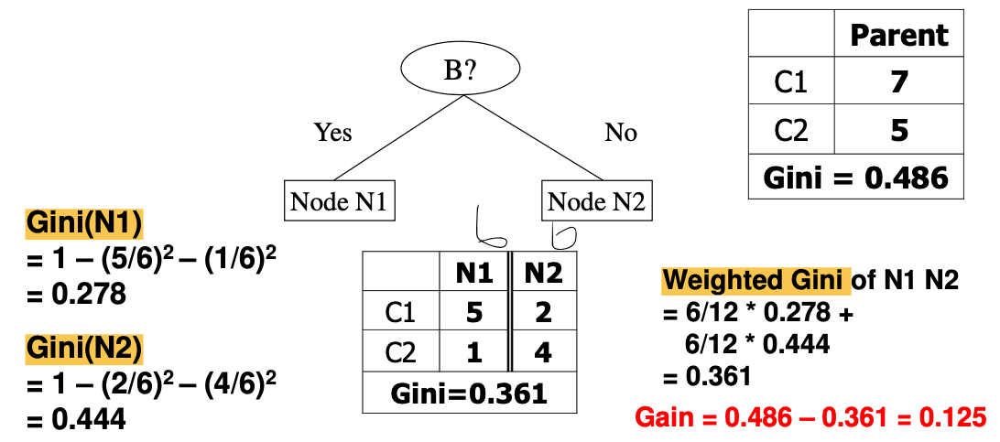

#### Categorical attributes

- 对每个值，都计算每个类别有多少

- 使用**count matrix** 来进行上述计算

- 以下划分可以看出，多路划分的GINI系数会比右边二元划分的两种方式**都要小**：因为二元划分实际上合并了多路的一些输出，自然会降低了子集的一定的纯度。

  

#### Continuous attributes

- 划分连续变量的方式很多，常见的方式如使用二元划分的方式，但是划分的界限在何处也是一个问题。

**问题：**

如何选择最好的**splitting value**？

最简单的方法：**对于每个出现的值v**，扫描database并gather count matrix，同时计算GINI系数。但是这种方式对于连续变量来说**非常低效**

(例如，工资<=800对于数据库，就需要遍历一遍整个表格，每个数据都要进行判断以及计算GINI系数，成本太高。对每个划分点都要O(n)次操作，由于有N个候选点，因此复杂度为O(n^2))

高效的方法：**对于每个出现的变量**，

- **Sort the attributes** on values
- **linearly scan** these values， 每个都**更新count matrix**，并且**计算GINI index**
  - 对于下面例子的划分，just pick a middle one,随意选取两个sorted value的**中间值**，然后来进行计算！
- **choose**拥有**最小GINI系数**的划分位置

(例如，首先排序操作需要的为O(nlogn), 和上面穷举的方法不同，不需要遍历所有数据，只需要选择中间值即可)

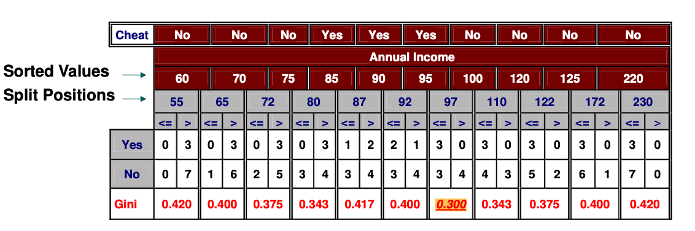

## Entropy

$$
Entropy(t)=-\sum_{j}p(j|t)log(p(j|t))
$$

- 也是一种判断划分好坏的度量
- 广泛用于**ID3（information gain）, C4.5**(gain ratio)算法中
- 选择原则：选择能够**最大化gain**的划分条件。使用的是**Gain Ratio**
- **Maximum**：(lognc) 当数据平均分布在类的时候，implying least information
- **Minimum**：0 只属于一类， implying most information
- 它的计算和GINI类似
- 物理学中，熵越高，意味着信息越乱。

### Entropy的计算

对于单个节点的熵的计算为

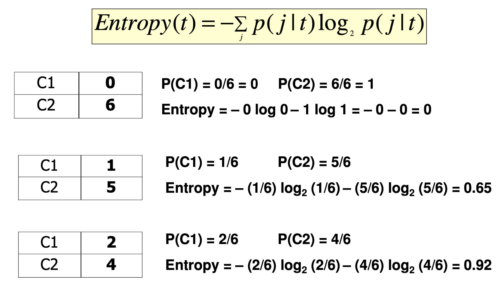

**对于多分类情况**

选择熵的减少量最大的，也就是information gain 最大的划分条件。

information gain:
$$
Gain_{split}=Entropy(p)-\sum_{i=1}^k \frac{n_i}{n}Entropy(i)
$$

#### information gain

**ID3 使用的是information gain**

**缺点与改进**

information gain使用的缺点在于，当分类非常多，并且每个分类的数量又非常小的时候，信息增益会过高。例如，对于ID，所有类都只有一个数据，并且信息增益极高，因为使用entropy算法，会导致所有的熵都是0.(这些问题在GINI index中不会存在，因为GINI index 是使用概率来计算的。)

改进：

使用**Gain Ratio**（信息增益率）而不是信息增益

#### Gain Ratio *

**C4.5使用的是gain ratio**
$$
GainRATIO_{split}=\frac{GAIN_{split}}{SplitINFO}\\
SplitINFO=-\sum_{i=1}^k \frac{n_i}{n}log\frac{n_i}{n}
$$

- 信息增益/splitINFO（Adjusts Information Gain by the entropy of the partitioning (SplitINFO).）
  - Higher entropy partitioning (large number of small partitions) is penalized!

## Classification Error

$$
Error(t)=1-maxP(i|t)
$$

- **Maximum**: (1-1/Nc) 当平均分布的时候，implying least interesting information
- **Minimum**: (0) 当只属于一类的时候

### Classification Error 的计算

对于节点的classification error的计算

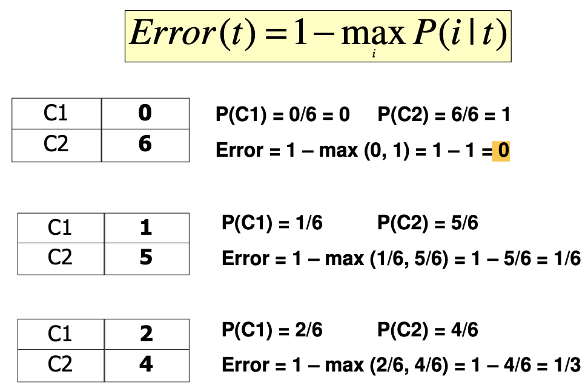

## GINI vs Entropy vs Classificaiton Error

对于二元分类问题有：

**GINI vs classification error**

可以看到如下，**GINI**系数会随着分类的不一样而**improves**，是会改变的，但是**error remains the same**.

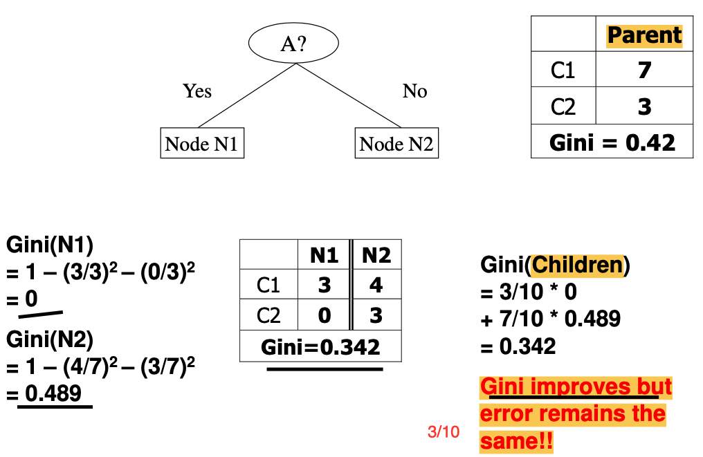

## Pros and cons

https://blog.csdn.net/keepreder/article/details/47168383

### Advantages

- 构建迅速，**成本低**（不需要对数据进行一些特殊的处理），分类快。Inexpensive to construct and extremely fast to classify
  - **无需特别处理缺失值**，不敏感。在训练和测试阶段可以直接进行处理。Can handle missing values(during training and testing)
  - 处理**无关变量和重复变量**非常容易。Can easily handle redundant or irrelevant attributes (unless the attributes are interacting)
  - 不需要处理数据型和常规型的数据。
  - 效率高，以此构建，反复使用。
- 小的decision tree 是human readable的，很容易理解。Easy to interpret for small-sized trees
- 当使用一些防止过耦合的方法时，不容易受噪音影响。**Robust** to **noise** (**especially** when methods to **avoid overfitting** are employed)
  - 当只有一种类型再停止的话，可能会导致过耦合（overfitting），因为节点太多饿了。解决方式可以是：记录一个阈值，当小于这个值就停止。

### Disadvantages

- 有些分类会造成决策树过大，因为分类过于详细！**Space** of possible decision trees is **exponentially large.** 
- **贪心**算法并**不会找到optimal**的决策树。Greedy approaches are often unable to find the best tree.
  - 因为贪心算法只考虑当前情况的最大纯度而找分割点，很有可能不是最好的树

- 不会考虑到一些变量之间的更改。Does not take into account interactions between attributes
  - 例如如果突然添加噪音，可能会把噪音变成划分标准，导致决策树无法代表真实数据，从而导致过拟合。
- 每个决策树的boundary都只有单个变量的输出。Each decision boundary involves only a single attribute 
  - 如果想要复数输出，还需要建立独立的决策树来处理不同的输出

#### Overfitting  reason

-  **噪音**数据：训练数据中存在噪音数据，决策树的**某些节点有噪音数据作为分割标准**，导致决策树无法代表真实数据。
- **缺少代表性数据**：训练数据没有包含所有具有代表性的数据，导致某一类数据无法很好的匹配，这一点**可以通过观察混淆矩阵（Confusion Matrix）分析得出。**
-  **多重比较**（Mulitple Comparition），这一情况和决策树选取分割点类似，需要在每个变量的每一个值中选取一个作为分割的代表，所以选出一个噪音分割标准的概率是很大的。

# Overfitting

首先，我们要知道过拟合产生的原因。

overfitting是我们训练模型的时候，一种常见的问题，一般指当前模型过于拟合某个数据集，泛化性极差，不适用其他数据。

### Classification Errors

在分类时，会产生多种error

- Training Errors
  - 模型在训练的时候产生的错误
- Test errors
  - 模型在测试的时候产生的错误
- **Generalization errors**
  - Expected error of a model over random selection of records from same distribution
  - 和系统误差有点类似。可以这么理解，训练出来的模型进行测试后，产生的误差叫做测试误差。但是我们真正想要的是模型上总体的误差，这就是泛化误差。因此，它可以说是一个预期的误差。

### Overfitting vs underfitting

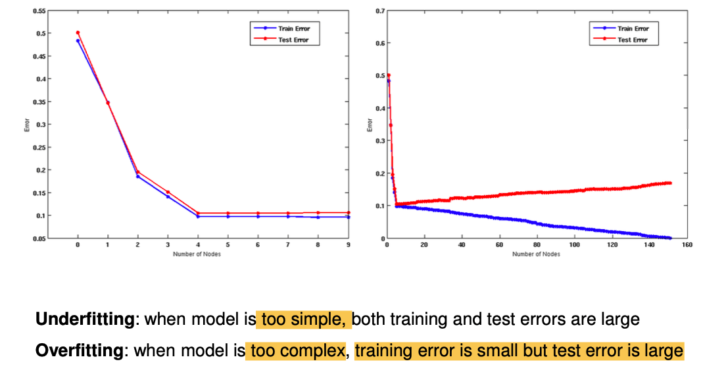

- **Underfitting**: 欠拟合，模型太简单了！很明显训练误差和测试误差都很大。

- **Overfitting**：过拟合，模型太复杂了！训练误差会很小，因为和数据很贴近，但是，测试误差会很大！，因为不适用。
  - 如果测试数据**under-representative**，随着node的数量变多，test error会递增，training error会递减
  - **提高训练数据的量**，能够有效减少两种误差之间的值

### Reasons

- **limited training size** 训练数据过小可能会导致过拟合。
  - 如果数据太少，可能会导致，数据并不具有代表性，没法代表所有数据的pattern，最后导致过拟合。
    - 因此，**如果数据集过大，可以一定程度上缓解过拟合。**
- **High model complexity**
  - 无用（free）变量太多，比较增多，导致模型过于复杂。

简而言之：当维度过高，而数据量又小的时候，算法会随机选择一个超高维变量足额好来保证训练的准确性，这就导致了过拟合。

**Overfitting results in models that are more complex than necessary**

从以上的例子可以看到，单单看test erro是没法准确预估整个数据集的，应该看泛化误差来进行判断。

这涉及到，我们应该如何**选择最好的tree**，于是我们有

### Model selection for best tree

我们在选择best tree的时候，需要考虑到下面三个方面

- performed **during** model building(在建立模型的过程中使用的)
- **Purpose** is to ensure that model is not overly complex(avoid overfitting)
- **need to estimate generalization error** 需要对泛化误差进行一个预估
  - using validation set 需要验证
  - incorporating model complexity 关注了模型的复杂性
  - estimating statistical bounds 对数据的边界会进行一个预估

#### Using validation set

**procedure**：

- 将**training data (D.train)** 分成两部分：
  - **training set**：D.tr 用来计算**训练误差**
  - **validation set**：D.val 用来**估算泛化误差**。（注意，validation set和test set不一样）

**Drawback：** **less data** available for training!

#### Incorporating Model Complexity

**Rationale: **Occam's Razor 

- Given two models of similar errors, one should prefer the simpler model over the more complex model误差相似的话，越简单的模型更讨喜
- A complex model has a greater chance of being fitted accidentally by errors in data 复杂的模型更容易产生错误
- Therefore, one should include model complexity when training a model 因此在训练模型的时候，需要考虑到模型的复杂度。

$$
Gen.Error(Model)=\\
Train.Error(Model,Train.Data)+\alpha*complexity(Model)
$$

#### Estimating complexity of Decision Trees

##### **pessimistic Error Estimate **

of decision tree T with k leaf nodes: **除了考虑training error，把可能生成的错误也考虑进去来作为预估的泛化误差。**
$$
err_{gen}(T)=err(T)+\Omega * \frac{k}{N_{train}}
$$

- err(T): 训练数据的**error rate**
- $\Omega$: trade-off hyper-parameter 超参数，和上面的$\alpha$类似
  - Cost of adding a leaf node relative to incurring error（可以理解为，每次添加叶子节点的时候，可能产生的错误的率）
- k: 叶子结点的个数
- N~train~:training records的个数
- 见下方的例子，$\Omega$起了很重要的作用，它会影响最后数值而影响选择。下面的例子，应该选择右子树。

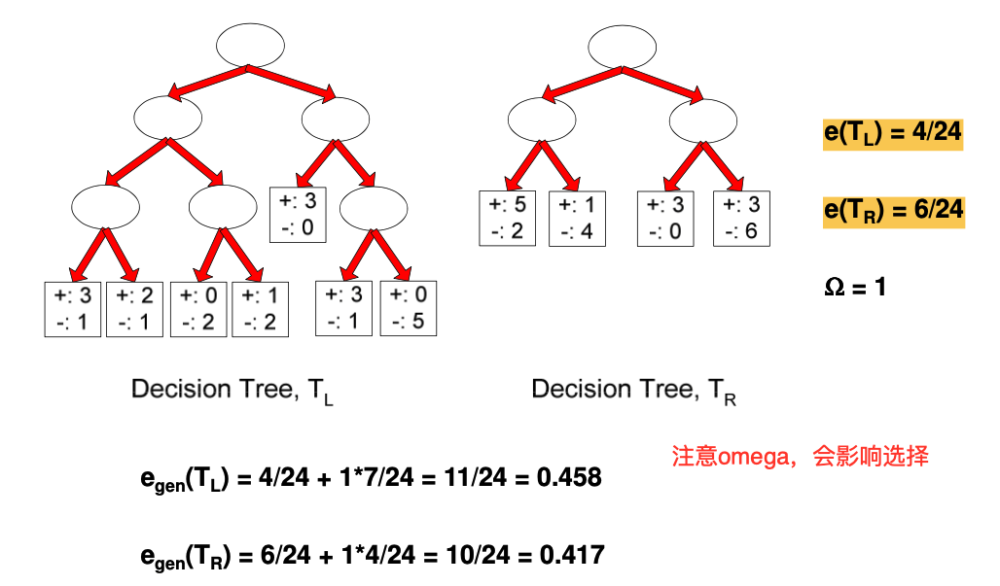

##### optimistic error estimate

- 把training error作为generalization error

下面的例子，如果使用这种方式，应该选择左子树。

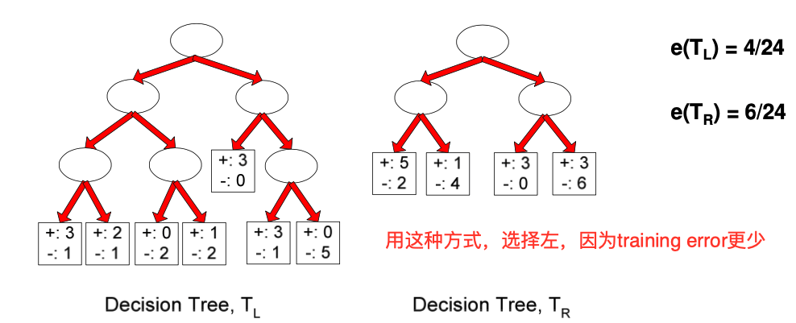

那么我们该如何处理过拟合的问题呢？

### Minimum Description Length(MDL)

这个准则可以用来处理数据过拟合的问题
$$
cost(Model,Data)=Cost(Data|Model)+\alpha * Cost(Model)
$$

- search for the **least costly model**
- Cost: **the number of bits （attributes） needed for encoding**
- Cost(Data|Model) : **encodes misclassification errors**
- Cost(Model) uses **node encoding(number of children) plus splitting condition encoding** 可以理解为，所有的node的数量

这个方法计算的是，用Data训练model，可能获得的encoding cost.

**$\alpha$ 会决定了这个值的的大小**。

例子：

16 attributes， 3 classes C~1~,C~2~,C~3~   $\alpha$=1
$$
m-nodes:log_2{m}\\
k-leaf:log_2{k}\\
n-instances:log_2{n}
$$
In this model, it should be: （因为是二叉树，因此计算时应该取log）

- 16 attributes: $log_2(16)=4$
- 3 classes：$log_2(3)=2$ 趋近2

$$
Cost(Tree,Data)=\\
Cost(Data|Model)+\alpha * Cost(Tree)=\\
$$

​	**case1**: 2 internal nodes, 3 leaf, 7 errors
$$
Cost(Tree,Data)=2*4+3*2+7*log_2n=14+7log_2n
$$
​	**case2**: 4 internal nodes, 5leaf, 4 errors
$$
Cost(tree,Data)=4*4+5*2+4*log_2n=26+4log_2n
$$

### Prevent Overfitting for decision tree

#### Pre-pruning

**early stopping rule**

- 在完全成长**前**停止算法

- 常见停止条件：

  - 所有都**实例同属一类**
  - 所有**变量值相同**

- **more restrictive conditions**

  - Stop if **estimated generalization error falls below a certain**

    **threshold**：为树设立一个error阈值。

- **Pros：**减少成长为整棵树的计算成本

- **cons**：可能会变成sub-optimal trees

#### Post-Pruning

- 完全成长后剪枝
- 一些方法
  - **自下而上**剪枝，如果generalization error有提升，就剪枝。
  - **subtree replacement**
    - 把其中的子树换成叶子节点
    - 叶子结点的类，是由这棵子树上，大部分的节点的类类进行决定的
  - **subree raising**
    - 把子树替换成最常用的枝

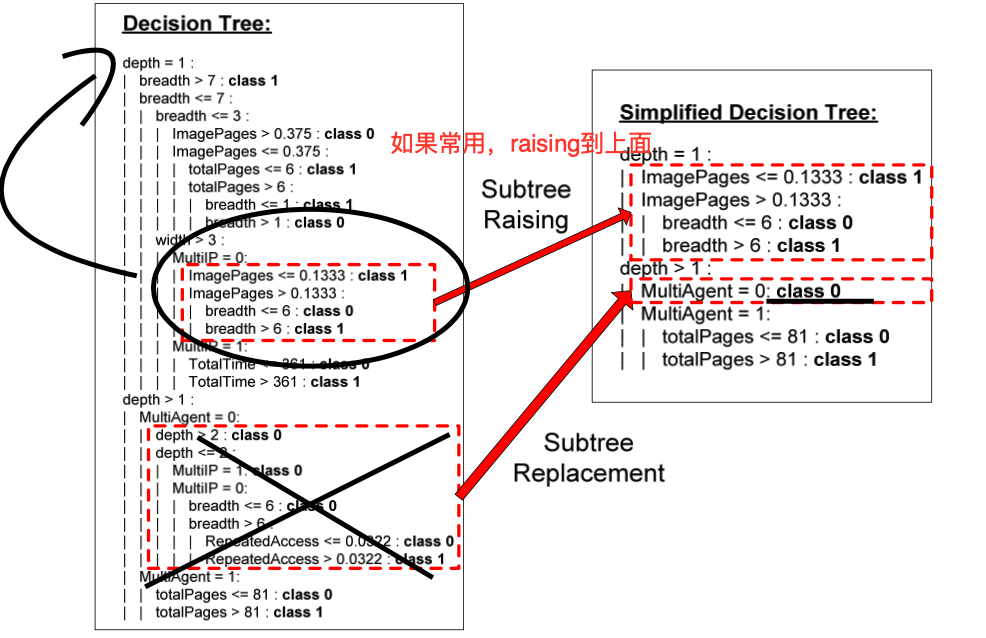

### Model Evaluation

**Purpose**

为了估算分类起在test set上的表现

**Holdout**

- k% 用来训练，100-k%用来测试
- 随机采样，然后重复做这件事
- 注意：**没有golden k**，很多时候要根据data set的大小来进行决定！

#### **Cross Validation**

- 把N大小的数据集分成k个互不相交的子集
- k-1的部分拿来训练，剩下的部分拿来测试
- 一般：跑多次，每次跑k-1个剩下的一个来进行测试，最后取平均

Example

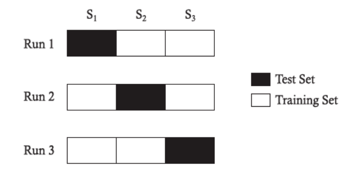
$$
err_{test}=\frac{\sum_{i=1}^k {err_{sum}(i)}}{N}
$$
以上，计算这个的时候，会统计每次的error，然后取平均。

- $err_{test}$：
  - 不是单个node的error，而是Expectederrorofamodeltrainedonadatasetofsamesize as the training folds: N(k-1)/k
  - 经常用来估算 模型的误差
- k
  - k一般为5/10
- randomized cross-validation
  - 重复随机分片成kfold，每次都计算mean和err~test~的差
  - Complete cross-validation: consider all partitionings

#### selecting hyperparameters

有些算法需要hyper-parameters，例如我们上面的一些例子提到的$\Omega$, 决策树叶子节点的数量等……

**选择parameter的方法**

- iterate through **a set of candidate** values p
- choose p that **minimizes validation error rate**, err~val~(p)
- err~val~(p) 也能通过cross-validation 的训练中计算出来。

### Avoiding common pitfalls

- 训练数据和测试数据不能有交集
  - 否则，测试数据就没法很好地体现泛化误差**will not be representative of generalization error**
  - 为了寻找是否有交集
    - 在训练集中训练一个random classifier
    - 如果trained classifier比random classifier表现更好，很有可能有交集。
- Validation error  不等于 generalization error
  - validation error: **used for model selection**, 比如当用来选择parameter的时候
  - 不能用来预估泛化的表现。