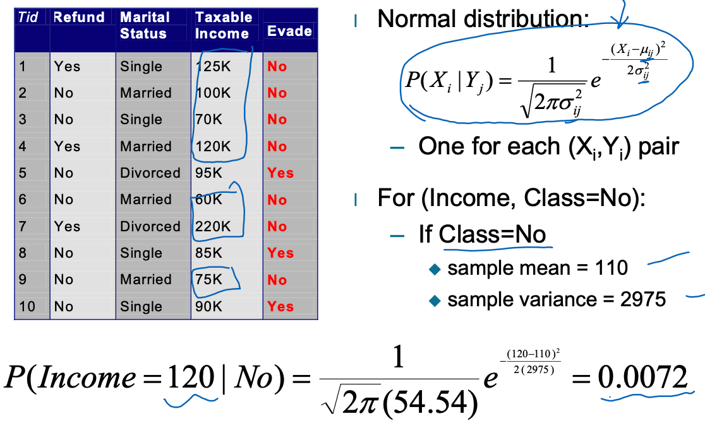
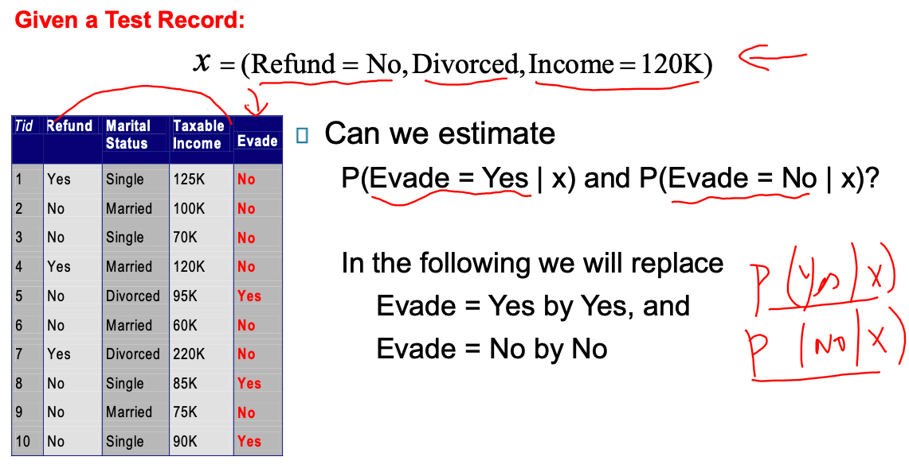
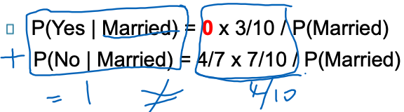
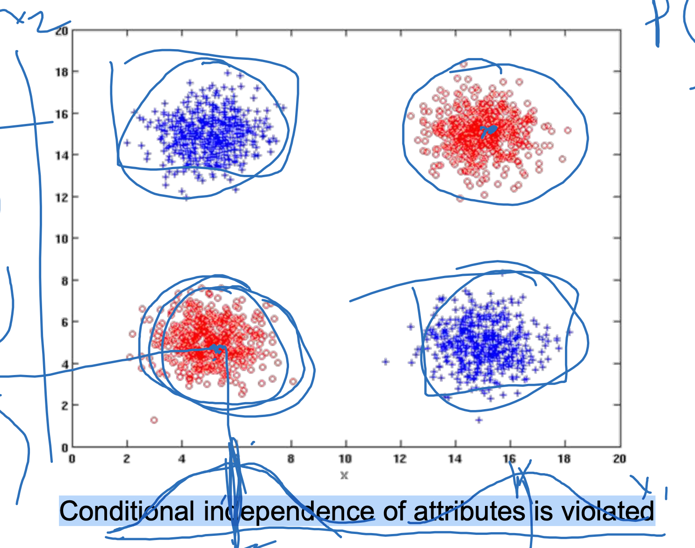
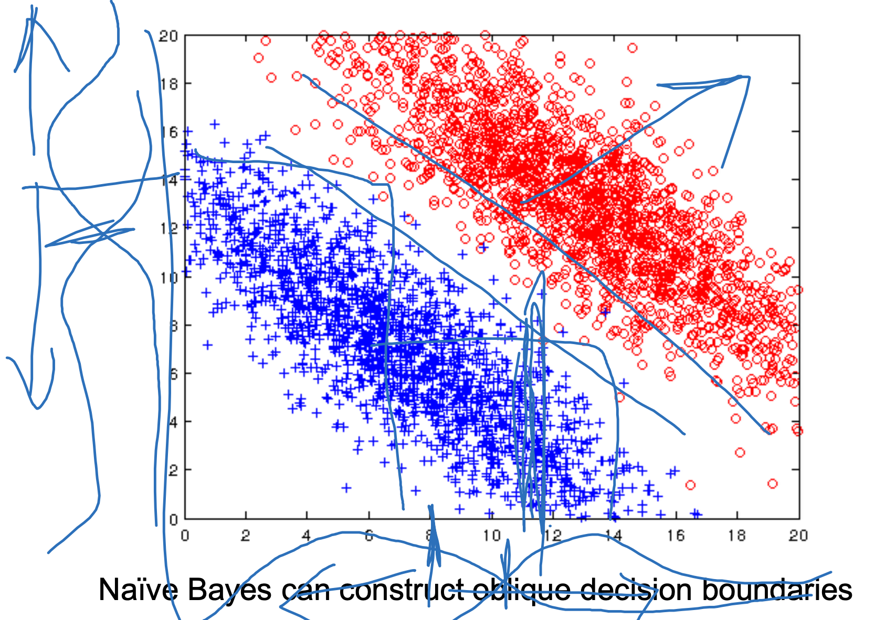
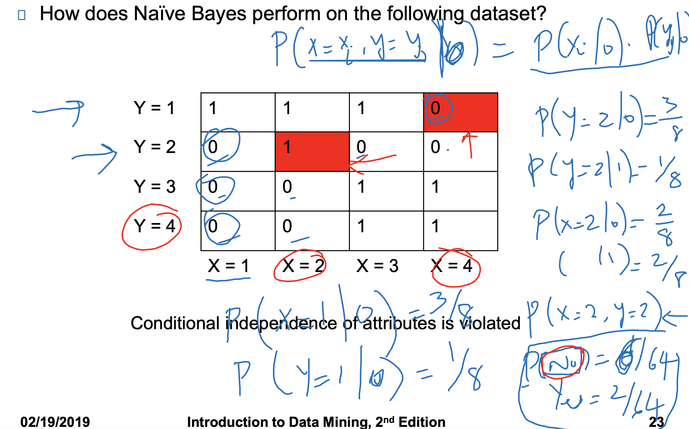
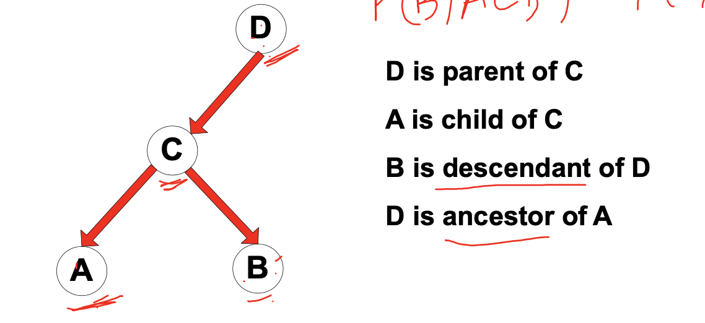
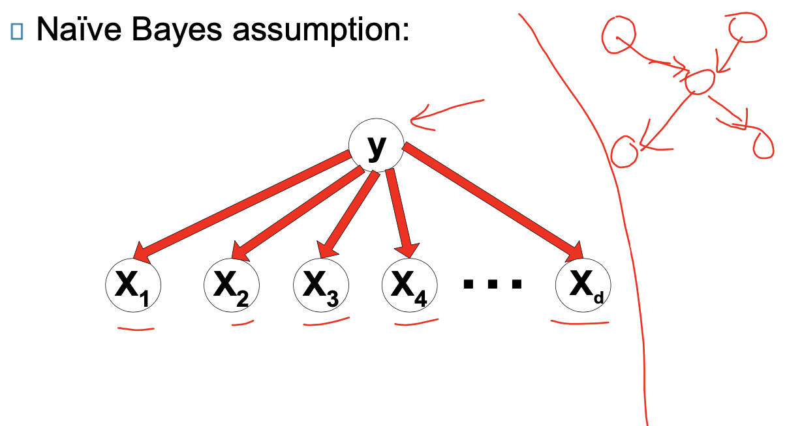
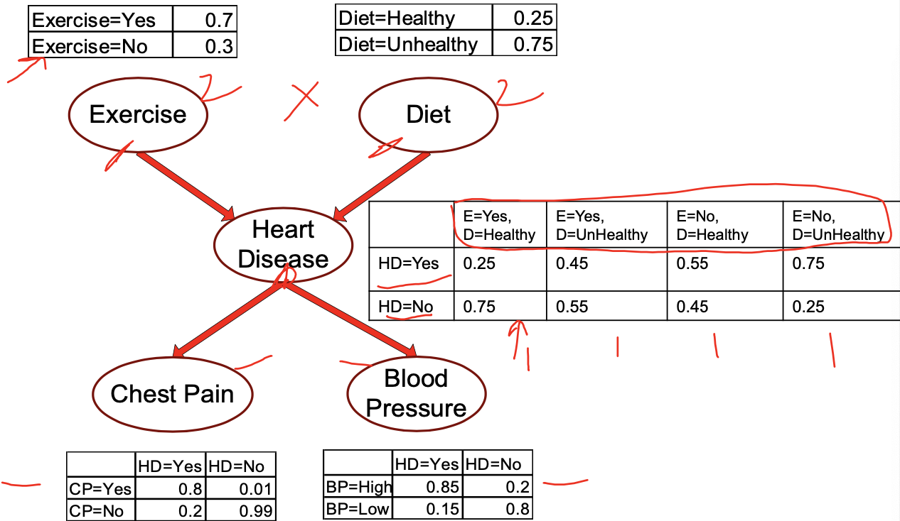
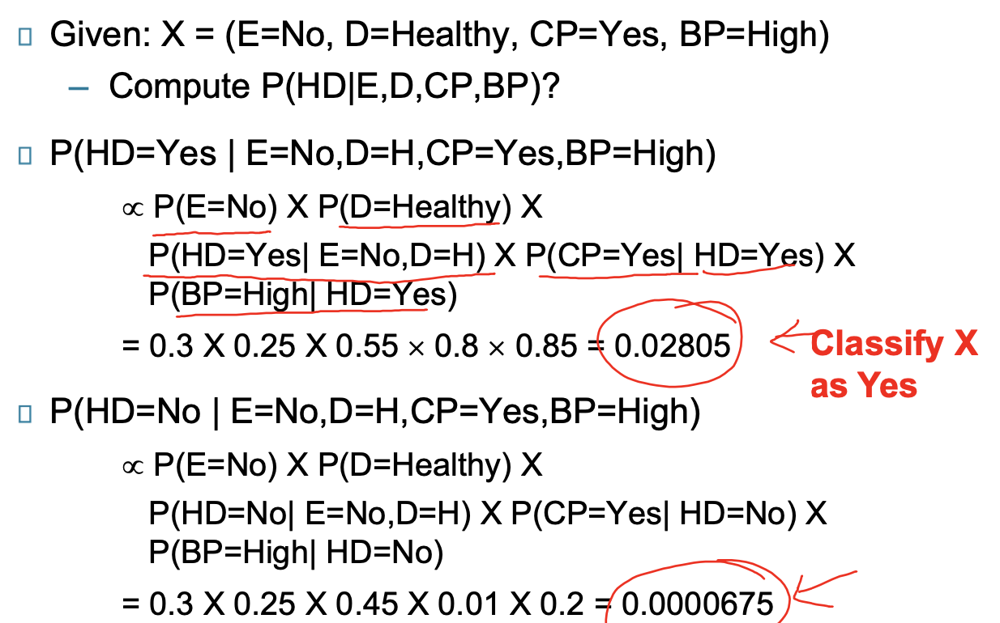

# Bayes Classifiers

使用概率论来解决分类的问题

## **conditional Probability**

同时发生X,Y的概率是=发生y概率的前提下发生X的概率 * 发生y的概率：$P(x,y)=P(x|y)*p(y)$

于是有：$P(x|y)=\frac{P(x,y)}{p(y)}$以及$P(y|x)=\frac{P(x,y)}{p(y)}$

从此可以推出

## Bayes Theorem

$P(Y|X)=\frac{P(X|Y)*P(Y)}{P(X)}$

- P(Y|X): Posteriror 
- P(X|Y): conditional 
- P(Y): Prior
- P(X): evidence

## Conditional Independence

如果几个事件相对独立，就有：

- 性质1

$P(X_1,X_2,...,X_d|Y_j)=p(X_1|Y_j)P(X_2|Y_j)...P(X_d|Y_j)\\=\prod p(X_i|Y_j)$

- 性质2：如果X，Y相对独立，对于给定Z就有 

  $P(X|YZ)=P(X|Z)\\P(X|YZ)=(P(YZ|X)*P(Z))/P(YZ)\\P(X|Z)=(P(Z|X)*P(X))/P(Z)$

### Continuous attributes

前面涉及到一个问题，我们该如何分析连续变量

- 方法1: 分箱。把值域分箱。（等频率，等距离），从连续变量变成ordinal变量
- 方法2: Probability density estimation:
  - 假设变量符合 Normal distribution
  - 使用数据来预估变量的分布（例如mean,方差）
  - 一旦概率分布能够大致预知，就可以使用它来估算**条件概率**。

因此对与下面例子的值，就可以如此估算。

## As classification

### Goal

class: Y

Attributes: X~1~, X~2~, X~3~ …… X~d~

简单来说，就是要预估，在x这些值的发生情况下，y可能是什么类别

- **Goal**: to predict the value of class Y
- **Specifically $P(Y=y|x_1,x_2,...X_d)$**
- 获取不确定的预估 

### Approach

$P(Y|X_1,X_2,...,X_d)=\frac{P(X_1,X_2,...X_d|Y)P(Y)}{P(X_1,X_2,...,X_d)}$

- 通过Bayes Theorem来计算上式
- $P(X_1,X_2,...X_d|Y)$ 提供了有关generative process of a class label的信息
- 为了求$P(Y|X_1,X_2,...,X_d)$的最大，其实就是求
  - 因为$P(X_1,X_2,...,X_3)$是确定的，因此就是求
  - $P(X_1,X_2,...X_d|Y)P(Y)$的最大值。
- 因为可以进行如下分解$P(X_1,X_2,...,X_d|Y_j)=p(X_1|Y_j)P(X_2|Y_j)...P(X_d|Y_j)$，所以有
  - 要求 $P(X_1,X_2,...X_d|Y)P(Y)$的最大值，就是求 $P(Y_j)\prod P(X_i|Y_j)$的最大。

### Example

- 如上，要求P(Yes|x), P(No|x) 带入公式，有：
  - $P(Yes|x)=\frac{P(x|Yes)P(Yes)}{P(x)}$
  - $P(No|x)=\frac{P(x|No)P(No)}{P(x)}$
  - 因为有 $P(Yes|x)+P(No|x)=1$，所以有：
  - $P(x)=P(x|Yes)P(Yes)+P(x|No)P(No)$
  - 根据图表有 $P(Yes)=\frac{3}{10},P(No)=\frac{7}{10}$
  - 因此，难点就转移到了，如何计算P(x|Yes)和P(x|No)
- 计算p(x|Yes) 和 p(x|No)
  - 因为有：x=(Refund=No,Dicvorced, Income=120K), 所以对此可以应用条件概率1有
  - P(x|Yes)=P(Refund=No|Yes) * p(Divorced) * p(Income=120K)=1 * 1/3 *p(Income=120K)
  - P(x|No)=P(Refund=No|No)*P(Divorced) * P(income=120k|No)= 4/7 * 1/7 p(income=120k|No)
- 所以有：p(X)=p(X|Yes)P(Yes)+p(X|No)P(No)=1/3 * p(Income=120K)+(4/7^2)* p(Income=120K) *(7/10)
- 比较后可得，No的几率更大。

### issues

使用贝叶斯分类器有个问题，就是当任意有一个概率为0，公式就不成立

例如

对以上问题，这个公式就有问题！无法正确的进行分类

#### 解决方案

不能简单使用比率来估算概率，需要进行转换
$$
Original: P(A_i|C)=\frac{N_{ic}}{N_c}\\
Laplace: P(A_i|C)=\frac{N_{ic}+1}{N_C+v}\\
m-estimate: P(A_i|C)=\frac{N_{ic}+mp_i}{N_c+m}
$$

- N~ic~: 在C类中，拥有value A~i~ 的实例的数量
- N~c~: 在C类中，总数
- v: A的值域，A一共有几种值
- p~i~:prior probability of A~i~
- m: parameter

这里，注意Laplace的转换，常用。

## Summary

- Robust to **isolated noise points** 噪音不敏感 比例非常之小
- Can handle missing values both during training and testing 能够处理缺失值
- Robust to irrelevant attributes 无关变量不敏感
- Conditional independence assumption may not hold for **correlated or redundant attributes**如果有相关属性或者冗余的属性的时候，朴素贝叶斯可能不适用，这时候需要使用其他技术，例如下面要提到的Bayesian Networks.
  - Use other techniques such as Bayesian Networks

**几个例子**

例子1: 这个例子中，naive bayes效果并不好，因为这个情况下，x和y并不是独立同分布的

P(X1,X2|Y)=P(X1|Y)P(X2|Y)很明显，当y相同的时候，他们明显是不是独立的

例子2:这个例子，贝叶斯分类效果不错，会产生明显的界限

例子3: 这个例子，效果也不好，独立同分布不符合

# Naive Bayes networks

**Definition：**

提供了不同变量之间概率关系的graphical representation

**Consists of:**

- 没有循环的无向图
  - 一个节点代表一个变量
  - 边代表的是相互的关系
- A **probability table** associating each node to its immediate parent(s) 每个节点和parent链接的概率表（条件概率表）

### Conditional Independence

对于如上：

- 已知节点的父节点，贝叶斯网络中的一个节点对所有非后代的节点都是条件性独立的。P(B|ACD)=P(B|C)
  - 也就是说，对于已知的节点B，在已知其父节点C的情况下， 和图中其他节点都是条件独立的，即AD

那么就有：

如图，对于上图，X1，X2，X3都是相互独立的。

### Probability Tables

- 如果节点X没有parent，table包含前置概率P(X)
- 如果节点X只有一个parent Y，table包含条件概率 P(X|Y)
- 如果节点包含多个parent Y1，Y2，Y3等，table包含条件概率P(X|Y1, Y2, Y3 ..., Yk)

### Inference

输入：X1, X2, ... Xd

**公式：** **joint probability** $P(X_1,X_2,X_3,...,X_d)=\prod_i P(X_i|Parents(X_i))$

输出： $P(Y|X_1,X_2,X_3...X_{d-1})=\frac{P(Y,X_1,X_2,...X_{d-1})}{P(X_1,X_2,...,X_{d-1})}$

Example:

