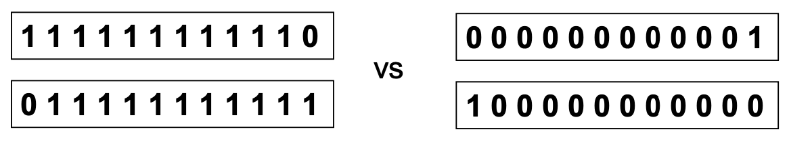

# KNN Classification

- 三个要素
  - labeled records
  - 距离函数：用来计算数据之间的距离
  - value k: 邻居的数量
- Process
  - 计算和其他数据的距离
  - 定义K
  - 模型训练后，使用投票的方式来预测其他unknown record

## Definition

K-nearest neighbors of a record x are data points that **have the k smallest distances to x**

## Process

1. **Compute distance**（similarity measure）

首先计算和点和点之间的距离。

距离函数可以使用欧几里得距离

2. **Choose K value**

决定要选择多少个邻居

3. **Determine class**

通过knn labels list来决定类型

- Take the **majority vote** of class labels among the k-nearest neighbors

- Weigh the vote according to distance 
  - **weight factor, w = 1/$d^2$**

## Key

1. k 的选择变得很重要, 影响到准确率

- too **small**: sensitive to noise points
- too **large**: neighborhood may include points from other classes

2. Scaling issues

变量需要可以重新scale，以防离群值的影响。

离群值可能会导致knn的中心移动过多而导致准确率下降。

3. 选择正确的similarity measure也很重要

例子：

如上，这两个数据的欧几里德距离是相同的。

如果是symmetric数据，则没有差别。

如果是asymmetic数据，很明显左边的更加重要，这个时候，欧几里得距离来计算相似性就不合适。

## Summary

- Lazy learners: do not build models explicitly
- 预测unknown的数据成本太高了。(因为需要所有节点都参与。)
- **Easy** to handle variable interactions. 如果有新的变量加入，处理也很容易，因为所有信息都基于本地信息来获取的。
- 选择正确的计算距离的方式很重要
- Superfluous/redundant attributes 会产生问题
- **Missing attributes are hard to handle**

KNN不会产生像决策树那样的清晰的模型，它根据当前的数据对所有数据进行一次分类，因此预测unknown节点的成本很高。