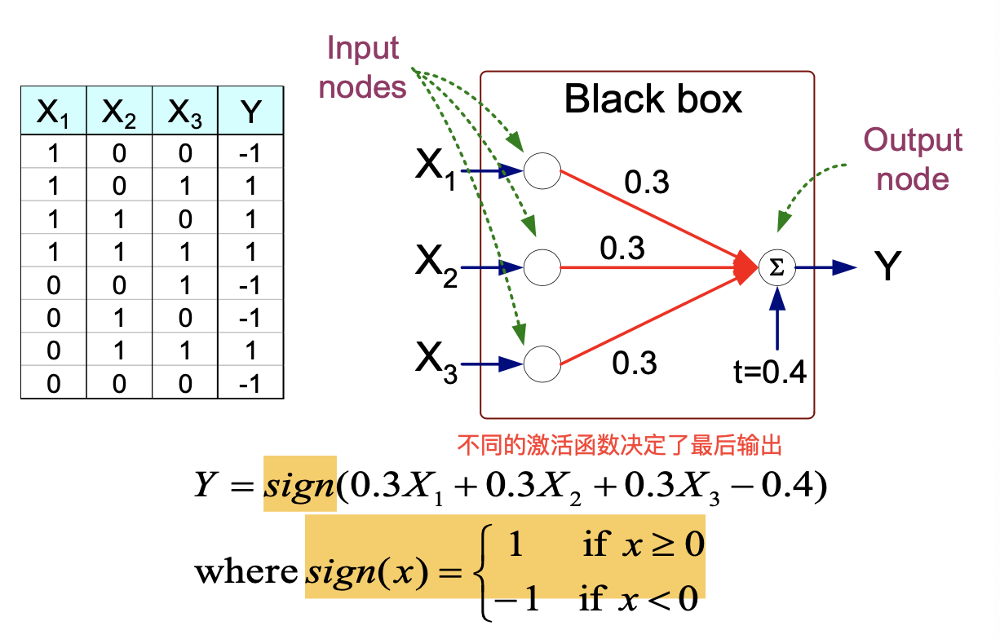
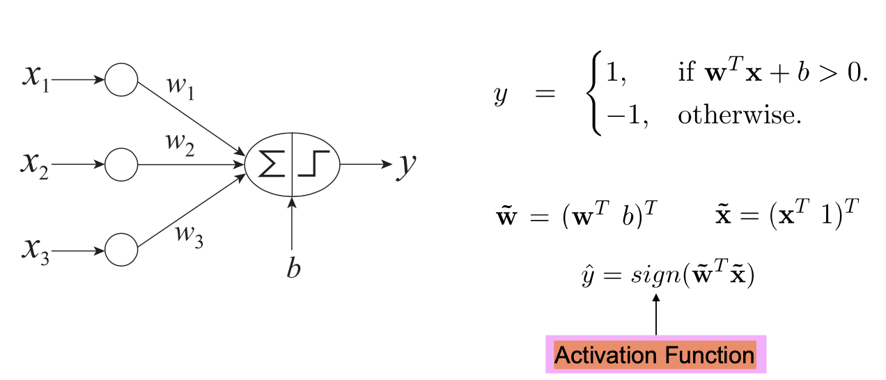
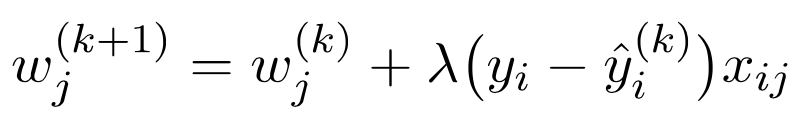
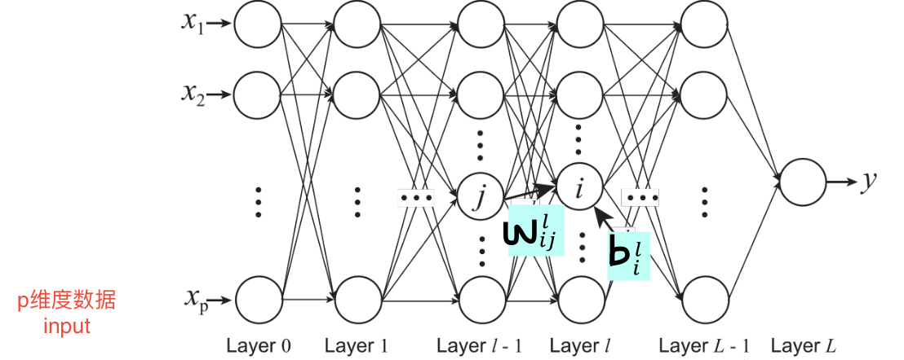
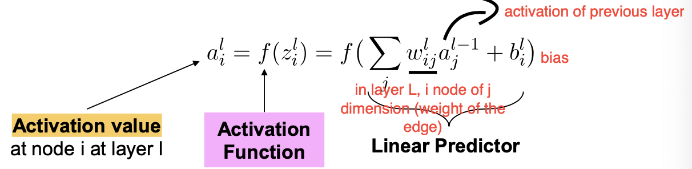
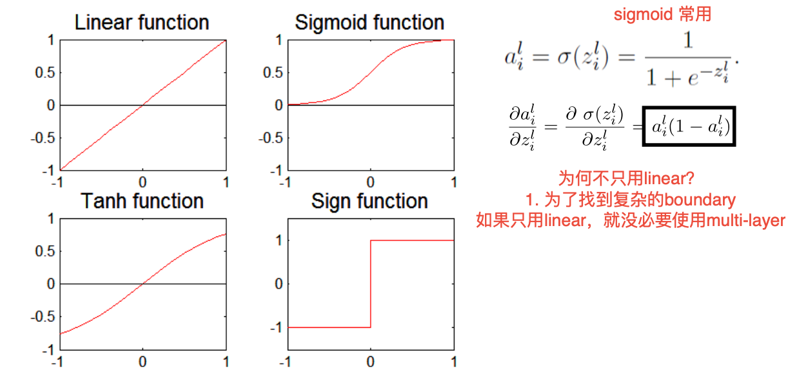
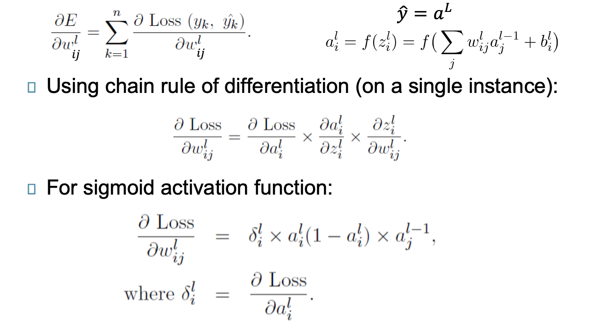
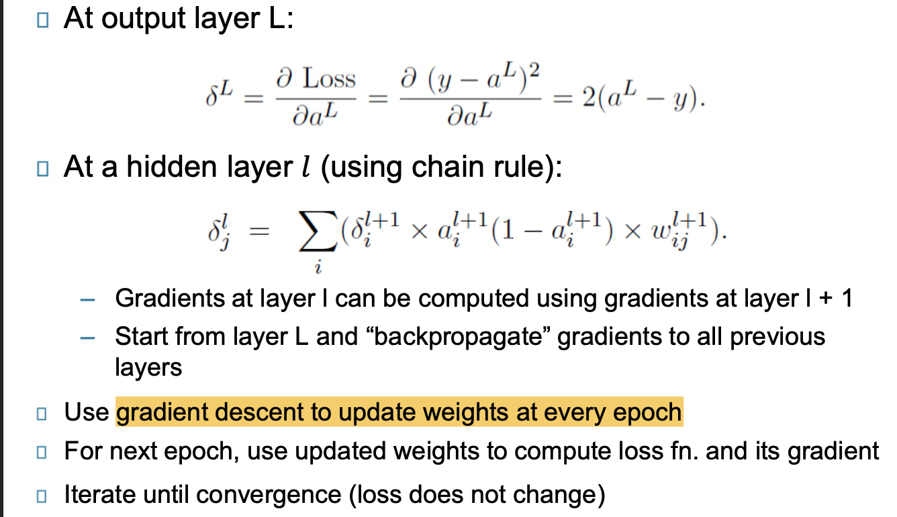

# Artificial Neural networks

**Basic idea:**

一个复杂的非线形模型可以看为多个简单的单元的集合。

ANN是nodes(simple processing units)的集合, 由directed links连接。

- 每个节点从incoming edges接受信号，计算，传输信号到outgoing edges
- 类似神经元
- **边的weight决定了connection的强度。**
- Simplest ANN：**Perceptron(single neuron)**

## Perceptron

**Example**

### Architecture

注意，输出需要activation function来进行激活

### **Process**

- - 求和：对所有加权输入进行求和
  - 输出：激活函数计算并输出。
- 

### **Learning rules**

- Initialize weights(初始化权重)
- Repeat，知道达到特定条件
  - 计算y的实际值$y$
  - **更新权重**
  - 
  - 其中，k是iteration的次数，$\lambda$是学习绿
  - **重点在于lambda的控制！**
    - 如果太大，难以收敛，收敛速度过慢。
    - 如果太小，则很久
    - stopping point：当yi=yi^(k)想等了，可以停止。

### **Learning Process**

- 一下的值都根据上面的例子计算Y=sign(0.3X1+0.3X2+0.3X3-0.4)
- Update weight based on **error** e=(yi-yi^)
- 如果y=y^, e=0, 停止更新
- y>y^, e=2，预测值比实际值少了2，weight要increase
- y<y^,e =-2， 预测值比实际值多了2，weight要decrease

### Problem

以上，因为y是线性的，因此boudary也是线性的。

对于非线形的问题，perceptron就会失败

## Multi-layer Neural Network

用来解决非线性决策的分类问题

多层的computing nodes

### Why

为何使用多层的hidden layers呢？

hidden layers的activations可以看成是featrues 提取器，每一层都会相应地提取features，每一层都是上一层的抽象。

ANN的深度指的是层数。

### Architecture

input layer + 多层hidden layer + output layer Y

### Activation Function

激活函数决定了最后的值，会影响到最后的预测结果

### Learning rules

对于多层感知机，需要使用Gradient Descent来进行weights的学习：

- Loss Function：计算每层各个点的误差
- Gradient descent： Update parameters in the direction of “**maximum descent**” in the loss function across all points 找梯度最大。速度可能会很慢，因为计算实在太大了。
- Stochastic gradient descent： update the weight for every instance (minibatch SGD: update over mini-batches of instances)

**Process**

1. compute gradient

问题：

2. Backpropagation Algorithm：反向传播

不断重复1，2步骤直到收敛

### Design

- Input Layer 的节点数量
  - One input node **per binary/continuous attribute**: 一个变量对应一个输入
  - k or log2 k nodes for each categorical attribute with k values
- output layer 的节点数量
  - 1 output for binary class problem
  - k or log2k nodes for k-class problem
- hidden layers的数量，以及每层的节点数
- **Initial weights and biases**

### Characteristics

- Multilayer ANN are **universal approximator**s but could suffer from overfitting if the network is **too large**
- Gradient descent **may converge to local minimum**
- Model building can be **very time consuming**, but testing can be very fast
- Can handle **redundant and irrelevant** attributes (in small numbers) because weights are automatically learnt for all attributes
- **Sensitive** to noise in training data 
- Difficult to handle **missing attributes**

## New Trend

现在的神经网络更倾向于deep networks（>5-10）但是也依赖于计算机计算能力，

新的改变多在算法设计上

image：CNN（convolutional）

sequence： RNN(Recurrent)

Residual Networks(With skip connections)

Unsupervised Models: Autoencoders

Generative Models: Generative Adversarial Networks

