# SVM

目标：找到能够区分data的平面

问题：当有多个平面的时候，如何区分更好的svm模型？

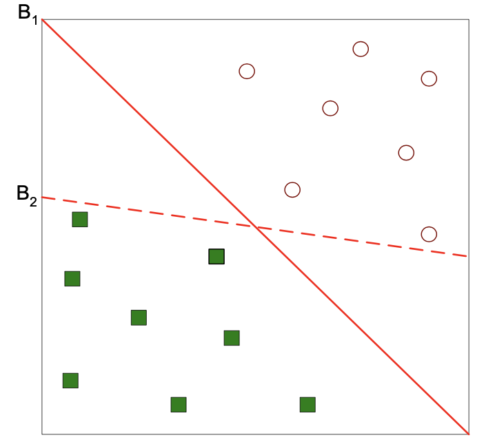

解决方案：找到能够最大化边界的模型。下面的模型，B1比B2好

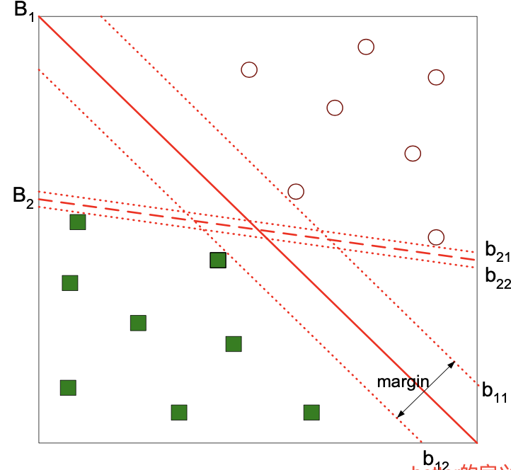

所以，对当前模型有：

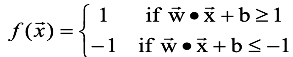

所以**边界的距离**为：$Margin = \frac{2}{||\vec w||}$

## Linear SVM

其实也就是寻找符合条件的w和b

那么问题来了：如何寻找w,b？

我们的目的在于最大化边界Margin， 

相等的，就是要最小化$L(\vec w)=\frac{||\vec w||^2}{2}$, 也就是要找最小的w向量组

### Process

**Example**

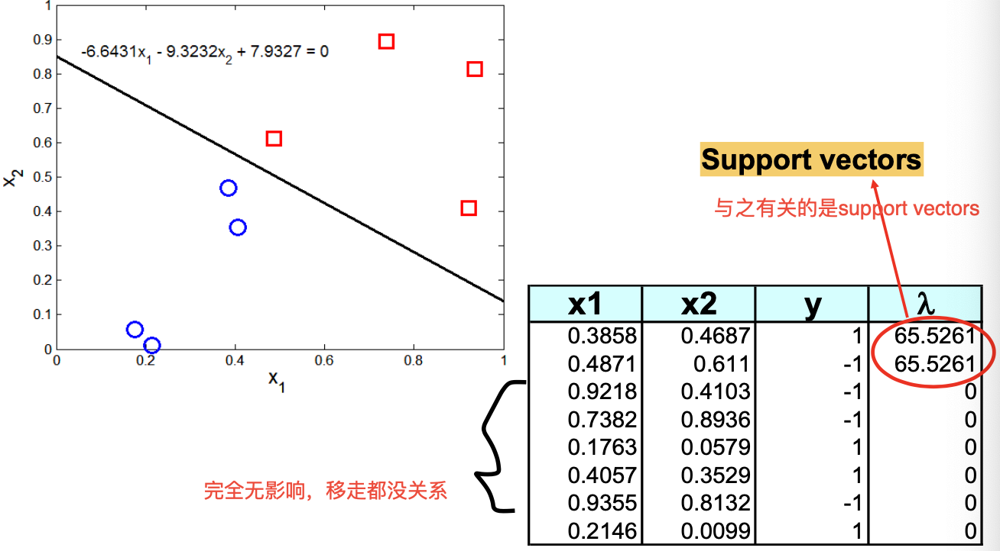

最后的边界只和support vectors 有关系。

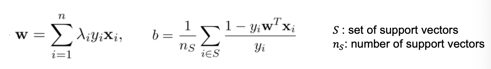

如果support vector相同，decision boudnary不变。

1. 代入计算，求解support vector
2. classify using SVM(代入求解)

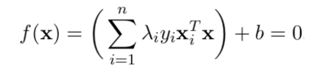

## Soft-margin SVM

问题：有时候，没法正好平分，边界不会是线性的，此时就需要使用soft-margin的方式。

**Basic Idea：**给SVM设置一个slack variable，也就是一个偏置值。在这个区间范围内的ok

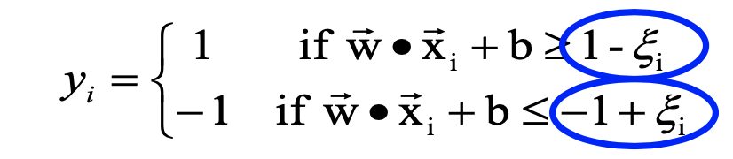

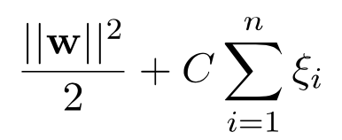

右边的这个值，分别代表了：model complexity*training error

- **Goal：minimize**！为了最小化上面的式子,也就是error

因为目的在于增大范围，所以前面的式子更加重要。

对于这个式子，当C增高，epsilon变小；反之。重点是前面的式子。

于是，为了找到更好的模型，选择的点就变成了：既要增大范围，又要减少C*epsilon

### As a regularizer of hinge loss

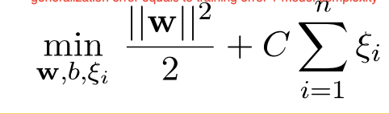

- 使用L2 normalization 保证了margin的最大化

  - 一般来说，Lp norm 代币哦啊了model的复杂度

  - 减少L1叫做Lasso

- 这个过程也就是minimizing slack的过程也就是minimizing Hinge Loss的过程

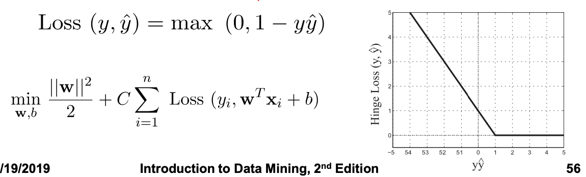

## Non linear SVM

有时候可能是曲线的边界。但是问题在于：对于我们要如何去寻找这样一个边界。

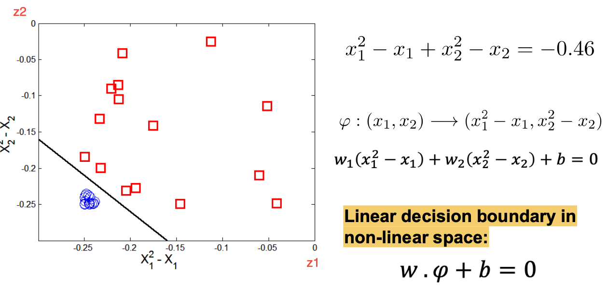

问题

mapping function 难以确定

当维度太高的时候，可能会有 **curse of dimensionality **问题。

计算复杂度很高。

最重要的Trick

### kernel Trick

很多时候会涉及到两数相乘。

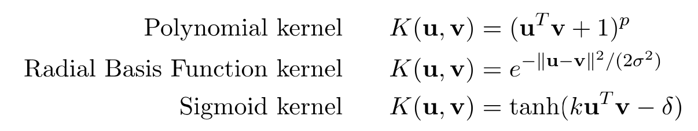

于是我们可以使用kernel function来代替这个乘积

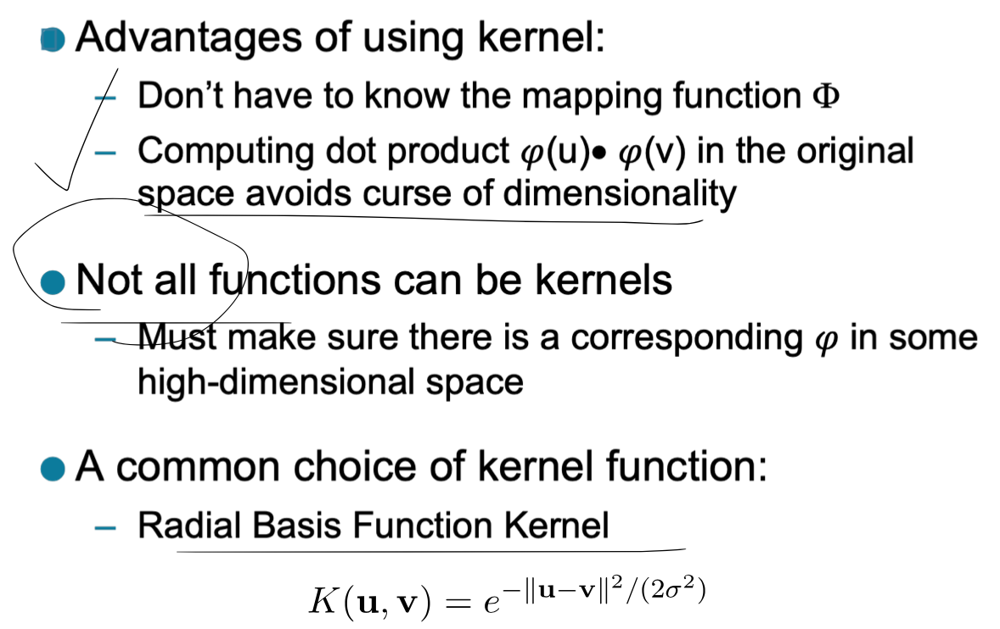

## Characteristic

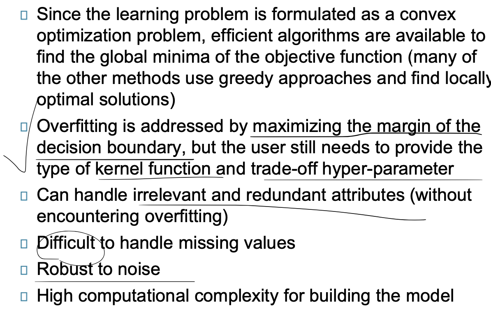
