# Esemble imbalance

可以通过将各种basic classifier组合起来，通过各个classifier的结果来做决定。

## Condition

如果具有一下条件，则ensemble method效果会更好：

- 所有base classifier 相互独立
- 所有base classifier 相比于随机猜测，表现更好(对于binary, error rate < 0.5)

## Rationale

Esemble method works best with unstable base classifiers

这些unstable base classifier具有一些以下特征：

- 因为high complexity，导致模型对minor perturbations敏感。
- 例子：ANN，unpruned decision trees
- **Low bias** in finding optimal decision boundary 能够很好地找到边界条件
- **High variance** for minor changes in training set/model selection：对于轻微的改变都会对最后的结果产生很大的影响。

**Example 1** 

假设有25 个base classifiers 每个classifier的error rate = 0.35

- 如果所有classifier都是相同的，则error rate = 0.35
- 如果相互独立，则error rate = probability of having more than half of base classifiers being wrong.

通过上面的例子，我们可以看出，**通过esemble method的结合，能够降低bias**

**Example 2**

### Bias-variance Decomposition

对于单个classifier有：

Generalization 可以定义为：

**gen.error(m)=c1×noise+bias(m)+c2×variance(m)**

c1,c2是定值，根据traing/test set的特性而定义的。

于是generalizaiton error的大小就取决于bias 和 variance。

**C1 * noise 无法避免，于是我们可以通过降低bias 和 variance来提高模型表现。如果二者都低，则效果好。**

但是有些模型会导致下面的结果：

如果有些模型 high colexity, training size 过小，会导致overfitting如下

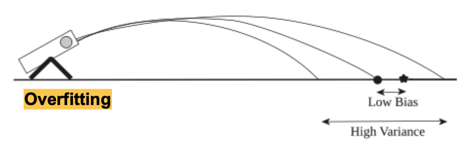

如果有些模型too simple, 会导致underfitting

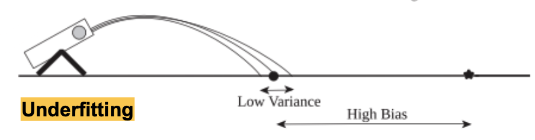

简而言之，有的模型虽然能够做到low bias但是不可避免high variance，有些模型虽然能够做到low vairance，但是bias很高，因此他们之间的trade off makes the esemble method important

**combining the reponses of multiple base classifiers can help to reduce the overall variance**!

### Summary

判断模型的表现可以通过泛化error 来体现：

**gen.error(m)=c1×noise+bias(m)+c2×variance(m)**

有时候 bias 和variance无法避免，之间的trade - off可以通过ensemble method来平衡，从而达到更好的表现。

**Example** 1:  esemble method can help reduce the bias

**Example** 2:  esemble method can lower the variance in prediction by combining the the predictions

## General approach

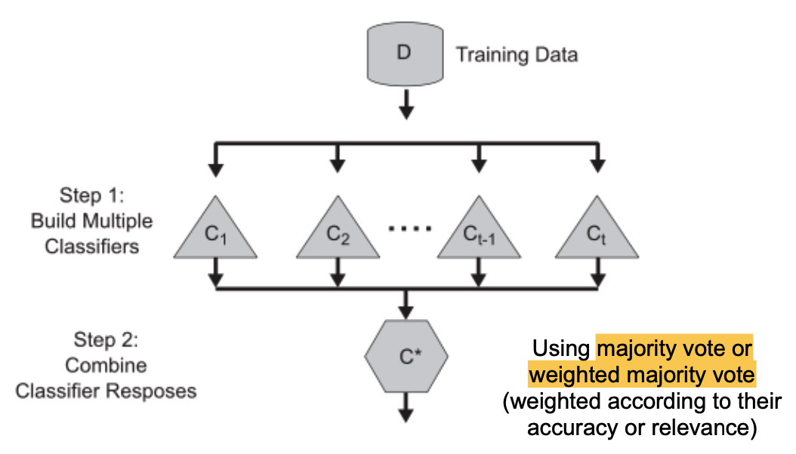

## Constructing Ensemble Classifiers

- Manipulating **training set**
  - bagging, boosting
- Manipulating **input features**
  - random forests
- Manipulating **class labels**
  - Eorror-correcting output coding
- Manipulating **learning algorithm**
  - injecting randomness in ANN or decision tree

# Bagging

also known as bootstrap

Bootstrap sampling: **sampling with replacement**

### **Approach**: 

- k = 采样次数
- 使用bootstrap sampling的方式进行采样
- 针对每次采样都build classifier
- 循环k次
- 取投票胜利的

每个数据被采样的概率为：**1-(1-1/n)^n^** 当n趋近于无穷，约为0.632

### **Algorithm**

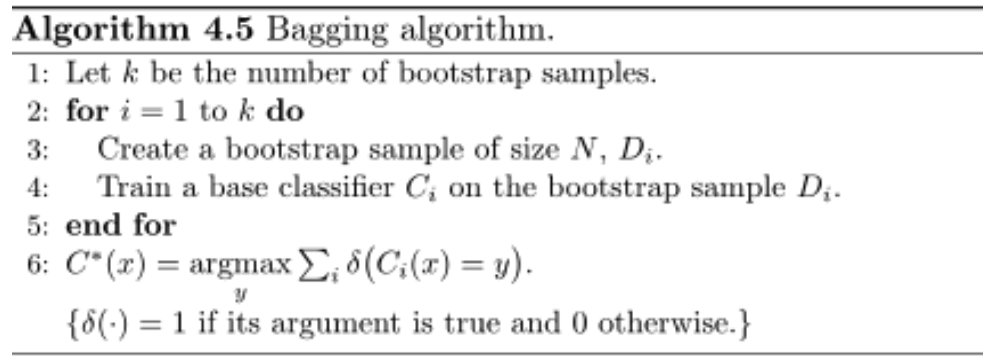

### **Example**

使用决策树训练tree stump。决策的每一侧，都是用vote来决定分类。

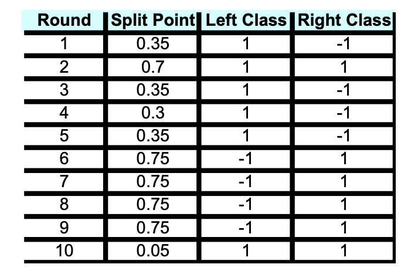

最后是用投票的方式来决定最终的分类：

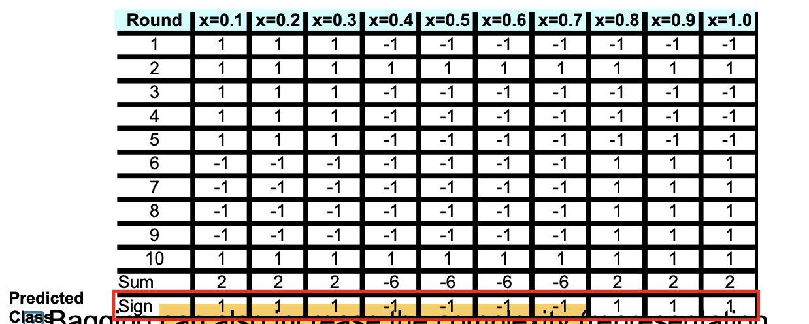

根据之前训练的10个classifier来进行投票。根据最终投票结果来选择

### Summary

bagging 通过 bootstrap的方式来进行抽样，每个样本被抽中的概率是相同的

- 优点：improves generalization error by reducing the variance of the base classifiers. 

- 我们也可以由此得出：bagging的performance是由classifier的稳定性决定的。
  - 如果base classifier unstable：bagging帮助减少训练中的随机性
  - 如果base classifier stabel： error主要是由bias引起的，这种情况下，bagging效果不一定好，甚至会degrade，因为会increase complexity

# Boosting

另一种采样方式。和bagging的区别是：boosting focus more on misclassified records. 如果分类正确，会尽量少取样； 分类错误，被取样的概率会增大。

### Approach

- 一开始，所有records被选中的概率相同。（same weight）
- 每次，sampling的weight会改变 
  - wrong classified: weight increase
  - correct classified: weight decrease

## AdaBoost

对于一堆base classifier C1,C2, C3,...CT

一个classfier的 Error rate = 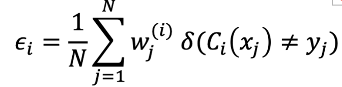

意义：当classifier分的不对，就判定为misclassified。这个式子意义为-miscalssfication的average error

可以用这个来评价分类器的重要性。

$\alpha_i=\frac{1}{2}ln(\frac{1-e_i}{e_i})$

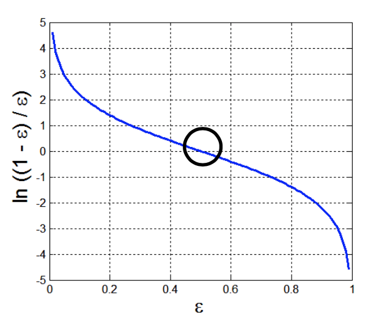

从图中可以看出，error=0时，很重要。

### Algorithm

初始所有weights都是1/n

**weight update**

我门可以得出的有：其中，zi是normalization factor

$e^{-a_i}=\frac{1}{e^{a_i}}$ 可以看出，

- 如果ai越大，weight越小。也就是说，如果这个classifier错误率越小，ai越大，weight越小。符合算法思路。
- 根据上面的坐标图可以得知。当error rate>0.5, ai<0。此时，weight会无限大。对此，**weights are reverted back to 1/n**  and the resampling procedure is repeated.

**classificaiton**

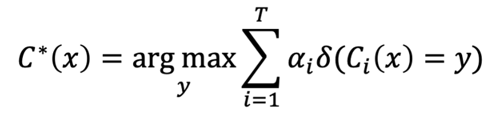

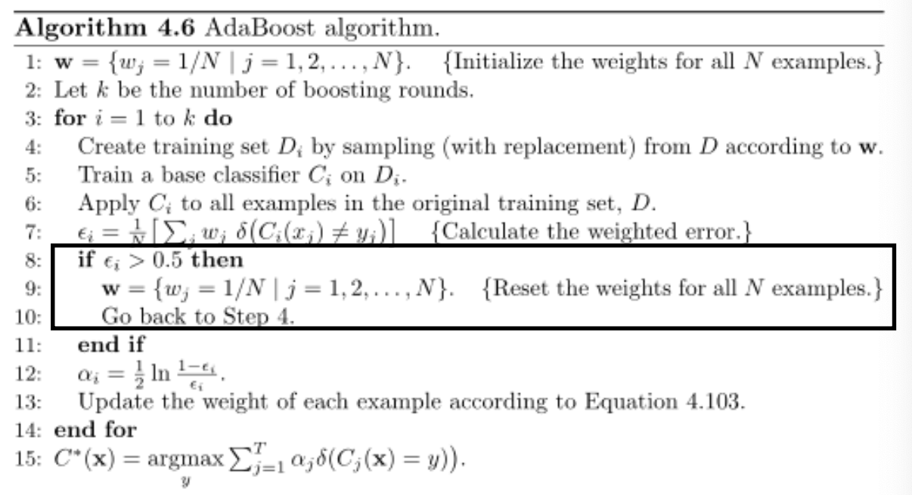

- 初始w=1/n （n: n examples）
- Int k: boosting的轮数
- repeat 1:k
  - Sampling Di: 根据weight从setD中采样
  - train classifer Ci: 根据Di
  - 应用：Apply classifier Ci 到所有example上
  - 计算error rate ei 
  - if ei>0.5:  w=1/n 如何error rate太高，就重新设置回1/n。重新采样，重新训练，重新测试这一个classifier
  - 计算重要性ai 
  - update weight 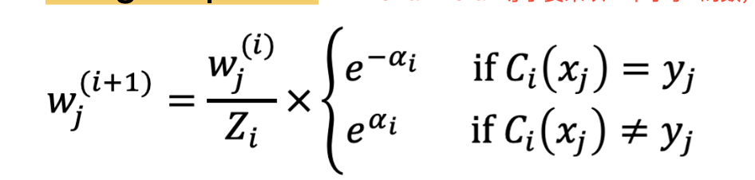
- 最后得出总的classifier 也就是 sum（重要性*分类结果）

### **Example**

original data

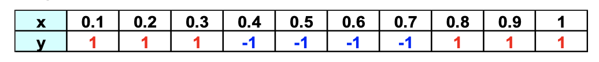

boosting round

alpha 根据error rate 计算alpha得如下表格

weights 根据上面的式子重新更新weight

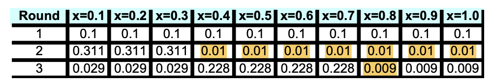

最后根据上面计算得出的重要性alpha和分类器，得出最终的classifier。图中的sum是weighted sum，根据alpha加权结果得出的。最终通过sign来得出分类结果。

分类器：$classifier: C=sign(\alpha_1*Classifier1+\alpha_2*Classifier2+\alpha_3*Classifier3)$

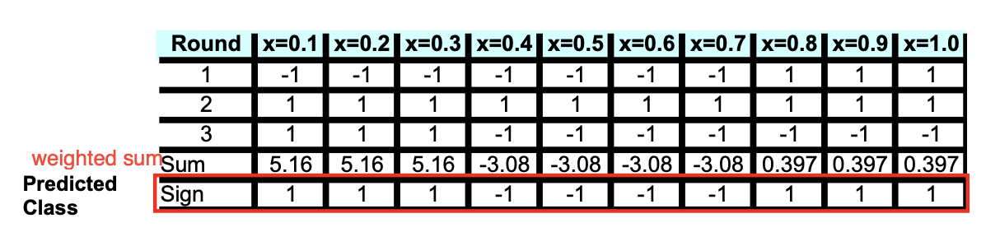

### Summary

我们可以观察到，虽然complexity 上升了，但是正确率显著提高。

# Random Forest Algorithm

上面的两个方法都是对训练集做新的处理从而做到结合分类器的效果。下面的随机森林是对input features和training set 做处理。

- **bootstrap**： 使用bootstrap采样的方法来训练每棵决策树
- **induction：**使用不同的induction技术来处理features
  - **internal node**：randomly **sample p attributes** for split criterion
  - **repeat** until all leaves are **pure**(unpruned tree)

### Characteristics

- Base classifiers
  - **unpruned trees** -- unstable classifiers 基本分类器是没有剪枝的，他们都是不稳定的。
  - **decorrelated** ：基本分类器不互相关。（因为在训练的时候，就已经随机选择features了）
- Random forests **reduce variance** of unstable classifiers **without negatively impacting the bias** 
- 重点在于p的选择，也就是选择多少attributes
  - small: 保证了没有correlation
  - high： 提升了base classifier
  - 一般：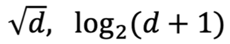

# Class Imbalance Problem

## Definition

很多分类问题都会面临数据class倾斜的问题，某一类特别多，某些类别特别少。

- Credit card fraud
- intrusion detection
- defective products in manufacturing assenbly line

在以上的这些问题中，rare的class被当作positive，majority的class被当作negative，少数的存在更重要。

## Challenges

但是这就面临到一个分类的问题，要找到这些很难。

**Building classifiers**

- 训练过程很多时候都被majority的class影响了。（例如决策树，最后是少数服从多数的，这就有问题）
- 少数的class在训练中没法提现出来

**Evaluating performance**

- accuracy 不适用。accuracy计算的是准确率，因为数据量太少，会被majority影响。

## Solution

因此，我们需要一种能够**平等代表**两种class的方法。

### Building solution

**Sampling-based**

- under-sampling
  - 减少majority的频率, 减少到和minority相当。
  - 缺点：majority 的类可能会variance巨大
- Over-sampling
  - 增加minority的数量（例如，通过复制），增加到和majority相当。
  - 问题：minory的类可能几乎没有啥区别，variance非常小。

### Test Instances（score threshold）

简单来说，若一个样本在某一个类别上的概率大于设定的阈值，我们认为该样本属于该类别，反之亦然。

例如决策树。在最后，按照以前学的，是通过投票来决定。但是如果设置阈值，可以很好的控制。

- 把classifier的outputs**转换成真实值 s(X)** 
- 根据test set的要求，选择一个**threshold St**
  - 如果s(x)>St, x 就被分类为positive

Score requirement

- P(y=1|X), 必须成比例
  - Posterior probability estimates of Naïve Bayes, Bayesian Networks, and Logistic Regression
  - Signed distance of point from hyperplane in SVM
  - Fraction of positive training instances in the leaf of a decision tree assigned to a point

### Evaluation

以下是一些评价指标。注意，一般评价指标是不会考虑进去数据倾斜问题的（skew）判断数据是否倾斜的方式见下面。

### Confusion Matrix

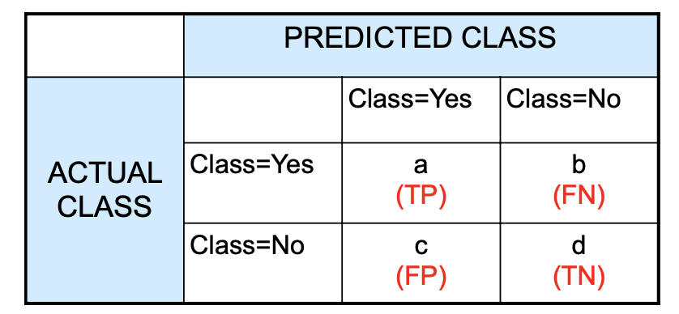

- TP: True Positive 

- FN: False negative **Type II Error**
- FP: False positive **Type I error**
- TN: True negative

简记方式：预测正确--True。 预测的是Yes，不管正不正确，预测倾向都是positive

#### Skew

一般的用来评价的指标是不会考虑数据倾斜问题的。判断数据是否倾斜，判断真实positive在总数据中的占比，也就是：

 ==$skew=\frac{a+b}{a+b+c+d}$==  

#### Accuracy

判断模型的预测准确率。也就是**预测正确的数量在所有数据中的占比**。（TP,TN）

==$Accuracy = \frac{a+d}{a+b+c+d}$==

**Problem**

单纯的使用accuracy会遇到一个问题。如果当数据倾斜严重，accuaracy 可能会失效。

例子：No：990个 Yes: 10个。 这样，如果预测全部是NO，准确率仍然有99%。这很明显不合理。因为预测为Yes的一个都没检测出来。

#### Precision

预测为Yes的数据中，有多少是真实正确的

==$Precision(p)=\frac{a}{a+c}$==

#### Recall

真实正确的数据中，有多少是被预测正确的

==$Recall(r)=\frac{a}{a+b}$==

#### F-measure

可以观察到，当precision高，recall低，当precision低，recall高。此时需要一个可以结合二者的方法。F-score是二者的结合。

==$F-measure(F)=\frac{2rp}{r+p}=\frac{a+a}{a+b+a+c}$==

##### Problem

F-score一定程度上解决了一些问题，但是面对数据倾斜的问题，仍然没法很好的解决。存在以下一些问题：

- **Sensitive to performance on positive class** （预测值为yes）
  - 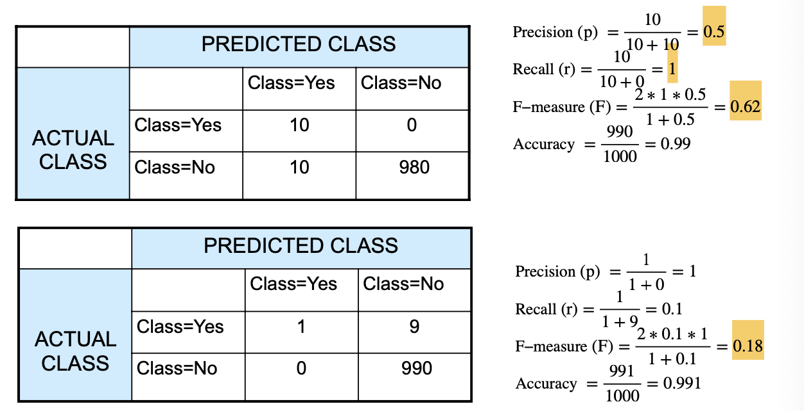
  - 如上图例子F-score很容易受预测正确值的影响
- does not vary by increasing TN
  - 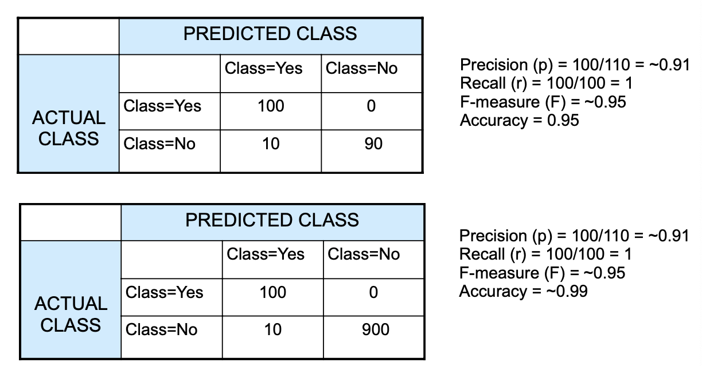
  - 如上图可以看到，F-score完全不受TN影响
- changes with skew
  - 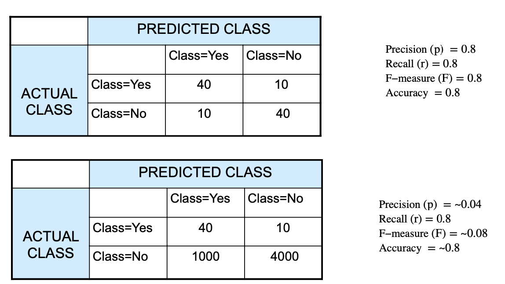
  - 如上图可以看到，当数据倾斜严重的时候，F-score也会被严重影响。

#### Improvement

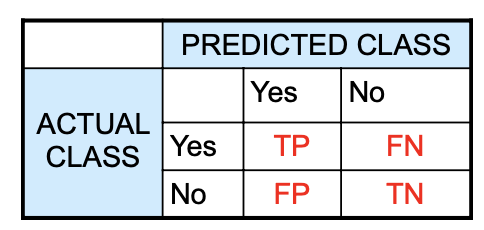

针对上面的F-score的问题，可以改进一些评价算法

$Recall=Sensitivity=TP_{rate}=\frac{TP}{TP+FN}=\frac{a}{a+c}$

$FN_{rate}=\beta=\frac{FN}{FN+TP}=1-sensitivity$

$Specificity=TN_{rate}=\frac{TN}{TN+FP}=\frac{d}{c+d}$

$FP_{rate}=\alpha=\frac{FP}{TN+FP}=1-specificity$

##### Characteristic

- TP rate 和 FP rate 不受skew的影响
- 任意分类器都有，如果TP rate = FP rate， precision=skew

### Designing Score Threshold

上面提到了，score threshold，那么如何来定义评价指标是很重要的。

不同的分类器都应该对应不同的score threshold

**single classifier** 单于单个的分类器有

- 探索所有可能的score thresholds
- 计算适合每个threshold的evaluation 方式
- 选择能够maximiaze evaluation的对应的score threshold

**Problem：** classifier may not be robust to small changes in the score threshold

例子：如果给定不同的阈值，决策树最后的预测结果可能会很不一样。如下面的例子。调整决策树的阈值后，FN上升，FP下降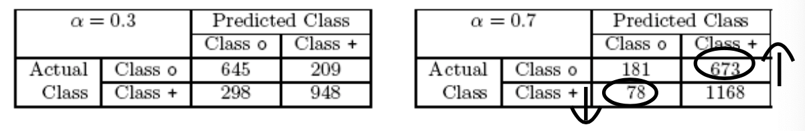

## ROC(Receiver Operating Characteristic)

### Definition

Graphical approach：一种聚集所有performance的评价所有的score threshold的方式

- Plots TPR against FPR
  - ROC 中的点代表了model的performance
  - 改变threshold就会改变point的位置
- ROC对数据倾斜不敏感，即使数据倾斜，curve也不会改变。

### Example

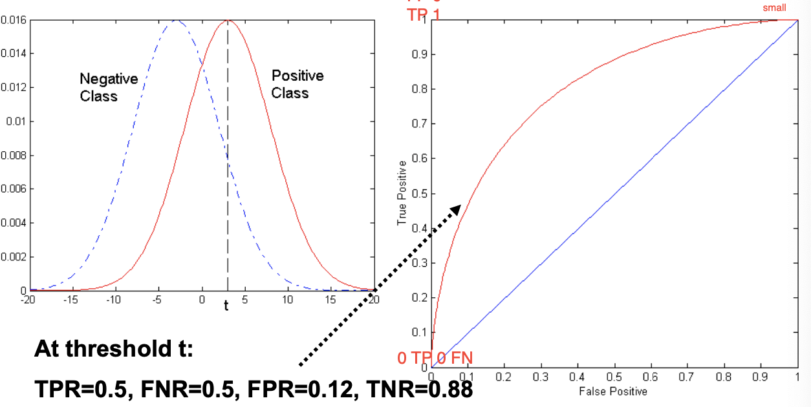

如图，设置为，当x>t, 所有点都被预测为positive。

注意：**positive = TP+FP , negative = FN+TN**

而：**TPR=1-FNR, FPR=1-TNR**

### Construction

- Sort：根据score按照从小大大排序
- Apply a threshold：针对每个score值都应用一个threshold
- 计算TP,FP,TN,FN， 然后计算TPR，FPR

**example**

如图，由小到大排序score，并对应threshold。

之后，对于每个对应的threshold，小于的都为nagative

如图取0.53为例子：<0.53的一共有2个值，因此negative class一共有两个。其中，0.25的位置的预测错误，原本应该是+，因此FN+1; 0.43位置的预测正确，因此TN+1. （可以简单地记为，-，TN+1；+，FN+1）

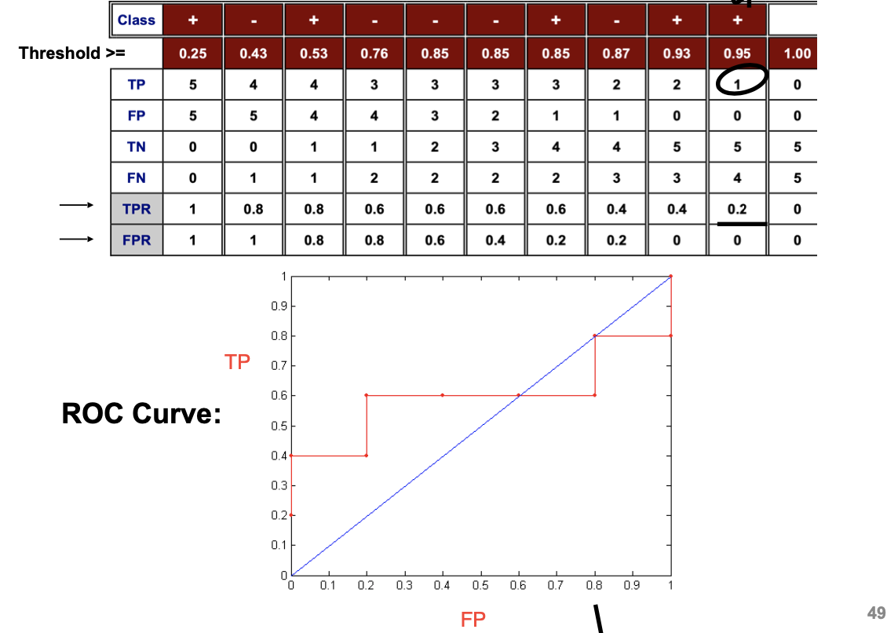

### Characteristc

- 几个重要的点
  - (0,0): FP=TP=0 所有都是negative类型
  - (1,1): FP=TP=1 所有都是positive类型
  - (0,1): FP=0, TP=1, ideal, 所有都完美分类了。

- Diagnoal line ：也就是图中的蓝色线条，对角线
  - 也就是random guess，随意猜测曲线，半半
  -  如果比斜线低，预测值正好相反。（prediction is opposite of the true class）

### Comparison

那么如何用这个来进行模型的比较呢？

没有任何模型始终会比另一个模型更好

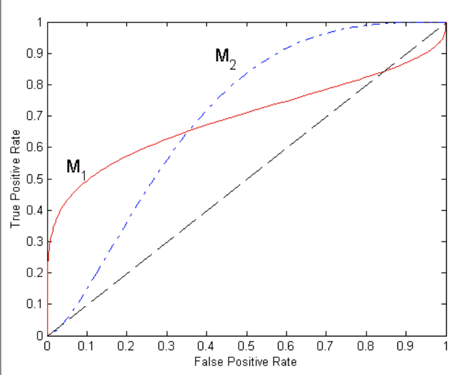

如图此模型

- M1: better for small FPR
- M2: better for large FPR

评价方式：看area under curve(**AUC**)

- Ideal：1（也就是整个矩形）
- random：0.5（也就是对应的右下角三角形）

#### AUC

通过看对应的面积来评价模型的好坏。作为一个数值，一般来说，AUC更大的，模型相对更加优秀。

取值在0.5-1之间

- AUC越大，模型越好
- AUC相等，看sensitivity。不同的sensitivity，模型效果不一样。例如上面的图中，M1，M2模型。

### PR

Precision Recall Curve（PR曲线）

和ROC类似，也是评价的一种方式。

- 和ROC相反，**sensitive to skew**
-  score threshold lowered 当数值很低的时候
  - Recall **increases**
  - Precision 不一定会降低
- 当 score threshold=lowest
  - recall=1, precision = skew
- Random classifier
  - Precision = skew

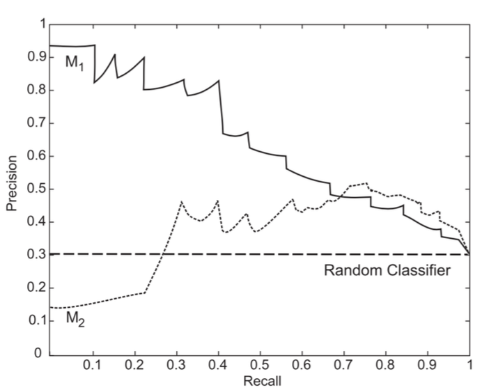