# Cluster

## Definition

Clustering is a set of clusters :是几个聚类的集合。

**unsupervised**！ 是无监督学习。不给定label，让自行分类。

- same group: related (intra-cluster distances 尽可能小)
- different group：unrelated（inter-cluster distances 尽可能大）

## Types of clustering

主要可以分类两类

- Partitional 
  - 不是分级的
- Hierarchical
  - 分级的，一个可以包含在另一个里。

其他一些分类有

- Exclusive
  - 互斥的，所有点都只属于一个clusters
- non-exclusive
  - 点可以属于多个clusters
  - 可以代表多个类或者border points

- Fuzzy
  - 每个点都属于所有clusteer，并且有对应的weight
  - 所有weight sum=1
  - probabilistic clustering也有同样的性质
- non-fuzzy

- Partial
  - 只有一部分data被考虑进去
- Complete

- Heterogenous
  - Clusters of widely different sizes, shapes, and densities
- homogeneous

## Types of Clusters

- Well-seperated

  - cluster内的**任何点之间**的距离都比cluster外之间的距离小
  - 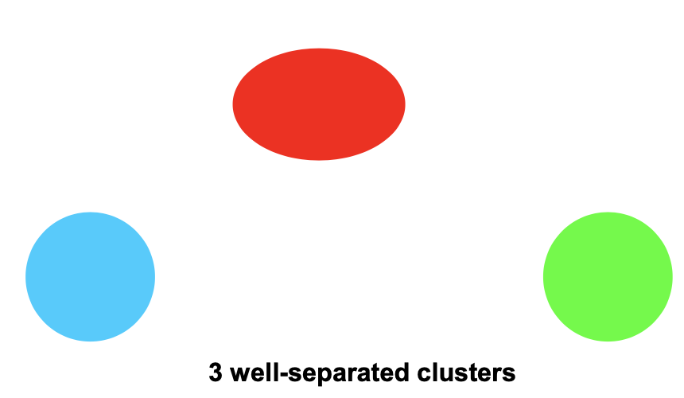

- center-based

  - cluster 内部任意**object**（可以是点，也可以是point）与中心点（centroid/medoid）的距离都比cluster外的其他中心的距离小。

  - 如此图，左边两个球，point对自己本身距离最近，object对自己这个大的cluster最近。

    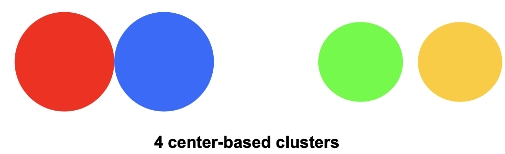

- contiguity-based

  - cluster中任意一个点和cluster中一个或多个点的距离都比cluster外的点近。
  - 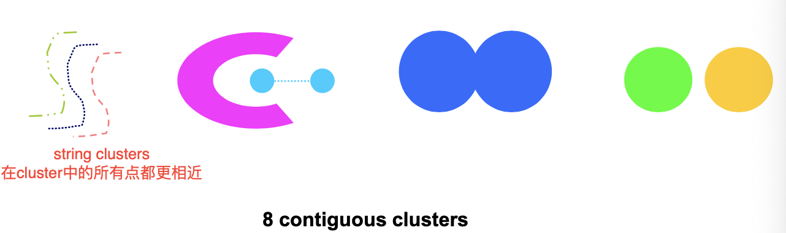
  - 或者可以说，在某个cluster中，有一个点，可以让其中所有的点都更加相近

- Densitiy-based

  - 集群在有密度的点的区域中产生。其中cluster由密度比较高的产生。

  - 当clusters之间不规则或者有交织，有noise/outliers时可以使用

  - 如图，这个图无法识别string clusters，因为string clusters本身就是点

    

- Shared Property/Conceptual Clusters

  - 有共同性质/代表一些特别的概念

    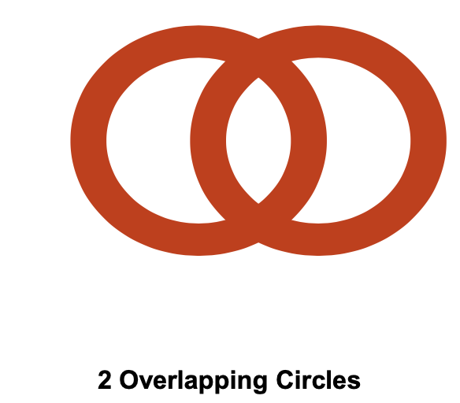

# Algorithms

## Pre-processing & post-processing

**Pre-processing**

- normalize data 归一化
- eliminate outliers 保证没有outlier

**Post-processing**

- eliminate small  clusters that may represent outliers：消除可能是outliers的cluster
- split 'loose' clusters （i.e. relatively high SSE）
- merge 'close' clusters and have relatively low SSE

## Evaluation method

无法知道算法是否是optimal。于是需要评定工具。

### SSE

**SSE：Sum of squared error**

- error =distance to nearest cluster
- 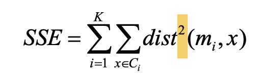
  - mi: center of cluster Ci
  - x: Ci中的点

简而言之，就是计算所有点到最近的中心的距离的平方的和。

一般来说， SSE小的，clustering更好。

**减少SSE的方法：可以简单地增加k**

### WSS(cohesion)

WSS(within cluster sums of Squares)

用来测量cluster**内部**object的紧密程度

- cohesion=SSE=

### BSS(Separation)

BSS(between cluster sum of squares)

用来测量cluster**外部**与其他cluster的分离程度

- Speration = BSS = 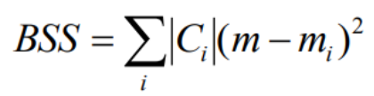
  - Ci: i cluster 的 大小
  - m：整个dataset的centroid

**BSS+WSS=constant**

# K-means and variants（partitional）

- **Partional clustering approach**： 专门用来分partional的
- **K** 必须定义，K的选择很重要，定义了一共要分几个集群
- 每个cluster都有**centroid**
- 每个点都要被分到最邻近的centroid

## K-means (basic)

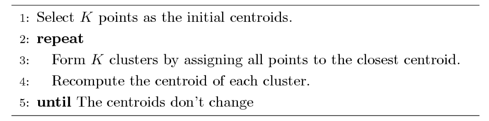

- 随机选择k个centroid
- repeat
  - 计算所有点到这几个中心点的距离。把他们归属于最近的centroid
  - 对每个cluster，重新计算这个cluster的centorid（一般是mean）
- 知道centroid不再改变，停止算法。

### **Detail**

- initial centroid一般是随机选择 --- 可能会导致最后结果不一致
- 一般centroid是所有点的mean
- 最近的距离度量：欧几里得距离/cosine距离/correlation etc
- 大部分很快就收敛了
  - 一般终止条件是几乎没有点再改变
- Compexity：O(n * K * d*l)
  - n: 点的数量
  - K：cluster数量
  - d：attributes数量
  - l：iterations次数

### **Problem**

basic k-means 会有很多小问题

- 当clusters的这些方面不同
  - size
    - 过大的cluster可能会被分割
  - density
    - 过于密集且相近的集群可能会被分成同一类
  - non globular shape
    - 形状不同可能会被分割

- 当有outliers
- 当centroid不同，也会导致结果不同，可能不是最佳的。

### Solution

- easiest: 最简单的方法是提高K，把clusters分割。
- selection of intial centroid: centroid 的选择也会影响最后分类
  - **跑多次**，最后选择 **minimum SSE**
  - 这个方法能够**一定程度上**提高分类效果，但是并不是一直有用
    - idealy：每次都选中自然的中心，但是每次选中原本natural centroid的几率是很小的

#### K-means++

- 比k-means慢（不是随机选择），但是能够产生更小的SSE，分类效果更好
- 保证了接近O(logk)的预期

相对basic算法的改进在于centroid的选择

**Approach**

- 随机选择一个点作为
- k-1 step
  - 对所有点，找到SSE最小的点
  - 按照概率找到新的centroid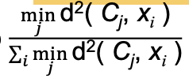

### Other problems

通过上面，了解到，basic K-means有许多问题。

包括：

- varying size/density/shape 会导致分类不准确
  - 这个可以简单通过增加k，把cluster变小就可解决。
- initial centroid不同会导致分类不同
  - 这个问题可以通过跑多个initial centroid，选择最好的SSE来解决这个问题。
  - 可以使用K-means++来解决这个问题。虽然速度变慢，但是相对的效果变好

还有其他更多的问题存在。

#### Empty clusters

k-means可能会有空集的存在

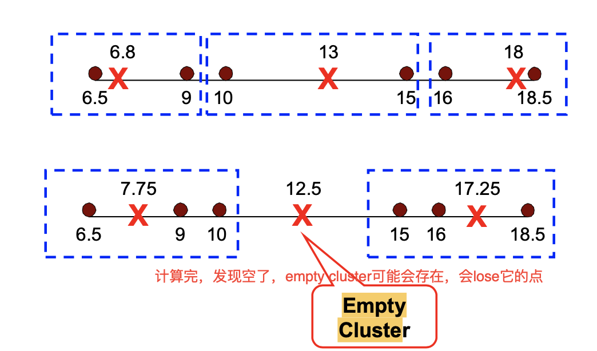

如图，原本存在3个集合，更新完集合后，发现一个点都不存在了，中间的点就变成了空集。

**Solution**

easy way

- 选择contributes most to SSE的点
- 选择这个cluster中sse最高的点
- 如果有多个空集，可以不停循环上面的方法来解决

进阶

basic方法，是把所有点都归属好后再更新centroid。

另一种方法，**每次归属完一个点都更新centroid**

- 每次归属一个点，都更新0/2个中心
- 成本更高，但是**永远不会产生空集（**因为每次都会更改）

通过这个方法，会产生order dependency

### Bisecting K-means

是k-means的进阶版本。前面的算法都只能做到partitional，这个方法可以做到**hierarchical** 

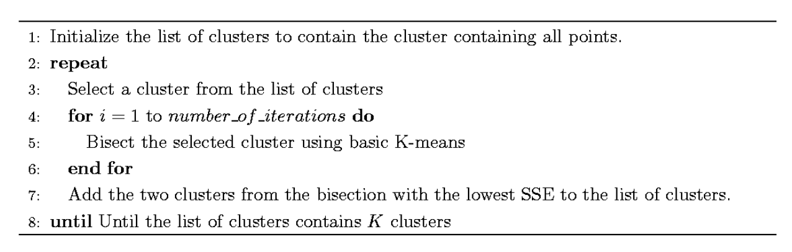

通过不停切分来获得层级的clusters

- bisect 标准： large clusters/ cluster with max SSE
- Robust to initial choice of centroids

# Hierarchical clustering

## Definition

- 可以产生nested clusters
- 可以产生对应的dendrogram来可视化
  - 树形结构的图标，能够清晰展示merge/split顺序

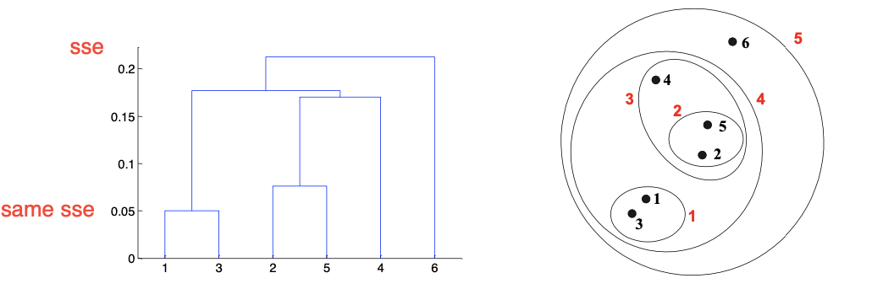

## Strengths

- 不需要设置K，是通过不停合并/切分直接得到的
- 可以用来做一些有意义的分类学

## Types

**Agglomerative**

合并

- 每个单独的点都是独立的一个cluster
- 合并两个最近的cluster直到只有一个

**Divisive**

切分

- 整个dataset就是一个完整的cluster
- 每次都切分，直到每个cluster只有一个point

传统的hierarchical算法使用的距离评定方法是similarity/distance matrix

### Agglomerative algorithm

**Basic algorithm**

- 计算距离（similarity/distance）矩阵

- 所有点各自为一个cluster

- Repeat

  - merge 最近的两个clusters
  - update proximity matrix

  直到只剩一个cluster

可以看到，这个算法中，最重要的是proximity的计算。

## Inter-cluster distance(Proximity)

- Min: 取两个cluster之间的最短距离
- max：取两个cluster之间的最长距离
- Group aggerage：两个cluster之间的平均距离
- distance between centroids：两个cluster centroid的距离
- ward's method uses squared error

### Single Link

也就是使用MIN方法的clustering。

计算所有集合之间的点的距离。取距离最短的两个集合合并。为下一个合并的cluster。

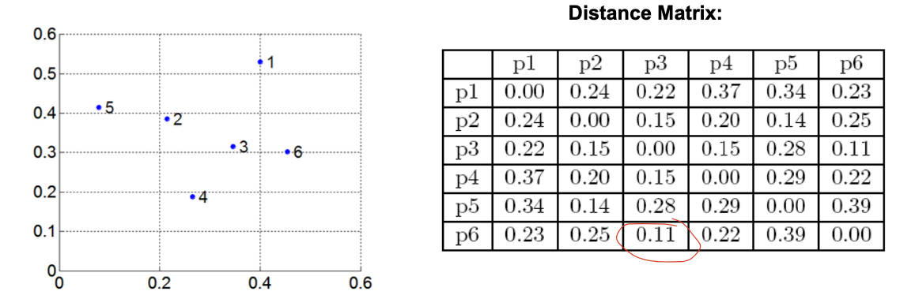

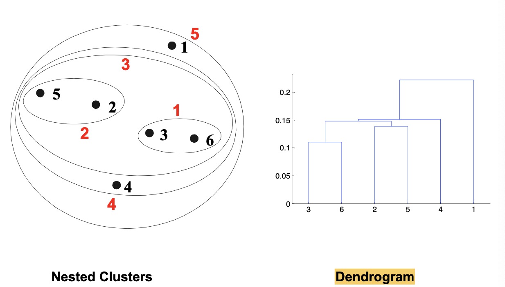

#### Pros & cons

Pros

- can handle non-elliptical shapes :可以处理奇形怪状的集合

Cons

- sensitive to noise/outliers 对离群点非常敏感。

### Complete LInkage

使用MAX方法

计算所有集合之间的最远距离（集合内多个点，取最远的）。取最短的最远距离进行合并

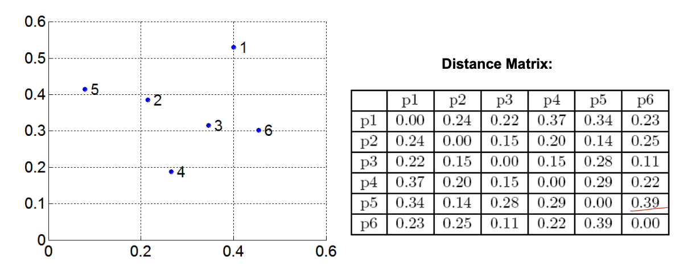

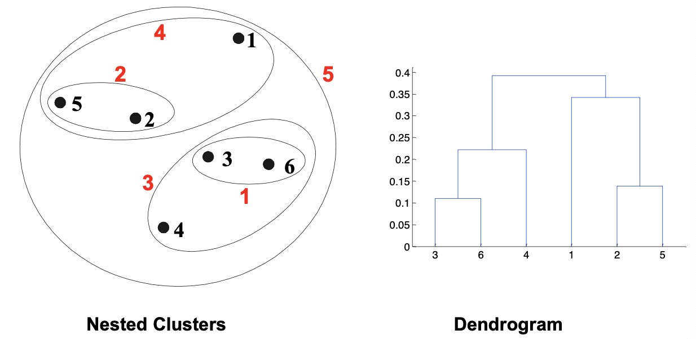

#### Pros & Cons

Pros

- Less susceptible to noise/outliers 对离群点相对没有那么敏感

Cons

- Tends to break large clusters 如果集合大小不一，可能会把大的集合拆分
- biased towards globular clusters：更倾向于变成圆形的集合

### Group Average

计算clusters之间的平均距离。取最短合并

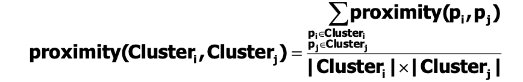

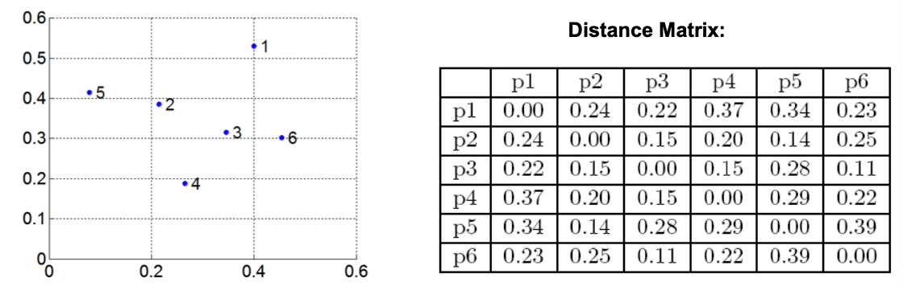

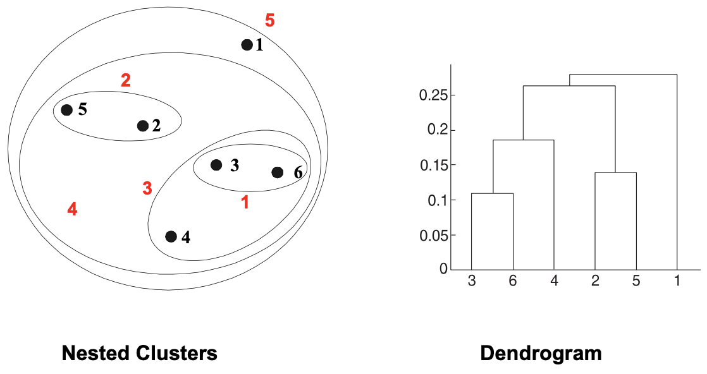

#### Pros & Cons

是single 和comlete 的折中

Pros

- less susceptible to noise and outliers: 对离群点相对没那么敏感

Cons

- biased towards globular clusters: 更倾向于圆形的集群

### Ward's(Similarity)

根据SSE来合并clusters

计算每两个集群之间的SSE（合并后），取最小

#### Pros & Cons

Pros

- Less susceptible to noise and outliers

Cons

- Biased towards globular clusters

和K-means很像，可以用来初始化k-means来找点

### Comparison

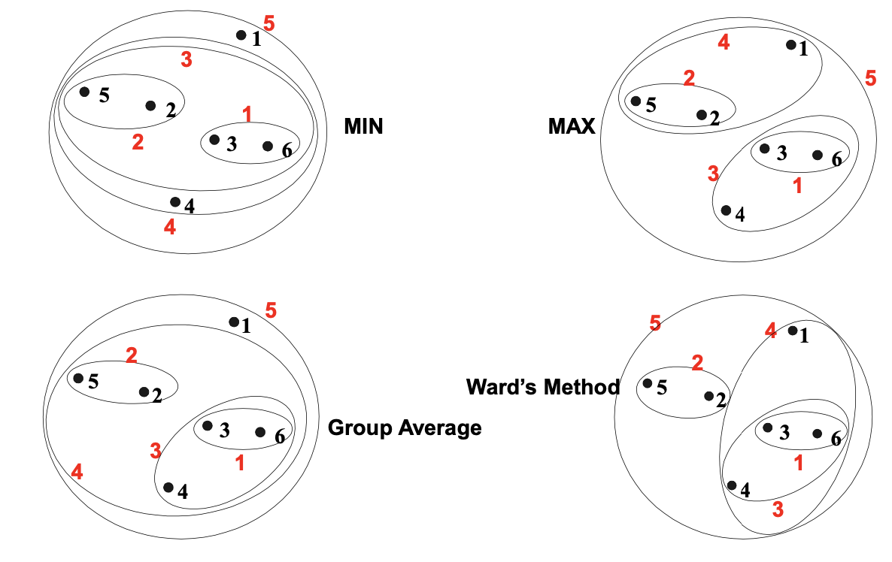

### Requirements

Time：O(N^3^) 

- N步，N^2^的proximity matrix计算
- 如果使用好的数据结构，可以降到O(N^2^log(N))

Space: O(N^2^)因为使用proximity matrix

## Summary

比较这些算法，可以看到，能够较好地起到分层的作用。

|               | Pros                              | Cons                                             |
| ------------- | --------------------------------- | ------------------------------------------------ |
| Single        | 可以处理椭圆边界                  | sensitive to noise/outliers                      |
| Complete      | less sensitive to noise /outliers | 1. 容易把大的cluster切分了2. 倾向于圆形的cluster |
| Group Average | less sensitive                    | 倾向于圆形                                       |
| Ward          | less sensitive                    | 同上                                             |

**Limitation**

- 一旦决策做下了，没法撤回
- 没有通用方法
- 可能会有多种问题
  - 噪音敏感
  - 大小/不规则难以处理
  - 切分大集合

# Density-based clustering

## DBSCAN

number of points within a specified radius(Eps): 简而言之，就是在Eps的范围内，包含的点的数量。

DBSCAN以密度为分类标准

### Types of points

- core points ：在Eps范围内，至少有要求的最少的点的数量（MinPts）
  - 可能会有点在其他cluster内部
- border points：不是core points，但是可能在core point的内部
- Noise points： 都不是

如图

A是core point：Eps 范围内，一共有7个点，符合>=MinPts

B时border point：Eps 范围内，虽然不符合7个点，但是在A的边境内

C事noise：既不是core也不再core的cluster里面

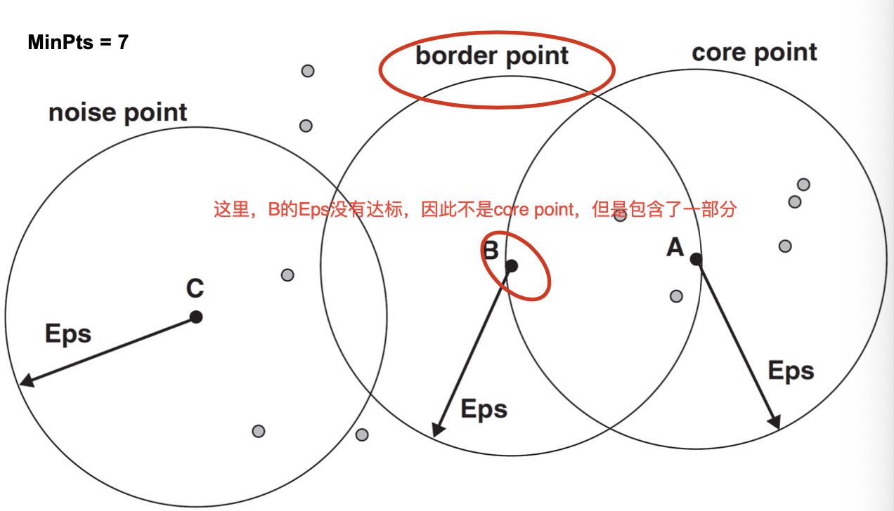

### Algorithm

- 删除noise 点
- 开始聚类
  - Eps范围内，任意符合>=MinPts的core points都归属于同一个cluster
  - 在对应core point的Eps范围内的border point归属于这个core point 所在的cluster
  - 如果一个border points属于多个cluster，需要决定属于哪一个。

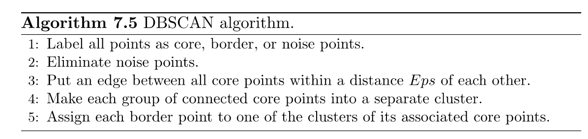

### Pros & Cons

Pros

- Resistent to noise不受噪音影响
- can handle clusters of different shapes and sizes 不受形状和大小影响

Cons

- varying densities可能会对分类效果产生很大的影响。

### Eps & MinPts

那么如何决定这两个值显得很重要。

Idea：在点的数量大小>=k的cluster中，kth nearest neighbors are close-by

Noise points have their kth nearest neighbor farther away 噪音特别远

可以通过绘制限免的，每个点到它最近的K个点的距离图来找参数。

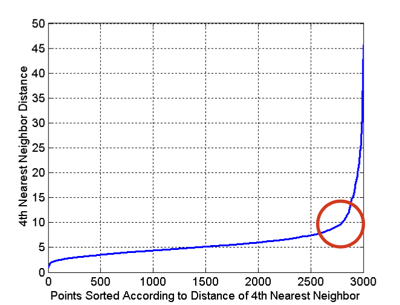

如图，终点时找到这个改变的点。