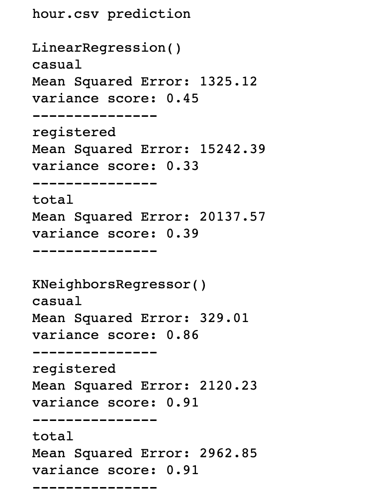
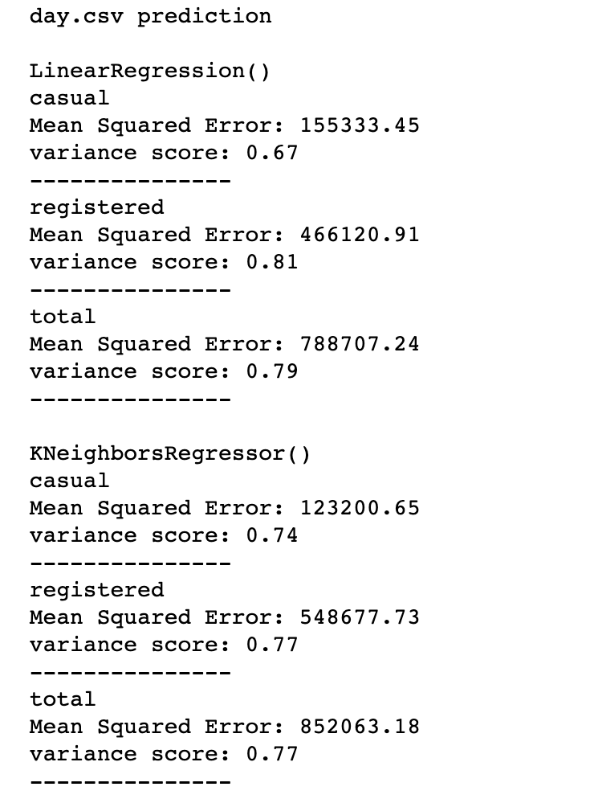
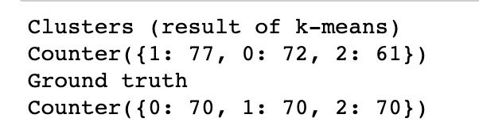
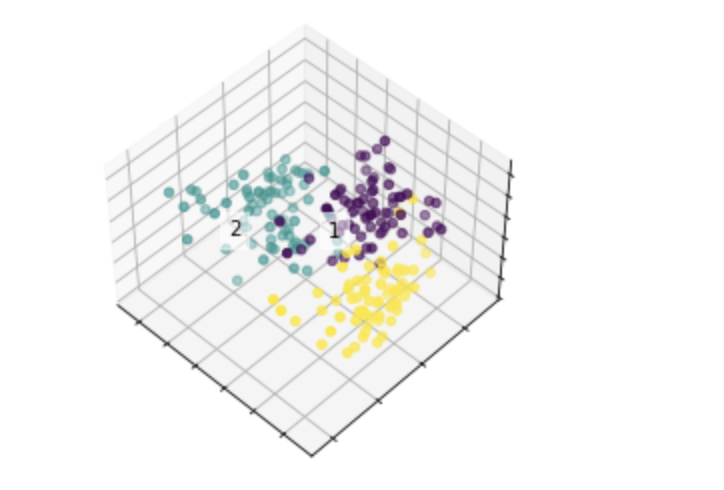

# Assignment 3  Report

## Problem1 Regression

### Intro

**Input**: Bike Share dataset

**Output**: predict daily/hourly values for the number of casual/registered/total riders.

**Method**: Linear Regression and KNN Regression

**Data Pre-processing Method**: discard the last 3 columns. 

**Train and Evaluation**: Using the two method to train the model. Calculate the Mean Squared Error and variance score to evaluate the model.

### Description of dataset

Datasets

- Readme.txt: describes the datasets
- "hour.csv": Store the hourly data
- "day.csv": Store the daily data

Data

- hour.csv
  - Data size:17379
  - columns："instant,dteday,season,yr,mnth,hr,holiday,weekday,workingday,weathersit,temp,atemp,hum,windspeed,casual,registered,cnt" 17 columns
- day.csv
  - Data size: 731
  - Columns: "instant,dteday,season,yr,mnth,holiday,weekday,workingday,weathersit,temp,atemp,hum,windspeed,casual,registered, cnt"

### Method

**Linear Regression**: model available at sklearn.linear_model. 

**KNN Regression**: moedel available at sklearn.neighbors, and I chose 5 neighbors

**K-Fold**:use 5-fold to train the data.

**Evaluate Method**: I chose to calculate mean squared error and calculate the variance score to evaluate the performance. 

### Processing

#### 1. Import packages

```python
import pandas as pd
import numpy as np

from sklearn import neighbors, linear_model
from sklearn import model_selection
```

#### 2. Load Data

```python
day_data=pd.read_csv("day.csv")
hour_data=pd.read_csv("hour.csv")
```

#### 3. Data Pre-process

I deleted the column **index** and **dteday**. The column index is just as its name, and I think it has no influence on the result. The column dteday has the format problem and I think it has the same effect as the index column. 

As states in the assignment statement, the last 3 columns will not contribute to the result, so I delete them all. 

```python
def preprocessData(rider,data):
    data_X=data.values[:,2:-3]
    
    if rider =='casual':
        data_Y=data.values[:,-3]
    elif rider == 'registered':
        data_Y=data.values[:,-2]
    else :
        data_Y=data.values[:,-1]
    return data_X,data_Y
```

#### 4. Train and evaluate

I used the k-fold cross validation to train the data, and print out the mean MSE and variance score of the 5 folds. 

```python
# initialize
linear_Regression = linear_model.LinearRegression()
knearest_Regression = neighbors.KNeighborsRegressor(n_neighbors=5, weights='uniform')

def train_and_evaluate(data_X,data_Y,regression_type):
    kf = model_selection.KFold(n_splits=5, shuffle=True)
    total_MSE=0
    total_variance_score=0
    for train_index, test_index in kf.split(data_X):
        X_train, X_test = data_X[train_index], data_X[test_index]
        y_train, y_test = data_Y[train_index], data_Y[test_index]
        regression_type.fit(X_train, y_train)
        total_MSE+=np.mean((regression_type.predict(X_test) - y_test) ** 2)
        total_variance_score+=regression_type.score(X_test, y_test)
    print("Mean Squared Error: %.2f" % (total_MSE/5))
    print("variance score: %.2f" % (total_variance_score/5))
```

#### 5.Result



### Conclusion

KNN regression works better in hourly prediction. 

In hourly prediction, the mean square error of linear regression is much higher than the knn regression method but much lower than the data in daily prediction. I think the reason why the MSE has changed so much is because the data within a day is more detailed and distributed in multiple hours of the day, the data becomes smaller, and the subtle changes cause the difference to become smaller. 

I think the reason why KNN works better in hourly prediction is that, the data in hourly.csv is distributted in multiple hours.  Obviously, there are more people riding bicycles during the day and fewer people at night, the data is more like distributted normally, more than a linear distribusion. Therefore, linear regression works worse than KNN regression.

Linear regression works a little bit better than KNN regression except for the casual riders prediction. 

I think it is because in casual rider prediction, the data is much more "casual", and would distribute casually not in linear distribution, therefore it works worse than knn regression for the casual riders predition. However, for registered riders, the patern is much clear, so it works better. 

## Problem2 Clustering

### Intro

**Input**: seeds dataset

**Output**: cluster the dataset into 3 clusters

**Method**: PCA and K-Means

**Data Pre-processing Method**: PCA

### Description of dataset

Datasets

- seeds_dataset.txt: the data of the seeds

Data

- Data size: 210
- Features:7
- Columns: area, perimeter, compactness, length, width, asymmetry coefficient,  length of kernel groove, target

### Method

**PCA**: Uesed to reduce the dimensionality, use to pre process the data

**K - means**: use to cluster the data

### Processing

#### 1. Import packages

```python
import pandas as pd
import numpy as np

from sklearn.cluster import KMeans
from sklearn.decomposition import PCA

import matplotlib.pyplot as plt
%matplotlib inline
from mpl_toolkits.mplot3d import Axes3D
```

#### 2.  Data Process

The data process progress only need to exclude the last column. 

And I use the PCA to reduce the dimensionality. 

I tried from 2 to 7, and I found that the result does not change, I think it just because the dataset is too small. 

```python
X = seed_data_pca.values[:,:-1]
y = seed_data_pca.values[:,7]

#using PCA
pca = PCA(n_components=4)
pca.fit(X)
X = pca.transform(X)
```

#### 3. fit model

After PCA progress, all I need to do is just fit the dataset into the model.  And compare the result with the Ground truth

```python
#fit kmeans
kmeans_cluster_algo = KMeans(n_clusters=3)
kmeans_cluster_algo.fit(X)

import collections
seed_data_pca[7]=seed_data_pca[7]-1
print("Clusters (result of k-means)")
print(collections.Counter(kmeans_cluster_algo.labels_) )
print("Ground truth")
print(collections.Counter(seed_data_pca[7]))
```

#### 4. plot the result





