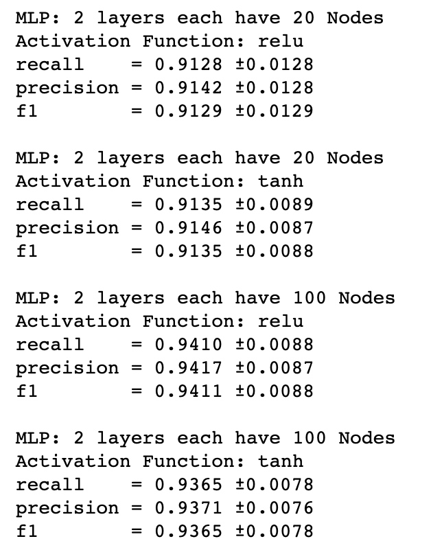
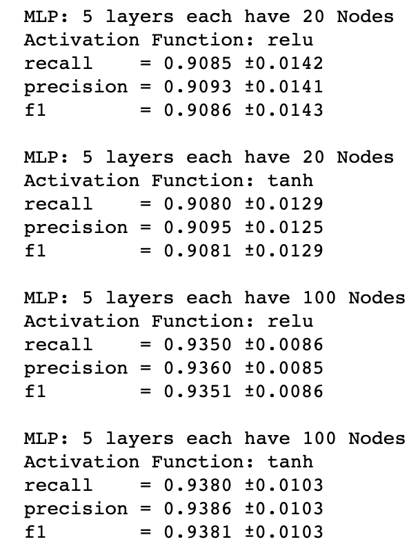
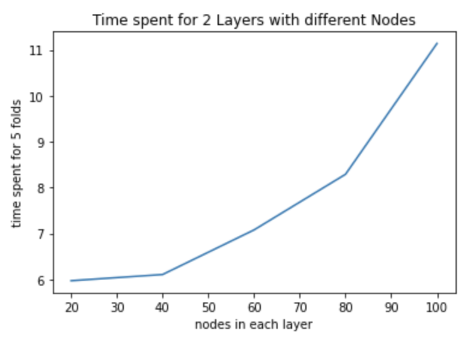
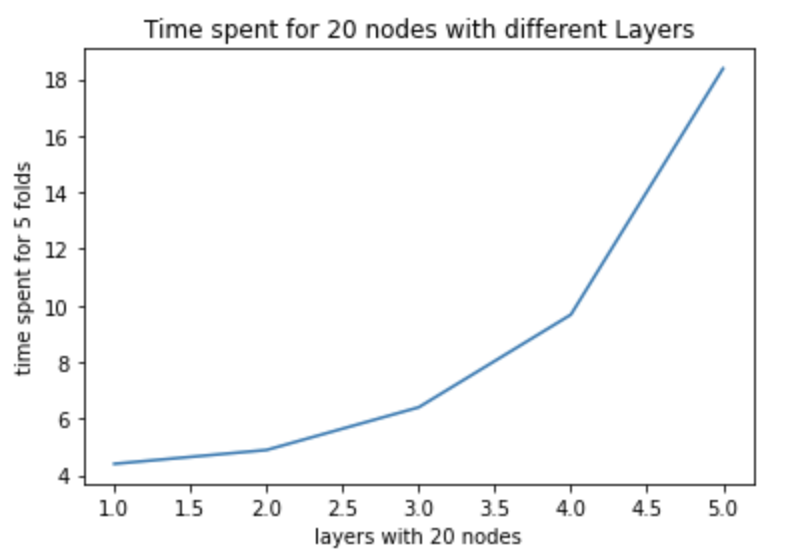
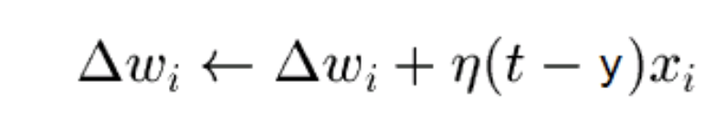

# Assignment 4  Report

## Question1 

## Problem1 running 8 models

### Intro

**Input**: MNIST dataset- pixels of 9 digits

**Output**: predict what digit is considering the pixels

**Method**: Multi Layer Perceptron Classifier

**Train and Evaluation**: Using the K fold to train the data and using precision, recall, and fscore to evaluate the model

### Description of dataset

Datasets

- "digits.csv": Store the daily data

Data

- digits.csv
  - Data size:6000
  - Columns：195
  - Feature size: 194
  - Label: First column "label"

### Method

**MLP**: multi layer perceptron Classifier

**K-Fold**:use 5-fold to train the data.

**Evaluate Method**: precision, recall ,fscore. 

### Processing - First problem(8 models)

#### 1. Import packages

```python
import pandas as pd
import numpy as np
from matplotlib import pyplot as plt

from sklearn.neural_network import MLPClassifier
from sklearn import preprocessing
from sklearn import model_selection
from sklearn import metrics
import time
```

#### 2. Load Data

```python
data=pd.read_csv("digits.csv")
```

#### 3. Data Pre-process

The X should be all rows except for column 1. y should be the label, which is the first column "label"

```python
X=data.values[:,1:]
y=data.values[:,0]
```

#### 4. Train and evaluate

I used the k-fold cross validation to train the data, and print out the precision, recall and fscore of the 5 folds. 

```python
def train_and_evaluate(layer_sizes,activation_func,X,y):
    kfold = model_selection.KFold(5, shuffle=True, random_state=2)
    for train_idx, test_idx in kfold.split(X):
        X_train, X_test = X[train_idx], X[test_idx]
        y_train, y_test = y[train_idx], y[test_idx]

        mlp_clf = MLPClassifier(hidden_layer_sizes=layer_sizes,max_iter=1000,solver='lbfgs',activation=activation_func)
        X_scaler = preprocessing.MinMaxScaler()
        X_train = X_scaler.fit_transform(X_train)    
        mlp_clf.fit(X_train, y_train)
        X_test = X_scaler.transform(X_test)
        y_pred = mlp_clf.predict(X_test)
        rec += [metrics.recall_score(y_pred, y_test, average="weighted")]
        prec += [metrics.precision_score(y_pred, y_test, average="weighted")]
        f1 += [metrics.f1_score(y_pred, y_test, average="weighted")]
    print("recall    = {:.4f} ±{:.4f}".format(np.mean(rec), np.std(rec)))
    print("precision = {:.4f} ±{:.4f}".format(np.mean(prec), np.std(prec)))
    print("f1        = {:.4f} ±{:.4f}".format(np.mean(f1), np.std(f1)))
    print()
```

#### 5.Result



### Conclusion

For the first problem that asking us to run 8 models, we can see from the result: 

If the model has the same layers, the more nodes a layer has, the more accurate  the models is. 

If the model has the same nodes for each layer, the more layers a  model has, the more accurate it is. 

In a word, Increasing the nodes or layers can improve the accuarcy of the model. 

Besides these, the activation fuction has a little impact on this moel. At least in this example, the reluctance function works a little bit better than the tanh function. 

## Problem 2 Methics observing Problems

I observed these two experiments with 5 fold and calculate each time spent. 

1. The time it takes to fit each model as size of layers increase for various layer sizes (recom- mend number of layers = 2 and size of layers = [20, 40, 60, 80, 100]). Provide graphs.

   For the five models with **the same layers and incresing nodes in each layer** , the graph is:

   

2. Thetimeittakestofiteachmodelasnumberoflayersincreaseforvariousnumbersoflayers (recommend number of layers = [1, 2, 3, 4, 5] and size of layers = 20). Provide graphs.

   For the five models with **the same nodes with incresing layers** , the graph is:

   

3. What type of growth do you see for each? Why?

   We can see from above that:

   The two types of  graph shows that adding more layers or adding more nodes in each layers makes the time spent growing **exponentially**.

   **Reason**: I think the MLP algorithm is indeed a linear function with high coeffiicient.  Therefore, I think the time spent by the model is not only related to the size of input data, but also to the coefficients of the MLP.

   1. For models with 2 layers and increasing nodes:

      Let `a` be the weight of the first layer, `b` be the weight of the second layer

      The input of the first layer should be y=a0x0+a1x1+……+anxn

      The input of the second layer should be z=b0y0+b1y1+……bnyn

      Therefore, the output should be Output=z(y)=z(y(x))=a0b0X0+a1b1X1+……anbnXn

      Therefore, I think the time should also grows exponentially.

   2. For models with  20 nodes and incresing layers: 

      Same as I stated above, I think since the node of each layer is the same , time is most affected by the coefficients( a x b x c x d x e x……). The more layers the model has, the higher the coefficients be, therefore, the graph grows exponentially. 

4. What happens in simple/smallish network if you stop using MinMaxScaler. Why?

   > MinMaxScaler rescales the data set such that all feature values are in the range [0, 1]. 

    I think the MinMaxScaler helps the model runs faster and much more accurate, since all data is much more smaller, which means the Squared error would also be much more smaller than before, considering the gradient descent,  that would help the model converage much more faster. 

## Question2 

**Problem**: In the scikit learn package, the default value for the learning rate of an MLP is 0.001. Explain what will happen to the classification result if we set this parameter to 0.5 and why.？

If the learning rate is set to 0.5, the model would coverage faster but I think the result may not be that accuarate. 

The learning rate determines how much error needs to be used in each backpropagation according to the formula:



If the learning rate becomes larger, the delta weight of each update will become larger, the changes become rapid. Therefore, if the learning rate becomes this large, the model may converage faster or even can not converage because the error may be large, and the result may be suboptimal. 