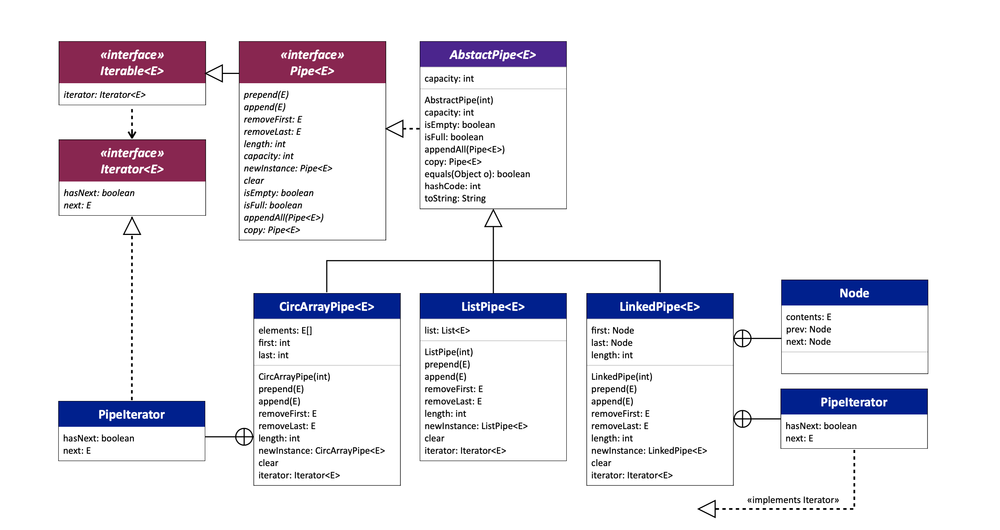
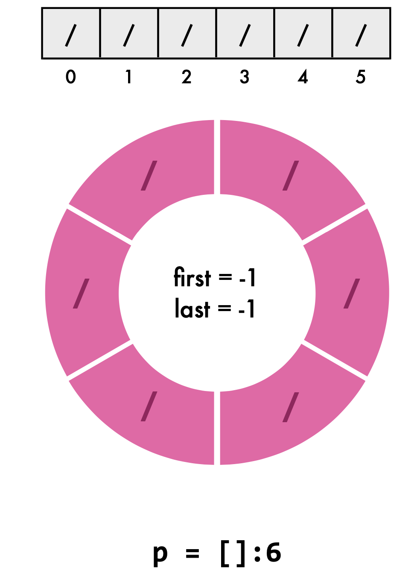

# Bounded pipe

Implement the data structure of the boundedPipe using different data structure -- just like  deque



## circArrayPipe

Data structure: Array

structure should look like this:



`first` is the position of the first element

`last` is the position of the last element

how to calculate the length:

```java
/**
     * return the length of the ListPipe
     *
     * @return the length of the ListPipe
     */
    @Override
    public int length() {
        int length;
        if (first == -1) {
            length = 0;
        }
        else if ((last + 1) % capacity() == first) { //if it is full
            length = capacity();
        }
        else {
            length = (last + 1 - first + capacity()) % capacity();
        }
        return length;
    }
```


## LinkedPipe

Data structure: Linked List

Implement using node.

```java
class Node {
        E contents;
        Node prev;
        Node next;

        public Node(E contents) {
            this.contents = contents;
        }
}
```


## ListPipe

Data structure: Linkedlist in Java API.

