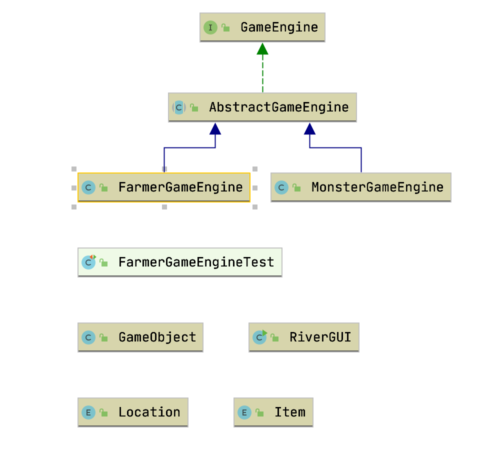
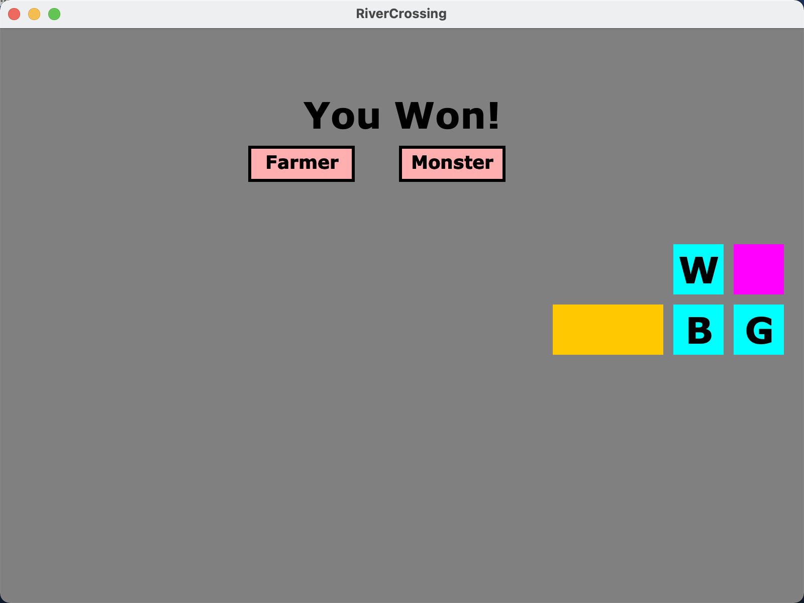

# River Crossing

**Project purpose**: Refactor the FarmerGameEngine class and implement the MonsterGameEngine class.

The game is shown in this page: https://www.transum.org/software/River_Crossing/

What I had done:

- Refactor GameEngine, GameObject class.
- create GameEngineInterface
- Modify GUI
- Implement MonsterGameEngine class

**class diagram**

**GUI**

**Key part of this project**

Using offset to refactor the GUI

