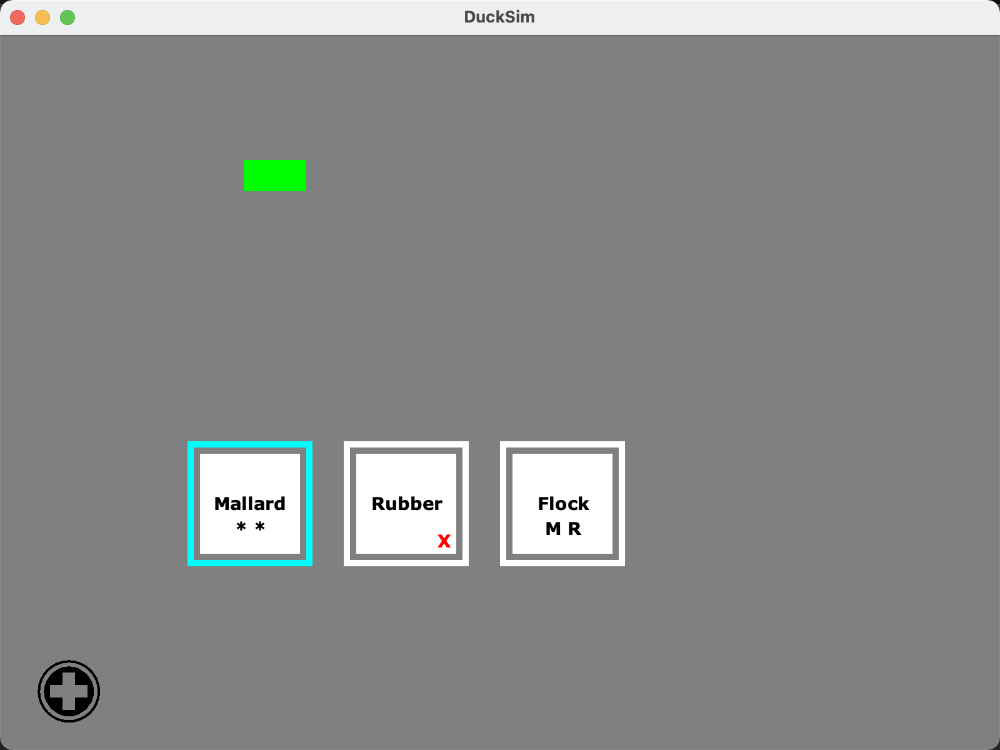
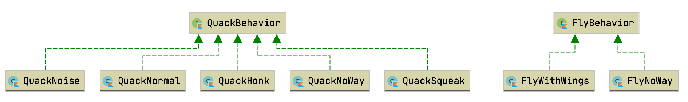
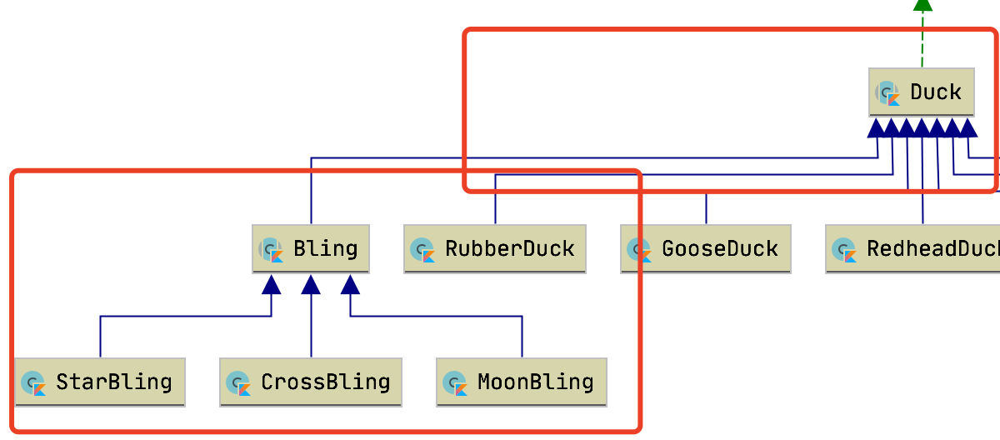
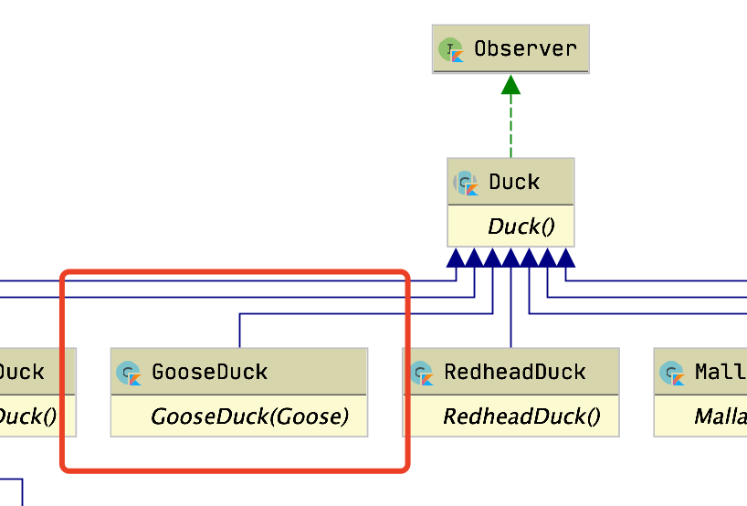
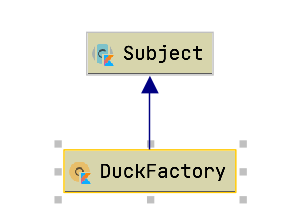
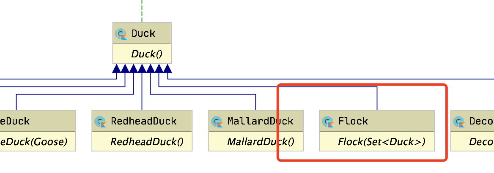

# Ducksim

**Purpose**: use this project to learn the design pattern. 

**Language**: Kotlin

**Design pattern** implemented: Strategy, Decorator, Factory, Adapter, Observer, Composite, Singleton

 **Functionality**

There are 5 types of duck

|               | fly  | Quack | Color  |
| ------------- | ---- | ----- | ------ |
| duck          | Yes  | Yes   | Black  |
| Mallard duck  | Yes  | Yes   | Green  |
| Red head duck | Yes  | Yes   | Red    |
| Rubber duck   | No   | Yes   | Yellow |
| Decoy duck    | No   | No    | Orange |

Ducks can be captured. If captured, can not fly or quack, a red `x` is showed. If release, ducks will behave as they did originally.

Ducks can join welcoming team. All ducks in this team will show welcome when a new duck is created as long as they are not captured. If ducks is captured and it is in the welcome team, ducks will show be aware!  The word should appear over the duck's name. 

Ducks can form a flock. 

Ducks can be decorated using different characters.

Goose is not a duck, but wants to adapt to the ducks fuction. Goose can fly,  quack Honk, its color is blue. 

**How it looks like**

## Strategy Pattern

 **Purpose**:use this pattern to capsulate the flying behavior and quacking behavior.

**Diagram:**

## Decorator Pattern

**Purpose**: Use this pattern to decorate the duck. Create a Bling class to decorate the duck. And there are 3 types of bling class. A duck can at most have 3 bling decorator. 

**Diagram:**

## Factory Pattern & singleton 

**Purpose**: Use factory pattern to create different types of ducks with different types of decorator according to the user.  Make the factory a singleton class.

Create different types of duck and using different types of Bling class to decorate the class. 

## Adapter Pattern

**Purpose**: Uxe adapter pattern to adapt the goose duck. Goose is not a duck, but want to use the ducs's fly and quack. 

**Diagram:**

## Observer Pattern

**Purpose: ** Use observer pattern to implement the welcoming committee. For all ducks in welcomint committee, if a new duck is created, all ducks show welcome. If a duck is captured, when a new duck is created, show be aware!

The observer is a interface. The duck implement the interface. The duck factory is the subject. When duck join the committee, it register the subject factory. Therefore, when a new duck is created, the factory will notify all the observers.

## Composite Pattern

**Purpose:** Use composite pattern to create a duck flock. 

The flock is a kind of duck. The flock will have a collection of ducks. It can not have bling. Flock can fly, can quack "Noise"  If the flock join the welcoming committe, all ducks in this flock will join too. If the flock is captured, all ducks in this flock are captured. And release do the same way. 

