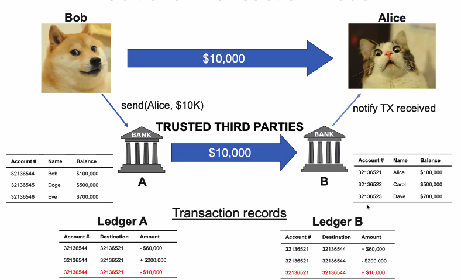
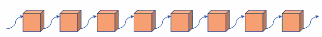
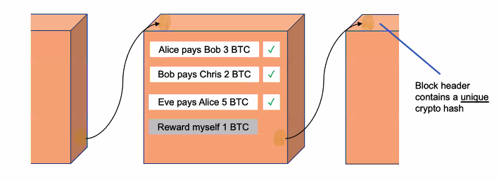
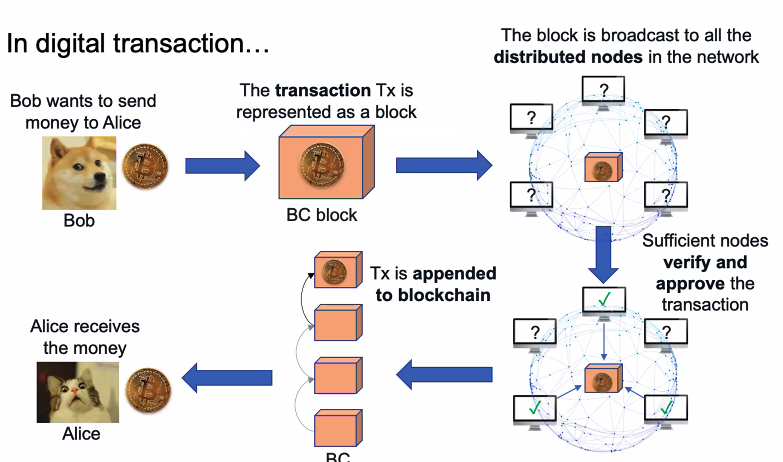

# Blockchain Technologies intro

## Traditional models intro

### Traditional transaction model

必须需要有可信赖第三方的存在，在传统模型中，就是bank！(**centralized**)

#### Issues

**Centralized** systems have many issues

- single point of failure : 单点故障。这种系统一旦有地方失效，就会导致整个系统无法运作。
  - System attacks, hacks
  - prone to errors
- **Require trust** 
  - Counterparty risk/fraud(交易对手风险: 交易对手不履行合约义务儿造成的风险)
- Security and privacy issues
- operational cost to maintain trusted third parties（维护成本高）

### Traditional trust model

#### Trust?

it is a complex **psychological state** combined with **rational and emotional factors.**

#### Models

- P2P: because of you- **trust counterparty** 点对点式。
- Leviathan: because of **legal contracts** established by trusted authorities. -**trust dispute resolution mechanism (CA)** 因为特定的规则而建立的。
- Intermediary: because of **trusted platform** we both operate on- **trust intermediary** 因为平台可信赖。

#### Why fails?

direct violation: non reputable organization

opportunistic behavior: benefits outweigh trust factors

Systematic collapse

#### summary

Extremely hard to restore! 传统模式问题很多，因此才要寻找新的模式

## Blockchain: A Revolution of Trust

An open network where **everybody can establish trust themselves**

### Features 

- **Decentralized**: **Trust distributed across multiple entities**
  - no central authority 因为没有中心
  - no single point of failure 所以不回产生单点故障的问题
  - reduced operational cost 并且减少了操作带来的成本
- Open: anyone can participate and verify the integrity and trustworthiness 每个人都能参与
- Anonymity: everybody is equal and his/her identity remains hidden 
  - 和privacy不同。anonymity 是你的信息是被隐藏的，每个人都相同。
- enhanced confidentiality, integrity and privacy

### How to established Blockchain

via **software programs**

- decentralized platform with **reward incentive** machanisms 如果你遵守规则，你会得到奖励
  - encourage honest and trustworthy behavior of many participants

- smart contract with pre-defined algorithms
  - dispute resolution

In blockchain network nothing to be trustworthy except its output

all transactions validated via 

### Why blockchain

- enhanced security and reliability 
  - via decentralization model and cryptography 中心化的方式如果出错了就gg了
- tamper proof
  - data alteration remains extremely difficult 难以改动信息。每个人都拥有各种信息，不能轻易改变它。
- digital freedom
- improved transparency: 每个人都可以verify, track，但是没人能自己更改交易
- better efficiency and reduced cost: automated, minimal transaction cost, no need of maintaining central authority

### What is Blockchain

> **Bitcoin is NOT blockchain**
>
> Bitcoin **is a digital currency** that **uses blockchain as the underlying data structure.** 

Blockchain **is a data structure** where data blocks are linked together(**chain of blocks**)

Data blocks in the chain **cannot be deleted or altered**(**immutability**)

Blockchain is a **comprehensive system** consisting of:(要素)

- transactions
- Immutable ledgers
- Decentralized network
- data encryption/decryption
- **consensus mechanisms**
- **smart contracts** 

### Block

- Blockchain permits **transactions** to be gathered and **recorded in the block.** block中存储着要集中的transactions
- Blocks are **chained** in chronological order **via cryptographic hash**

计算hash决定要把block放在哪里。如果要更改/删除交易，需要更改整个chain。

需要存储的信息：index; hash of current block

### How it works

一开始只有一份data，但是data会复制到多个node。

verifier是随机的，甚至可以volunteer去当！（incentive system）

### Types of blockchain

**Public & private**

private 一般是为了 特定的组织而设计。有些特性在private中可以不适用。

### Concepts

**Blockchain Transactions**

- **smallest** element
- record every decision and action taken 
- proof of history, provides **provenance**
- **immutable/indelible**

区块链中最小的元素。记录了所有操作，来源，去向等各个要素。

**Block**

- contains multiple transactions
- Write and read-only
- 一旦chained，很难改变。（能改，但是一改需要改变其他所有的block，成本巨大）

**chain of Block**

- a chain contains multiple blocks
- linked **using cryptographic hash**
- **instance of distributed ledger**

**Distributed network**

Blockchain - decentralized/distributed P2P network 在这样的network上运行

每个节点都保存了一份ledger（distributed ledger）

**Distributed Ledger**

- **Blockchain is a distributed ledge**r: 每个节点都保存了一份，每个节点-agree on the true state of the ledger(via a consensus protocol)
- keep track of **all transactions** performed in the network
- Can be **encrypted for confidentiality**
- C**an be used by individuals without central authority**
- **Immutable** : 很难改变，如果要改变，意味着所有participants都需要同意。并且，改变需要改变接下来所有的数据。

**Distributed consensus**

- ensure the blocks in blockchain are **valid and truthful**
- prevent malilcious adversaries from system compromise and chian-forking
- **consensus protocols** 协议！

**Smart Contract**

- A c**omputer program** stored **on a blockchain** that run when predetermined conditions are met.
  - **Define** rules; **enforces** obligations and penalties; **executes** actions required by clauses; **autonomous** without ownership

- enable broader blockchain applications beyond cryptocurrencies
- can run in a secure environment to preserve confidentiality of blockchain transactions

**Encryption**

保证隐私性。防止泄漏。

**Challenges**

### Summary

interdisciplinary - blockchain

distributed systems + cryptography =blocks

Question answering

1. yes. CAP theorem
2. 
3. 
4. 
5. dynamic 上千
6. node 
7. miner creates the block
8. No need to. Put trust to some one
9. digital signature tech