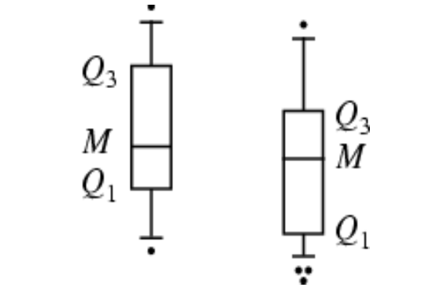
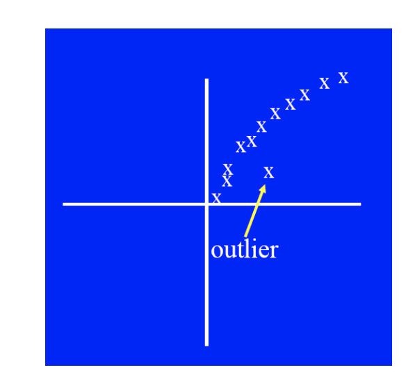
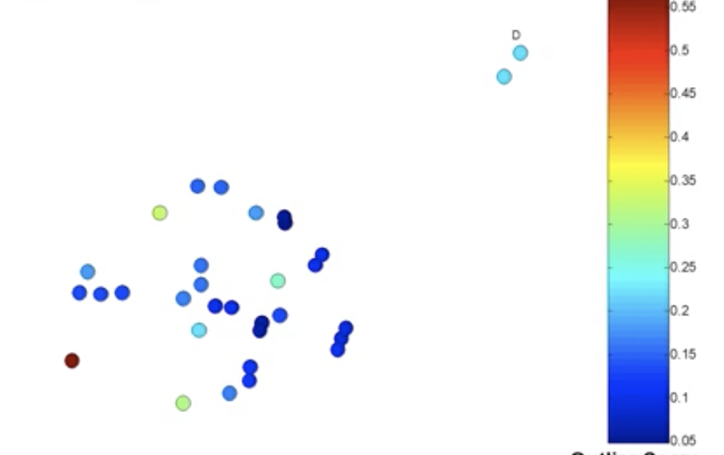
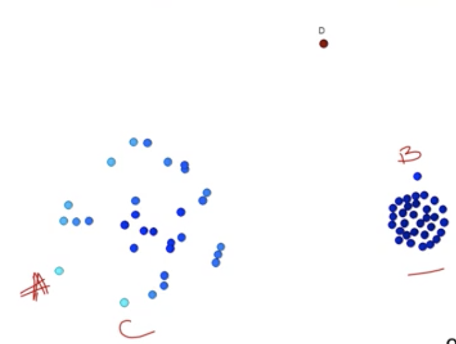
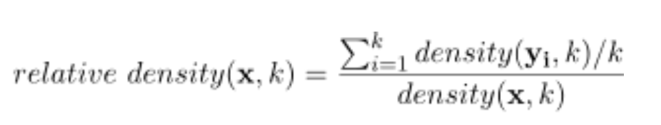
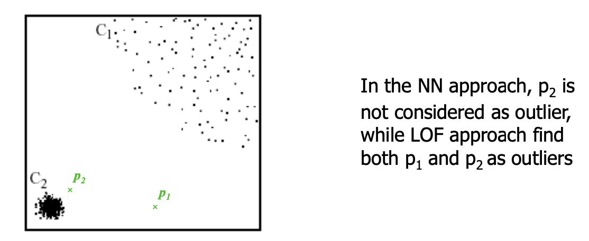
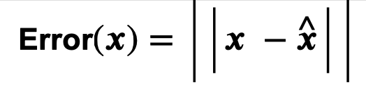

# Anomaly Detection

**Anomalies/outliers**

和剩下的数据差别巨大的数据。

- 一般来说，anomalies时非常rare的数据，出现频率很低。
- 可能非常重要，也可能很费事。

### **Cause of anomaly**

- 有很多来自不同类的数据
  - 例如主要分析橙子的weight，但是混合进了葡萄
- natural variation
  - 例如天生就很高的人的
- Data errors

### Noise VS Anomaly

Noise: Erroneous 噪音是一种错误，可能是无意产生的一些错误。

- 噪音不一定是不寻常的值或者物体。
- Noise is NOT interesting

Anomalies

- may be Interesting， 如果不是noise铲射高的话

二者很类似，但是有本质的区别。

### Issues about anomalies

**Number of attributes**

- 很多异常都是由单属性来定义的：例如身高/形状/颜色
- 如果通过所有属性来看，很难找到异常点
- 但是，单单看一个属性，很难找到异常所在

**Scoring**

- 大部分异常检测技术只会展示binary的结果（是/不是）
  - 如果对于分类问题，这是很ok的
- 有些方法为这些点assign a score
  - 度量了一个object异常的程度
  - 这样让objects能够被ranked
- 一般来说，我们只需要知道是或不是，但是score还是很有必要的。

## Types of anomaly Detection

- Model-based:也就是为nomal/anomaly的类建立模型

  - unsupervised
    - anomalies是没法很好fit in model的点, 造成模型不准确

  - Supervised 
    - anomalies被当作rare class
    - 必须得有training data

- Model-free(一般都是unsupervised)
  - Distance-based：一般是离群点，有些情况中，可以在图像上展现
  - Density-based：一般是低密度的点

## Approaches

### Visual

Boxplots or scatter plots

**Limitation**

- Not automatic
- subjective

### Statistical

**Probabilistic definition of an outlier:** An outlier is an object that has a **low probability** with respect to a **probability distribution model of the normal class.** 也就是在概率分布中的低概率事件

一般假设parametric model能够描述数据的分布（例如normal distribution）

应用一个statistical test一般需要

- 分布的参数（mean, variance）
- 期望的outliers数量（confidence limit）

issues

- 定义这样的一个dataset是heavy tialed distribution

#### Strengths & weaknesses

Pros

- Firm mathematical foundation
- can be **efficient**
- good results if distribution is known

Cons

- 很多时候，distribution是unknown的
- 对于高位数据，估算true distribution有时候是很难的
- anomalies可能distort参数

### Distance-Based

如果一个object最近的几个点，都在一定距离之外，那么这个object就是一个outlier

Score：distance to **kth nearest neighbor**

#### Strengths & weaknesses

Pros

- **Simple**

Cons

- **Expensive** O(n^2^)

- sensitive to **parameters**

  - 可以使用average distance to knearest neighbors来提高robustness

  - k的选择可能会影响到score的分数

    如图，D反而不是最高分了，因为k此时=2

    

- sensitive to variations in **density**

  - density可能会影响分数。密度大的，可能距离反而不大

    

- 高维空间中，distance会变得less meaningful

### Density-based

score：inverse of the density around the object 取倒数--密度越大，分数越低

- 可以用knn来定义/DBSCAN也可以达到--来定义k
  - inverse of **distance to kth neighbor** 第k个邻居的距离的倒数。--越临近，密度越高，distance越低，分数越高
  - inverse of **average distance to k neighbors** 和k个邻居的平均距离。平均距离越大，越稀疏，distance越大，分数越低

但是如果有不同的密度区域，这个方法可能会产生问题。

#### **relative density**

为了解决不同密度的问题

比较x到k最近neighbor和y到k最近neighbor之间的density

- 这里，density：inverse distance from x to kth nearest neighbor

那么对于这个函数x有：

- density>1: **Outlier** 
- density趋近1/<1： **normal**密度比neighbor大/相似

#### LOF approach

local outlier factor, 和relative density的方法相似。但是，density代表的是inverse of **average distance of x** from its **k nearest neighbors**. 这里，距离是平均距离了！

**Outliers:** largest LOF

#### Strengths & weakness

Pros

- **Simple**

Cons

- **Expensive**: O(n^2^)
- sensitive to **parameters**
- 高纬度空间中，Density becomes less meaningful

### Clustering-based

outlier： 如果明显不属于任何一个cluster，就是outlier

- prototype-based clusters: 如果和cluster不够近就是outlier
- density-based：密度太低就是outlier
- contiguity-based：没有很好相连就是outlier

其他会受影响的例如outliers对clusters的影响，clusters的数量也会影响到outlier

#### Detecting

- 也可以用来检测看起来非常不同的anomalies **clusters**
- anomalous clusters 要么太小，要么太远。

#### Strength & weakness

Pros

- Somple
- 很多clustering的方法都可以使用

Cons

- 选择什么clustring 方法很难
- 很难决定要多少个clusters
- outliers可能会影响到clusers

### Reconstruction-based

使用常规模型**重构x**的anomaly score时error

#### Reconstruction models

例如PCA（Principal Componet Analysis）主成分分析

用小的数据来重构模拟原来的数据

#### Autoencoders

- 是深度学习的一种用来降纬度的方法。
- 目的：降纬度，（k纬度），尽可能减少重构的错误

#### Strengths & weakness

Pros

- 不需要assumptions about normal class--和statistical相比
- 能够自行处理无关变量

Cons

- 会受到纬度的影响。因为重构本身就是高纬度的计算。