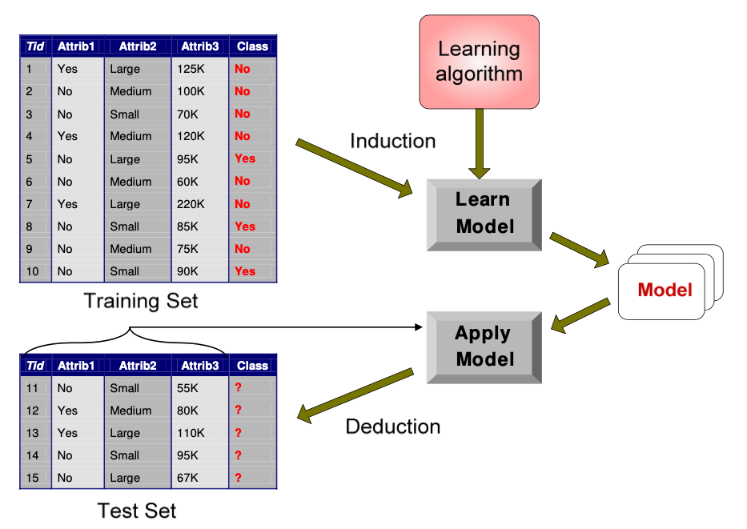

# Classification

## Basic

对于一个数据集有(training set): 每个数据都有tuple(x,y)来表示，x是变量集，y是分类标签。

**x**：attribute, predictor, independent variable, input

y:  class, response, dependent variable, output

### **Definition**:

分类模型就是将每个x映射进对应的提前预设好的分类y中 

### Techniques

现在常见的一些分类技术如下

- Base Classifier
  - Decision Tree based 
  - Rule-based
  - nearest-neighbor
  - neural networks
  - naive bayes and bayesian belief networks
  - Support bector machines
- ensemble classifier
  - boosting, bagging, random forests

### Evaluation

对于模型表现如何，需要有特定的评价方式来分析模型的**performance**

#### Confusion Matrix

分类模型常见的的一种评价方式就是 **confusion matrix**

- f 11: true positive
- f 10: false negative
- f 01: false positive
- f 00: true negative

**Accuracy**准确率：正确预测/所有预测

**Error rate**错误率:  错误预测/所有预测
$$
Accuracy=\frac{f_{11}+f_{00}}{f_{11}+f_{00}+f_{01}+f_{10}}\\
ErroRate=\frac{f_{10}+f_{01}}{f_{11}+f_{00}+f_{01}+f_{10}}\\
Accuracy=1-ErroRate
$$

#### Purpose

使用正确的评价模型，可以评价模型的泛化能力(Generalization Performance)。

一个模型好不好，重点在于看其对位置数据的预测能力。

> Generalization performance: performance on unseen instances(never seen during training) 

