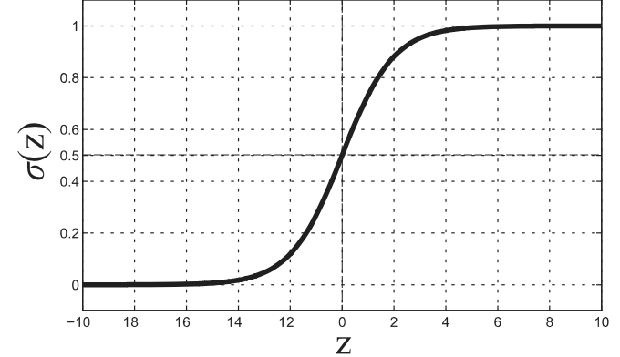
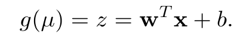
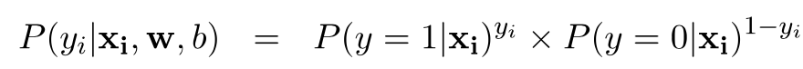
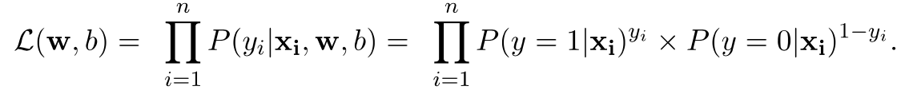
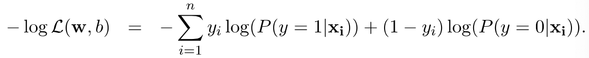

# Logistic Regression

**Generative VS Discriminative**

概率分类模型有两种：

1. Generative models

- Estimate 条件概率： P(X|Y)
- 例子：**朴素贝叶斯，贝叶斯网络**
- 能够获得**generating X given Y**的过程

2. Discriminative models

- 直接得出P(Y|X),不需要估算P(X|Y)
- 例子：**Logistic Regression**

## Definition

### 推导

**Odds(时间发生比)**=$\frac{P(y=1|x)}{P(y=0|x)}$

因为P(y=1|x)+P(y=0|x)=1

所以，如果odds<1，说明下面的很大---class=0

​			如果odds>1，说明是class=1

因为值范围在0到∞之间，那么可以转换成线性回归问题：预测连续变量Odds(范围0到∞)

**Logistic Regression Model**

​                                       $\frac{P(y=1|x)}{P(y=0|x)}=e^z=e^{w^Tx+b}$

> 最简单的模型可以是y=wx+b，
>
> 更加准确的，可以转换成y=w^T^x+b, 对于每个变量x都有对应的weight，然而这个问题在于，值域在-∞，∞之间，因此可以转换成：e^z^
>
> e^z^ 范围在0到∞间，于是重点就在于z的取值

公式推导：

因为有 $P(y=1|x)+P(y=0|x)=1$, 

所以有：$\frac{P(y=1|x)}{(1-P(y=1|x))}=e^z$

换算有：Sigmoid Function - $P(y=1|x)=\frac{1}{1+e^{-z}}$

其中 $z=w^Tx+b$ ，被叫做linear predictor

当z>0: +

当z<0: -

### link function

Logistic belongs to a larger family of generalized linear models

g: link function

逻辑回归中的link function也叫logit function

### 计算

- Maximize the likelihood of observing training records

- Likelihood of a single record(xi, yi):

  

  于是有：当yi=1，p=1; yi=0,p=0

- Likelihood of entire training data: 对于所有

  

  对于整个data就有

- Negative log of likelihood(**Cross-entropy Function**)

  

### Characteristics

**Pros**

P(Y|X) 可以直接通过计算得出

可以处理interacting variables，

只要能够防止过拟合，可以处理irrelevant and redundant attributes

**Robust**：高维变量，因为不需要计算密度或者距离

**Cons**

无法处理missing value

只能学习线性边界

