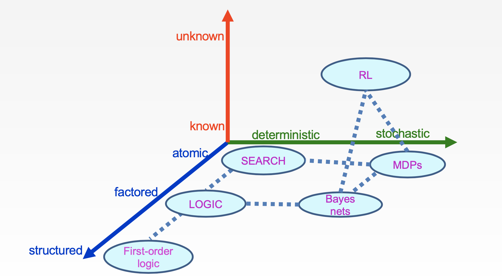

# Overview

### Material

textbook  http://aima.cs.berkeley.edu/

Material https://aimacode.github.io/aima-javascript/ 

### Grade

5% Participation 

30% Homework assignment: written problems

30% Projects assignment: 5* pac-man project/ mini-project

35% Exam: open book, 10%midterm(2/24)+25%fianl(5/6)

### Topics

- Search: heuristic search, A*, adversarial search, and game playing.
- Probability and learning: reasoning under uncertainty, reinforcement learning, temporal modeling.
- Logic and knowledge: propositional, first-order, reasoning, planning, knowledge representation.
- Machine learning: supervised, unsupervised, reinforcement, and deep learning.
- AI Applications: self-driving cars, computer vision, natural language processing, and more.

以下：

从原子-因果逻辑导致-结构化的

环境因素确定-环境因素随机

环境已知-未知

