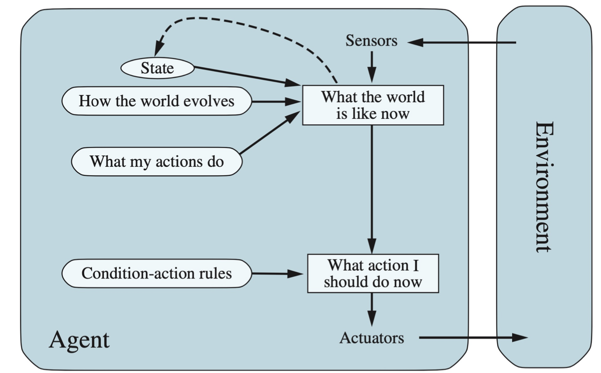
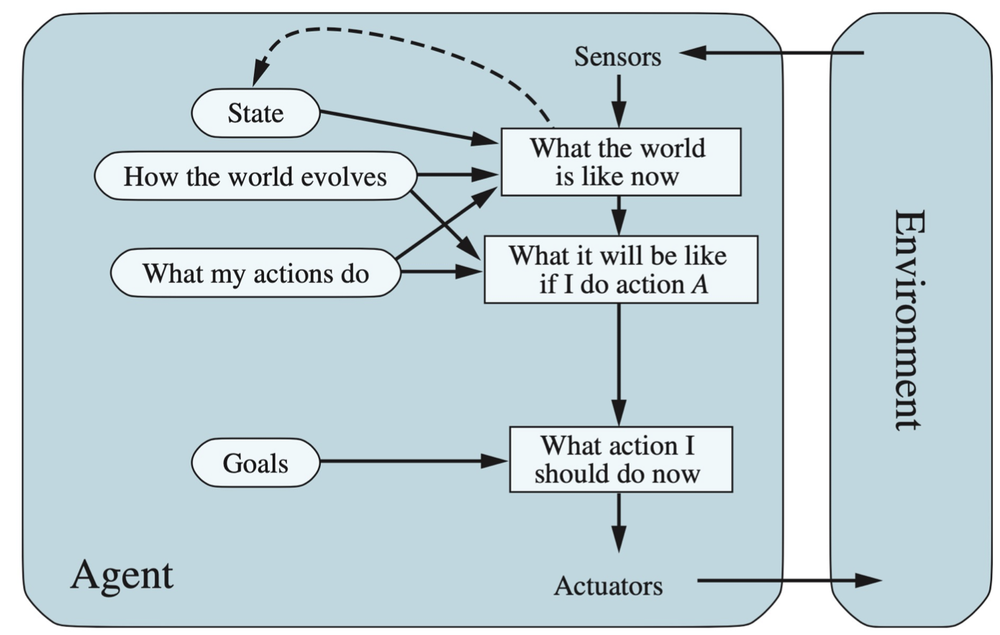
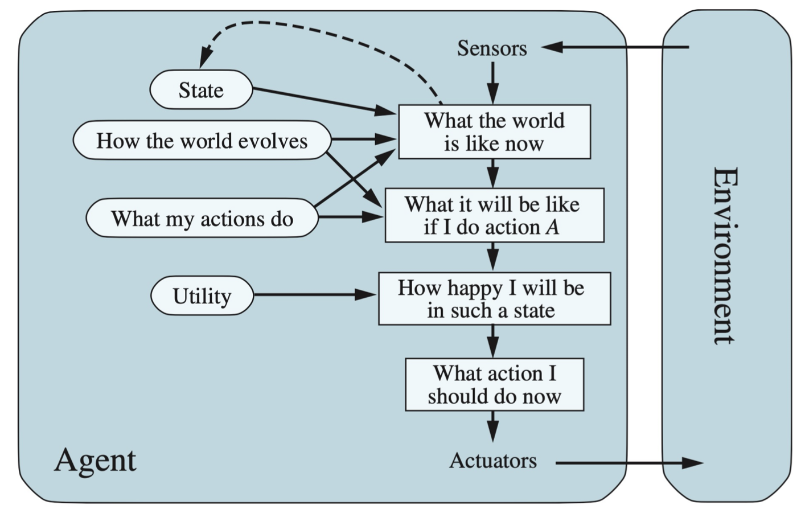
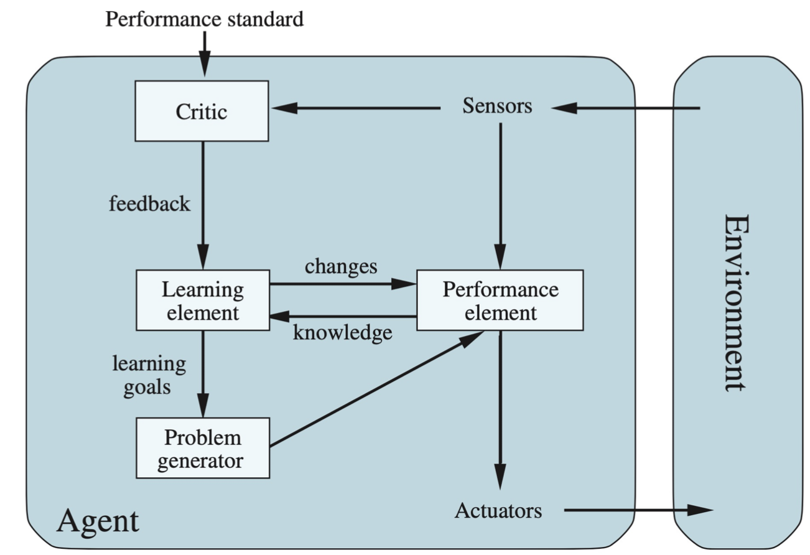

# Into & agent

> AI System=code(model/algorithm)+data

### **Definition**

AI focus on **study and construction of agents** that **do the right thing**

AI is concerned mainly with **rational action.**

A **rational agent**- to achieve the best outcome or the best expected outcome

### **Agent**

#### Definition:

computer program expected to be intelligent

简而言之，一个用来和环境进行交互的代理。它感知环境，处理数据，作出反应。

- Agent function 
  - Input: percept sequence
  - output: agent's actual response to any sequence of percepts
- **agent programs**: a concrete implementation of agent function

#### **Rational agent**: 

 **maximally** achieving **pre-defined goals**

- **Rational** ： maximizing your expected utility 就是将利用率，表现最大化，

  - based on initial knowledge

  - learn from what it perceives

- **Utility** function: an internalization of the **performance measure** 内置的performance的度量
- 广泛应用于各个**environment**，并且是autonomous

#### **Design**

如何设计agent，基本上是与环境类型有关的

对于环境，如果有                agent需要

partially observable ---- requires **memory**

Stochastic  ----- have to prepare for **contingencies**

Multi-agent ----- need to behave **randomly**

Static ----- has time to compute a rational decision

continuous time ----- continuously operating **controller**

unknown physics ----- need for **exploration**

unknown perf. Measure ----- observe with **human principal**

#### **Types**

- simple reflex agent 
  - direct input-ouput (know the whole world)
  - 
- Model-based agent
  - **Store internal state information** and keep track of the state of the world
  - 
- Goal-based agent
  - want to achieve its goals (与上者唯一的区别就是，它是根据要达到什么目标来作出反应)
  - 
- Utility-based agent
  - want to i**mprove utility** function
  - 
- learning agent
  - adapt to previous experience and data
  - 
