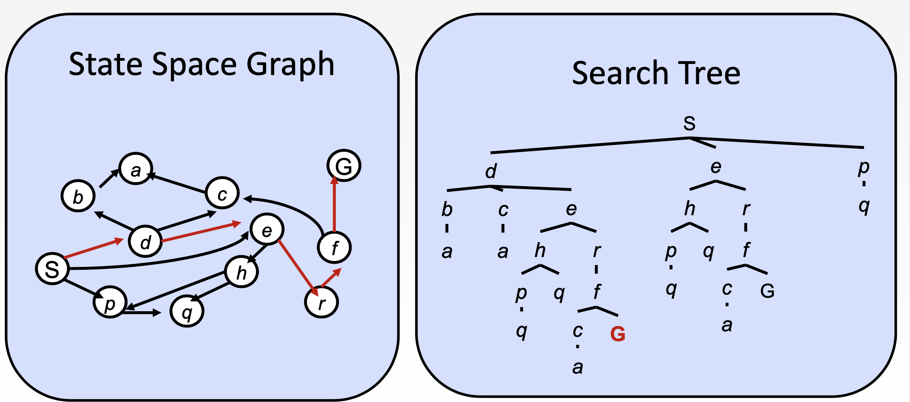

# Search

参考链接 

https://www.redblobgames.com/pathfinding/a-star/introduction.html A*算法介绍

https://aimacode.github.io/aima-javascript/3-Solving-Problems-By-Searching/ 每个搜索算法图示详解

https://www.redblobgames.com/pathfinding/a-star/implementation.html implementation

## Definition

### Task Environment 

面临的各种问题

-  Observability (Full or partially or unobservable) 
-   Single-agent or multi-agent
-   Deterministic or nondeterministic or stochastic
-   Episodic or sequential
-   Static or dynamic or semi-dynamic
-   Discrete or continuous
-   Known or unknown

### **Problem-soving agent**

定位问题-找到目标，形成解决方案

- agents that plan ahead

- **Atomic** presentation
  - states of the world are considered as whole
  - No internal structure visible to the problem-solving algorithms

### Search problem and solutions

要素

- A **state space** (a set **S**)
- Initial state (Start state *s*) 初始状态
- Goal state(*s*) 目标状态
- Actions(*s*): (a set **A**) 前后左右
- Transition model: RESULT(s, a) 转换状态
- Action cost function: Action-Cost(s, a, s’) 花费

solution：sequence of actions (**path**) from the initial state to a goal state

optimal solution：**lowest path cost** among solutions

### State Space Graph 

- 是此类问题的一种数学化的展示
  - –  Nodes are world configurations (abstracted)
  - –  Arcs represent successors (action results)
  - –  The goal test is a set of goal nodes (maybe only one)
- **In a search graph, each state occurs only once.**

### Search Tree

- 每个节点都是state space中的一个状态
- start state是root
- 每条边代表着一个action
- Each node encodes an entire path and correspond to plans to achieve that state



### Search Algorithms

- Input: Search problem
- Output: solution or an indication of failure
- Superimpose a **searchtree** over the **statespace graph**

### Algorithms's performance

- **Completeness**:Guaranteed to find a solution if one exists or correctly report failure 是否能保证找到方案

- **Cost optimality**:Find the lowest path cost solution 收否能找到最佳方案

- Time complexity:Number of operations to find the solution

  – b, maximum branching factor of search tree

  – d, depth of the shallowest goal node

  – m, maximum length of any path in the state space (potentially ∞)

- Space complexity:Among of memory needed to find the solution

## Uninformed search

agent 无法知道到达goal需要花费多少，可以理解为，blind search

uninformed的算法虽然可以获得最佳，但是可能会速度非常慢

### BFS

一般使用**queue**来实现


```python
# 改进，记录来的路径
frontier = Queue()
frontier.put(start )
came_from = dict()
came_from[start] = None

while not frontier.empty():
   current = frontier.get()
   if current == goal: # 终止条件，如果找到了节点，就停止。
     break 
   for next in graph.neighbors(current):
      if next not in came_from:
         frontier.put(next)
         came_from[next] = current # 记录了前一个节点

# 重构路径
current = goal 
path = []
while current != start: 
   path.append(current)
   current = came_from[current]
path.append(start) # optional
path.reverse() # optional
```


#### Bi-direct	BFS

BFS的升级，只是从两个端点开始，2*b^(d/2)


### DFS

一般使用**stack**来实现


#### DFS limited

DFS with a depth limit L(一般是根据经验来定义L) 一般这个L下，能够找到最好的路径


#### DFS iterative

Depth-limited search with depth L=1,L=2……

这个算法一般是用来寻找dfs的depth limit的


### UCS(Dijkstra) 基于成本的

使用**priority queue**


```python
# Dijkstra
frontier = PriorityQueue() # 使用优先队列, 目的是为了寻找成本最小的那一条路
frontier.put(start, 0)
came_from = dict() # 记录了访问过的节点，形式 节点，前置节点
cost_so_far = dict() # 记录到这个节点所花销的最短的路径的成本值
came_from[start] = None # 初始化
cost_so_far[start] = 0

while not frontier.empty():
   current = frontier.get()

   if current == goal:
      break
   
   for next in graph.neighbors(current):
      new_cost = cost_so_far[current] + graph.cost(current, next) # 记录邻居路径成本值
      if next not in cost_so_far or new_cost < cost_so_far[next]: #如果接下来的这个节点，没有被访问过/所花费的成本更小
         cost_so_far[next] = new_cost # 更新当前成本值
         priority = new_cost 
         frontier.put(next, priority)
         came_from[next] = current

```


### Summary


## Search-informed

- Uses domain-specific knowledge (**hints)**
- Can find solutions **more efficiently**
- **Heuristic**: Lead the search algorithm faster towards a goal state.
  - Implemented via **Heuristic** function: h(n)

### **Heuristics function**

estimated cost of the **cheapest** path from the state at node n to goal state

用来估算当前状态到目标点的花销。

可以将这个应用到算法中

例如使用：欧几里得距离，曼哈顿距离，直线距离等

如果只能上下左右，可以使用曼哈顿距离。

如果可以任意方向移动，可以使用欧几里得距离。

### **Greedy best-first search**

- Strategy: expand a **node with the lowest h(n)value** 每次都使用最短距离

- 很像 UCS+priority queue(difference:use estimated forward cost, not computed backward cost) 区别在于，这个方法计算的是每次到达终点的距离，ucs计算的是当前从出发到该点的距离。

- **Not optimal!**
- Could not find the best solution. 
- 如果选择的距离方程较差，甚至有可能找不到solution

```python
# Heuristic function
def heuristic(a, b):
   # Manhattan distance on a square grid
   return abs(a.x - b.x) + abs(a.y - b.y)

frontier = PriorityQueue()
frontier.put(start, 0)
came_from = dict()
came_from[start] = None

while not frontier.empty():
   current = frontier.get()

   if current == goal:
      break
   
   for next in graph.neighbors(current):
      if next not in came_from:
         priority = heuristic(goal, next) #通过heuristic 方程来计算成本
         frontier.put(next, priority)
         came_from[next] = current
```


### A *

Dijkstra 算法虽然能够找到花销最小的路径，但是花了太多的时间在一些与终点不顺的方向上的节点上。

Greedy虽然方向正确了，但是可能找不到最短路径。

因此将这两个特性结合！

**cost optimal!**

- **UCS+Greedy**
  - UCS计算的是来程的成本
  - Greedy计算的是到终点的花销
  - 结合综合考虑总的成本，从而来进行。

- **f(n)=g(n)+h(n)**:lowest estimated cost of the path from n to G
  - g(n):path cost from the initial state to node n(直线距离)
  - h(n): path cost from state to goal
  - 结合该点到终点和
- Uses **priority queue**
- completeness：Yes
- cost optimal: 取决于 **properties** **of the heuristic ** 只有保证这些特性，这个算法才是cost-optimal的
  - **properties** **of the heuristic**： heuristic costs <=actual costs
    - **Admissibility**（可接纳的）: admissible (optimistic) heuristic never overestimates the cost**. 0<= h(𝑛)<=h*(𝑛)**  （启发函数估算成本要<=实际路径到达goal的成本）
    - **Consistency**（一致性）**: h(𝑛) <= h(𝑛′) + cost(n, a, n’)** （启发函数每条边的的估算成本<=每条边的实际成本）
    - **Consistent heuristic is admissible**


​	！！如果不可接纳（即估算后成本比实际还高，可能并不会cost -optima）

```python
# Heuristic function
def heuristic(a, b):
   # Manhattan distance on a square grid
   return abs(a.x - b.x) + abs(a.y - b.y)

frontier = PriorityQueue()
frontier.put(start, 0)
came_from = dict()
cost_so_far = dict()
came_from[start] = None
cost_so_far[start] = 0

while not frontier.empty():
   current = frontier.get()

   if current == goal:
      break
   
   for next in graph.neighbors(current):
      new_cost = cost_so_far[current] + graph.cost(current, next)
      if next not in cost_so_far or new_cost < cost_so_far[next]:
         cost_so_far[next] = new_cost
         priority = new_cost + heuristic(goal, next)
         frontier.put(next, priority)
         came_from[next] = current
```


### Weighted A* (suboptimal search)

- **f(n)=g(n)+W*****h(n)(W>1) **加了权重

  - a slightly costlier, but could search faster 成本可能会略高，但是能够搜索得更快

  - optimal path would not be found 

  - Cost of weighted A* search:between C* and WxC*

| **A\* search**     | **g(n) + h(n)** | **W=1** |
| ------------------ | --------------- | ------- |
| UCS search         | g(n)            | W=0     |
| Greedy search      | h(n)            |         |
| Weighted A* search | g(n) + W x h(n) | W>1     |

### Memory-bounded Search

- Beam search:limits the size of the frontier
- Iterative-deepening A* search(IDA*)
- Bidirectional A*
- recursive best-first search
- simplified memory-bounded A*


## Summary

#### Which to use

Which algorithm should you use for finding paths on a game map?

- If you want to find paths **from or to *all* all locations**, use **BFS** or **Dijkstra**. 
  - Use **BFS** if movement costs **are all the same**; 
  - use Dijkstra if movement costs **vary**.
- If you want to find paths **to *one* location**, or the **closest of several goals**, use **Greedy Best First Search** or **A****. Prefer **A****in most cases. When you’re tempted to use Greedy Best First Search, consider using A* with an [“inadmissible” heuristic](https://en.wikipedia.org/wiki/Admissible_heuristic).

#### Optimal path

**BFS** and **Dijkstra** are **guaranteed to find the shortest path** given the input graph. 

**Greedy Best First Search is not**. 

A* is **guaranteed to find the shortest path** if the **heuristic is never larger than the true distance.** As the heuristic becomes smaller, A* turns into Dijkstra’s Algorithm. As the heuristic becomes larger, A* turns into Greedy Best First Search.

#### Performance

Greedy Best First Search **typically** runs faster than Dijkstra’s Algorithm but doesn’t produce optimal paths. **A* is a good choice for most pathfinding needs.**