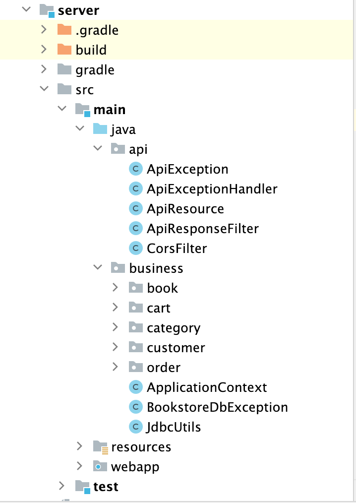
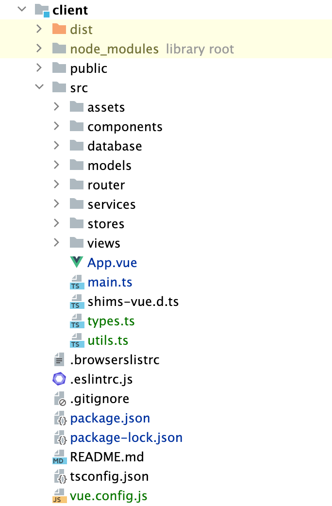
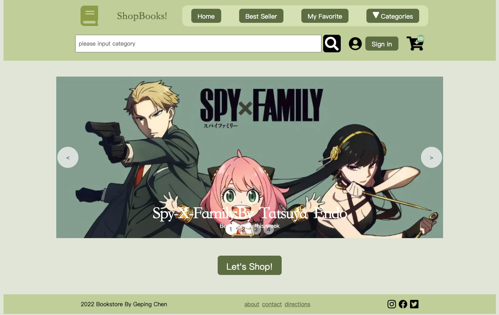
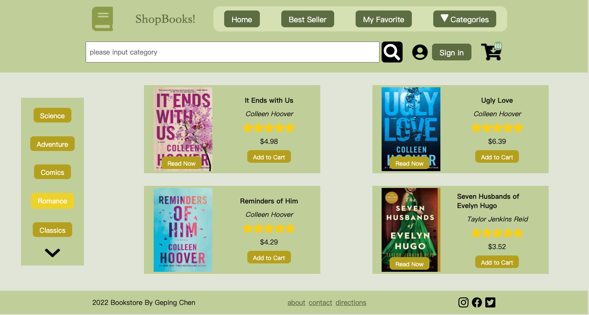
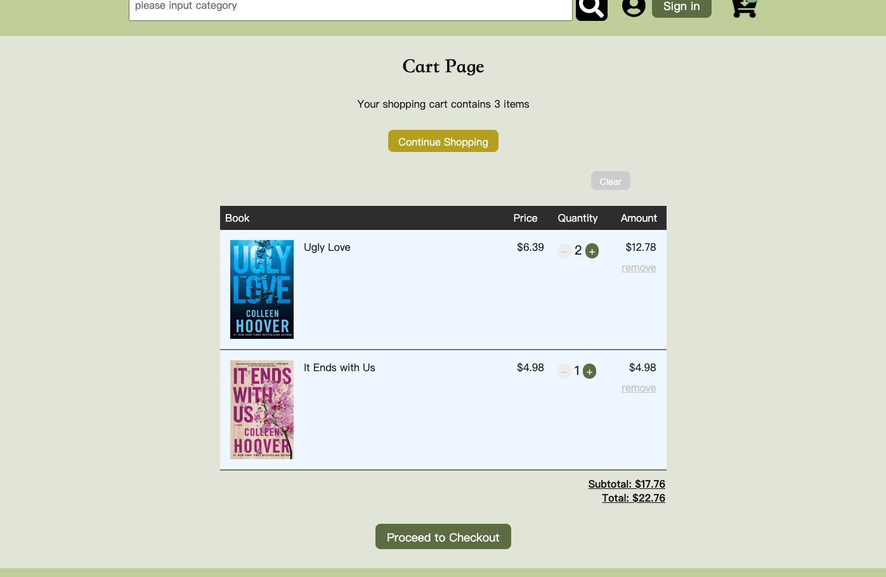
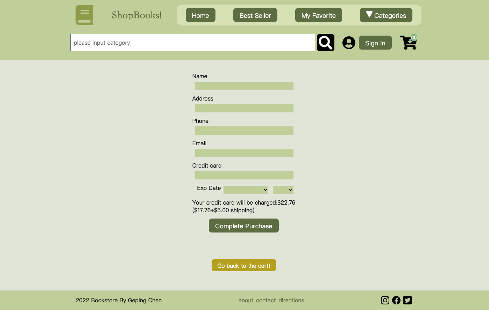
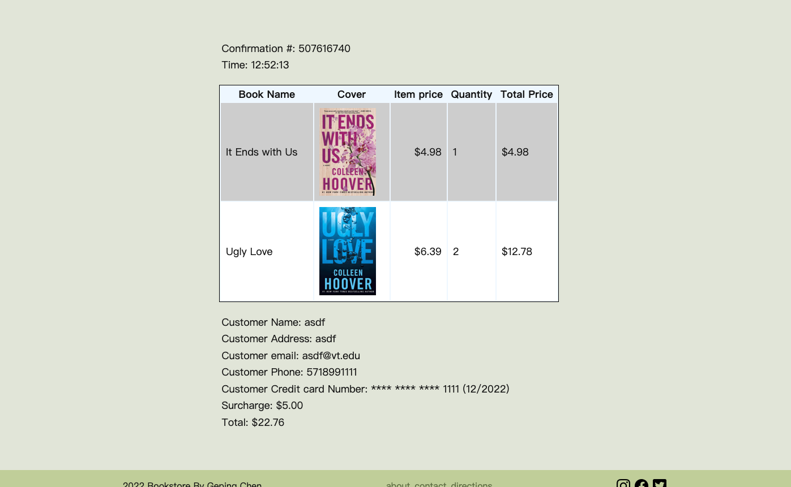
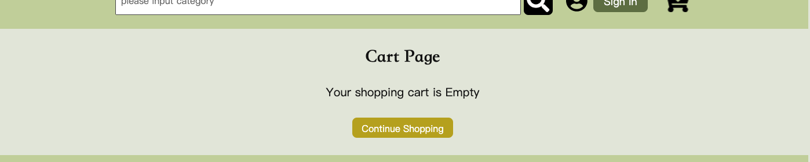

# BookStore

**Vue.js+Typescript+Java**

This is a bookstore demo of class CS5244 Web Application. 

Demo can be viewed [here](http://cs5244.cs.vt.edu:8080/GepingBookstoreTransact/)

## Structure

- server: Backend 

  - Api: api& cors filter file
  - Business: codes about data model and database connection 

  

- client: front end

  - **Assets** - css/js resources
  - **Components** - self defined components 
  - **router**: path configuration
  - **Services**: ApiService, configure the path of the api from backend
  - **Store**: data accessing code. Accessing data from backend using store for better managing.
  - **Views**: pages that we access.
  - **App.vue**: main view of vue
  - **main.ts**: app configuration, start app
  - **vue.config.js**:  Path configuration of the whole frontend project.

  

## Technologies

| Technologies | Description         |
| ------------ | ------------------- |
| Vue.js       | Frontend tools      |
| Element UI   | Frontend framework  |
| JDBC         | database connection |
| MySQL        | Database            |
| Java         | Backend Language    |
| Pinia        | VUE store tools     |
| Typescript   | frontend            |
| Figma        | Design tool         |

## Demo

Homepage

Category page

Shopping cart

Checkout Page

Confirmation Page

Empty cart

