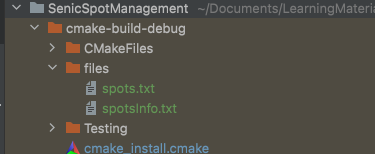

# C++ 小笔记

基本上操作都和Java相同，记录一下不同

## 基本类型

Java: **Boolean** Cpp: **bool**

Java: **String** CPP: **string**

 

## 使用string

- 使用string的时候需要 ： `#include<string>`
- 长度获取：`length(), size()`都可以
- 不需要像Java转成charArray来使用数组，对于`string s = "Hello"`, 直接通过`s[0] ` 可以获得char 字符 `H`

- Java使用eqauls来比较，c++使用compare方程。如果返回0就是相同。

没有自带的split

```c++
string str = "hhh ttt ggg jjj";
//方法一: strtok
char* s = new char[str.size() + 1];
strcpy(s, str.c_str());
char* p = strtok(s, " ");
vector<string> words;
while(p) {
	words.push_back(p);
	p = strtok(NULL, " ");
}
//方法二: istringstream
istringstream ss(str);
vector<string> words;
string word;
while(ss >> word) {
	words.push_back(word);
}
//输出
for(string x : words) {
	cout << x << endl;
}

```


## 使用Array

- array size: 使用sizeof来操作获得size
  - `sizeof()`返回type的大小
  - 返回数组大小的方法
    - `sizeof(array)/sizeof(array[0])`
    - `sizeof(array)/sizeof(array type)`


## Structure

和c相同，可以理解为小class

定义struct的方式如下。最后跟的为struct的name。

```c++
struct {             // Structure declaration
  int myNum;         // Member (int variable)
  string myString;   // Member (string variable)
} myStructure1, myStructure2;       // Structure variable
```

也可以当成定义类型来使用

**named structure**

```c++
struct myDataType { // This structure is named "myDataType"
  int myNum;
  string myString;
};

myDataType myVar;
```


## &

### Reference 

生成一个指向一个对象的reference。

`&meal = food` 标记 - 指向food的一个新的reference。meal 和food是同一个对象。meal是food的别名。

可以理解为**指向的是同一个对象**。但是可以使用另一个名称来命名它。

### 取地址符 & 

使用一个variable的流程

- 创建一个variable：分配一个memory address
- assign value：将这个值存储在这个memory地址里。
- 此时，就可以使用这个分配好的variable

根据上面的流程。如果要获得对应的地址，就需要取地址符 **&**

通过 **&**可以获得对应的varaiable的地址。

### Example

meal 和 food 是同一个对象。

通过 `&meal = food` 创建指向food的一个新的reference。

通过 `&meal, &food` 获取meal 和food的地址。

```c++
#include <iostream>
#include <string>
using namespace std;

int main() {
  string food = "Pizza";
  string &meal = food;

  cout << food << "\n";
  cout << meal << "\n";
  cout << &meal<<"\n";
  cout << &food << "\n";
  return 0;
}
```

output


## *

### pointer

**==使用在声明的时候，代表的是一个指针==**

- 是个variable
- 存储的值是memory address

`string* ptr = &food` : 

- 声明一个string 类型的指针
- name是str
- 值是food在内存中的地址

### Dereference

**==如果不使用在声明，代表的是dereference操作==**

- `*ptr` 代表的是 ptr存储的地址所指向的对象的value

- 指针内容可以更改。如果更改, 指向的是同一个对象，但是value 变了。

### example

```c++
#include <iostream>
#include <string>
using namespace std;

int main() {
  string food = "Pizza";  // A string variable
  string* ptr = &food;  // A pointer variable that stores the address of food

  // Output the value of food
  cout << food << "\n";
  // Output the memory address of food
  cout << &food << "\n";
  // Output the memory address of food with the pointer
  cout << ptr << "\n";
  // Output address of the pointer ptr
  cout << &ptr << "\n";
  // Output the value of the object that stores in this address
  cout << *ptr << "\n";
  
  // Change the value of the pointer
  *ptr = "Hamburger";
  // Output the new value of the pointer (Hamburger)
  cout << *ptr << "\n";
  // Output the new value of the food variable (Hamburger)
  cout << food << "\n";
  
  return 0;
}
```

output


## function

### 执行顺序

Cpp 的 function是顺序执行的！！！

main使用的function必须**定义在main**之前。

为了代码规范 -- 可以先对所有方法进行一个定义，然后在后续进行使用。**declaration above main， definition below mian**

**h 文件就是这么使用的！**

```c++
// Function declaration
void myFunction();

// The main method
int main() {
  myFunction();  // call the function
  return 0;
}

// Function definition
void myFunction() {
  cout << "I just got executed!";
}
```

### default value

可以通过在funciton的parameter部分使用=来设定默认值。 这个parameter是optional的，可有可无。

```c++
void myFunction(string country = "Norway") {
  cout << country << "\n";
}
```

### pass reference

 如果传的是值 -- 只是改变了内部的value

如果传递reference -- 需要更改function 外部的值的时候

**example**

如下，能够对外部的x，y值进行一个修改交换。

如果传递的是 int x, int y; nothing happened

```c++
void swapNums(int &x, int &y) {
  int z = x;
  x = y;
  y = z;
}
```


## class

和Java很像，区别如下

- 不用new ，直接声明

- c++可以定义两种function

  - in-class function 和Java使用方法相同

  - out-class function： 当这么使用的时候，需要使用namespace来声明，例如

    - ```c++
      class MyClass {        // The class
        public:              // Access specifier
          void myMethod();   // Method/function declaration
      };
      
      // Method/function definition outside the class
      void MyClass::myMethod() {
        cout << "Hello World!";
      }
      
      int main() {
        MyClass myObj;     // Create an object of MyClass
        myObj.myMethod();  // Call the method
        return 0;
      }
      ```

- inheritance: 注意通过: 来进行class的继承。

  - ```c++
    // Base class
    class Vehicle {
      public:
        string brand = "Ford";
        void honk() {
          cout << "Tuut, tuut! \n" ;
        }
    };
    
    // Derived class
    class Car: public Vehicle {
      public:
        string model = "Mustang";
    };
    ```

- c++支持多继承

  - ```c++
    // Derived class
    class MyChildClass: public MyClass, public MyOtherClass {
    };
    ```


## Files

文件需要放置在executable文件夹下面

in CLION



需要的library 

```c++
#include <iostream>
#include <fstream>
```

使用的class

- ofstream - output to file
- ifstream - read file
- fstream - create, write, read

### example

#### write

```c++
#include <iostream>
#include <fstream>
using namespace std;

int main() {
  // Create and open a text file
  ofstream MyFile("filename.txt");

  // Write to the file
  MyFile << "Files can be tricky, but it is fun enough!";

  // Close the file
  MyFile.close();
}
```

#### read

```c++
// Create a text string, which is used to output the text file
string myText;

// Read from the text file
ifstream MyReadFile("filename.txt");

// Use a while loop together with the getline() function to read the file line by line
while (getline (MyReadFile, myText)) {
  // Output the text from the file
  cout << myText;
}

// Close the file
MyReadFile.close();
```

## Math

所有自带的math函数都需要include

```c++
#include <cmath>
```


## 对象的创建

https://zhuanlan.zhihu.com/p/62106872

c++有两种对象的创建方式

```c++
A a;  // a存在栈上
A* a = new a();  // a存在堆中
```


## iterator

当需要声明iterator的时候，可以使用**auto**


## [Map](https://www.cnblogs.com/fnlingnzb-learner/p/5833051.HTML)

`#include<map>`

**查找元素**

- 判断是否存在 -- 用count就可以
- 查找位置 -- 使用find和end，返回的是迭代器

```cpp
if (m.find("f") == m.end()) {
  // not found
} else {
  // found
}
```


# Template

使用template出错--定义在h文件，方法在cpp文件，就会产生如下错误。

https://www.codeproject.com/Articles/48575/How-to-define-a-template-class-in-a-h-file-and-imp

https://www.cnblogs.com/jingmoxukong/p/3827011.html

https://leetcode.com/problems/design-linked-list/solutions/1341264/c-code-with-explanation-fastest-cleanest-without-memory-leak/?orderBy=most_votes

# STL

## Stack


## Queue


## Linked List

https://arminli.com/cpp-linked/

## Map

红黑树版本

https://www.geeksforgeeks.org/build-a-custom-map-using-header-file-in-c/


# Problem

## 互相引用问题

https://www.zhihu.com/question/379789314

这是编译顺序的问题。可以使用指针来解决。

## 


## 函数编程

传参数 - 指针/地址/对象

这里注意传递对象的方式！

