# Basics: Architecture - Networking layers

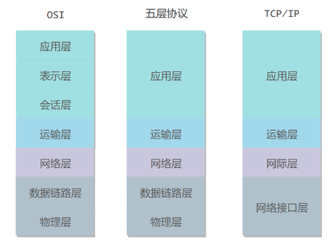

## 5 layers

OSI和TCP/IP的结合

- Application layer:responsible for providing **==services==** to the user. 
  - 为特定**应用程序**提供数据传输服务。例如HTTP, DNS。
- Transport layer: responsible for the delivery of a **==message==** into **segments** from one ==process== to another. 
  - 为**进程**提供通用数据传输服务。例如TCP(可靠)，UDP(及时)。关注的是信息的传递。封装成**segments**.
- Network layer:responsible for the delivery of individual ==**packets**== from the ==source host to the destination host==. 
  - 为**主机**提供数据传输服务。例如 IP。封装成**packets**.
- Data link layer: responsible for moving **==frames==** from one ==hop (node)== to the next. 
  - 主机之间可以有很多链路，链路层协议就是**为同一链路的主机提供数据传输服务**。封装成 **frame**

- Physical layer: responsible for movements of **==individual bits==** from one ==hop (node)== to the next. 
  - 作用是尽可能屏蔽传输媒体和通信手段的差异，使数据链路层感觉不到这些差异。关注的是**bit**

## OSI model

**Open Systems Interconnection** - 7 layers

- Presentation layer: responsible for **translation, compression, and encryption**. 
  - 关注的是**数据压缩，加密，描述**。保证了数据在主机之间的格式问题。
- Session layer:responsible for ==**dialog control**== and **==synchronization==**. 
  - 建立会话，同步的问题。

### Terms

- Between applications:
  - Application layer -- 提供什么服务(HTTP, DNS, SMTP etc.)
  - Presentation layer -- 是否要加密，压缩
  - session layer -- 是否要建立会话，是否需要同步

- Between Process:

  - Transport layer: 进程之间信息的传递- 需要可靠的还是及时的(TCP/UDP) - into **segments**

  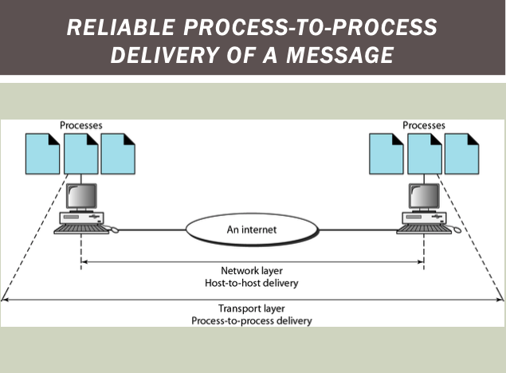

- host to host:

  - Network layer: 应该传递到哪个主机 （IP）- into **packets**

  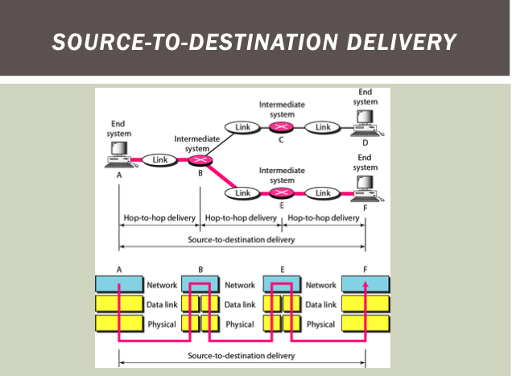

- Hop-to-Hop: 

  - Data link layer: 两个主机之间有不同的链路，怎么传输 - into **frames**
  - Physical layer - **bits**

  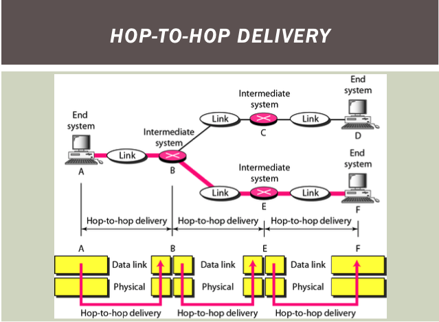

  ### Whole process

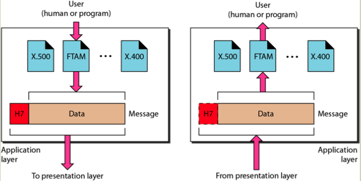

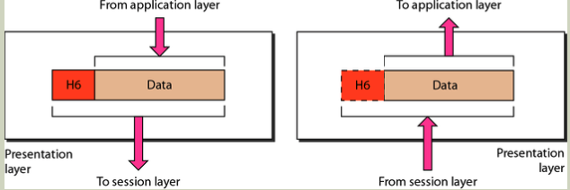

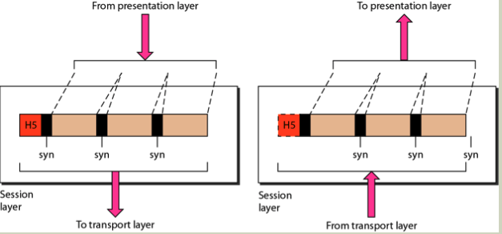

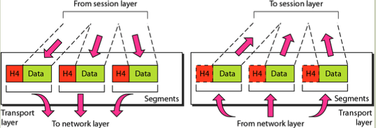

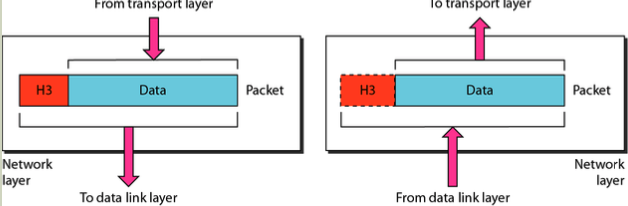

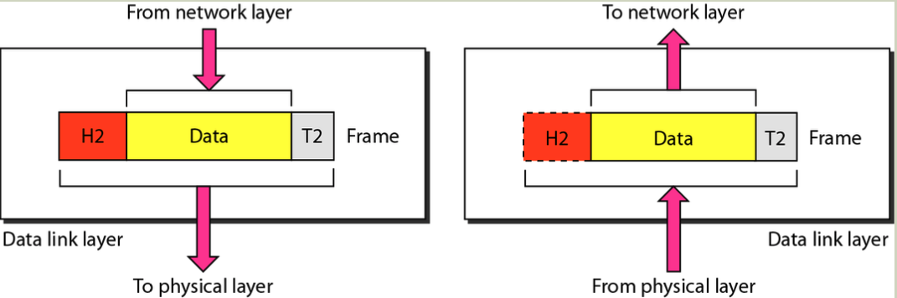

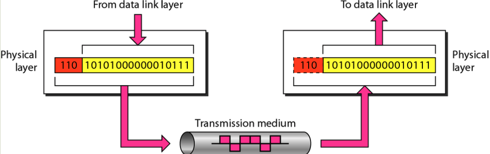

**Router**

only has: physical layer, data link layer, network layer -- 不需要为进程和应用程序提供服务。

## TCP/IP

差异如下，最底两层可以看作网络接口

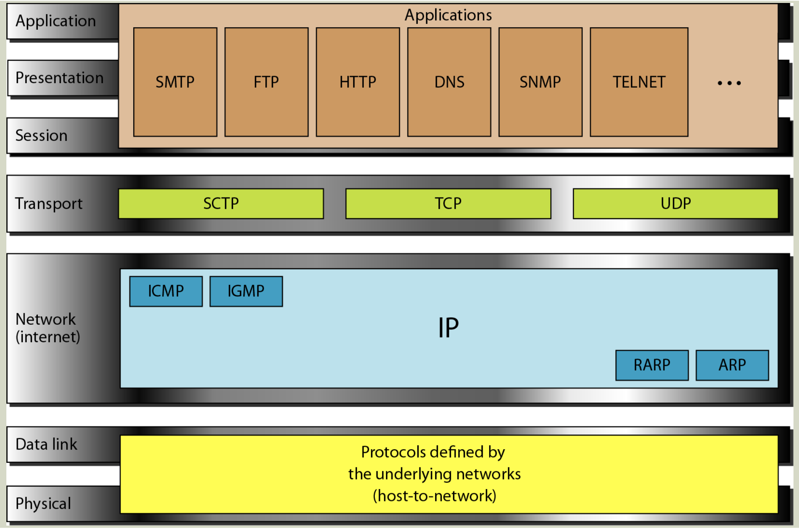