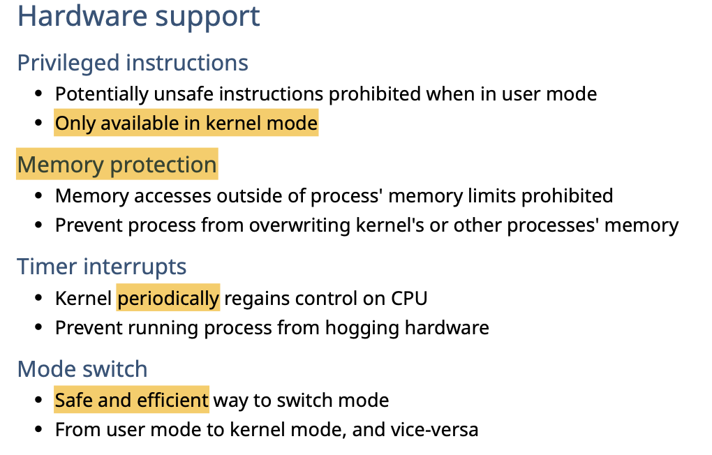
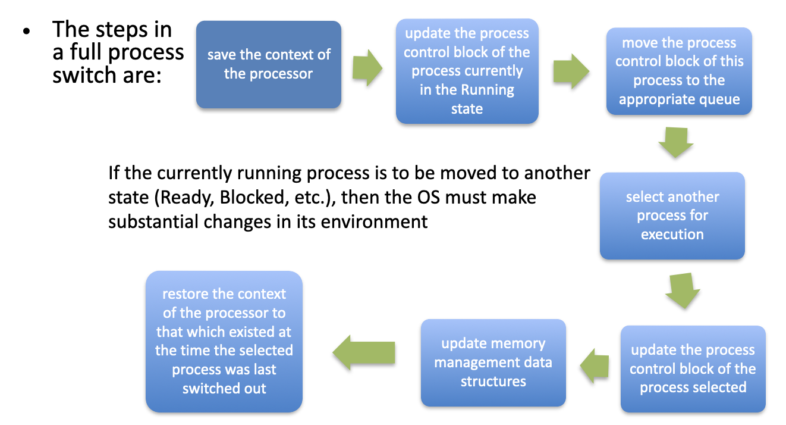
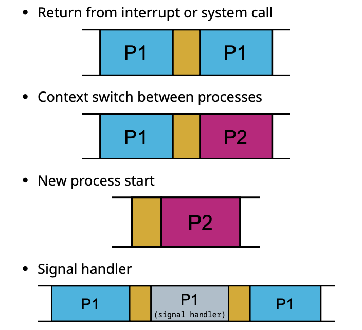
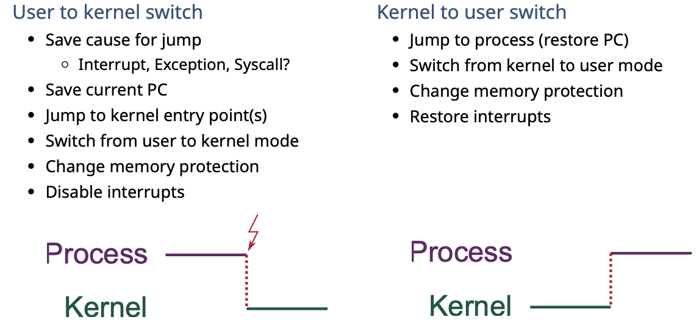
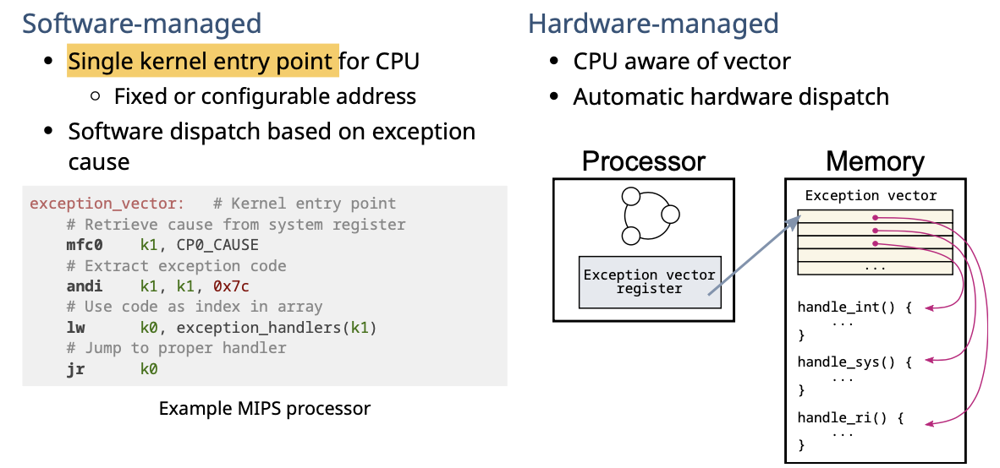
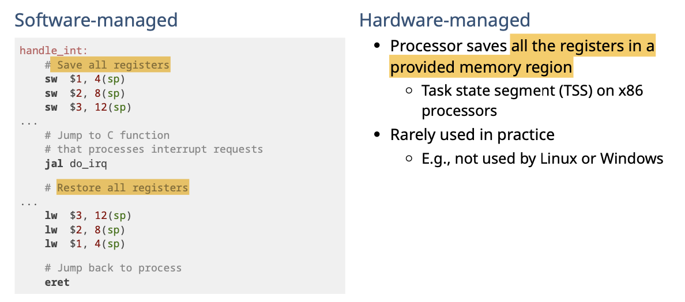
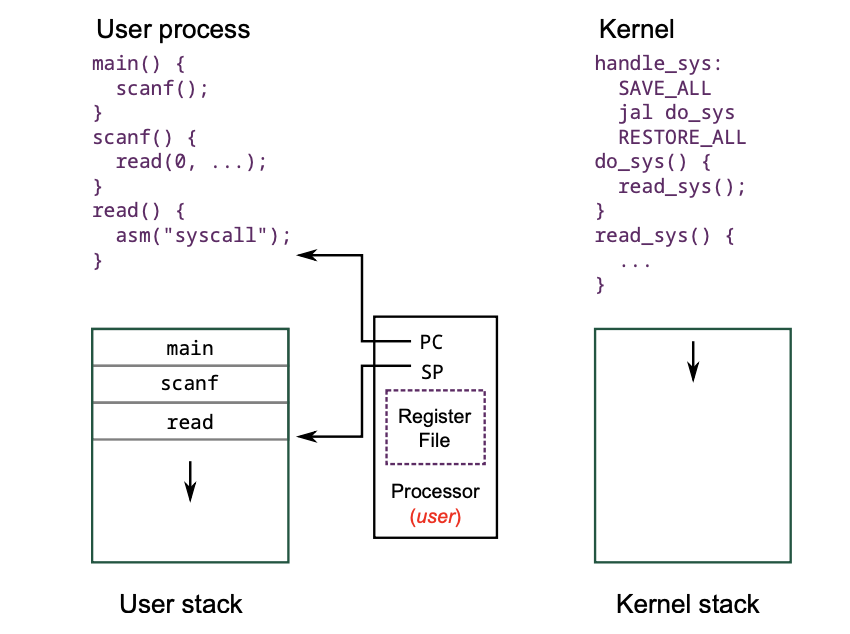
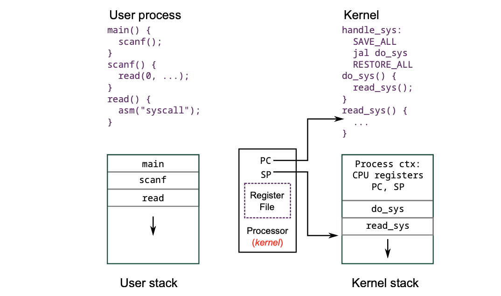

# Kernel

## Why 

- Native execution - 用户所有操作都直接对计算机的资源进行操作
  - 速度快
  - 但是不安全
- limited privilege execution - 用户所有操作都要判断是否有权限
  - 安全
  - 但是速度非常慢 - 尤其是 JS/python这种解释性语言，需要逐句解释的，需要每一步都进行判断。

**Summary **

综上，需要Kernel的出现。把OS划分成两种模式：User/Kernel

- User mode - 对hardware的操作权限是有限的
- Kernel mode - 拥有所有权限，可以随意对OS内部的东西进行更改（root）

Pros

## Boost sequence

From kernel to user

- Upon powering on the computer 开始启动时 - 设置权限只有kernel所属，address -> boot code
  - Privilege mode set to kernel mode
  - PC set to address of boot code (e.g., BIOS) Boot code runs
- Loads kernel 开始加载kernel。load image to memory
  - image into memory 
  - Jumps to kernel's entry point
- Kernel code runs 开始执行kernel - 并设置用户，开始加载user mode
  - Machine setup (devices, virtual memory, interrupt vector table, etc.) 
  - Chooses the first *user* process to run, loads it, and jumps to it
    - Privilege bit set to user mode 
    - PC set to process' entry point
- First process runs  开始执行user-mode
  - Need a way for kernel to re-take control...

## Mode switching

在执行的时候，难免需要切换执行模式，切换过程如下

### User mode to kernel mode

**Reason**

- Exception 导致 - 例如**同步**事件/program 导致
- Interrupts导致 - I/O需要调用hardware，必须切换/polling/异步导致
- System calls 导致 - 例如同步事件，

### Kernel mode to user mode

**Reason**

- interrupt/system call resume 原先被阻塞 - 现在又可执行，需要切换回原process来执行
- 切换context - 同上
- 开启新进程 - 同上
- Signal - 异步信息

### Requirements

在切换上下文的时候，需要保证状态没有被改变，因此必须得有记录状态的要求

#### Atomic transfer of control

切换时，所有当前状态必须是atomic的。不能被中途打断再来进行记录。

#### Exception vector

进入kernel的entry point必须得是有限的，只有有限个数的进程可以访问kernel。

#### Transparent, restartable execution

需要保存/加载所有之前状态。process是不能知道自己被interrupt的

### Kernel stack

根据上面的requirements，我们也必须能够保存kernel的状态，因此需要有自己的stack。

- 它和process的stack不相同，有自己的memory空间

- used to save context - 记录当前的状态的

- One kernel stack per process - 每切换一次进程就记录自己当前的状态。

