# Concurrency and Tread

# Concurrency

并发：多个任务在不同时间段交给同一个processor处理

Concurrency is the composition of independently executing tasks

Opposite to *sequential execution*

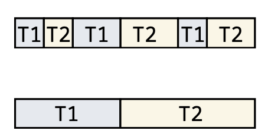

**vs parallelism**： 并行。多个任务分别在不同的cpu上运行，并且同时进行。提高速度。

很明显，速度提高。但是cpu， 贵！因此，并发还是最好的提高速度方案。

### Why

并发能有效提高效率 - 如下，IO和CPUburst可以overlapped，时间减少了

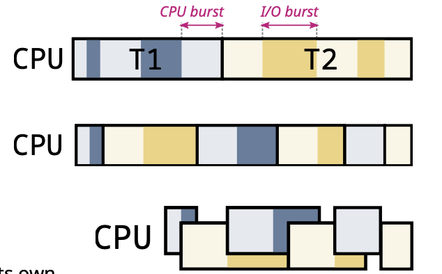

但是进程之间的并发有极大的limitations

- heavy job for fork a process 复制一个进程工作太多--需要复制特别多的状态
- slow context switch 进程切换很慢 - 需要切换上下文
- Difficult to communicate between processes 通信不方便 - 因为要求syscalls

 **Idea**

- 消除重复的部分 (address space, most of the environment)
- place concurrent computations within the same address space - 在同一个地址实行并发


# Tread

can be seen as light weight process

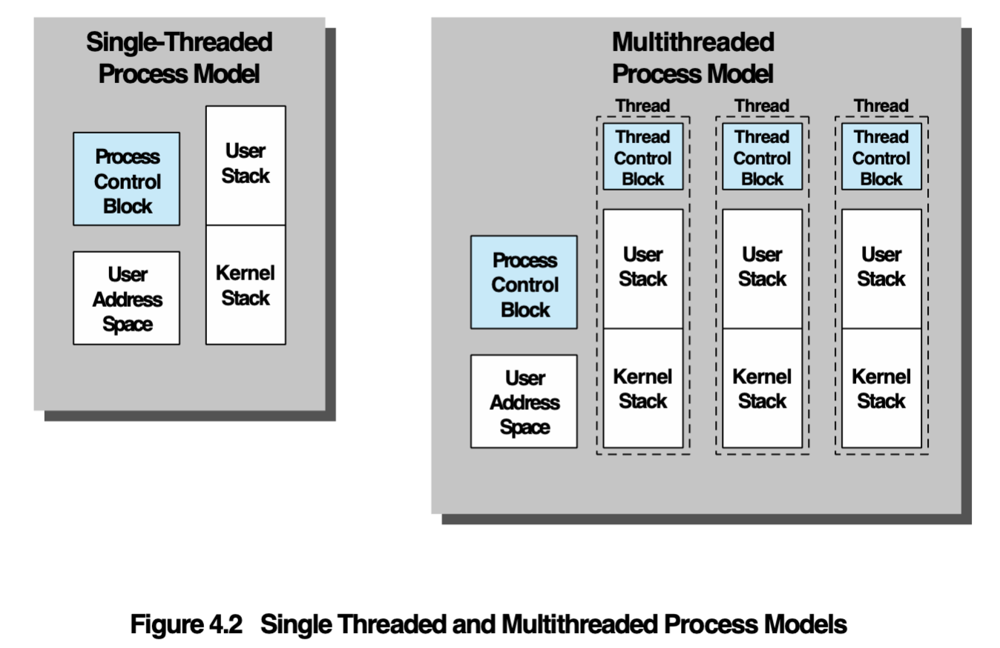

## Characteristic

线程独有的

- User stack：线程拥有自己的stack，用来存放局部的变量等。

- Register：寄存器，记录了线程运行的位置

- PC: program counter, 程序计数器， 记录了下面指令的位置

- 以及一些线程当前的状态：Tread Control Block

  - 记录了线程的meta data：包括 - stack pointer，PC，thread state，register value，pointer to PCB, etc。

  - 也就是，记录了线程本身stack记录存储位置，PC记录自己程序的下一个执行地址，thread state为当前线程状态，register value保存了当前的程序运行位置，记录了自己的进程的运行位置等。

线程之间共享的- 也就是进程里拥有的

- 进程的状态 PCB
- Address space：所有线程共享进程的地址。  **shared global memory**
- Heap： 这也就是说，进程的data是可以被共享的（particularly global）


如下，Java的jvm很好体现了二者的区别

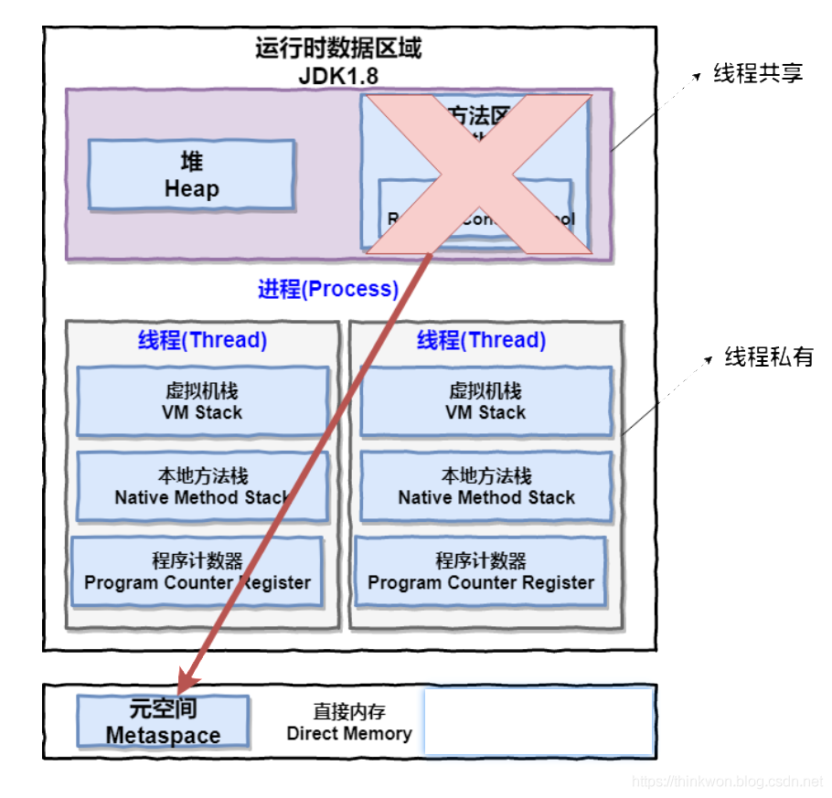

## Difference

注意 - 线程的生命和process息息相关。进程如果suspend/terminated，它的线程状态一致

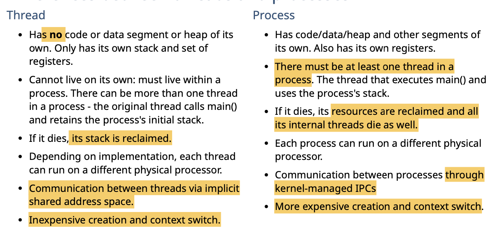

## Benefits

- less time to create a new thread than a process
- Less time to terminate a thread than a process
- Switching between two threads takes less time than switching between processes
- Threads enhance efficiency in communication

ETC

## User-level VS Kernel Level

### User-level

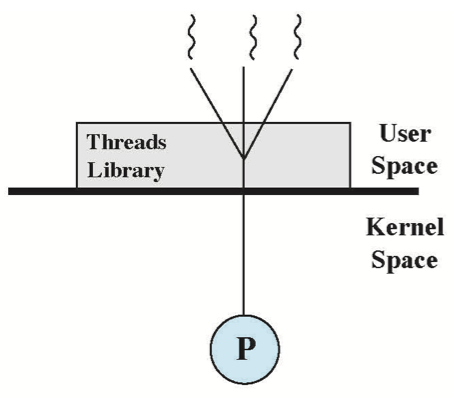

- User -level是OS不知道的 - OS只知道schedule processes，不知道线程是如何操作的
- 程序员用特定的**thread library**来操作线程
- 线程的交换**不需要context的切换**

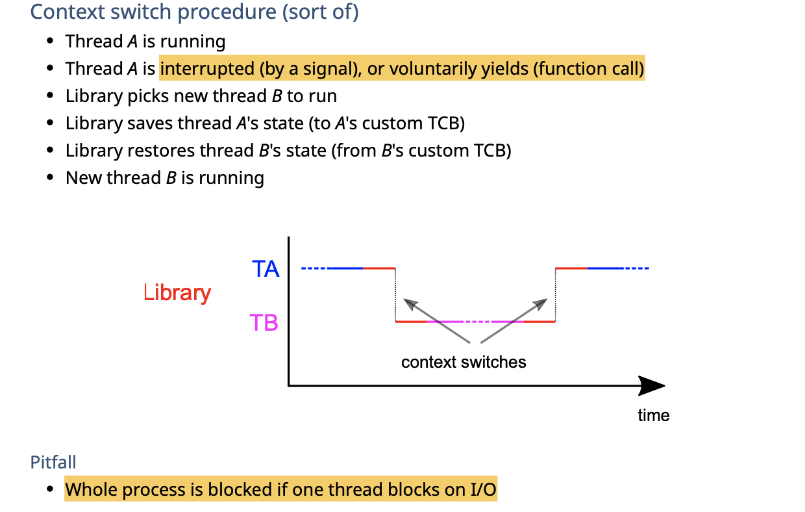

### Kernel level

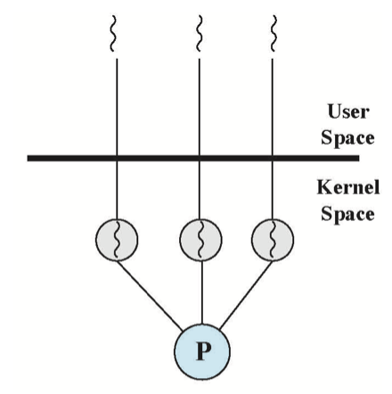

- Kernel-level是OS知道的threads ->每个程序至少有一个kernel-leve(main())
- All multi thread operations **are managed by OS**
- 线程的交换 - **context switch is light and needed**
  - 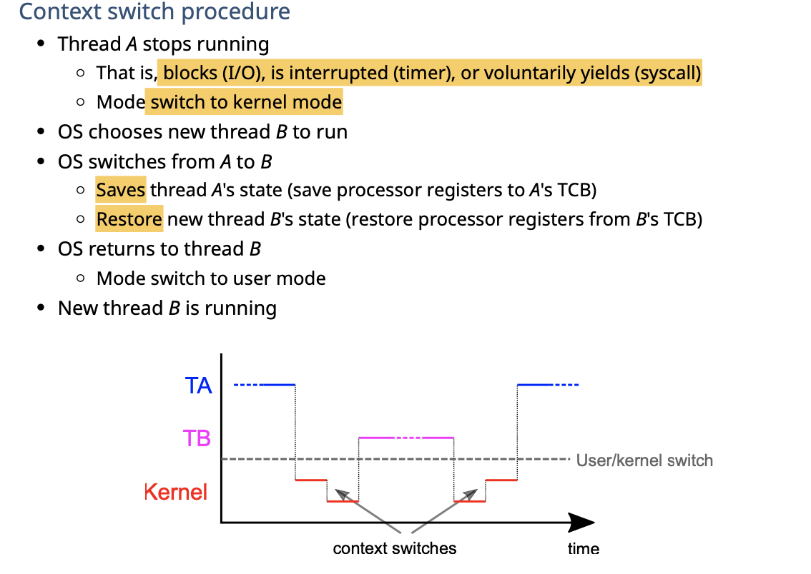

### Summry

**User-level**

- 优点
  - fast！create & switch - > 因为不需要上下文切换，所以很快
    - example - java thread
  - scheduler can be customized - 可以自己定义什么时候切换
- 缺点
  - Blocked when sysetm call -- 只要有一个thread - system call -> block all: 因为system call需要切换context，需要保存当前的状态进入kernel，就要block所有。

**Kernel Level**

- 优点
  - blocking system calls suspend the calling thread only 如果blocking 系统调用，基本上只会暂时suspend IO模块。不影响其他线程的使用
  - 可以multi-processor 跑
  - **Signals** 可以穿到特定thread (Signal是进程通信方式)
  - Linux ！
- 缺点
  - heavy，not flexible

### Combined

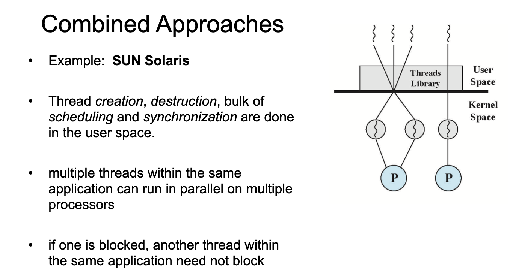

### Examples

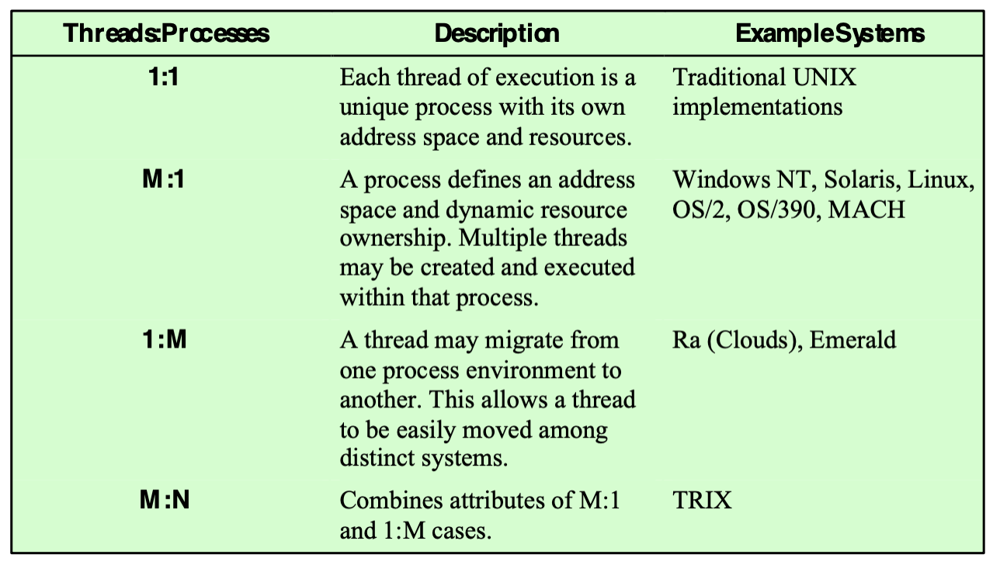

### Libraries

常见库

POSIX theads `#include<pthread.h>` used in linux system

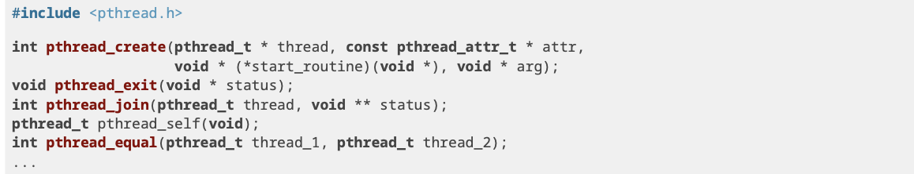


# Synchronization

## Reason

多线程速度快，但是可能会引起各种问题。例如：

- 因为资源是共享的，可能会导致不同线程更改同一个数据导致数据的不一致
- 线程的执行顺序是没法保持一致的，可能会导指令重排 
  - 例如根据global值来决定code顺序的问题
- Race condition： when the output of a concurrent program depends on the order of operations between threads.

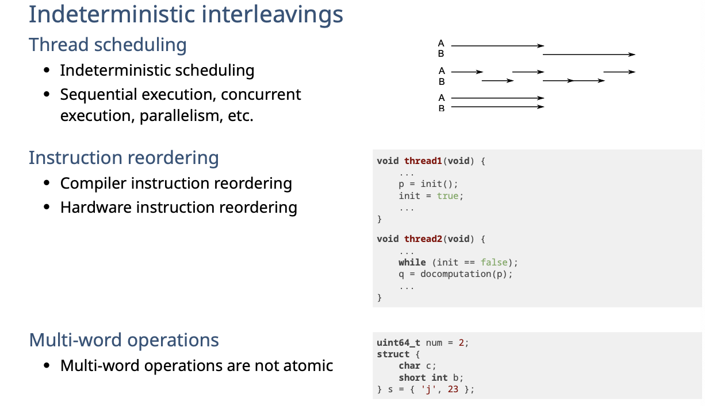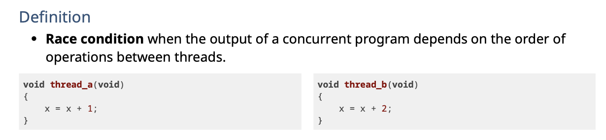

## Terms

- Atomic Operation
  - Indivisible – guarantees isolation from concurrent processes

- Critical Section
  - Accessing shared resources where other processes should not interfere

- Deadlock
  - Processes cannot proceed due to waiting on one another

- Livelock
  - Processes continually change states in response to other processes, preventing any useful work

- Mutual Exclusion
  - Requirement that when one process is accessing a critical section, no other process may do so

- Race Condition
  - Multiple processes reading/writing a shared data item where the final condition depends on the order of execution

- Starvation
  - A runnable process is overlooked indefinitely


## LOCK

**Critical Section: **共享的资源，一次只允许一个进程进入 - 也就是要保证**mutual exclusion**

### Definition

- A lock is a ***synchronization*** variable that provides ***mutual exclusion***
- Two states: ***locked*** and ***free*** (initial state is generally *free*)

### API

- `lock()` or `acquire()`
  -  Wait until lock is free, then **grab it**
- `unlock()` or `release()`
  - Unlock, and allow one of the threads waiting in *acquire* to proceed

**example**

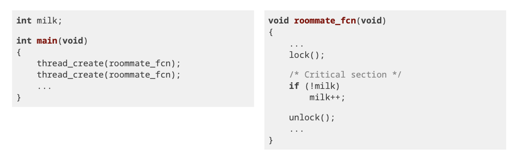

### Uniprocessor lock

Reason： race condition 的来源为**indeterministic scheduling**。

- 导致这个问题的原因是 - 打断了instruction的原子性。
- 被**抢占**了。

Solution：**取消interrupts** - 不能被打断，只能一口气执行完。

**example**

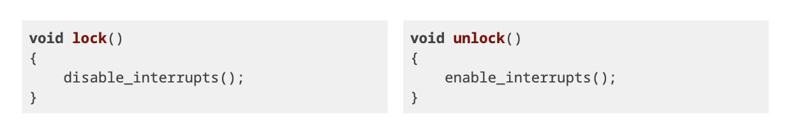

优点：简单

缺点：只对uniprocessor有用，并且unpreemptable code是很危险的，不能应用

### Multiprocessor spinlocks

如图。锁自旋。

也就是所有的read/modify/write都在这一个cpu实施

- *Test-and-set* hardware primitive to provide mutual exclusion 
  - a.k.a *Read-modify-write* operation
- Typically relies on a multi-cycle bus operation that **atomically** reads and updates a memory location
  - Multiprocessor support

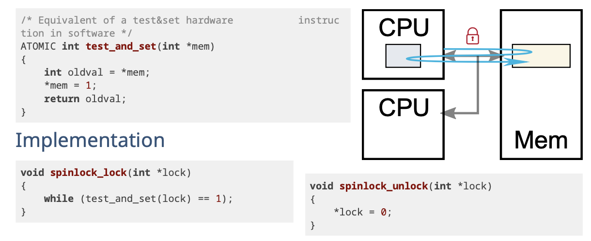

如图。

默认lock = 0。当需要对memory中的一个东西进行更改的时候，调用spinlock，并设置lock为1。此时只有第一个thread访问的时候会获得0，并进入后面的程序，其他人访问获得的都是1，没法访问。直到第一个线程执行完毕，把lock设置回0，释放锁，后面的线程才能继续进入。

#### Issue

- Busy-waiting - 只是为了后面的线程能及时获得锁并进行而不停获取锁，浪费cpu

#### Solution

- Yield/sleep: 当没法获得锁的时候，让行/直接sleep
  - 给cpu让行，如果当前无法执行，就让给不需要的其他线程来执行
  - Cons：
    - Yielding会浪费cpu时间 - 切换问题
    - sleeping会严重影响即时性。
- Block waiting threads until they can proceed
  - 直接block知道可以使用

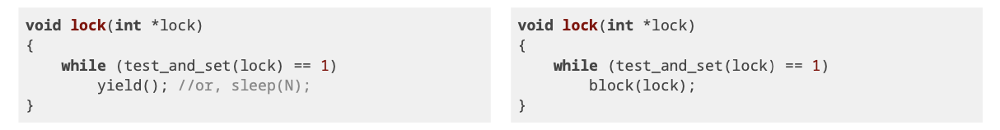

#### Example

Semaphone/Mutexes

## Semaphore

**generalized lock**

只有三个操作 ： init， up， down

- Used for different types of synchronization (including mutual exclusion) 
- Keeps track an arbitrary resource count
  - Queue of threads waiting to access resource

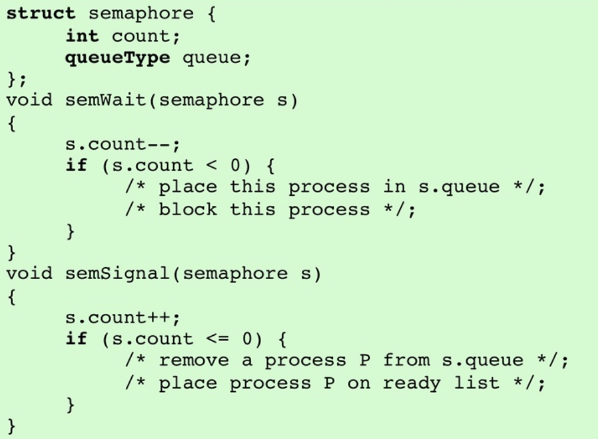

### Functions

- Initial count value *(but not a maximum value)* 

  ```c
  sem = sem_create(count);
  ```

- `down()` or `P()`
  - Decrement by one, or **block if already 0**

- `up()` or `V()`
  - Increment by one, and **wake up one of the waiting threads if any**

如果semaphore的信号量 = 0 就blocked；如果semaphre！=0，就wake up并且可以执行。

### Binary semaphore

- 初始值一般是1。count值是**binary**的，不是0，就是1.

- 可以当作lock来用 - **但是thread不会busy waiting - 而是会被block**

- 保证了mutually exclusive aceess to shared resource
- 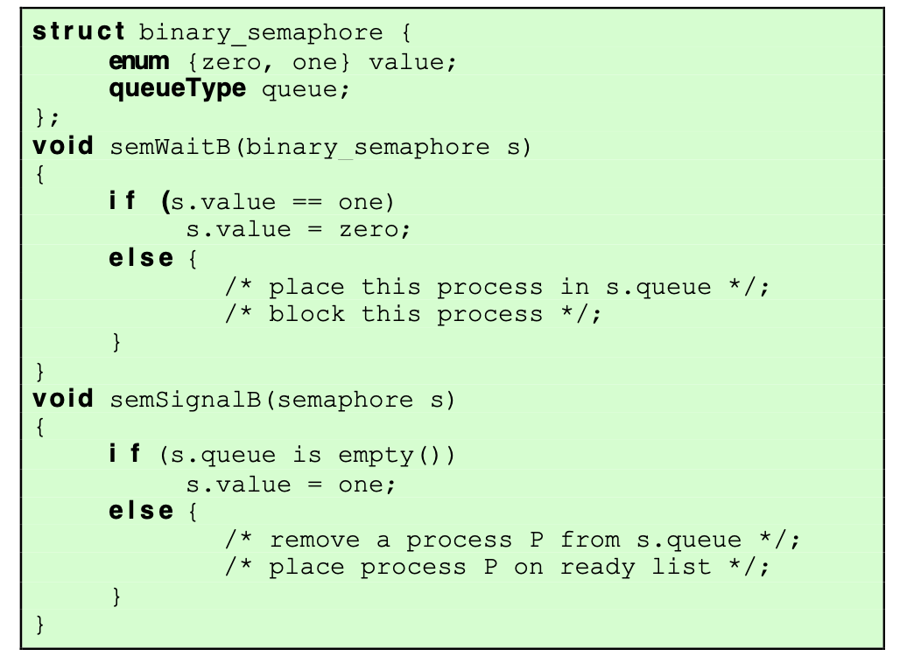

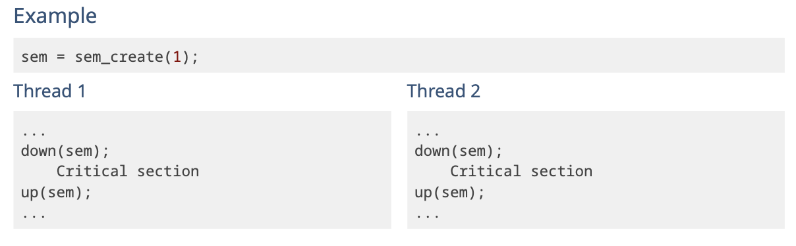

### Counted Semaphore

- 初始值为**count**，可以为任意的positive number（**一般是resource的数量**），可以自动设置可以有几个thread来访问。
  - 代表这个reosurce**有count个units是可以avalable能够让访问的。**
- thread能够一直执行，只要资源够
- 可以用来**Synchronization**

如下 - thread1工作是下载网络packet并保存到sem_packet中。thread2工作是消耗资源。

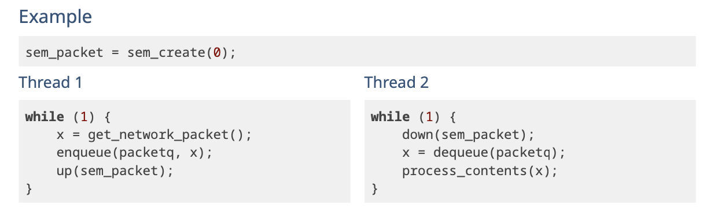

==binary semaphore 保证了对共享资源的访问一定是有保护的 -- mutual excluded== 

==counted semaphore保证了各个线程之间的同步==

## Concurrency Issue

### Producer - consumer problem

多个线程生产/消耗相同的data 空间

Two or more threads communicate through a circular data buffer: some threads ***produce*** data that others ***consume***.

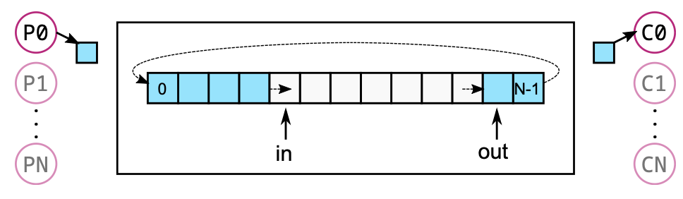

**Description**

- Bounded buffer of **size N** 
- Producers write data to buffer
  - Write at **in** and moves rightwards
  - Don't write more than the amount of available space 
- Consumers read data from buffer
  - Read at **out** and moves rightwards
  - Don't consume if there is no data
- Allow for multiple producers and consumers

#### Solution 1: no protection

如果没有对shared data任何处理，可能会导致 - 数据不一致的问题 (**Race condition**)

如下，可能会导致 多个producer/consumer在更改同一个位置，导致数据消失了！

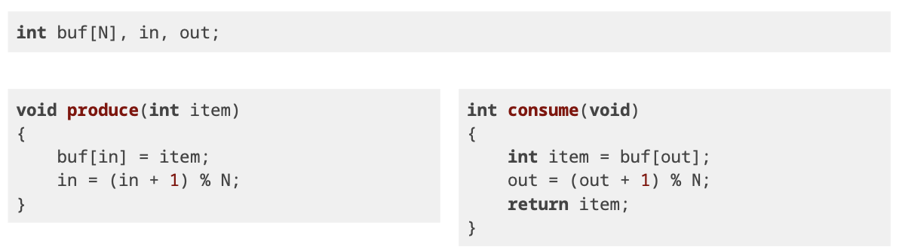

#### Solution2: Lock semaphores

使用上面的semaphores就可以解决这个问题。

使用binary semaphore，等于加了一段锁。如果当前producer/consumer在访问资源，就会把对应的lock设置为 0。后面的生产者/消费者就没法继续访问critical session的东西。

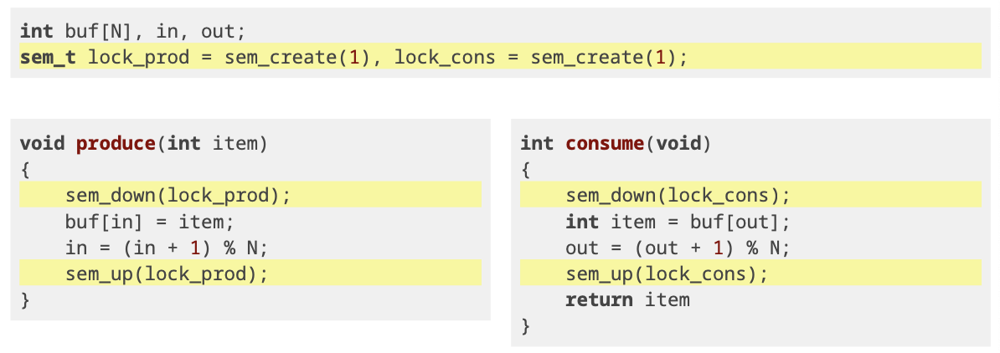

优点 ： 解决了不同步的问题， 至少保证了每次有只有一个producer/consumer在访问资源

缺点：数据其实不同步。根据上面的例子。尽管一次只有一个producer/consumer进入区域，但是producer会一直生产下去，consumer也会一直消耗资源。

#### Solution 3: Communication Semaphore

在加锁的同时，增加一个counted semaphore，用来记录资源的数量。保证了数据不会被覆盖。如果满了，producer就不会继续生产；如果空了，consumer就不会继续消耗。producer和consumer互相**通过semaphore来通知对方**。

**Add Synchronization**

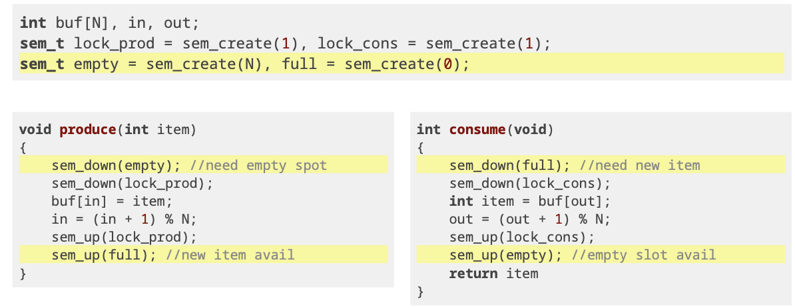

#### Application

##### Message

也就是**消息队列**！保证了synchronization

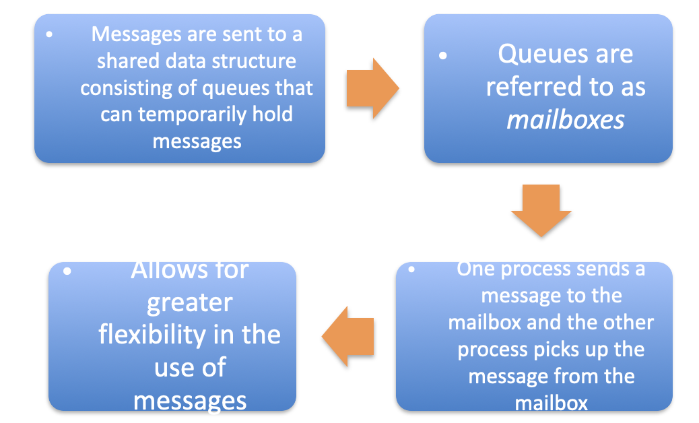

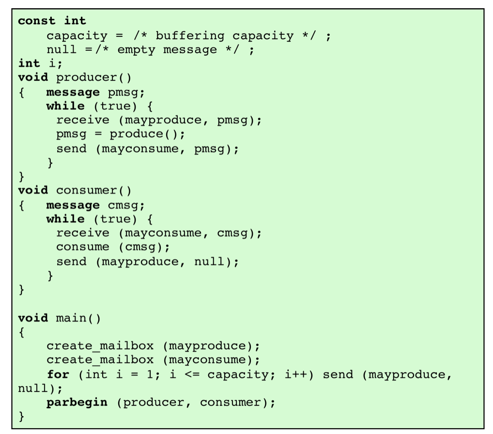

也就是创建邮箱来收/发信息。

## Readers-writers problem

同样是消耗相同的资源 - 但是读者多，写者少。

Read的情况一般没有什么问题 - 大家都可以进行读取，因为不会更改数据，可以不加锁

write的情况会产生问题 - 如果writer和reader同时进入资源，writer更改过数据，但是reader此时读的还是上一个数据，会出现脏读等问题。


**Description**

- Multiple threads access the same shared resource, **but differently**
  - *Many* threads only *read* from it 
  - *Few* threads only *write* to it
- Readers vs writers
  - Multiple ***concurrent* readers** at a time Or single writer at a time

#### Solution 1: Protect resource

reason： 根据上面的描述，可知，当多个线程访问同一个资源，有可能出现问题（reader & writer || wirter & writer），那么直接给资源加锁

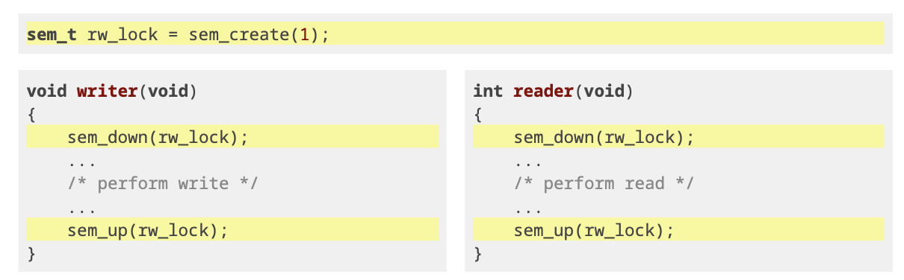

优点：的确解决了资源保护，并且一次只有一个writer进入更改数据

缺点：但是reader也是一次只能进入一个，效率太低

#### Solution 2: Enable multiple readers

可以增加一个rcount属性值，来记录reader的数量

其实本意是，不给reader加锁了。

- 一旦有一个reader进入，就加锁了。rw_lock就被设置为0 了。因为后面的rcount不会为1，所以不影响reader的访问，但是会控制writer的access。

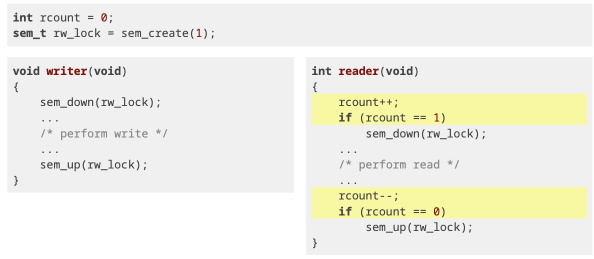

- 缺点：rcount依然会受到race condition的影响。可能多个reader同时进入，导致数据被更改。

#### Solution 3：Protect multiple readers

**对rcount进行加锁** - 防止了上面的问题，rcount也是一次只能只有一个reader在进行更改。但是那是并不影响read。

唯一的缺点是  - 由于rcount被锁了，有可能多个reader一直进入，但是一直没有读取完毕，导致rw_lock一直没有被释放。有可能writer一直在等待,**starvation**!

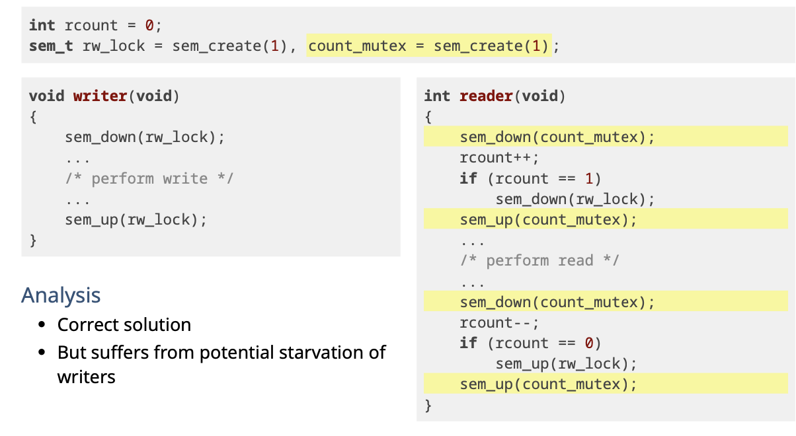

## Summary

**Semaphore - harmful**

- 可能需要多个semaphore - 导致程序过于复杂
- 太原始了- 可能导致programming mistake 
  - programmer必须注意好operation的顺序 -- 可能导致死锁
- 意义太多 - 可以当锁也可以当同步工具，意义不明显

**需要新的解决方案** -- 

### Other solution

#### **monitor**

和semaphore相同的操作

- Software module consists of one or more **procedures**, an **initialization sequence**, and **local data**
- 本身含有多个procedures，一个sequence，和本地数据
- local data只有procedures可以访问
- process进入后，会激活一个procedures
- 所有的控制访问都有procedures来进行控制。
- 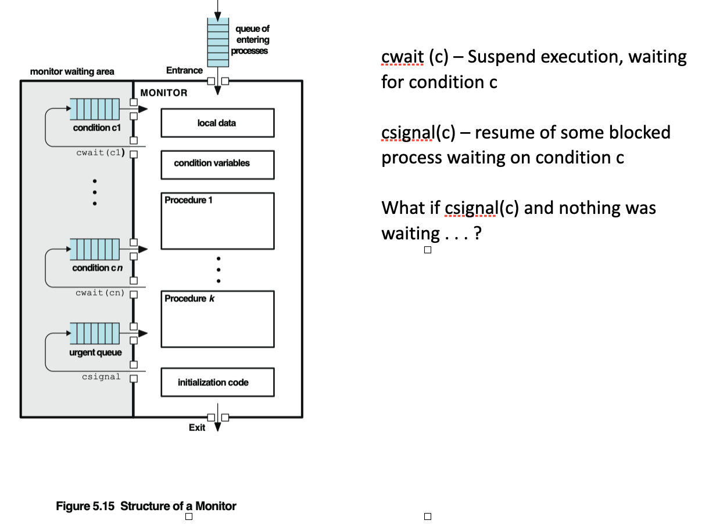

**Example**

如图，操作到produce和consume上了，不需要多个semaphore了。

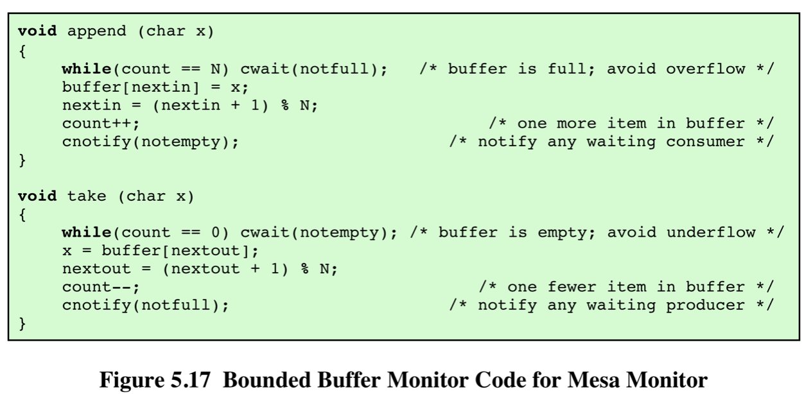

#### **Synchronization barriers** 

直到达到某个时间点，**broadcast**当前情况，并让运行。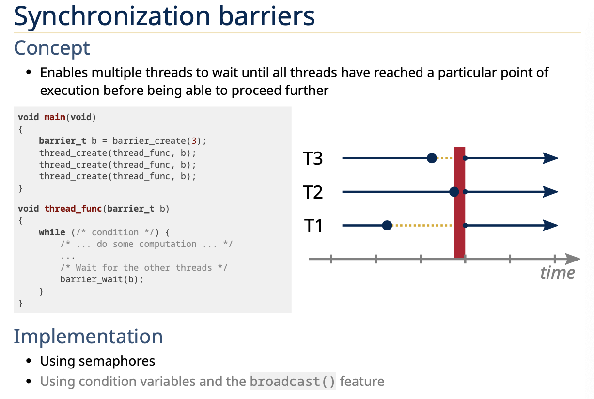


# Linux/Unix thread Library

**POSIX Threads <pthread.h>**  提供了多种操作

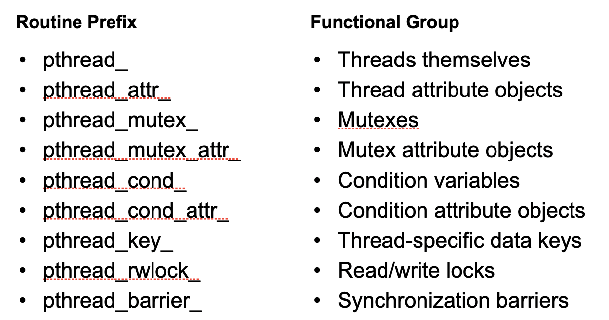

## Functions

### create thread

使用 `pthread_create()`

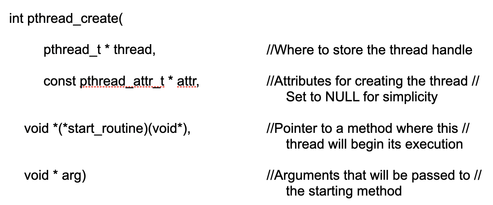

### Terminate thread

不需要显示声明结束(`pthread_exit()`)，会自动调用。任务完成了就结束了。

可以通过 `pthread_cancel()` 来取消另一个thread

进程会因为 `exec(),exit()` 被结束，如果进程已经结束了，不需要 call`pthread_exit()`, 如果显示声明，进程会被blocked，直到所有线程工作结束。

### Wait on thread

`pthread_join(pthread_t thread, void **value_ptr)` 调用方法的thread会被blocked，直到目标thread结束工作并放回。

## Lifecycle

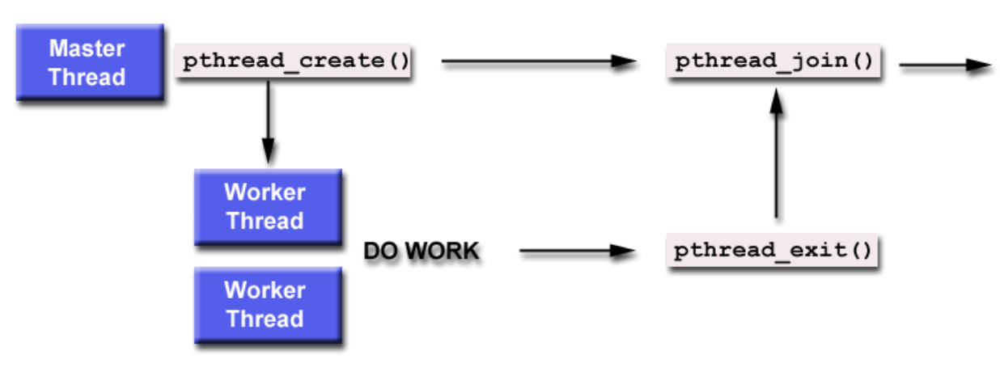

## Mutexes

一个**变量**，限制critical section访问，**只允许一个thread访问**

### **Definition**

Mutex (mutual exclusion) is a special type of **variable** that can be used to **restrict access to a critical section** to a **single thread** at a time.

**和semaphore很像，区别在于这个谁上的锁只有谁能解锁**

### **Reason**

如果其他thread都在waiting中，等待锁的释放，很浪费CPU，完全可以去干其他事情。

### Function

- **use mutex**

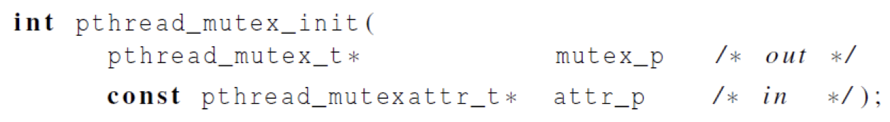

- **close mutex**

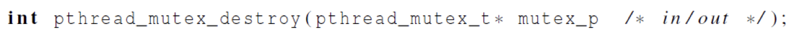

- **start lock**

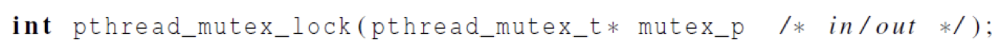

- **finish lock - unlock**

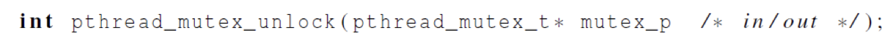

- **non-blocking call**

可以使用non-blocking call - 可以做其他事情

```c
int pthread_mutex_trylock(pthread_mutex_t* mp);
```

### Example

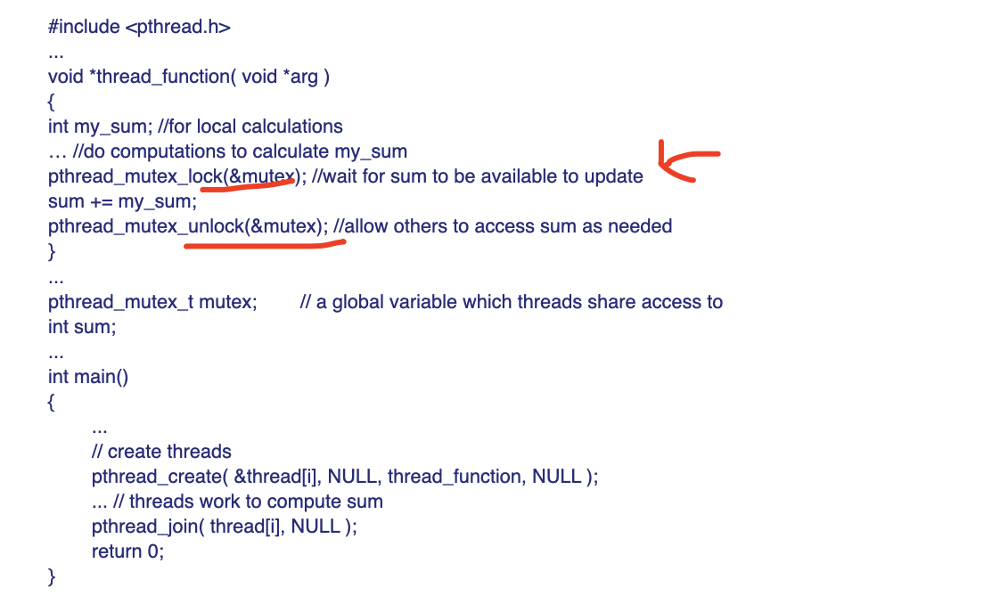

## Semaphore

### Definition

和Mutex很像，区别在于**谁都能解锁**。 - 可以用来解决read-write/producer-consumer问题

### Reason

和mutex出发点相同。如果只是单纯使用自旋锁，所有thread都会在busy waiting

### Function

- **include library**

```c
#include <pthread.h>
#include <semaphore.h>
```

- **create semaphore**

```c
int sem_init(sem_t *sem, int pshared, unsigned int value);
//semaphore object; 
//sharing option - 0 means local to the calling process
//initial value
```

- **terminate semaphore**
  - 一般 `pthread_join()`后使用(一般启动线程后就可以摧毁)
  - 如果thread正在waiting时，semaphore被destroyed，会出现问题

```c
int sem_destroy(sem_t *sem);
//free the object
```

- **control**

```c
int sem_post(sem_t *sem);//increase
int sem_wait(sem_t *sem);//decrease
```

### Example

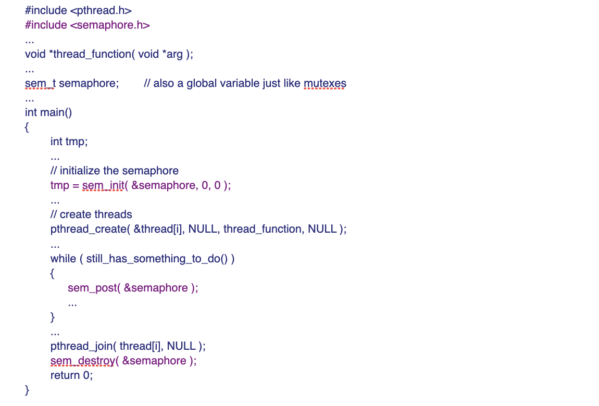

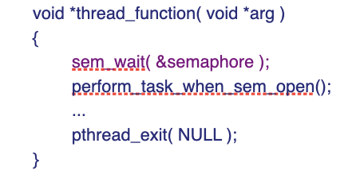

## Read-Write Locks

从上面的读写问题我们可以看到，如果单纯使用semaphore，问题好多！

pthread提供读写锁，解决这个问题

### **Problem**

如果我们使用mutex去实现一个线程安全的linkedlist，有几种解决方案

- Lock whole list

  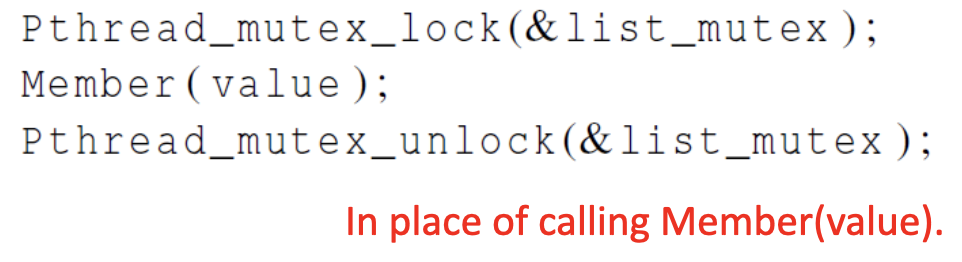

  - 缺点：如果大量访问操作 -> 需要不断上锁，解锁，如果parallesim会出问题。
  - 优点：insert/delete安全，因为锁的原因，不会产生不一致的问题，并且实现简单

- Lock individual nodes

  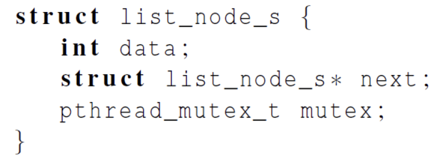

  - 缺点：太复杂了，并且效率低。每个node都对了一个字段，内存需求变大了。

  - improvement

    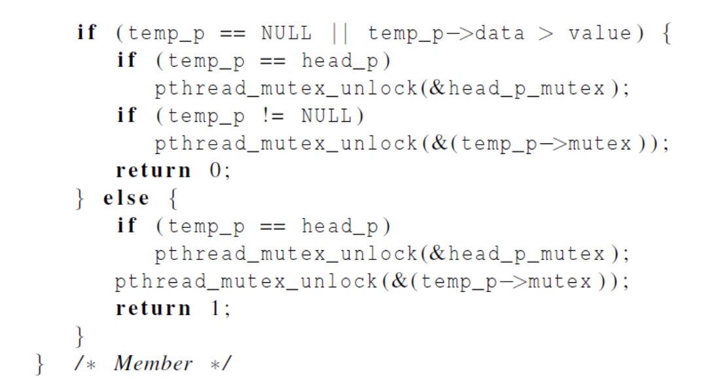


### solution

using read write lock

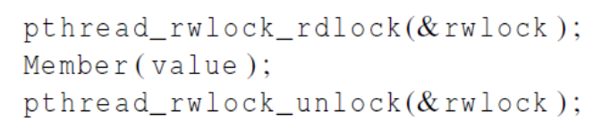

