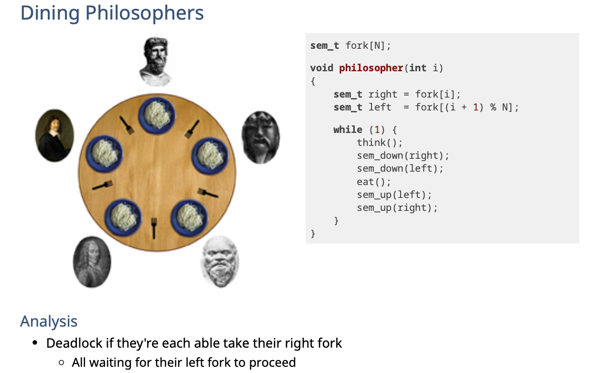
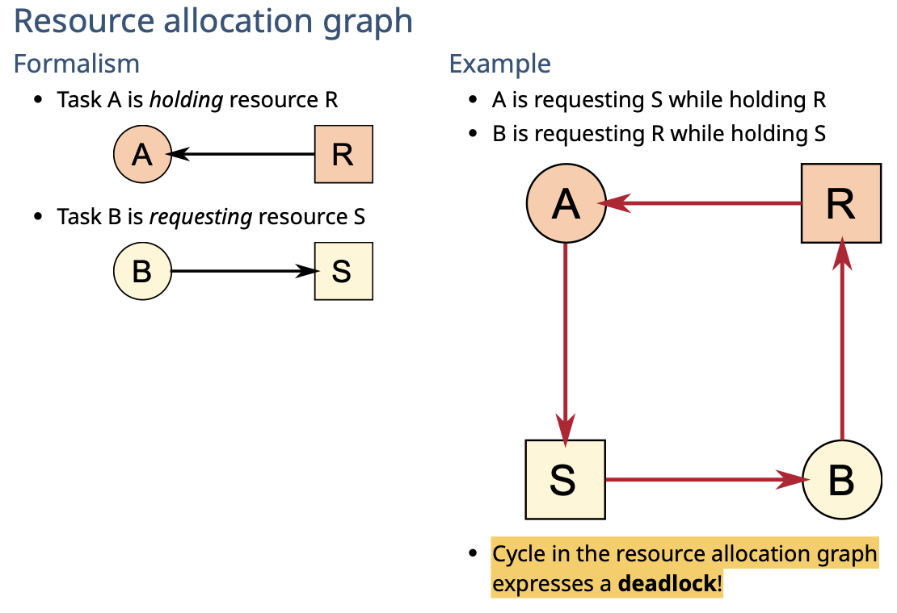
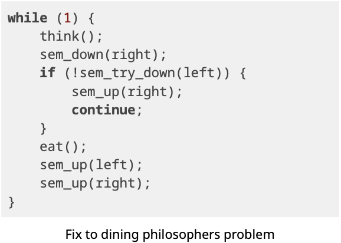
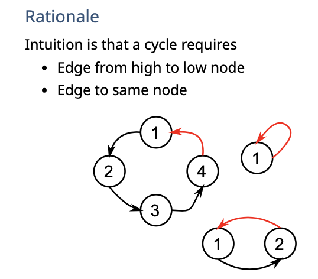
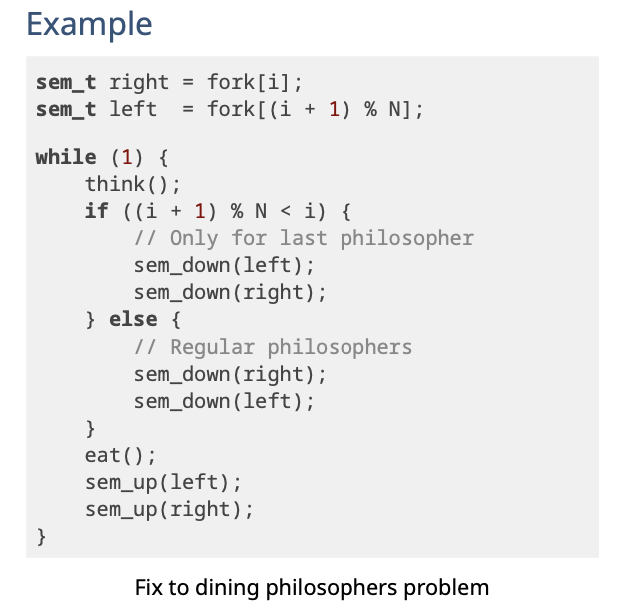
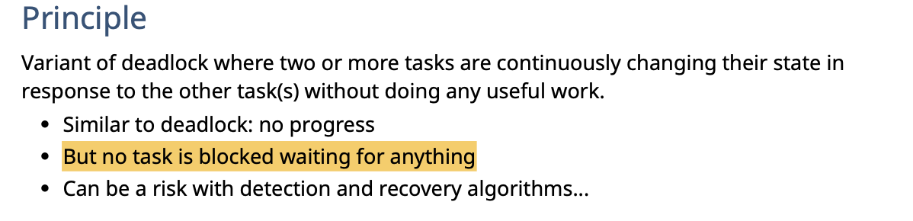
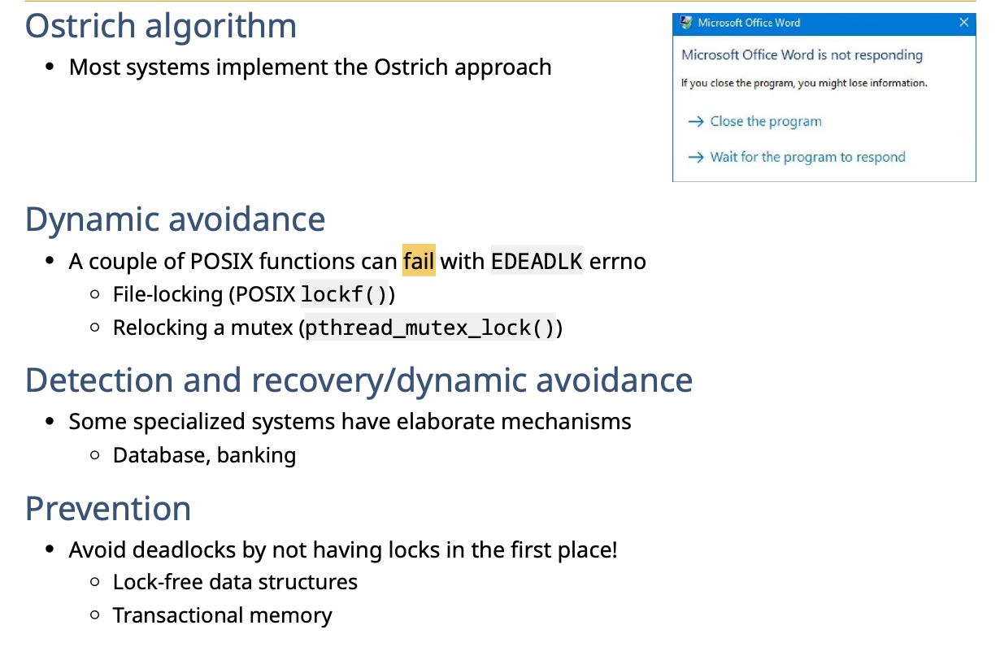
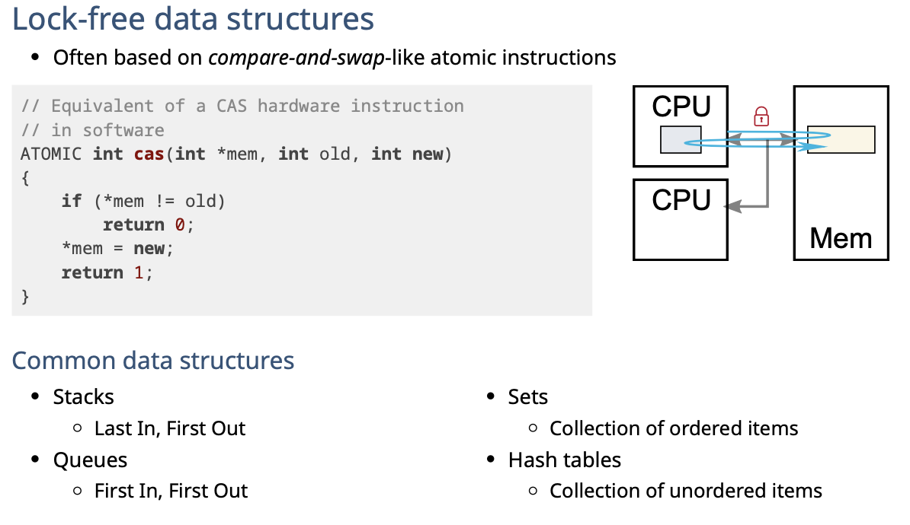
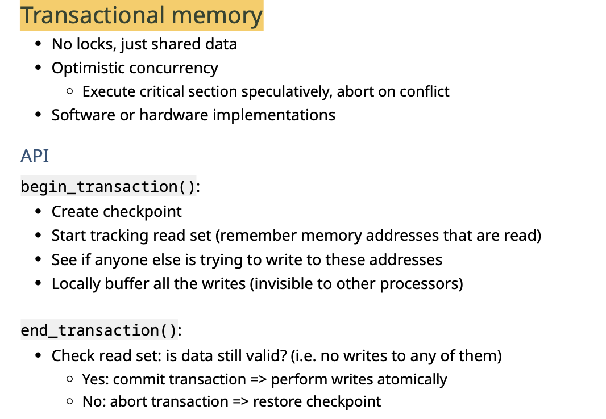

# Deadlock

## Problem

**Example**

## Definitions

A **deadlock** is the ultimate stage of **starvation**

Every one is waiting for others to stop in order to get the resource, but no one stop. All are waiting and starving

## ==Conditions==

**互斥，占有且等待，不准抢占，循环等待**

1 && 2 && 3 && 4 => deadlock

1. **Mutual exclusion/bounded resources**
   - A resource is assigned to exactly one task at a time

2. **Hold and wait** 
   - Each task is holding a resource while waiting for another resource

3. **No preemption**
   -  Resources cannot be preempted

4. **Circular wait**
   -  One task is waiting for another in a circular fashion

## Solution

- reboot - 慢死了
- detect and recovery -> kill task/rollback
- dynamic avoidance -> 如果是unsafe state，就不执行
- Prevent - 打破任意一个条件！

## Prevention

Invalidate one of the 4 conditions

### Mutual Exclusion / bounded resources

- give more resources
- virtualize resources (例如使用queue，让大家等待)
- lock-free resources
  - Make it sharable - 类似 message queue

### Hold & wait

**Don't hold resources when waiting for another**

- 一次性申请所有
  - 如果成功， 使用并release
  - 如果失败，释放拥有的资源并再来一次

**Issue**

- 如果永远没法一次性获得资源会导致starvation
- 资源太多会太复杂

### No preemption

**In most cases - impossible**

- Make resources preemptable
  - 如果没有available的资源，可以抢占其他task
  - 可以抢占waiting task
- Only works when it's easy to save and restore state of resource

### Circular wait

- **Give order to the requests for all resources**
  - assgin ID
  - all requests must be in ascending order of the IDs

## Livelock

## Real-life startegies

如下是乐观锁。不停比较然后交换。不同再进行改变。

transactional

