# Memory Management

## Problem

当我们需要一些数据来加载执行的时候，我们可能需要从磁盘获取一些数据并加载到内存中。

### UniProgramming

如下。

- kernel(OS)本身是需要占据一定内存的，因此：maximum address应该是内存空间 - os大小，如图红线
- 每个进程都自己获得pysical address并加载

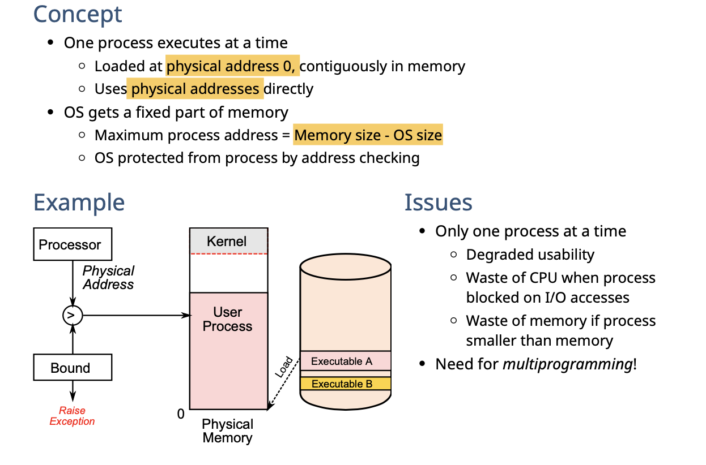

**Issue**

- 一次只能加载一个，因为从0开始
  - 导致性能下降
  - 如果需要I/O性能更慢了，因为需要先加载I/O进来，再重新加载程序
  - 如果process需要内存很小，浪费内存

### Multiprogramming

**Requirements**

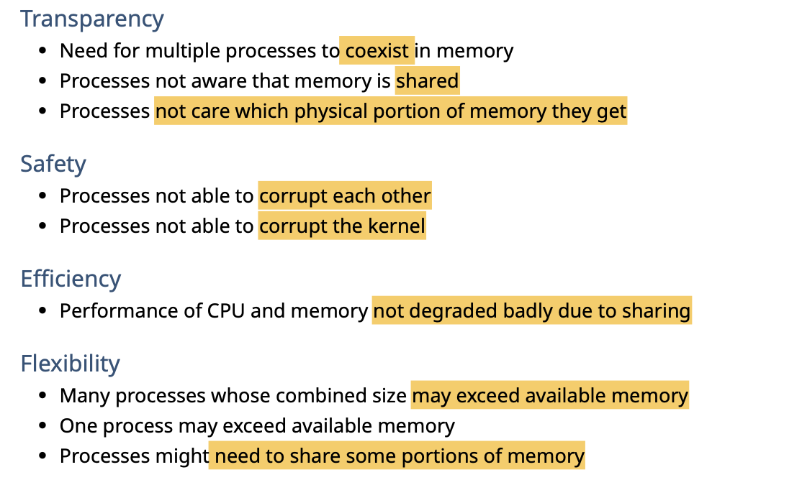

总结下来，最重要的要求就是

- ==**Relocation**==
  - 能够在memory任意位置加载。
- ==**Protection**==
  - 进程访问内存进行读写的时候需要权限
  - program在main memory中的位置是不可预测的n

那么可以新抽象为：

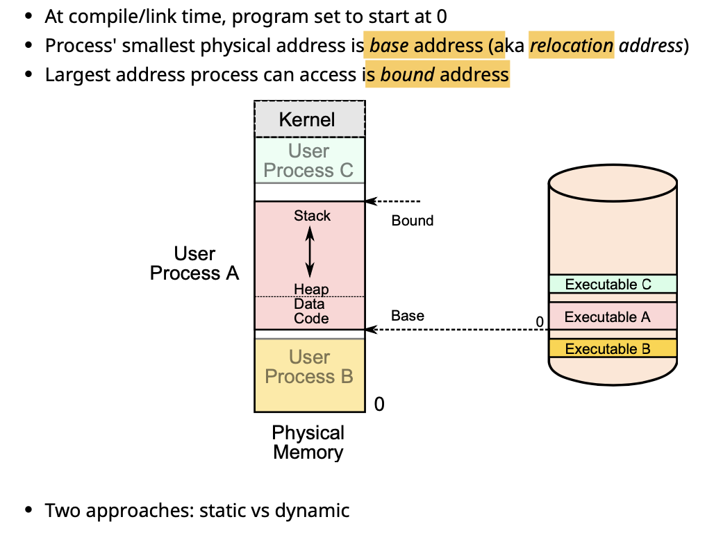

加载方法有两种

- static - 在加载进memory的时候调整address

  - 问题：只能一次，后面不能调整，并没有做到protection

- dynamic

  - Base register perform runtime relocation
  - bound register perform runtime protection
  - 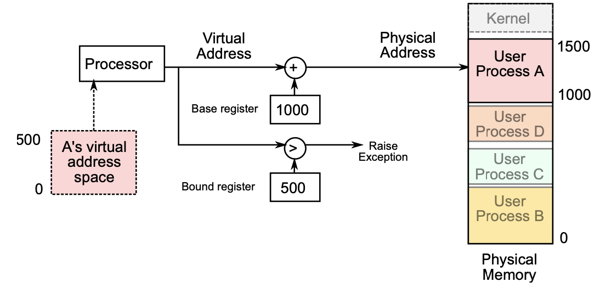
  - Pros: relocation/protection都能有效起到作用
  - cons：必须得有连续的空间 - 并且会导致**fragmentation**
    - 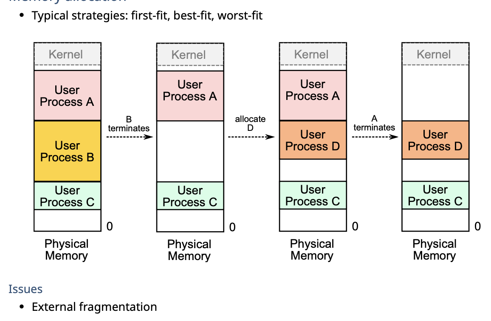

  **fragmentation solution**

- compaction - moving for free space

  - time consuming

- Swapping - preempt processes and reclain their memory
  - Need more processes than memory size

#### Summary

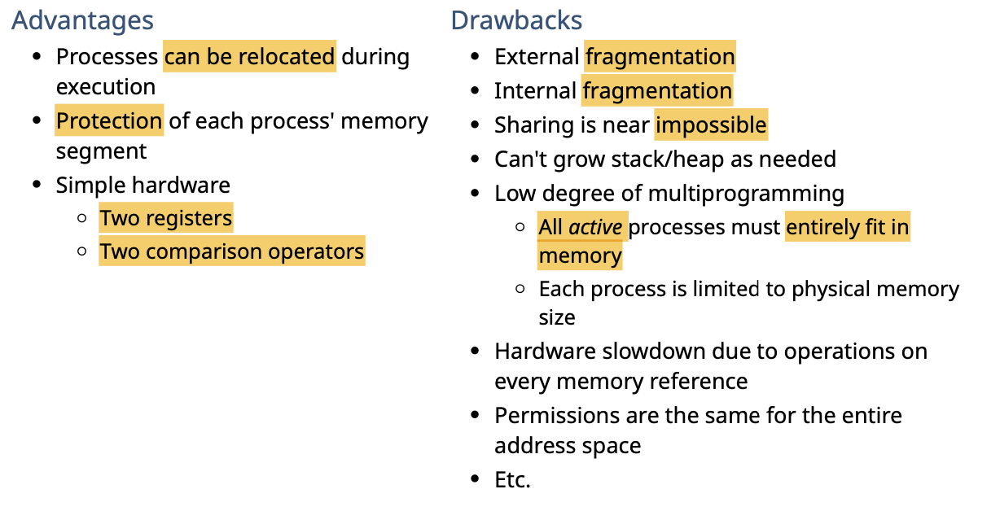

**Process在内存中的存储**

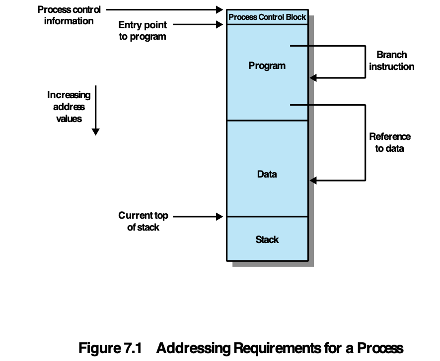

## How memory works

- memory 是可以根据逻辑线性划分的。

根据上面的需求，我们可以对memory进行划分。每次有新的process要进入内存，就进入对应的memory 块，就能达到上面的requirements - 任意加载/在memory中无法预测位置。

## How to Partitioning

### Solution 1: fixed partition

把memory块平均划分成fixed大小的区域

**缺点**：

- 程序可能太大而无法进入划分好的区域
- memory利用率太低了
  - 由于process的大小不定，内部碎片太多。 - 浪费空间

**Internal fragmentation**

### Solution 2: one process queue per partition

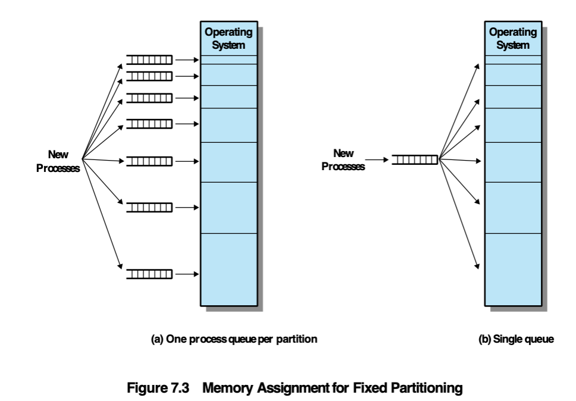

没有啥意义啊。。。依然利用率低

**优点**： 通过process queue来控制process的大小，能够一定程度上控制每个partition都能塞入process

**缺点**：process的数量收到了partition数量的限制。small job依然没法很好地利用空间。

### Solution 3: Dynamic partition

process有多大就partition多大 - 见缝插针

- **优点**：更加灵活 
- **缺点**
  - **Fragmentation**： memory会根据时间的推移，越来越fragmented(碎片化！！)。导致utilization降低

**Solution for fragmentation**：Compaction - 通过移动碎片空间 - shifts processes so they are continuous.  - 又有大空间了

**缺点：**time consuming & waste time 

### Solution 4: Dynamic+placement

根据solution 3 - > dynamic partition 的方式是正确的。唯一的缺点就是会导致碎片化 - 那么就需要解决方案来处理fragmentation问题。

解决方法1 - 使用compaction - 移动碎片，但是耗时又耗力

解决方案2 - placement algorithm

#### placement algorithm

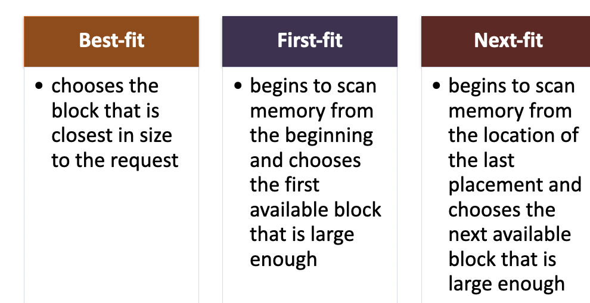

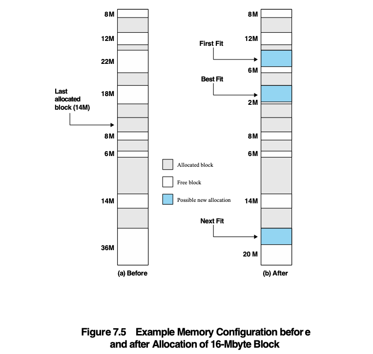

### Solution 5: Buddy System

- fixed+dynamic
- 所有可以被分配的空间都被看错single block
  - 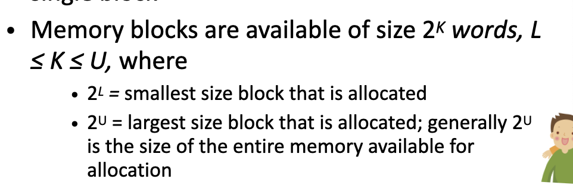
  - 根据上面寻找空间

那么可以通过这个构建一棵树，来寻找可以放入的空间

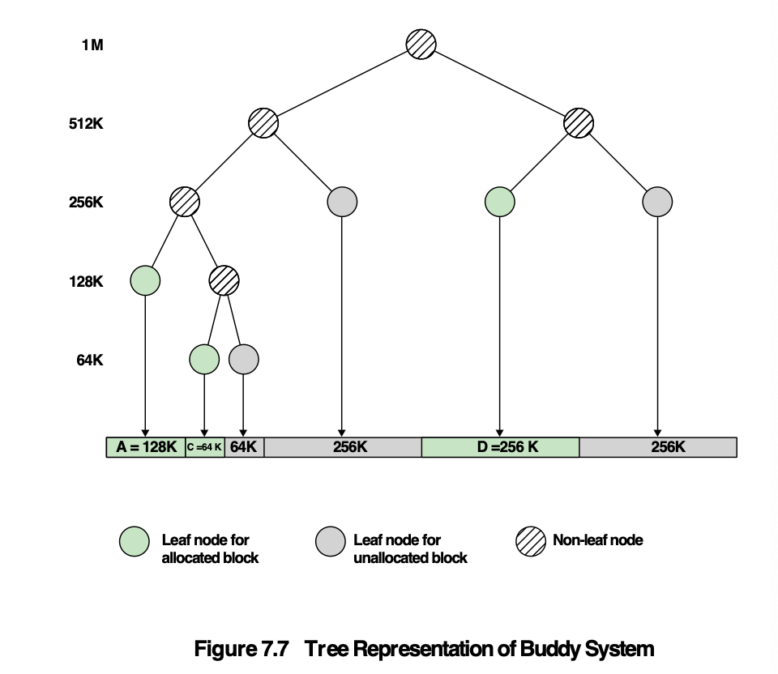

## Paging

和partition有点类似，区别在于 - paging划分得更小？

- partition **memory** into **fixed-size chunks** that are relatively **small**， called pages
  - **Virtual pages** in the virtual address space 
  - **Page frames** in the physical memory

- Divide **process** into **small fied-size chunks** of the same size

- Data is divided into **fixed size pages** and loaded into main memory onto "**Frames**"
- pages can reside in primary/secondary or both memory

简而言之，把memory和程序都进行partion，分frame存放。还需要维护page table

**优点**

- 解决了之前**碎片问题** - 由于分frame 存放，可以间隔开
  - 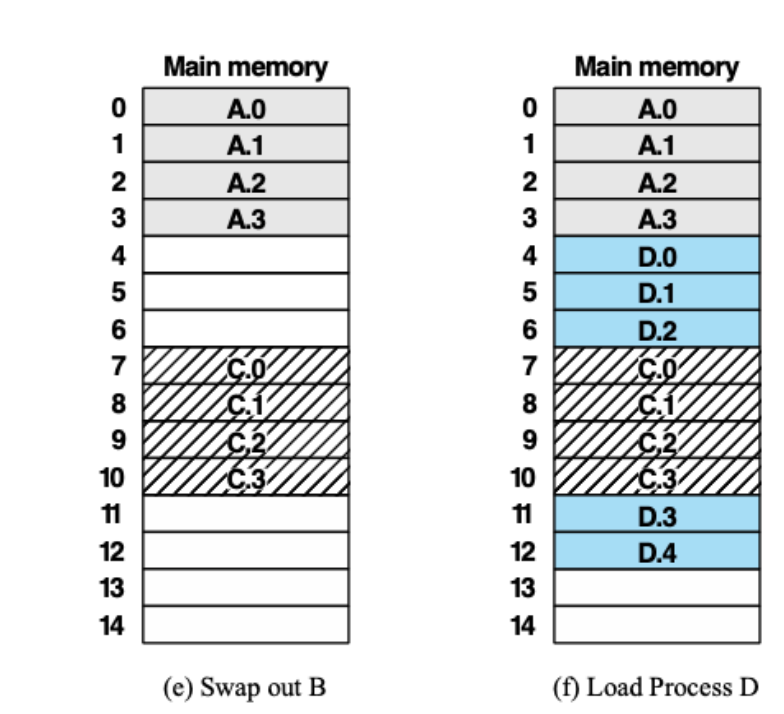

### Physical Pages

- **Physical memory** is partitioned into equal-sized page **frames**
- Physical memory address = (f,o)
  - f : frame number
  - o: offset within frame 

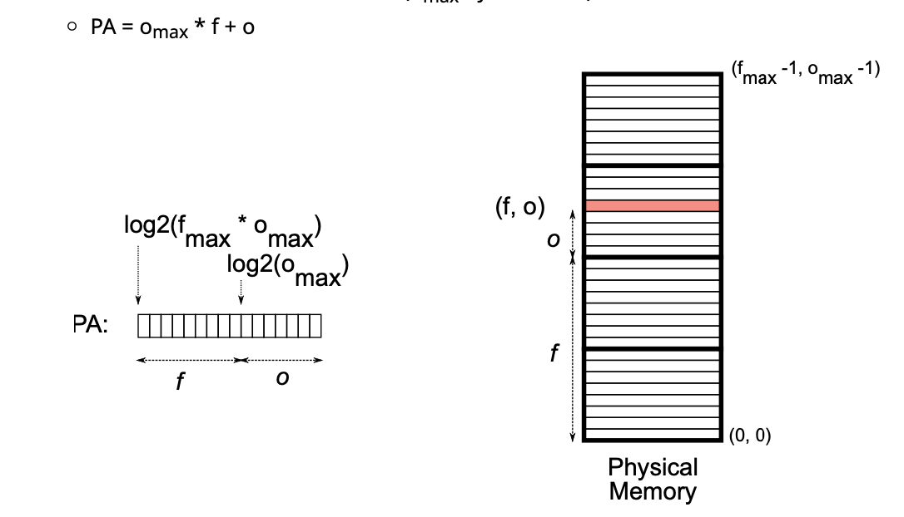

**Example**

1 byte = 8 bit

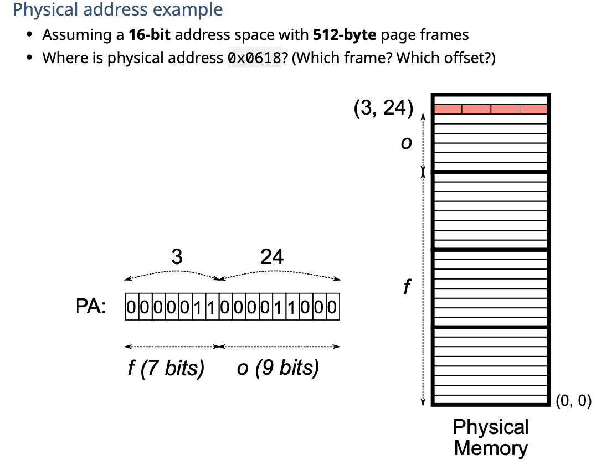

### Virtual Pages

- A **process' *virtual address space* is** partitioned into equal-sized *virtual pages* 
  - Virtual page size is equivalent to physical page frame size
- Virtual memory address = (p,o)
  - p:page number
  - o:offset with page

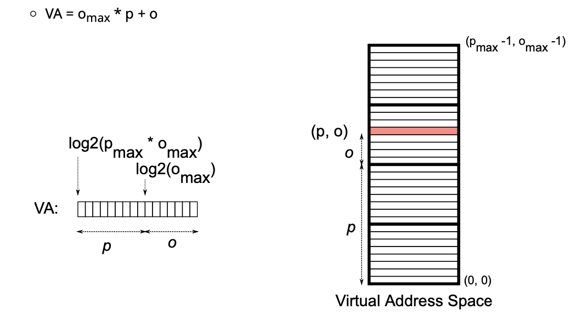

### From virtual to physical

- virtual memory 的作用就是把virtual pages 映射到 physical memory上
- Virtual pages在virtual address上是连续的，但是
  - page frames are arbitrarily located in pysical memory
  - **Not all pages need to be mapped at all times** (*demand-paging*) -- 可能后面加载 

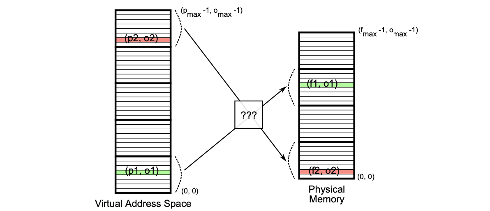

**这就需要一个映射机制 -- page table**

### Page table

- A page table is an **array** of **mapping entries**
  - Translate virtual addresses into physical addresses 
  - Invisible to the process

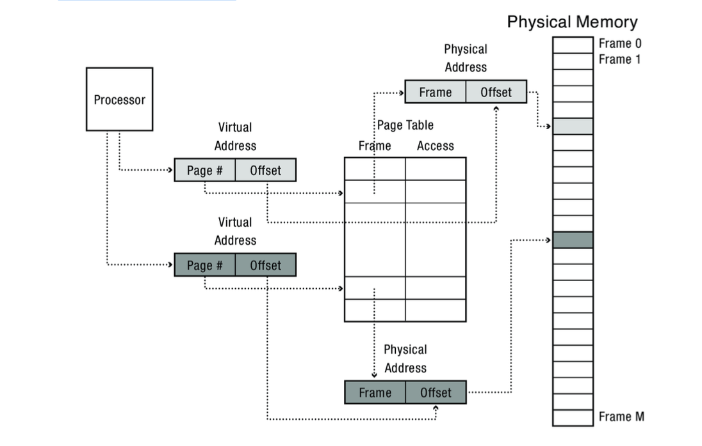

**Details**

- **One page table per process**
  - Part of process' state
- Page tables are **stored in physical memory**
- One page table entry (PTE) for each virtual page
- PTE contains 
  - Frame number
  - Protection flags: R/W/E
  - Other flags: valid bit, dirty bit, use bit, etc.

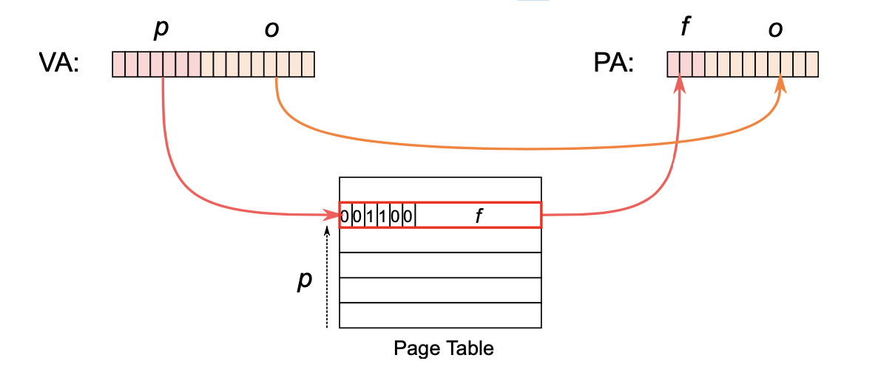

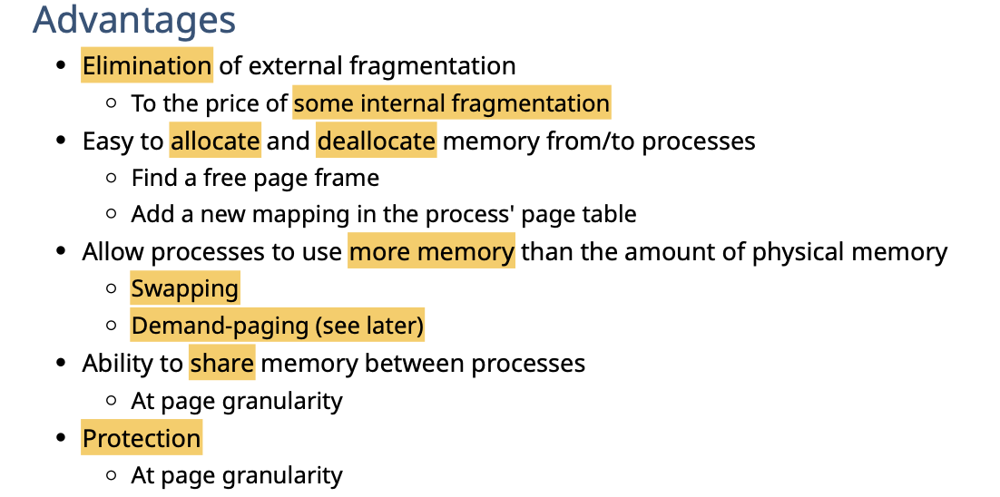

## Segmentation

**program** divied into **segments**

- 把program分成分成多个segments，并用array维护

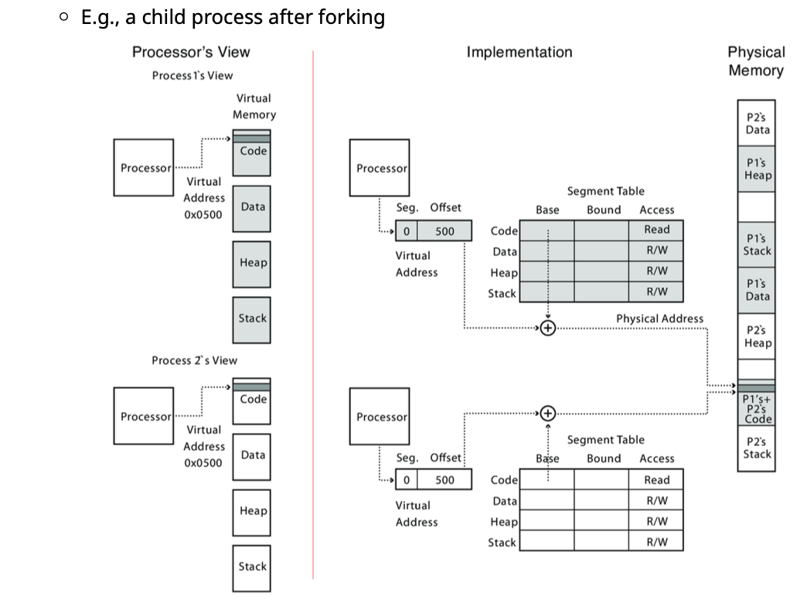

这个方法可以很好地做到sharing

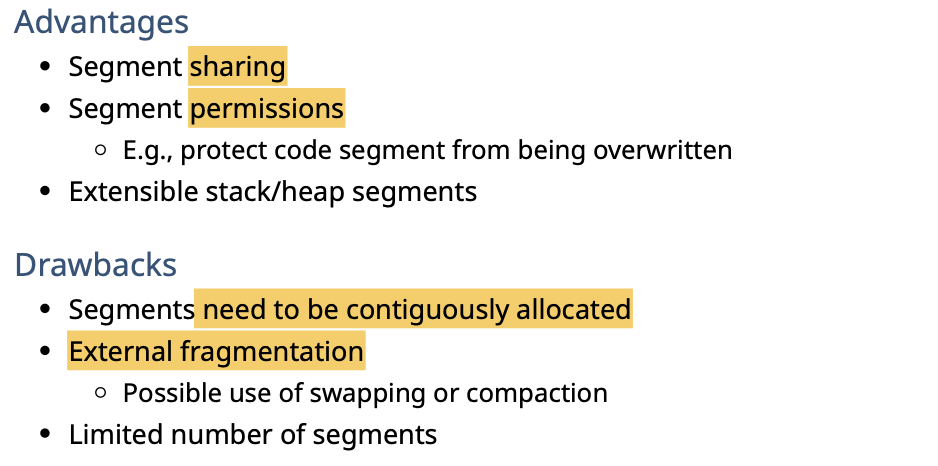

## memory efficient - Paged segmentation

**Issue**

不论是pagination还是segmentation，都会有一大部分的空间时空的，因此需要新技术。

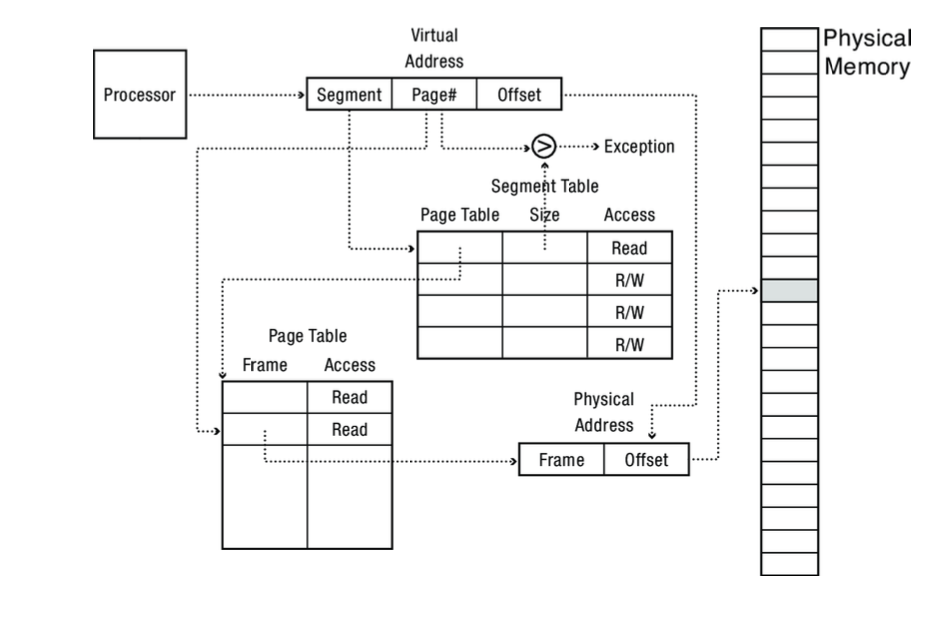

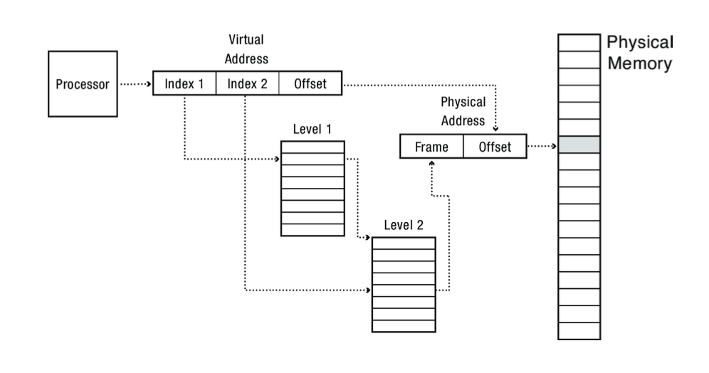

## Speed efficient paging

# Virtual Memory

## Introduction

- It's a storage allocation scheme
- secondary memory 也能像primary memory一样寻址
- 虚拟内存的目的是为了让物理内存扩充成更大的逻辑内存，从而让程序获得更多的可用内存。

## Execution of a process

